# 第一章：你的深度学习之旅


你好，感谢你让我们加入你的深度学习之旅，无论你已经走了多远！在本章中，我们将告诉你更多关于本书的内容，介绍深度学习背后的关键概念，并在不同任务上训练我们的第一个模型。无论你是否有技术或数学背景（尽管如果你有也没关系！），我们写这本书是为了让尽可能多的人能够接触到深度学习。

# 深度学习适合每个人

很多人认为你需要各种难以找到的东西才能在深度学习中取得出色的结果，但正如你在本书中所看到的，这些人是错误的。表 1-1 列出了一些你*绝对不需要*进行世界级深度学习的东西。

表 1-1。深度学习不需要的东西

| 迷思（不需要） | 真相 |
| --- | --- |
| 大量的数学 | 高中数学就足够了。 |
| 大量的数据 | 我们已经看到少于 50 个数据项取得了创纪录的结果。 |
| 大量昂贵的计算机 | 你可以免费获得进行最先进工作所需的设备。 |

*深度学习*是一种计算机技术，通过使用多层神经网络从人类语音识别到动物图像分类等用例来提取和转换数据。每个层从前一层获取输入，并逐渐完善它们。这些层通过最小化错误并提高准确性的算法进行训练。这样，网络学会执行指定的任务。我们将在下一节详细讨论训练算法。

深度学习具有强大、灵活和简单的特点。这就是为什么我们认为它应该应用于许多学科。这些学科包括社会科学、自然科学、艺术、医学、金融、科学研究等等。举个个人例子，尽管没有医学背景，Jeremy 创办了 Enlitic 公司，该公司使用深度学习算法来诊断疾病。在公司成立几个月后，宣布其算法能够比放射科医生更准确地识别恶性肿瘤。

以下是一些不同领域中数千个任务的列表，其中深度学习或大量使用深度学习的方法现在是世界上最好的：

自然语言处理（NLP）

回答问题；语音识别；总结文件；分类文件；在文件中查找名称、日期等；搜索提及某一概念的文章

计算机视觉

卫星和无人机图像解释（例如用于灾害韧性），人脸识别，图像字幕，读取交通标志，定位自动驾驶车辆中的行人和车辆

医学

在放射学图像中找到异常，包括 CT、MRI 和 X 射线图像；在病理学幻灯片中计数特征；在超声波中测量特征；诊断糖尿病视网膜病变

生物学

折叠蛋白;分类蛋白质;许多基因组学任务，如肿瘤-正常测序和分类临床可操作的遗传突变;细胞分类;分析蛋白质/蛋白质相互作用

图像生成

给图像上色，增加图像分辨率，去除图像中的噪音，将图像转换为著名艺术家风格的艺术品

推荐系统

网络搜索，产品推荐，主页布局

玩游戏

国际象棋，围棋，大多数 Atari 视频游戏以及许多实时策略游戏

机器人技术

处理难以定位的物体（例如透明、闪亮、缺乏纹理）或难以拾取的物体

其他应用

金融和物流预测，文本转语音等等…

令人惊讶的是，深度学习有如此多样的应用，然而几乎所有的深度学习都基于一种创新的模型类型：神经网络。

但事实上，神经网络并不是完全新的。为了对该领域有更广泛的视角，值得从一点历史开始。

# 神经网络：简史

1943 年，神经生理学家沃伦·麦卡洛克和逻辑学家沃尔特·皮茨联手开发了人工神经元的数学模型。在他们的论文《神经活动中内在思想的逻辑演算》中，他们宣称：

> 由于神经活动的“全有或全无”特性，神经事件及其之间的关系可以通过命题逻辑来处理。发现每个网络的行为都可以用这些术语来描述。

麦卡洛克和皮茨意识到，可以使用简单的加法和阈值处理来表示真实神经元的简化模型，如图 1-1 所示。皮茨是自学成才的，12 岁时就收到了与伟大的伯特兰·罗素一起在剑桥大学学习的邀请。他没有接受这个邀请，事实上，他一生中没有接受任何高级学位或权威职位的邀请。他大部分著名的工作都是在无家可归时完成的。尽管他没有正式认可的职位，社交孤立日益加剧，但他与麦卡洛克的合作对心理学家弗兰克·罗森布拉特产生了影响。

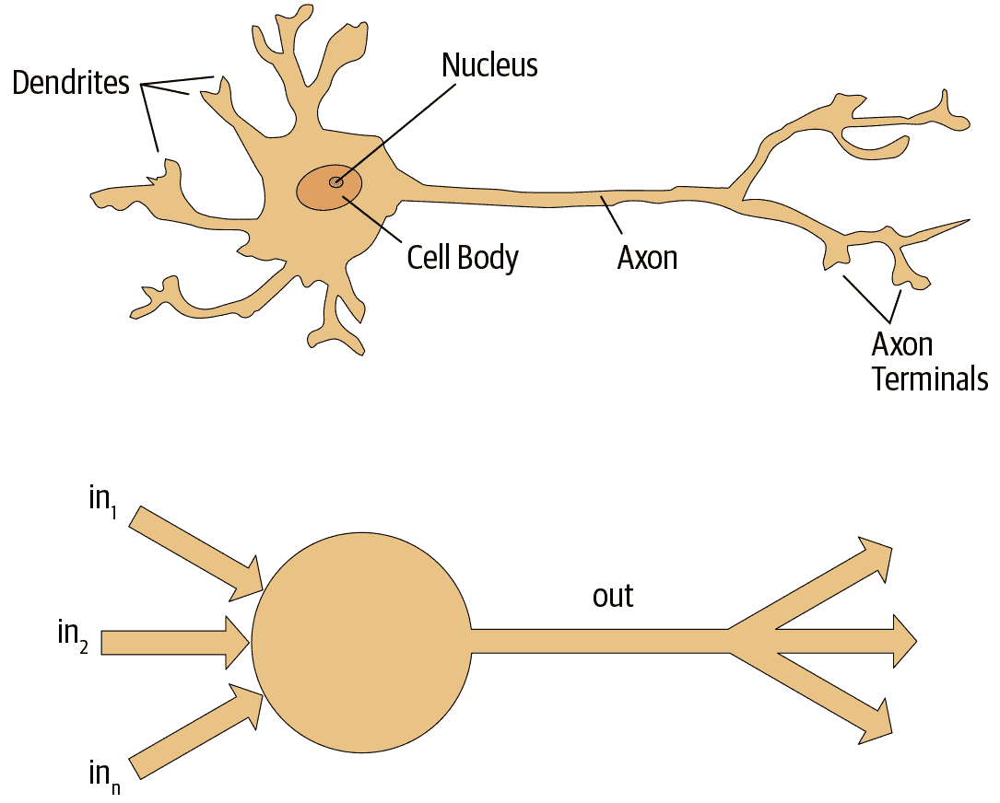

###### 图 1-1\. 自然和人工神经元

罗森布拉特进一步发展了人工神经元，使其具有学习能力。更重要的是，他致力于构建第一个使用这些原则的设备，即 Mark I 感知器。在《智能自动机的设计》中，罗森布拉特写道：“我们现在将见证这样一台机器的诞生——一台能够在没有任何人类训练或控制的情况下感知、识别和辨认其周围环境的机器。”感知器被建造出来，并成功地识别了简单的形状。

麻省理工学院的教授马文·明斯基（与罗森布拉特在同一所高中，但比他晚一年）与西摩·帕帕特合著了一本名为《感知器》（麻省理工学院出版社）的书，讲述了罗森布拉特的发明。他们表明，这些设备的单层无法学习一些简单但关键的数学函数（如异或）。在同一本书中，他们还表明，使用多层设备可以解决这些限制。不幸的是，这些洞见中只有第一个被广泛认可。因此，全球学术界在接下来的两十年几乎完全放弃了神经网络。

在过去 50 年中，神经网络领域最具影响力的工作可能是由大卫·鲁梅尔哈特、詹姆斯·麦克莱兰和 PDP 研究小组于 1986 年由麻省理工学院出版社出版的多卷本《并行分布式处理》（PDP）。第一章提出了与罗森布拉特所展示的类似希望：

> 人类比今天的计算机更聪明，因为大脑采用了一种更适合处理人类擅长的自然信息处理任务的基本计算架构。我们将介绍一个用于建模认知过程的计算框架，它似乎比其他框架更接近大脑可能进行的计算风格。

PDP 所使用的前提是，传统计算机程序与大脑的工作方式非常不同，这可能是为什么计算机程序在那时如此糟糕地执行大脑发现容易的任务（如识别图片中的物体）。作者声称 PDP 方法“比其他框架更接近”大脑的工作方式，因此可能更能够处理这些任务。

事实上，PDP 中提出的方法与今天的神经网络所使用的方法非常相似。该书将并行分布式处理定义为需要以下内容：

+   一组*处理单元*

+   *激活状态*

+   每个单元的*输出函数*

+   单位之间的*连接模式*

+   通过网络连接传播活动模式的*传播规则*

+   将输入与单位的当前状态相结合以产生单位输出的*激活规则*

+   通过经验修改连接模式的*学习规则*

+   系统必须运行的*环境*

我们将在本书中看到现代神经网络如何处理这些要求。

在 20 世纪 80 年代，大多数模型都建立了第二层神经元，从而避免了由明斯基和帕佩特（这是他们“单元之间的连接模式”，使用前面的框架）所确定的问题。事实上，神经网络在 80 年代和 90 年代被广泛用于真实的实际项目。然而，对理论问题的误解再次阻碍了该领域的发展。理论上，只需添加一个额外的神经元层就足以使这些神经网络能够近似任何数学函数，但实际上这样的网络通常太大且太慢，无法发挥作用。

尽管研究人员 30 年前就表明，要获得实际的良好性能，你需要使用更多层的神经元，但直到最近十年，这个原则才被更广泛地认可和应用。现在，由于计算机硬件的改进、数据可用性的增加以及允许神经网络更快更容易地训练的算法调整，神经网络终于实现了其潜力。我们现在拥有了 Rosenblatt 所承诺的：“一台能够感知、识别和辨认周围环境的机器，无需任何人类训练或控制。”

这就是你将在本书中学会如何构建的内容。但首先，因为我们将花很多时间在一起，让我们彼此稍微了解一下...

# 我们是谁

我们是 Sylvain 和 Jeremy，是你们在这个旅程中的向导。我们希望你们认为我们非常适合这个职位。

Jeremy 已经使用和教授机器学习约 30 年。他在 25 年前开始使用神经网络。在此期间，他领导了许多以机器学习为核心的公司和项目，包括成立专注于深度学习和医学的第一家公司 Enlitic，并担任全球最大的机器学习社区 Kaggle 的总裁兼首席科学家。他与 Rachel Thomas 博士共同创立了 fast.ai，这个组织建立了本书基于的课程。

不时地，你会直接从我们这里听到一些侧边栏的信息，比如 Jeremy 在这里说的：

# Jeremy 说

大家好，我是 Jeremy！你可能会感兴趣知道，我没有接受过任何正式的技术教育。我获得了哲学专业的学士学位，成绩并不好。我对做实际项目比对理论研究更感兴趣，所以在大学期间我全职在一家名为麦肯锡公司的管理咨询公司工作。如果你更愿意亲自动手建造东西而不是花费数年学习抽象概念，你会理解我的想法！请留意我的侧边栏，以找到最适合没有数学或正式技术背景的人的信息，也就是像我这样的人...

另一方面，Sylvain 对正式的技术教育了解很多。他已经写了 10 本数学教科书，涵盖了整个法国高级数学课程！

# Sylvain 说

与杰里米不同，我没有花很多年编写和应用机器学习算法。相反，我最近通过观看杰里米的 fast.ai 课程视频进入了机器学习世界。因此，如果你是一个从未打开终端并在命令行中编写命令的人，你会理解我在说什么！请留意我的旁注，以找到最适合具有更多数学或正式技术背景，但缺乏实际编码经验的人的信息，也就是像我这样的人...

fast.ai 课程已经被来自世界各地各行各业的数十万学生研究过。Sylvain 被认为是 Jeremy 见过的该课程中最令人印象深刻的学生，这导致他加入了 fast.ai，然后与 Jeremy 一起成为 fastai 软件库的合著者。

所有这些意味着，在我们之间，你拥有最好的两个世界：那些比任何人都更了解软件的人，因为他们编写了它；数学专家，编码和机器学习专家；以及那些了解在数学中作为相对外行者和在编码和机器学习中作为相对外行者的感受的人。

任何看过体育比赛的人都知道，如果有一个两人评论团队，你还需要第三个人来做“特别评论”。我们的特别评论员是亚历克西斯·加拉格尔（Alexis Gallagher）。亚历克西斯有着非常多样化的背景：他曾是数学生物学研究员，编剧，即兴表演者，麦肯锡顾问（就像 Jeremy 一样！），Swift 编码者和首席技术官。

# 亚历克西斯说

我决定是时候学习这个人工智能的东西了！毕竟，我几乎尝试了所有其他的东西...但我并没有建立机器学习模型的背景。不过...这有多难呢？我将在这本书中一直学习，就像你一样。请留意我的旁注，找到我在学习过程中发现有用的学习提示，希望你也会觉得有用。

# 如何学习深度学习

哈佛教授大卫·帕金斯（David Perkins）在《全面学习》（Jossey-Bass）一书中有很多关于教学的观点。基本思想是教授“整个游戏”。这意味着，如果你在教棒球，你首先带人们去看一场棒球比赛或让他们玩棒球。你不会教他们如何缠绕麻线从头开始制作棒球，也不会教他们抛物线的物理学，或者球在球拍上的摩擦系数。

哥伦比亚数学博士、前布朗大学教授和 K-12 数学教师保罗·洛克哈特（Paul Lockhart）在具有影响力的文章《数学家的悲歌》中设想了一个噩梦般的世界，在那里音乐和艺术的教学方式与数学的教学方式相同。孩子们在掌握音乐符号和理论十多年后才被允许听音乐或演奏音乐，花时间将乐谱转换到不同的音调。在艺术课上，学生学习颜色和应用工具，但直到大学才被允许真正绘画。听起来荒谬吗？这就是数学的教学方式——我们要求学生花费多年时间进行死记硬背和学习干燥、脱离实际的“基础知识”，我们声称这些知识在大多数学生放弃这门学科后才会有回报。

不幸的是，这正是许多关于深度学习的教学资源开始的地方——要求学习者跟随 Hessian 的定义和泰勒近似定理的步伐，而从未给出实际工作代码的示例。我们并不是在抨击微积分。我们喜欢微积分，Sylvain 甚至在大学教过微积分，但我们认为学习深度学习时不是最好的起点！

在深度学习中，如果你有动力修复模型使其表现更好，那真的会有帮助。那时你开始学习相关的理论。但你首先需要有模型。我们几乎所有的教学都是通过真实例子展示的。随着我们构建这些例子，我们会越来越深入，向您展示如何使您的项目变得更好。这意味着您将逐渐学习所有您需要的理论基础，以上下文方式，这样您就会明白为什么重要以及如何运作。

因此，这是我们对您的承诺。在整本书中，我们遵循以下原则：

教授整个游戏

我们将从向您展示如何使用完整、可用、最先进的深度学习网络来解决现实世界问题，使用简单、表达力强的工具开始。然后我们将逐渐深入了解这些工具是如何制作的，以及制作这些工具的工具是如何制作的，依此类推…

始终通过示例教学

我们将确保您能直观理解背景和目的，而不是从代数符号操作开始。

尽可能简化

我们花了多年时间建立工具和教学方法，使以前复杂的主题变得简单。

消除障碍

深度学习直到现在一直是一个独家游戏。我们正在打破这个局面，确保每个人都能参与。

深度学习中最困难的部分是手工制作的：你如何知道你是否有足够的数据，数据是否以正确的格式存在，你的模型是否正确训练，如果不正确，你应该怎么做？这就是为什么我们相信通过实践学习。与基本的数据科学技能一样，通过实践经验才能变得更好。花太多时间在理论上可能会适得其反。关键是只需编写代码并尝试解决问题：理论可以稍后再来，当你有了上下文和动力时。

在旅程中会有困难的时候。有时你会感到困惑。不要放弃！回顾一下书中你肯定没有困惑的部分，然后从那里开始慢慢阅读，找到第一个不清楚的地方。然后尝试一些代码实验，自己搜索更多关于你遇到问题的教程——通常你会找到一个不同的角度来理解材料，可能会帮助你理解。此外，第一次阅读时不理解一切（尤其是代码）是正常的。有时在继续之前按顺序理解材料有时会很困难。有时在你从后面的部分获得更多上下文后，事情就会豁然开朗，从整体上看到更多。所以如果你在某个部分卡住了，尝试继续前进，做个笔记以后再回来。

请记住，要在深度学习中取得成功，您不需要任何特定的学术背景。许多重要的突破是由没有博士学位的人在研究和工业领域取得的，比如 Alec Radford 在大学本科时写的一篇论文《使用深度卷积生成对抗网络进行无监督表示学习》，这是过去十年中最有影响力的论文之一，被引用超过 5000 次。甚至在特斯拉，他们正在努力解决制造自动驾驶汽车这个极具挑战性的问题，首席执行官埃隆·马斯克表示：

> 绝对不需要博士学位。重要的是对人工智能有深刻理解和能够实际应用神经网络（后者才是真正困难的）。甚至不在乎你是否高中毕业。

然而，要成功，您需要将本书中学到的知识应用到个人项目中，并始终坚持不懈。

## 你的项目和心态

无论您是因为兴奋地想要从植物叶片的图片中识别植物是否患病，自动生成编织图案，从 X 射线诊断结核病，还是确定浣熊何时使用您的猫门，我们将尽快让您使用深度学习解决自己的问题（通过他人预训练的模型），然后将逐步深入更多细节。在下一章的前 30 分钟内，您将学会如何使用深度学习以最先进的准确性解决自己的问题！（如果您迫不及待地想要立即开始编码，请随时跳转到那里。）有一个错误的观念认为，要进行深度学习，您需要像谷歌那样拥有计算资源和数据集的规模，但这是不正确的。

那么，什么样的任务适合作为良好的测试案例？您可以训练模型区分毕加索和莫奈的画作，或者挑选您女儿的照片而不是您儿子的照片。专注于您的爱好和激情有助于您设定四到五个小项目，而不是努力解决一个大问题，这在刚开始时效果更好。由于很容易陷入困境，过早野心勃勃往往会适得其反。然后，一旦掌握了基础知识，就努力完成一些让您真正自豪的事情！

# 杰里米说

深度学习几乎可以应用于任何问题。例如，我的第一家创业公司叫做 FastMail，它于 1999 年推出时提供了增强的电子邮件服务（至今仍在提供）。2002 年，我将其设置为使用一种原始形式的深度学习，即单层神经网络，以帮助分类电子邮件并阻止客户收到垃圾邮件。

在深度学习中表现良好的人的共同特征包括好玩和好奇。已故物理学家理查德·费曼就是我们期望在深度学习方面表现出色的人的一个例子：他对亚原子粒子运动的理解来自于他对盘子在空中旋转时摇晃的好奇。

现在让我们专注于您将学到的内容，从软件开始。

# 软件：PyTorch、fastai 和 Jupyter（以及为什么这不重要）

我们已经完成了数百个机器学习项目，使用了数十种软件包和多种编程语言。在 fast.ai，我们编写了大多数当今主要的深度学习和机器学习软件包的课程。在 2017 年 PyTorch 发布后，我们花费了一千多个小时进行测试，然后决定将其用于未来的课程、软件开发和研究。自那时以来，PyTorch 已成为全球增长最快的深度学习库，并且已经被用于顶级会议上的大多数研究论文。这通常是行业使用的领先指标，因为这些论文最终会被商业产品和服务使用。我们发现 PyTorch 是最灵活和表达力强的深度学习库。它不会以速度为代价而简化，而是提供了两者。

PyTorch 最适合作为低级基础库，提供高级功能的基本操作。fastai 库是在 PyTorch 之上添加高级功能的最流行的库。它也特别适合本书的目的，因为它在提供深度分层软件架构方面是独一无二的（甚至有一篇[同行评审的学术论文](https://oreil.ly/Uo3GR)介绍了这种分层 API）。在本书中，随着我们深入研究深度学习的基础，我们也将深入研究 fastai 的各个层次。本书涵盖了 fastai 库的第 2 版，这是一个从头开始重写的版本，提供了许多独特的功能。

然而，学习哪种软件并不重要，因为只需要几天就可以学会从一个库切换到另一个库。真正重要的是正确学习深度学习的基础和技术。我们的重点将是使用尽可能清晰地表达你需要学习的概念的代码。在教授高级概念时，我们将使用高级 fastai 代码。在教授低级概念时，我们将使用低级 PyTorch 或甚至纯 Python 代码。

尽管现在似乎新的深度学习库以快速的速度出现，但你需要为未来几个月和几年内更快的变化做好准备。随着更多人进入这个领域，他们将带来更多的技能和想法，并尝试更多的事情。你应该假设你今天学到的特定库和软件将在一两年内过时。想想在网络编程领域中一直发生的库和技术栈的变化数量——这是一个比深度学习更成熟和增长缓慢的领域。我们坚信学习的重点应该放在理解基础技术以及如何将其应用于实践中，以及如何在新工具和技术发布时快速建立专业知识。

到书的结尾，你将几乎理解 fastai 中的所有代码（以及大部分 PyTorch 代码），因为在每一章中，我们都会深入挖掘，向你展示我们构建和训练模型时究竟发生了什么。这意味着你将学到现代深度学习中使用的最重要的最佳实践，不仅是如何使用它们，还有它们是如何真正工作和实现的。如果你想在另一个框架中使用这些方法，你将有必要的知识来做到这一点。

由于学习深度学习最重要的是编写代码和实验，所以重要的是你有一个很好的代码实验平台。最流行的编程实验平台称为 [Jupyter](https://jupyter.org)。这是我们将在整本书中使用的工具。我们将向你展示如何使用 Jupyter 训练和实验模型，并审查数据预处理和模型开发流程的每个阶段。Jupyter 是在 Python 中进行数据科学最流行的工具，理由充分。它功能强大、灵活且易于使用。我们相信你会喜欢它！

让我们实践一下，训练我们的第一个模型。

# 你的第一个模型

正如我们之前所说，我们将教你如何做事情，然后再解释为什么它们有效。遵循这种自上而下的方法，我们将首先实际训练一个图像分类器，几乎可以 100%准确地识别狗和猫。为了训练这个模型并运行我们的实验，你需要进行一些初始设置。不要担心，这并不像看起来那么难。

# Sylvain 说

即使初始设置看起来令人生畏，也不要跳过设置部分，特别是如果你很少或没有使用终端或命令行的经验。大部分并不是必要的，你会发现最简单的服务器只需使用你平常的网络浏览器就可以设置好。在学习过程中，与本书并行运行你自己的实验是至关重要的。

## 获取 GPU 深度学习服务器

在本书中几乎所有的事情都需要使用一台带有 NVIDIA GPU 的计算机（不幸的是，其他品牌的 GPU 并没有得到主要深度学习库的全面支持）。然而，我们不建议你购买一台；事实上，即使你已经有一台，我们也不建议你立即使用！设置一台计算机需要时间和精力，而你现在想要把所有精力集中在深度学习上。因此，我们建议你租用一台已经预装并准备就绪的计算机。使用时的成本可能只需每小时 0.25 美元，甚至有些选项是免费的。

# 术语：图形处理单元（GPU）

也称为*图形卡*。计算机中一种特殊类型的处理器，可以同时处理成千上万个单个任务，专门设计用于在计算机上显示 3D 环境以进行游戏。这些相同的基本任务与神经网络所做的非常相似，因此 GPU 可以比常规 CPU 快数百倍运行神经网络。所有现代计算机都包含 GPU，但很少包含进行深度学习所需的正确类型的 GPU。

随着公司的兴衰和价格的变化，与本书一起使用的 GPU 服务器的最佳选择将随时间而变化。我们在[书的网站](https://book.fast.ai)上维护了我们推荐选项的列表，所以现在去那里，按照说明连接到 GPU 深度学习服务器。不用担心；在大多数平台上，设置只需要大约两分钟，许多甚至不需要任何付款或信用卡即可开始。

# Alexis 说

我的建议：听取这些建议！如果您喜欢计算机，您可能会想要设置自己的计算机。小心！这是可行的，但令人惊讶地复杂和分散注意力。这本书没有标题为*关于 Ubuntu 系统管理、NVIDIA 驱动程序安装、apt-get、conda、pip 和 Jupyter 笔记本配置的所有内容*。那将是一本独立的书。在工作中设计和部署我们的生产机器学习基础设施后，我可以证明它有其满足感，但与建模无关，就像维护飞机与驾驶飞机无关。

网站上显示的每个选项都包括一个教程；完成教程后，您将看到一个屏幕，看起来像图 1-2。

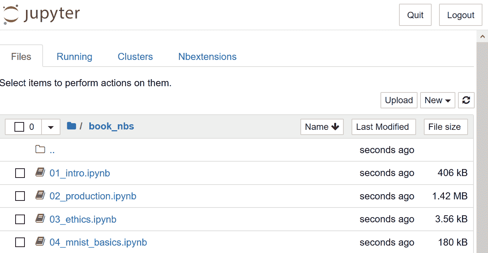

###### 图 1-2\. Jupyter 笔记本的初始视图

您现在已经准备好运行您的第一个 Jupyter 笔记本！

# 行话：Jupyter 笔记本

一种软件，允许您在单个交互式文档中包含格式化文本、代码、图像、视频等。Jupyter 因其在许多学术领域和工业中的广泛使用和巨大影响而获得了软件的最高荣誉，ACM 软件系统奖。Jupyter 笔记本是数据科学家用于开发和与深度学习模型交互的最广泛使用的软件。

## 运行您的第一个笔记本

笔记本按章节编号，与本书中呈现的顺序相同。因此，您将看到列出的第一个笔记本是您现在需要使用的笔记本。您将使用此笔记本来训练一个可以识别狗和猫照片的模型。为此，您将下载一组狗和猫照片的数据集，并使用该数据集*训练模型*。

*数据集*只是一堆数据——可以是图像、电子邮件、财务指标、声音或其他任何东西。有许多免费提供的数据集适合用于训练模型。许多这些数据集是由学者创建的，以帮助推动研究，许多是为竞赛提供的（有一些竞赛，数据科学家可以竞争，看看谁有最准确的模型！），有些是其他过程的副产品（如财务申报）。

# 完整和剥离的笔记本

有两个包含不同版本笔记本的文件夹。*full*文件夹包含用于创建您现在阅读的书的确切笔记本，包括所有散文和输出。*stripped*版本具有相同的标题和代码单元格，但所有输出和散文都已删除。阅读书的一部分后，我们建议关闭书，通过 stripped 笔记本进行练习，并尝试在执行之前弄清楚每个单元格将显示什么。还要尝试回想代码正在演示什么。

要打开一个笔记本，只需单击它。笔记本将打开，看起来类似于图 1-3（请注意，不同平台之间可能存在细节上的轻微差异；您可以忽略这些差异）。

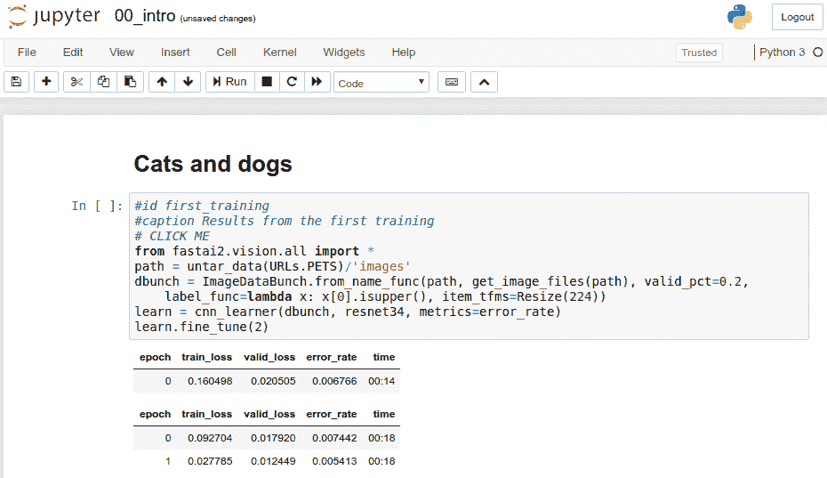

###### 图 1-3\. 一个 Jupyter 笔记本

一个笔记本由*单元格*组成。有两种主要类型的单元格：

+   包含格式化文本、图像等内容的单元格。这些使用一种称为*Markdown*的格式，您很快就会了解。

+   包含可执行代码的单元格，输出将立即显示在其下方（可以是纯文本、表格、图像、动画、声音，甚至交互式应用程序）。

Jupyter 笔记本可以处于两种模式之一：编辑模式或命令模式。在编辑模式下，键盘上的输入以通常的方式输入到单元格中。但是，在命令模式下，您将看不到任何闪烁的光标，键盘上的每个键都将具有特殊功能。

在继续之前，请按下键盘上的 Escape 键切换到命令模式（如果您已经在命令模式下，则此操作无效，因此现在请按下它）。要查看所有可用功能的完整列表，请按 H；按 Escape 键以删除此帮助屏幕。请注意，在命令模式下，与大多数程序不同，命令不需要按住 Control、Alt 或类似键，您只需按下所需的字母键。

您可以通过按下 C 键（需要首先选择单元格，显示为周围有轮廓；如果尚未选择，请单击一次）来复制单元格。然后按 V 键粘贴副本。

单击以“# CLICK ME”开头的单元格以选择它。该行中的第一个字符表示后面的内容是 Python 中的注释，因此在执行单元格时会被忽略。单元格的其余部分是一个完整的系统，用于创建和训练一个用于识别猫和狗的最先进模型。所以，现在让我们开始训练吧！要这样做，只需在键盘上按 Shift-Enter，或单击工具栏上的播放按钮。然后等待几分钟，以下事情会发生：

1.  一个名为[牛津-IIIT 宠物数据集](https://oreil.ly/c_4Bv)的数据集，其中包含来自 37 个品种的 7,349 张猫和狗的图像，将从 fast.ai 数据集合中下载到您正在使用的 GPU 服务器上，然后进行提取。

1.  一个*预训练模型*，已经在 130 万张图像上训练过，使用了一个获奖模型，将从互联网上下载。

1.  预训练模型将使用迁移学习的最新进展进行*微调*，以创建一个专门定制用于识别狗和猫的模型。

前两个步骤只需要在您的 GPU 服务器上运行一次。如果再次运行单元格，它将使用已经下载的数据集和模型，而不是重新下载它们。让我们看看单元格的内容和结果（表 1-2）：

```py
# CLICK ME
from fastai.vision.all import *
path = untar_data(URLs.PETS)/'images'

def is_cat(x): return x[0].isupper()
dls = ImageDataLoaders.from_name_func(
    path, get_image_files(path), valid_pct=0.2, seed=42,
    label_func=is_cat, item_tfms=Resize(224))

learn = cnn_learner(dls, resnet34, metrics=error_rate)
learn.fine_tune(1)
```

表 1-2\. 第一次训练的结果

| epoch | train_loss | valid_loss | error_rate | time |
| --- | --- | --- | --- | --- |
| 0 | 0.169390 | 0.021388 | 0.005413 | 00:14 |
| epoch | train_loss | valid_loss | error_rate | time |
| --- | --- | --- | --- | --- |
| 0 | 0.058748 | 0.009240 | 0.002706 | 00:19 |

您可能不会看到这里显示的完全相同的结果。训练模型涉及许多小随机变化的来源。在这个例子中，我们通常看到错误率远低于 0.02，然而。

# 训练时间

根据您的网络速度，下载预训练模型和数据集可能需要几分钟。运行`fine_tune`可能需要一两分钟。通常，本书中的模型需要几分钟来训练，您自己的模型也是如此，因此最好想出一些好的技巧来充分利用这段时间。例如，当您的模型训练时，继续阅读下一节，或者打开另一个笔记本并用它进行一些编码实验。

那么，我们如何知道这个模型是否好用？在表的最后一列中，你可以看到*错误率*，即被错误识别的图像的比例。错误率作为我们的度量标准——我们选择的模型质量的衡量标准，旨在直观和易于理解。正如你所看到的，即使训练时间只有几秒钟（不包括数据集和预训练模型的一次性下载），模型几乎是完美的。事实上，你已经取得的准确率比任何人在 10 年前取得的都要好得多！

最后，让我们检查一下这个模型是否真的有效。去找一张狗或猫的照片；如果你手头没有，只需搜索 Google 图片并下载你找到的一张图片。现在执行定义了`uploader`的单元格。它会输出一个按钮，你可以点击它，然后选择你想分类的图片：

```py
uploader = widgets.FileUpload()
uploader
```


现在你可以将上传的文件传递给模型。确保它是一张清晰的狗或猫的照片，而不是线描、卡通或类似的照片。笔记本会告诉你它认为这是一只狗还是一只猫，以及它的自信程度。希望你会发现你的模型表现得很好：

```py
img = PILImage.create(uploader.data[0])
is_cat,_,probs = learn.predict(img)
print(f"Is this a cat?: {is_cat}.")
print(f"Probability it's a cat: {probs[1].item():.6f}")
```

```py
Is this a cat?: True.
Probability it's a cat: 0.999986
```

恭喜你的第一个分类器！

但是这意味着什么？你实际上做了什么？为了解释这一点，让我们再次放大，看看整体情况。

## 什么是机器学习？

你的分类器是一个深度学习模型。正如已经提到的，深度学习模型使用神经网络，这些神经网络最初可以追溯到上世纪 50 年代，并且最近由于最新的进展变得非常强大。

另一个重要的背景是，深度学习只是更一般的*机器学习*领域中的一个现代领域。要理解当你训练自己的分类模型时所做的事情的本质，你不需要理解深度学习。看到你的模型和训练过程是如何成为适用于机器学习的概念的例子就足够了。

因此，在本节中，我们将描述机器学习。我们将探讨关键概念，并看看它们如何可以追溯到最初介绍它们的原始文章。

*机器学习*就像常规编程一样，是让计算机完成特定任务的一种方式。但是如果要用常规编程来完成前面部分我们刚刚做的事情：在照片中识别狗和猫，我们将不得不为计算机写下完成任务所需的确切步骤。

通常，当我们编写程序时，很容易为我们写下完成任务的步骤。我们只需考虑如果我们必须手动完成任务时会采取的步骤，然后将它们转换为代码。例如，我们可以编写一个对列表进行排序的函数。一般来说，我们会编写一个类似于图 1-4 的函数（其中*inputs*可能是一个未排序的列表，*results*是一个排序后的列表）。

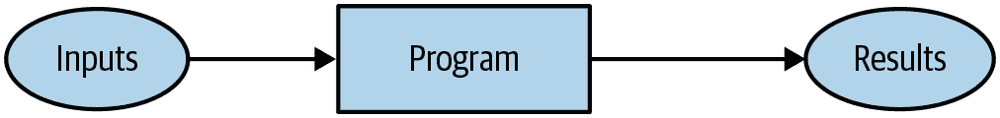

###### 图 1-4\. 传统程序

但是要在照片中识别物体，这有点棘手；当我们在图片中识别物体时，我们采取了什么步骤？我们真的不知道，因为这一切都发生在我们的大脑中，而我们并没有意识到！

早在计算机诞生之初，1949 年，IBM 的一位研究员阿瑟·塞缪尔开始研究一种让计算机完成任务的不同方式，他称之为*机器学习*。在他经典的 1962 年文章“人工智能：自动化的前沿”中，他写道：

> 为这样的计算编程对于我们来说是相当困难的，主要不是因为计算机本身的任何固有复杂性，而是因为需要详细说明过程的每一个细微步骤。任何程序员都会告诉你，计算机是巨大的白痴，而不是巨大的大脑。

他的基本想法是这样的：不是告诉计算机解决问题所需的确切步骤，而是向其展示解决问题的示例，并让它自己找出如何解决。结果证明这非常有效：到 1961 年，他的跳棋程序学到了很多，以至于击败了康涅狄格州冠军！这是他描述自己想法的方式（与之前提到的同一篇文章）：

> 假设我们安排一些自动手段来测试任何当前权重分配的有效性，以实际表现为准，并提供一种机制来改变权重分配以最大化性能。我们不需要详细了解这种程序的细节，就可以看到它可以完全自动化，并且可以看到一个这样编程的机器将从中学习。

这个简短陈述中嵌入了一些强大的概念：

+   “权重分配”的想法

+   每个权重分配都有一些“实际表现”的事实

+   要求有一种“自动手段”来测试该性能

+   需要一个“机制”（即，另一个自动过程）来通过改变权重分配来提高性能

让我们逐一了解这些概念，以便了解它们在实践中如何结合。首先，我们需要了解塞缪尔所说的*权重分配*是什么意思。

权重只是变量，权重分配是这些变量的特定值选择。程序的输入是它处理以产生结果的值，例如，将图像像素作为输入，并返回分类“狗”作为结果。程序的权重分配是定义程序操作方式的其他值。

因为它们会影响程序，它们在某种意义上是另一种输入。我们将更新我们的基本图片图 1-4，并用图 1-5 替换，以便考虑到这一点。

！[](Images/dlcf_0105.png)

###### 图 1-5。使用权重分配的程序

我们已将方框的名称从*程序*更改为*模型*。这是为了遵循现代术语并反映*模型*是一种特殊类型的程序：它可以根据*权重*做*许多不同的事情*。它可以以许多不同的方式实现。例如，在塞缪尔的跳棋程序中，不同的权重值会导致不同的跳棋策略。

（顺便说一句，塞缪尔所说的“权重”如今通常被称为模型*参数*，以防您遇到这个术语。术语*权重*保留给特定类型的模型参数。）

接下来，塞缪尔说我们需要一种*自动测试任何当前权重分配的有效性的方法，以实际表现为准*。在他的跳棋程序中，“实际表现”模型的表现有多好。您可以通过让两个模型相互对战并看哪个通常获胜来自动测试两个模型的表现。

最后，他说我们需要*一种机制来改变权重分配，以最大化性能*。例如，我们可以查看获胜模型和失败模型之间的权重差异，并将权重进一步调整到获胜方向。

我们现在可以看到他为什么说这样的程序*可以完全自动化，并且...一个这样编程的机器将从中学习*。当权重的调整也是自动的时，学习将变得完全自动——当我们不再通过手动调整权重来改进模型，而是依赖于根据性能产生调整的自动化机制时。

图 1-6 展示了塞缪尔关于训练机器学习模型的完整图景。

！基本训练循环

###### 图 1-6。训练机器学习模型

注意模型的*结果*（例如，在跳棋游戏中的移动）和其*性能*（例如，是否赢得比赛，或者赢得比赛的速度）之间的区别。

还要注意，一旦模型训练好了，也就是说，一旦我们选择了最终的、最好的、最喜欢的权重分配，那么我们可以将权重视为*模型的一部分*，因为我们不再对它们进行变化。

因此，实际上在训练后*使用*模型看起来像图 1-7。

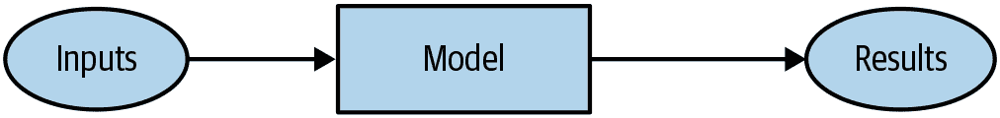

###### 图 1-7。使用训练后的模型作为程序

这看起来与我们在图 1-4 中的原始图表相同，只是将*程序*一词替换为*模型*。这是一个重要的观点：*训练后的模型可以像常规计算机程序一样对待*。

# 行话：机器学习

通过让计算机从经验中学习而不是通过手动编码个别步骤来开发程序的培训。

## 什么是神经网络？

不难想象跳棋程序的模型可能是什么样子。可能编码了一系列跳棋策略，以及某种搜索机制，然后权重可以变化以决定如何选择策略，在搜索期间关注棋盘的哪些部分等等。但是对于图像识别程序，或者理解文本，或者我们可能想象的许多其他有趣的问题，模型可能是什么样子却一点也不明显。

我们希望有一种函数，它如此灵活，以至于可以通过调整其权重来解决任何给定问题。令人惊讶的是，这种函数实际上存在！这就是我们已经讨论过的神经网络。也就是说，如果您将神经网络视为数学函数，那么它将是一种极其灵活的函数，取决于其权重。一种称为*通用逼近定理*的数学证明表明，这种函数在理论上可以解决任何问题，达到任何精度水平。神经网络如此灵活的事实意味着，在实践中，它们通常是一种合适的模型，您可以将精力集中在训练过程上，即找到良好的权重分配。

但是这个过程呢？人们可以想象，您可能需要为每个问题找到一种新的“机制”来自动更新权重。这将是费力的。我们在这里也希望有一种完全通用的方法来更新神经网络的权重，使其在任何给定任务上都能提高。方便的是，这也存在！

这被称为*随机梯度下降*（SGD）。我们将在第四章中详细了解神经网络和 SGD 的工作原理，以及解释通用逼近定理。然而，现在，我们将使用塞缪尔自己的话来说：*我们不需要深入了解这样一个过程的细节，就可以看到它可以完全自动化，并且可以看到这样一个机器编程的机器可以从中学习经验。*

# 杰里米说

不要担心；无论是 SGD 还是神经网络，在数学上都不复杂。它们几乎完全依赖于加法和乘法来完成工作（但它们进行了*大量*的加法和乘法！）。当学生们看到细节时，我们听到的主要反应是：“就是这样吗？”

换句话说，简而言之，神经网络是一种特殊类型的机器学习模型，它完全符合塞缪尔最初的构想。神经网络之所以特殊，是因为它们非常灵活，这意味着它们可以通过找到正确的权重来解决异常广泛的问题。这是强大的，因为随机梯度下降为我们提供了一种自动找到这些权重值的方法。

放大后，让我们现在缩小范围，重新审视使用塞缪尔框架解决我们的图像分类问题。

我们的输入是图像。我们的权重是神经网络中的权重。我们的模型是一个神经网络。我们的结果是由神经网络计算出的值，比如“狗”或“猫”。

下一个部分是什么，一个*自动测试任何当前权重分配的有效性的手段*？确定“实际表现”很容易：我们可以简单地将模型的表现定义为其在预测正确答案时的准确性。

将所有这些放在一起，假设 SGD 是我们更新权重分配的机制，我们可以看到我们的图像分类器是一个机器学习模型，就像 Samuel 所设想的那样。

## 一些深度学习术语

Samuel 在 1960 年代工作，自那时术语已经发生了变化。以下是我们讨论过的所有部分的现代深度学习术语：

+   *模型*的功能形式被称为*架构*（但要小心—有时人们将*模型*用作*架构*的同义词，这可能会让人困惑）。

+   *权重*被称为*参数*。

+   *预测*是从*独立变量*计算出来的，这是*不包括标签*的*数据*。

+   模型的*结果*被称为*预测*。

+   *性能*的度量被称为*损失*。

+   损失不仅取决于预测，还取决于正确的*标签*（也称为*目标*或*因变量*）；例如，“狗”或“猫”。

在进行这些更改后，我们在图 1-6 中的图表看起来像图 1-8。

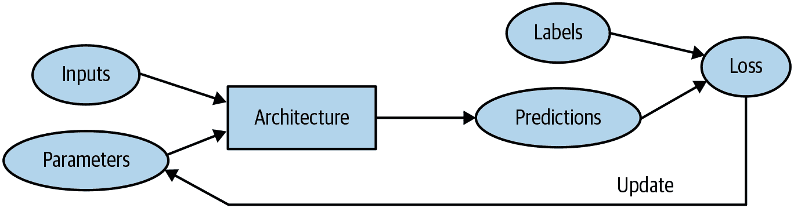

###### 图 1-8\. 详细训练循环

## 机器学习固有的限制

从这幅图片中，我们现在可以看到关于训练深度学习模型的一些基本事情：

+   没有数据就无法创建模型。

+   模型只能学习操作训练数据中看到的模式。

+   这种学习方法只创建*预测*，而不是推荐的*行动*。

+   仅仅拥有输入数据的示例是不够的；我们还需要为这些数据提供*标签*（例如，仅有狗和猫的图片不足以训练模型；我们需要为每个图片提供一个标签，说明哪些是狗，哪些是猫）。

一般来说，我们已经看到大多数组织声称他们没有足够的数据实际上意味着他们没有足够的*带标签*数据。如果任何组织有兴趣在实践中使用模型做一些事情，那么他们可能有一些输入数据计划运行他们的模型。并且可能他们已经以其他方式做了一段时间（例如，手动或使用一些启发式程序），因此他们有来自这些过程的数据！例如，放射学实践几乎肯定会有医学扫描的存档（因为他们需要能够检查他们的患者随时间的进展），但这些扫描可能没有包含诊断或干预措施列表的结构化标签（因为放射科医生通常创建自由文本自然语言报告，而不是结构化数据）。在本书中，我们将大量讨论标记方法，因为这在实践中是一个非常重要的问题。

由于这类机器学习模型只能进行*预测*（即试图复制标签），这可能导致组织目标与模型能力之间存在显著差距。例如，在本书中，您将学习如何创建一个*推荐系统*，可以预测用户可能购买的产品。这通常用于电子商务，例如通过显示排名最高的商品来定制主页上显示的产品。但这样的模型通常是通过查看用户及其购买历史（*输入*）以及他们最终购买或查看的内容（*标签*）来创建的，这意味着该模型很可能会告诉您关于用户已经拥有或已经了解的产品，而不是他们最有可能对其感兴趣的新产品。这与您当地书店的专家所做的事情大不相同，他们会询问您的口味，然后告诉您您以前从未听说过的作者或系列。

另一个关键的洞察来自于考虑模型如何与其环境互动。这可能会产生*反馈循环*，如此处所述：

1.  基于过去的逮捕地点创建了一个*预测性执法*模型。实际上，这并不是在预测犯罪，而是在预测逮捕，因此部分地只是反映了现有执法过程中的偏见。

1.  然后执法人员可能会使用该模型来决定在哪里集中他们的执法活动，导致这些地区的逮捕增加。

1.  这些额外逮捕的数据将被反馈回去重新训练未来版本的模型。

这是一个*正反馈循环*：模型被使用得越多，数据就变得越有偏见，使模型变得更加有偏见，依此类推。

反馈循环也可能在商业环境中造成问题。例如，视频推荐系统可能会偏向于推荐由视频最大观看者消费的内容（例如，阴谋论者和极端分子倾向于观看比平均水平更多的在线视频内容），导致这些用户增加他们的视频消费量，进而导致更多这类视频被推荐。我们将在第三章中更详细地讨论这个话题。

既然你已经看到了理论的基础，让我们回到我们的代码示例，详细看看代码如何与我们刚刚描述的过程相对应。

## 我们的图像识别器是如何工作的

让我们看看我们的图像识别器代码如何映射到这些想法。我们将把每一行放入一个单独的单元格，并查看每一行正在做什么（我们暂时不会解释每个参数的每个细节，但会给出重要部分的描述；完整细节将在本书后面提供）。第一行导入了整个 fastai.vision 库：

```py
from fastai.vision.all import *
```

这为我们提供了创建各种计算机视觉模型所需的所有函数和类。

# Jeremy 说

许多 Python 编程人员建议避免像这样导入整个库（使用`import *`语法），因为在大型软件项目中可能会引起问题。然而，在交互式工作中，比如在 Jupyter 笔记本中，它非常有效。fastai 库专门设计用于支持这种交互式使用，它只会将必要的部分导入到您的环境中。

第二行从[fast.ai 数据集合](https://course.fast.ai/datasets)下载一个标准数据集（如果之前没有下载），将其提取出来（如果之前没有提取），并返回一个提取位置的`Path`对象：

```py
path = untar_data(URLs.PETS)/'images'
```

# Sylvain 说

在 fast.ai 学习期间，甚至到今天，我学到了很多关于高效编码实践的知识。fastai 库和 fast.ai 笔记本中充满了许多有用的小贴士，这些贴士帮助我成为了一个更好的程序员。例如，请注意 fastai 库不仅返回包含数据集路径的字符串，而是一个`Path`对象。这是 Python 3 标准库中一个非常有用的类，使得访问文件和目录变得更加容易。如果你之前没有接触过它，请务必查看其文档或教程并尝试使用。请注意，[书籍网站](https://book.fast.ai)包含了每章推荐教程的链接。我会继续在我们遇到时告诉你我发现有用的小编码技巧。

在第三行，我们定义了一个函数`is_cat`，根据数据集创建者提供的文件名规则来标记猫：

```py
def is_cat(x): return x[0].isupper()
```

我们在第四行使用了这个函数，告诉 fastai 我们拥有什么类型的数据集以及它的结构：

```py
dls = ImageDataLoaders.from_name_func(
    path, get_image_files(path), valid_pct=0.2, seed=42,
    label_func=is_cat, item_tfms=Resize(224))
```

不同类型的深度学习数据集和问题有各种类别，这里我们使用`ImageDataLoaders`。类名的第一部分通常是你拥有的数据类型，比如图像或文本。

我们必须告诉 fastai 的另一个重要信息是如何从数据集中获取标签。计算机视觉数据集通常以标签作为文件名或路径的一部分进行结构化，最常见的是父文件夹名称。fastai 带有许多标准化的标记方法，以及编写自己的方法。在这里，我们告诉 fastai 使用我们刚刚定义的`is_cat`函数。

最后，我们定义了我们需要的`Transform`。`Transform`包含在训练期间自动应用的代码；fastai 包含许多预定义的`Transform`，添加新的`Transform`就像创建一个 Python 函数一样简单。有两种类型：`item_tfms`应用于每个项目（在本例中，每个项目都被调整为 224 像素的正方形），而`batch_tfms`应用于一次处理一批项目的 GPU，因此它们特别快速（我们将在本书中看到许多这样的例子）。

为什么是 224 像素？出于历史原因（旧的预训练模型需要这个确切的尺寸），但你几乎可以传入任何尺寸。如果增加尺寸，通常会得到更好的模型结果（因为它可以关注更多细节），但代价是速度和内存消耗；如果减小尺寸，则相反。

# 术语：分类和回归

*分类*和*回归*在机器学习中有非常具体的含义。这两种模型是我们在本书中将要研究的两种主要类型。*分类模型*试图预测一个类别。也就是说，它从许多离散的可能性中进行预测，比如“狗”或“猫”。*回归模型*试图预测一个或多个数值，比如温度或位置。有时人们使用*回归*一词来指代一种特定类型的模型，称为*线性回归模型*；这是一个不好的做法，在本书中我们不会使用这种术语！

Pet 数据集包含 7390 张狗和猫的图片，包括 37 种品种。每个图像都使用其文件名进行标记：例如，文件*great_pyrenees_173.jpg*是数据集中大白熊犬品种的第 173 个示例图像。如果图像是猫，则文件名以大写字母开头，否则以小写字母开头。我们必须告诉 fastai 如何从文件名中获取标签，我们通过调用`from_name_func`来实现（这意味着可以使用应用于文件名的函数来提取文件名），并传递`x[0].isupper()`，如果第一个字母是大写字母（即是猫），则评估为`True`。

在这里提到的最重要的参数是`valid_pct=0.2`。这告诉 fastai 保留 20%的数据，*完全不用于训练模型*。这 20%的数据被称为*验证集*；剩下的 80%被称为*训练集*。验证集用于衡量模型的准确性。默认情况下，被保留的 20%是随机选择的。参数`seed=42`将*随机种子*设置为每次运行此代码时相同的值，这意味着每次运行时我们都会得到相同的验证集，这样，如果我们更改模型并重新训练它，我们知道任何差异都是由于对模型的更改，而不是由于有不同的随机验证集。

fastai 将*始终*仅使用*验证集*显示模型的准确性，*永远不会*使用训练集。这是绝对关键的，因为如果您为足够长的时间训练足够大的模型，它最终会记住数据集中每个项目的标签！结果将不是一个有用的模型，因为我们关心的是我们的模型在*以前未见过的图像*上的工作效果。这总是我们创建模型时的目标：使其在模型仅在未来看到的数据上有用，经过训练后。

即使您的模型尚未完全记住所有数据，在训练的早期阶段可能已经记住了其中的某些部分。因此，您训练的时间越长，您在训练集上的准确性就会越好；验证集的准确性也会在一段时间内提高，但最终会开始变差，因为模型开始记住训练集而不是在数据中找到可泛化的潜在模式。当这种情况发生时，我们说模型*过拟合*。

图 1-9 展示了过拟合时会发生什么，使用一个简化的例子，我们只有一个参数和一些基于函数`x**2`随机生成的数据。正如您所看到的，尽管过拟合模型在接近观察到的数据点的数据上的预测是准确的，但在该范围之外时则相差甚远。

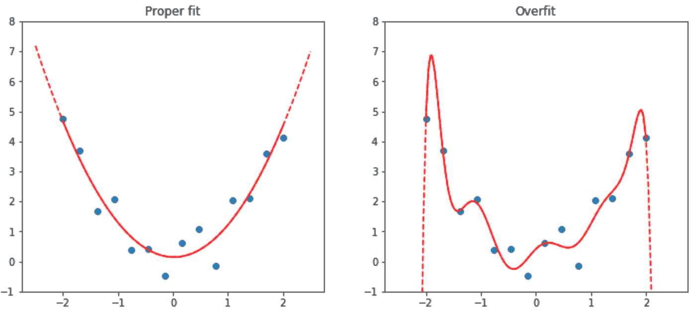

###### 图 1-9\. 过拟合示例

**过拟合是训练所有机器学习从业者和所有算法时最重要和具有挑战性的问题**。正如您将看到的，很容易创建一个在准确预测其训练数据上做得很好的模型，但要在模型从未见过的数据上做出准确预测要困难得多。当然，这些数据在实践中是重要的。例如，如果您创建一个手写数字分类器（我们很快就会！）并将其用于识别支票上写的数字，那么您永远不会看到模型训练过的任何数字——每张支票都会有稍微不同的书写变化。

您将在本书中学习许多避免过拟合的方法。但是，只有在确认发生过拟合时（即，如果您观察到训练过程中验证准确性变差）才应使用这些方法。我们经常看到从业者在有足够数据的情况下也使用过拟合避免技术，最终得到的模型可能比他们本可以实现的更不准确。

# 验证集

当您训练模型时，您必须*始终*同时拥有训练集和验证集，并且必须仅在验证集上测量模型的准确性。如果您训练时间过长，数据不足，您将看到模型的准确性开始变差；这被称为*过拟合*。fastai 将`valid_pct`默认设置为`0.2`，因此即使您忘记了，fastai 也会为您创建一个验证集！

我们的图像识别器训练代码的第五行告诉 fastai 创建一个*卷积神经网络*（CNN），并指定要使用的*架构*（即要创建的模型类型）、我们要对其进行训练的数据以及要使用的*度量标准*：

```py
learn = cnn_learner(dls, resnet34, metrics=error_rate)
```

为什么使用 CNN？这是创建计算机视觉模型的当前最先进方法。我们将在本书中学习有关 CNN 如何工作的所有知识。它们的结构受到人类视觉系统工作方式的启发。

在 fastai 中有许多架构，我们将在本书中介绍（以及讨论如何创建您自己的架构）。然而，大多数情况下，选择架构并不是深度学习过程中非常重要的部分。这是学术界喜欢谈论的内容，但实际上您不太可能需要花费太多时间。有一些标准架构在大多数情况下都有效，而在这种情况下，我们使用的是一种称为*ResNet*的架构，我们将在本书中大量讨论；它对许多数据集和问题都既快速又准确。`resnet34`中的`34`指的是该架构变体中的层数（其他选项是`18`、`50`、`101`和`152`）。使用层数更多的架构模型训练时间更长，更容易过拟合（即在验证集上的准确率开始变差之前无法训练多少个时期）。另一方面，当使用更多数据时，它们可能会更准确。

什么是度量标准？*度量标准*是一个函数，使用验证集来衡量模型预测的质量，并将在每个时期结束时打印出来。在这种情况下，我们使用`error_rate`，这是 fastai 提供的一个函数，它正是它所说的：告诉您验证集中有多少百分比的图像被错误分类。分类的另一个常见度量标准是`accuracy`（即`1.0 - error_rate`）。fastai 提供了许多其他度量标准，这将在本书中讨论。

度量标准的概念可能会让您想起*损失*，但有一个重要区别。损失的整个目的是定义一个“性能度量”，训练系统可以使用它来自动更新权重。换句话说，损失的一个好选择是易于随机梯度下降使用的选择。但度量标准是为人类消费而定义的，因此一个好的度量标准是您易于理解的，并且尽可能接近您希望模型执行的任务。有时，您可能会决定损失函数是一个合适的度量标准，但这并不一定是情况。

`cnn_learner`还有一个名为`pretrained`的参数，默认值为`True`（因此在这种情况下使用，即使我们没有指定），它将您模型中的权重设置为已经由专家训练过的值，以识别 130 万张照片中的一千个不同类别（使用著名的[*ImageNet*](http://www.image-net.org)数据集）。具有已在另一个数据集上训练过的权重的模型称为*预训练模型*。您几乎总是应该使用预训练模型，因为这意味着您的模型在您甚至没有展示任何数据之前就已经非常有能力。正如您将看到的，在深度学习模型中，许多这些能力是您几乎无论项目细节如何都需要的。例如，预训练模型的部分将处理边缘、梯度和颜色检测，这些对许多任务都是必需的。

使用预训练模型时，`cnn_learner`将移除最后一层，因为该层始终是针对原始训练任务（即 ImageNet 数据集分类）专门定制的，并将其替换为一个或多个具有随机权重的新层，适合您正在处理的数据集的大小。模型的最后部分被称为*头*。

使用预训练模型是我们训练更准确、更快速、使用更少数据和更少时间和金钱的最重要方法。您可能会认为使用预训练模型将是学术深度学习中最研究的领域...但您会非常、非常错误！预训练模型的重要性通常在大多数课程、书籍或软件库功能中没有得到认可或讨论，并且在学术论文中很少被考虑。当我们在 2020 年初写这篇文章时，事情刚刚开始改变，但这可能需要一段时间。因此要小心：您与之交谈的大多数人可能会严重低估您可以在深度学习中使用少量资源做些什么，因为他们可能不会深入了解如何使用预训练模型。

使用一个预训练模型来执行一个与其最初训练目的不同的任务被称为*迁移学习*。不幸的是，由于迁移学习研究不足，很少有领域提供预训练模型。例如，目前在医学领域很少有预训练模型可用，这使得在该领域使用迁移学习具有挑战性。此外，目前还不清楚如何将迁移学习应用于诸如时间序列分析之类的任务。

# 术语：迁移学习

使用一个预训练模型来执行一个与其最初训练目的不同的任务。

我们代码的第六行告诉 fastai 如何*适应*模型：

```py
learn.fine_tune(1)
```

正如我们所讨论的，架构只是描述数学函数的*模板*；直到我们为其包含的数百万参数提供值之前，它才会真正发挥作用。

这是深度学习的关键之处——确定如何适应模型的参数以使其解决您的问题。要适应一个模型，我们必须提供至少一条信息：每个图像查看多少次（称为*时代*数）。您选择的时代数将在很大程度上取决于您有多少时间可用，以及您发现在实践中适应模型需要多长时间。如果选择的数字太小，您可以随时稍后进行更多时代的训练。

但为什么这种方法被称为`fine_tune`，而不是`fit`？fastai 确实有一个名为`fit`的方法，它确实适合一个模型（即，多次查看训练集中的图像，每次更新参数使预测越来越接近目标标签）。但在这种情况下，我们已经从一个预训练模型开始，并且我们不想丢弃它已经具有的所有这些功能。正如您将在本书中了解到的，有一些重要的技巧可以使预训练模型适应新数据集，这个过程称为*微调*。

# 术语：微调

一种迁移学习技术，通过使用与预训练不同的任务进行额外时代的训练来更新预训练模型的参数。

当您使用`fine_tune`方法时，fastai 将为您使用这些技巧。您可以设置一些参数（我们稍后会讨论），但在此处显示的默认形式中，它执行两个步骤：

1.  使用一个时代来适应模型的那些部分，以使新的随机头部能够正确地与您的数据集配合工作。

1.  在调用适合整个模型的方法时，请使用请求的时代数，更快地更新后面的层（特别是头部）的权重，而不是早期的层（正如我们将看到的，通常不需要对预训练权重进行太多更改）。

模型的*头部*是新添加的部分，专门针对新数据集。一个*时代*是对数据集的一次完整遍历。在调用`fit`之后，每个时代后的结果都会被打印出来，显示时代编号，训练和验证集的损失（用于训练模型的“性能度量”），以及您请求的任何*指标*（在这种情况下是错误率）。

因此，通过所有这些代码，我们的模型学会了仅仅通过标记的示例来识别猫和狗。但它是如何做到的呢？

## 我们的图像识别器学到了什么

在这个阶段，我们有一个工作良好的图像识别器，但我们不知道它在做什么！尽管许多人抱怨深度学习导致不可理解的“黑匣子”模型（即，可以提供预测但没有人能理解的东西），但事实并非如此。有大量研究表明如何深入检查深度学习模型并从中获得丰富的见解。话虽如此，各种机器学习模型（包括深度学习和传统统计模型）都可能难以完全理解，特别是考虑到它们在遇到与用于训练它们的数据非常不同的数据时的行为。我们将在本书中讨论这个问题。

2013 年，博士生 Matt Zeiler 和他的导师 Rob Fergus 发表了《可视化和理解卷积网络》，展示了如何可视化模型每一层学到的神经网络权重。他们仔细分析了赢得 2012 年 ImageNet 比赛的模型，并利用这一分析大大改进了模型，使他们能够赢得 2013 年的比赛！图 1-10 是他们发表的第一层权重的图片。

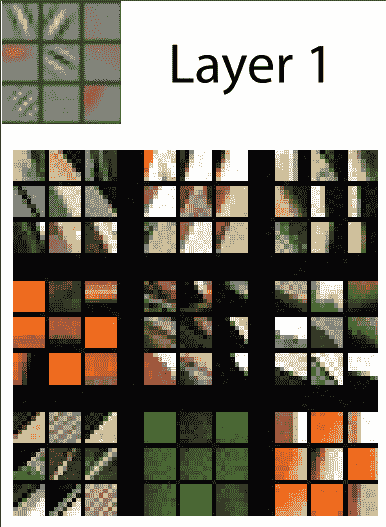

###### 图 1-10。CNN 第一层的激活（由 Matthew D. Zeiler 和 Rob Fergus 提供）

这张图片需要一些解释。对于每一层，具有浅灰色背景的图像部分显示了重建的权重，底部较大的部分显示了与每组权重最匹配的训练图像部分。对于第一层，我们可以看到模型发现了代表对角线、水平和垂直边缘以及各种梯度的权重。（请注意，对于每一层，只显示了部分特征；实际上，在所有层中有成千上万个特征。）

这些是模型为计算机视觉学习的基本构建块。它们已经被神经科学家和计算机视觉研究人员广泛分析，结果表明，这些学习的构建块与人眼的基本视觉机制以及在深度学习之前开发的手工计算机视觉特征非常相似。下一层在图 1-11 中表示。

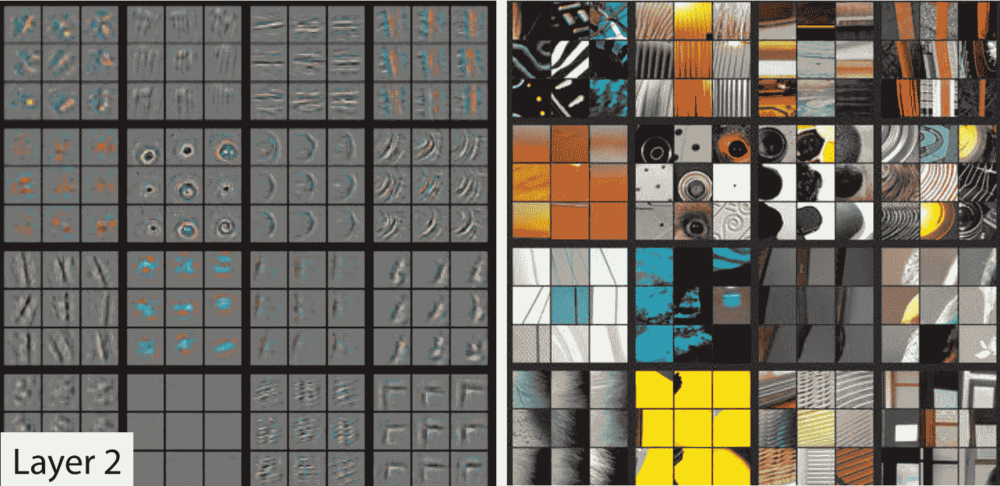

###### 图 1-11。CNN 第二层的激活（由 Matthew D. Zeiler 和 Rob Fergus 提供）

对于第 2 层，模型找到的每个特征都有九个权重重建示例。我们可以看到模型已经学会创建寻找角、重复线条、圆圈和其他简单模式的特征检测器。这些是从第一层中开发的基本构建块构建的。对于每个特征，图片右侧显示了与这些特征最匹配的实际图像的小块。例如，第 2 行第 1 列中的特定模式与日落相关的梯度和纹理相匹配。

图 1-12 显示了一篇论文中展示第 3 层特征重建结果的图片。

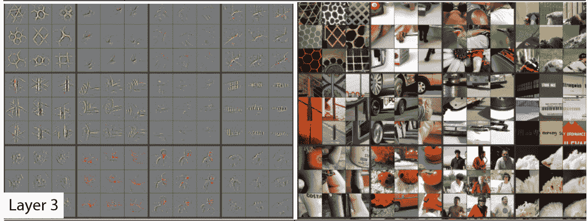

###### 图 1-12。CNN 第三层的激活（由 Matthew D. Zeiler 和 Rob Fergus 提供）

通过观察图片右侧，您可以看到特征现在能够识别和匹配更高级的语义组件，如汽车车轮、文字和花瓣。利用这些组件，第 4 层和第 5 层可以识别更高级的概念，如图 1-13 所示。

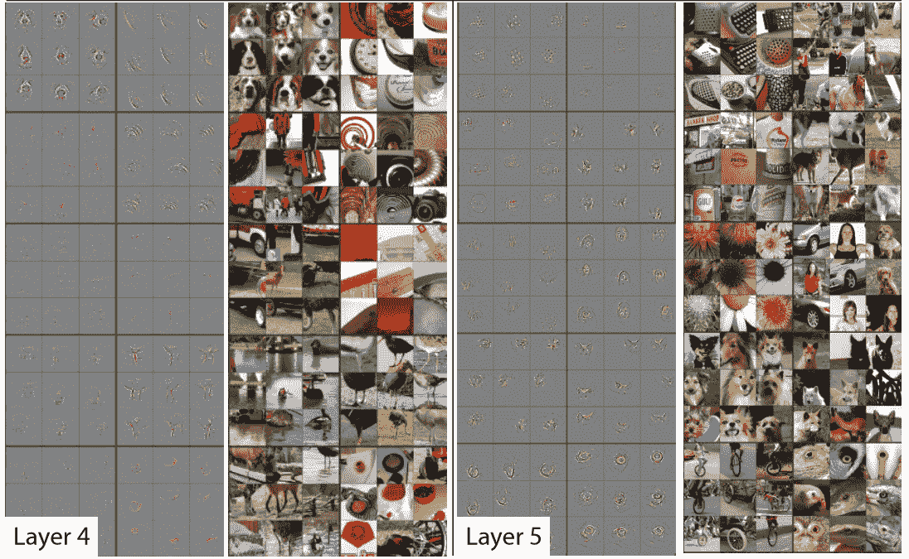

###### 图 1-13。CNN 的第四和第五层的激活（由 Matthew D. Zeiler 和 Rob Fergus 提供）

本文研究了一个名为*AlexNet*的旧模型，该模型只包含五层。自那时以来开发的网络可以有数百层 - 所以你可以想象这些模型开发的特征有多丰富！

当我们早期微调我们的预训练模型时，我们调整了最后几层关注的内容（花朵、人类、动物），以专注于猫与狗问题。更一般地，我们可以将这样的预训练模型专门用于许多不同的任务。让我们看一些例子。

## 图像识别器可以处理非图像任务

图像识别器只能识别图像，顾名思义。但很多事物可以被表示为图像，这意味着图像识别器可以学会完成许多任务。

例如，声音可以转换为频谱图，这是一种图表，显示音频文件中每个时间的每个频率的数量。fast.ai 学生 Ethan Sutin 使用这种方法，[轻松击败了一种最先进的环境声音检测模型的发布准确率](https://oreil.ly/747uv)，使用了 8732 个城市声音的数据集。fastai 的`show_batch`清楚地显示了每个声音具有相当独特的频谱图，如图 1-14 所示。

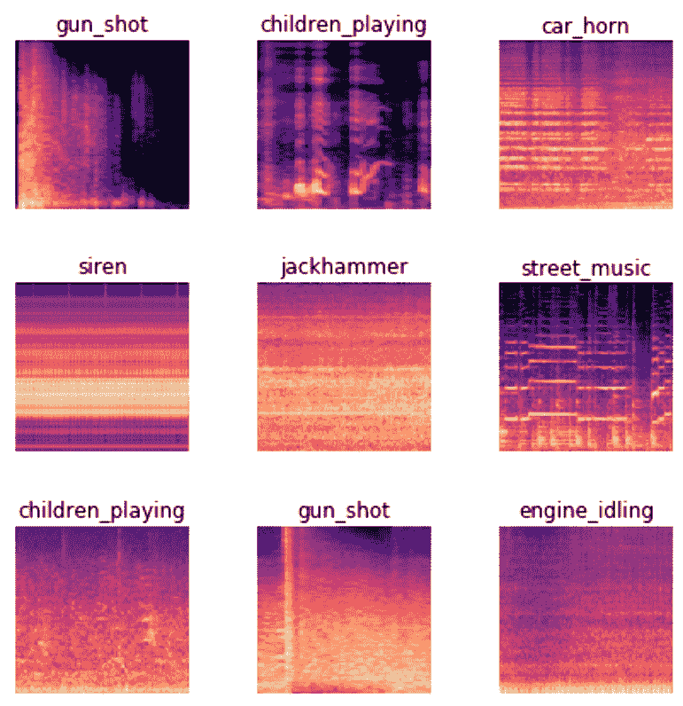

###### 图 1-14。显示具有声音频谱图的 show_batch

时间序列可以很容易地通过简单地在图表上绘制时间序列来转换为图像。然而，通常最好尝试以尽可能简单的方式表示数据，以便提取出最重要的组件。在时间序列中，季节性和异常很可能是感兴趣的。

时间序列数据有各种转换方法。例如，fast.ai 学生 Ignacio Oguiza 使用一种称为 Gramian Angular Difference Field（GADF）的技术，从一个时间序列数据集中为橄榄油分类创建图像，你可以在图 1-15 中看到结果。然后，他将这些图像输入到一个图像分类模型中，就像你在本章中看到的那样。尽管只有 30 个训练集图像，但他的结果准确率超过 90%，接近最先进水平。

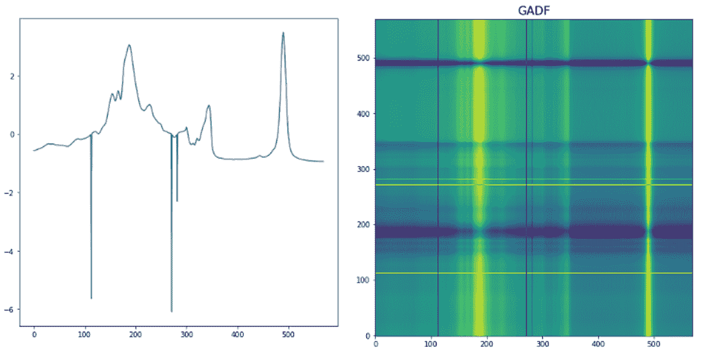

###### 图 1-15。将时间序列转换为图像

另一个有趣的 fast.ai 学生项目示例来自 Gleb Esman。他在 Splunk 上进行欺诈检测，使用了用户鼠标移动和鼠标点击的数据集。他通过绘制显示鼠标指针位置、速度和加速度的图像，使用彩色线条，并使用[小彩色圆圈](https://oreil.ly/6-I_X)显示点击，将这些转换为图片，如图 1-16 所示。他将这些输入到一个图像识别模型中，就像我们在本章中使用的那样，效果非常好，导致了这种方法在欺诈分析方面的专利！

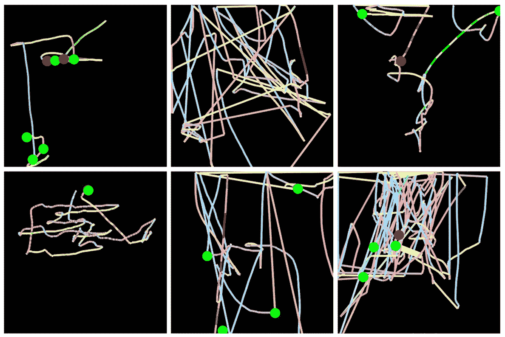

###### 图 1-16。将计算机鼠标行为转换为图像

另一个例子来自 Mahmoud Kalash 等人的论文“使用深度卷积神经网络进行恶意软件分类”，解释了“恶意软件二进制文件被分成 8 位序列，然后转换为等效的十进制值。这个十进制向量被重塑，生成了一个代表恶意软件样本的灰度图像”，如图 1-17 所示。

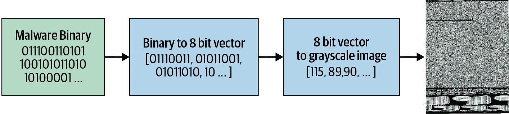

###### 图 1-17。恶意软件分类过程

作者们随后展示了通过恶意软件分类生成的“图片”，如图 1-18 所示。


###### 图 1-18。恶意软件示例

正如您所看到的，不同类型的恶意软件在人眼中看起来非常独特。研究人员基于这种图像表示训练的模型在恶意软件分类方面比学术文献中显示的任何先前方法都更准确。这表明将数据集转换为图像表示的一个很好的经验法则：如果人眼可以从图像中识别类别，那么深度学习模型也应该能够做到。

总的来说，您会发现在深度学习中，少数几种通用方法可以走得很远，只要您在如何表示数据方面有点创造性！您不应该将这里描述的方法视为“巧妙的变通方法”，因为它们通常（如此处）击败了以前的最先进结果。这确实是正确思考这些问题领域的方法。

## 术语回顾

我们刚刚涵盖了很多信息，让我们简要回顾一下。表 1-3 提供了一个方便的词汇表。

表 1-3\. 深度学习词汇表

| 术语 | 意义 |
| --- | --- |
| 标签 | 我们试图预测的数据，比如“狗”或“猫” |
| 架构 | 我们试图拟合的模型的 * 模板 *；即我们将输入数据和参数传递给的实际数学函数 |
| 模型 | 架构与特定一组参数的组合 |
| 参数 | 模型中改变任务的值，通过模型训练进行更新 |
| 拟合 | 更新模型的参数，使得使用输入数据的模型预测与目标标签匹配 |
| 训练 | * 拟合 * 的同义词 |
| 预训练模型 | 已经训练过的模型，通常使用大型数据集，并将进行微调 |
| 微调 | 为不同任务更新预训练模型 |
| 纪元 | 一次完整通过输入数据 |
| 损失 | 衡量模型好坏的指标，选择以驱动通过 SGD 进行训练 |
| 指标 | 使用验证集衡量模型好坏的测量标准，选择供人类消费 |
| 验证集 | 从训练中保留的一组数据，仅用于衡量模型好坏 |
| 训练集 | 用于拟合模型的数据；不包括验证集中的任何数据 |
| 过拟合 | 以使模型 * 记住 * 输入数据的特定特征而不是很好地泛化到训练期间未见的数据的方式训练模型 |
| CNN | 卷积神经网络；一种特别适用于计算机视觉任务的神经网络 |

有了这个词汇表，我们现在可以将迄今介绍的所有关键概念汇集在一起。花点时间回顾这些定义，并阅读以下摘要。如果您能理解解释，那么您就有能力理解接下来的讨论。

* 机器学习 *是一种学科，我们通过从数据中学习来定义程序，而不是完全自己编写它。 * 深度学习 *是机器学习中使用具有多个 * 层 * 的 * 神经网络 * 的专业领域。 * 图像分类 * 是一个代表性的例子（也称为 * 图像识别 *）。我们从 * 标记数据 * 开始 - 一组我们为每个图像分配了 * 标签 * 的图像，指示它代表什么。我们的目标是生成一个称为 * 模型 * 的程序，给定一个新图像，将对该新图像代表的内容进行准确的 * 预测 *。

每个模型都从选择 * 架构 * 开始，这是该类型模型内部工作方式的一般模板。 * 训练 *（或 * 拟合 *）模型的过程是找到一组 * 参数值 *（或 * 权重 *），这些参数值将该一般架构专门化为适用于我们特定数据类型的模型。为了定义模型在单个预测上的表现如何，我们需要定义一个 * 损失函数 *，它确定我们如何将预测评分为好或坏。

为了让训练过程更快，我们可以从一个*预训练模型*开始——一个已经在其他人的数据上训练过的模型。然后我们可以通过在我们的数据上进一步训练它来使其适应我们的数据，这个过程称为*微调*。

当我们训练一个模型时，一个关键问题是确保我们的模型*泛化*：它从我们的数据中学到的一般性教训也适用于它将遇到的新项目，这样它就可以对这些项目做出良好的预测。风险在于，如果我们训练模型不当，它实际上会记住它已经看到的内容，而不是学习一般性教训，然后它将对新图像做出糟糕的预测。这样的失败被称为*过拟合*。

为了避免这种情况，我们总是将数据分为两部分，*训练集*和*验证集*。我们通过只向模型展示训练集来训练模型，然后通过查看模型在验证集中的表现来评估模型的表现如何。通过这种方式，我们检查模型从训练集中学到的教训是否适用于验证集。为了评估模型在验证集上的整体表现，我们定义一个*度量*。在训练过程中，当模型看到训练集中的每个项目时，我们称之为一个*周期*。

所有这些概念都适用于机器学习。它们适用于各种通过训练数据定义模型的方案。深度学习的独特之处在于一类特定的架构：基于*神经网络*的架构。特别是，像图像分类这样的任务在*卷积神经网络*上严重依赖，我们将很快讨论。

# 深度学习不仅仅适用于图像分类

近年来，深度学习在分类图像方面的有效性已经被广泛讨论，甚至在识别 CT 扫描中的恶性肿瘤等复杂任务上显示出*超人类*的结果。但它可以做的远不止这些，正如我们将在这里展示的。

例如，让我们谈谈对于自动驾驶汽车至关重要的一点：在图片中定位物体。如果自动驾驶汽车不知道行人在哪里，那么它就不知道如何避开！创建一个能够识别图像中每个单独像素内容的模型被称为*分割*。以下是我们如何使用 fastai 训练一个分割模型，使用来自 Gabriel J. Brostow 等人的论文[“视频中的语义对象类：高清实况数据库”](https://oreil.ly/Mqclf)中的[*CamVid*数据集](https://oreil.ly/rDy1i)的子集：

```py
path = untar_data(URLs.CAMVID_TINY)
dls = SegmentationDataLoaders.from_label_func(
    path, bs=8, fnames = get_image_files(path/"images"),
    label_func = lambda o: path/'labels'/f'{o.stem}_P{o.suffix}',
    codes = np.loadtxt(path/'codes.txt', dtype=str)
)

learn = unet_learner(dls, resnet34)
learn.fine_tune(8)
```

| epoch | train_loss | valid_loss | time |
| --- | --- | --- | --- |
| 0 | 2.906601 | 2.347491 | 00:02 |
| epoch | train_loss | valid_loss | time |
| --- | --- | --- | --- |
| 0 | 1.988776 | 1.765969 | 00:02 |
| 1 | 1.703356 | 1.265247 | 00:02 |
| 2 | 1.591550 | 1.309860 | 00:02 |
| 3 | 1.459745 | 1.102660 | 00:02 |
| 4 | 1.324229 | 0.948472 | 00:02 |
| 5 | 1.205859 | 0.894631 | 00:02 |
| 6 | 1.102528 | 0.809563 | 00:02 |
| 7 | 1.020853 | 0.805135 | 00:02 |

我们甚至不会逐行走过这段代码，因为它几乎与我们之前的示例完全相同！（我们将在第十五章深入探讨分割模型，以及本章中我们简要介绍的所有其他模型以及更多更多。）

我们可以通过要求模型为图像的每个像素着色来可视化它的任务完成情况。正如您所看到的，它几乎完美地对每个对象中的每个像素进行分类。例如，请注意所有的汽车都被叠加着相同的颜色，所有的树都被叠加着相同的颜色（在每对图像中，左侧图像是地面实况标签，右侧是模型的预测）：

```py
learn.show_results(max_n=6, figsize=(7,8))
```

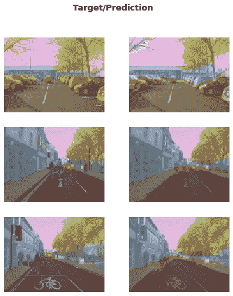

另一个深度学习在过去几年显著改进的领域是自然语言处理（NLP）。计算机现在可以生成文本，自动从一种语言翻译到另一种语言，分析评论，标记句子中的单词等等。以下是训练一个模型所需的所有代码，该模型可以比五年前世界上任何东西更好地分类电影评论的情感：

```py
from fastai.text.all import *

dls = TextDataLoaders.from_folder(untar_data(URLs.IMDB), valid='test')
learn = text_classifier_learner(dls, AWD_LSTM, drop_mult=0.5, metrics=accuracy)
learn.fine_tune(4, 1e-2)
```

| epoch | train_loss | valid_loss | accuracy | time |
| --- | --- | --- | --- | --- |
| 0 | 0.594912 | 0.407416 | 0.823640 | 01:35 |
| epoch | train_loss | valid_loss | accuracy | time |
| --- | --- | --- | --- | --- |
| 0 | 0.268259 | 0.316242 | 0.876000 | 03:03 |
| 1 | 0.184861 | 0.246242 | 0.898080 | 03:10 |
| 2 | 0.136392 | 0.220086 | 0.918200 | 03:16 |
| 3 | 0.106423 | 0.191092 | 0.931360 | 03:15 |

这个模型使用了 Andrew Maas 等人的论文[“Learning Word Vectors for Sentiment Analysis”](https://oreil.ly/L9vre)中的[IMDb Large Movie Review dataset](https://oreil.ly/tl-wp)。它在许多千字长的电影评论中表现良好，但让我们在一个短评论上测试一下看看它的表现如何：

```py
learn.predict("I really liked that movie!")
```

```py
('pos', tensor(1), tensor([0.0041, 0.9959]))
```

在这里我们可以看到模型认为评论是积极的。结果的第二部分是我们数据词汇中“pos”的索引，最后一部分是分配给每个类的概率（“pos”为 99.6%，“neg”为 0.4%）。

现在轮到你了！写下你自己的迷你电影评论，或者从互联网上复制一个，看看这个模型对它的看法。

如果您对 fastai 的任何方法有任何疑问，您应该使用`doc`函数，将方法名称传递给它：

```py
doc(learn.predict)
```

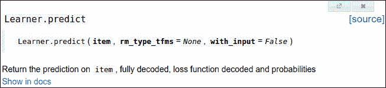

一个窗口弹出，包含一个简短的一行解释。 “在文档中显示”链接将带您到完整的[文档](https://docs.fast.ai)，在那里您将找到所有细节和许多示例。此外，fastai 的大多数方法只是几行代码，因此您可以单击“源”链接查看幕后发生的情况。

让我们继续讨论一些不那么性感，但可能在商业上更有用的事情：从普通*表格*数据构建模型。

# 术语：表格

表格形式的数据，例如来自电子表格、数据库或逗号分隔值（CSV）文件。表格模型是一种试图根据表格中其他列的信息来预测表格中一列的模型。

事实证明，这看起来非常相似。以下是训练一个模型所需的代码，该模型将根据个人的社会经济背景预测一个人是否是高收入者：

```py
from fastai.tabular.all import *
path = untar_data(URLs.ADULT_SAMPLE)

dls = TabularDataLoaders.from_csv(path/'adult.csv', path=path, y_names="salary",
    cat_names = ['workclass', 'education', 'marital-status', 'occupation',
                 'relationship', 'race'],
    cont_names = ['age', 'fnlwgt', 'education-num'],
    procs = [Categorify, FillMissing, Normalize])

learn = tabular_learner(dls, metrics=accuracy)
```

正如您所看到的，我们不得不告诉 fastai 哪些列是*分类*（包含一组离散选择之一的值，例如`occupation`）与*连续*（包含表示数量的数字，例如`age`）。

这个任务没有预训练模型可用（一般来说，预训练模型在任何表格建模任务中都不广泛可用，尽管一些组织已经为内部使用创建了这些模型），所以在这种情况下我们不使用`fine_tune`。相反，我们使用`fit_one_cycle`，这是训练 fastai 模型*从头开始*（即没有迁移学习）最常用的方法：

```py
learn.fit_one_cycle(3)
```

| epoch | train_loss | valid_loss | accuracy | time |
| --- | --- | --- | --- | --- |
| 0 | 0.359960 | 0.357917 | 0.831388 | 00:11 |
| 1 | 0.353458 | 0.349657 | 0.837991 | 00:10 |
| 2 | 0.338368 | 0.346997 | 0.843213 | 00:10 |

这个模型使用了 Ron Kohavi 的论文[“Scaling Up the Accuracy of Naive-Bayes Classifiers: a Decision-Tree Hybrid”](https://oreil.ly/qFOSc)中的[*Adult*](https://oreil.ly/Gc0AR)数据集，其中包含一些关于个人的人口统计数据（如他们的教育、婚姻状况、种族、性别以及是否年收入超过 5 万美元）。该模型的准确率超过 80%，训练时间约为 30 秒。

让我们再看一个例子。推荐系统很重要，特别是在电子商务中。像亚马逊和 Netflix 这样的公司努力推荐用户可能喜欢的产品或电影。以下是如何训练一个模型，根据用户以前的观影习惯，预测用户可能喜欢的电影，使用[MovieLens 数据集](https://oreil.ly/LCfwH)：

```py
from fastai.collab import *
path = untar_data(URLs.ML_SAMPLE)
dls = CollabDataLoaders.from_csv(path/'ratings.csv')
learn = collab_learner(dls, y_range=(0.5,5.5))
learn.fine_tune(10)
```

| epoch | train_loss | valid_loss | time |
| --- | --- | --- | --- |
| 0 | 1.554056 | 1.428071 | 00:01 |
| epoch | train_loss | valid_loss | time |
| --- | --- | --- | --- |
| 0 | 1.393103 | 1.361342 | 00:01 |
| 1 | 1.297930 | 1.159169 | 00:00 |
| 2 | 1.052705 | 0.827934 | 00:01 |
| 3 | 0.810124 | 0.668735 | 00:01 |
| 4 | 0.711552 | 0.627836 | 00:01 |
| 5 | 0.657402 | 0.611715 | 00:01 |
| 6 | 0.633079 | 0.605733 | 00:01 |
| 7 | 0.622399 | 0.602674 | 00:01 |
| 8 | 0.629075 | 0.601671 | 00:00 |
| 9 | 0.619955 | 0.601550 | 00:01 |

这个模型在 0.5 到 5.0 的范围内预测电影评分，平均误差约为 0.6。由于我们预测的是一个连续数值，而不是一个类别，我们必须告诉 fastai 我们的目标范围是多少，使用`y_range`参数。

虽然我们实际上并没有使用预训练模型（和表格模型一样的原因），但这个例子显示了 fastai 在这种情况下仍然让我们使用`fine_tune`（您将在第五章中学习到这是如何以及为什么有效）。有时最好尝试`fine_tune`和`fit_one_cycle`，看看哪个对您的数据集效果更好。

我们可以使用之前看到的相同的`show_results`调用来查看一些用户和电影 ID、实际评分和预测：

```py
learn.show_results()
```

|  | userId | movieId | rating | rating_pred |
| --- | --- | --- | --- | --- |
| 0 | 157 | 1200 | 4.0 | 3.558502 |
| 1 | 23 | 344 | 2.0 | 2.700709 |
| 2 | 19 | 1221 | 5.0 | 4.390801 |
| 3 | 430 | 592 | 3.5 | 3.944848 |
| 4 | 547 | 858 | 4.0 | 4.076881 |
| 5 | 292 | 39 | 4.5 | 3.753513 |
| 6 | 529 | 1265 | 4.0 | 3.349463 |
| 7 | 19 | 231 | 3.0 | 2.881087 |
| 8 | 475 | 4963 | 4.0 | 4.023387 |
| 9 | 130 | 260 | 4.5 | 3.979703 |

我们训练的每个模型都显示了训练和验证损失。一个好的验证集是训练过程中最重要的部分之一。让我们看看为什么，并学习如何创建一个。

# 验证集和测试集

正如我们所讨论的，模型的目标是对数据进行预测。但模型训练过程基本上是愚蠢的。如果我们用所有的数据训练一个模型，然后使用同样的数据评估模型，我们将无法判断我们的模型在未见过的数据上表现如何。没有这个非常宝贵的信息来指导我们训练模型，很有可能模型会擅长对这些数据进行预测，但在新数据上表现不佳。

为了避免这种情况，我们的第一步是将数据集分成两组：*训练集*（模型在训练中看到的）和*验证集*，也称为*开发集*（仅用于评估）。这样我们可以测试模型是否从训练数据中学到的经验可以推广到新数据，即验证数据。

理解这种情况的一种方式是，在某种意义上，我们不希望我们的模型通过“作弊”来获得好的结果。如果它对一个数据项做出准确的预测，那应该是因为它已经学到了那种类型的特征，而不是因为模型已经被*实际看到那个特定项*所塑造。

将验证数据集分离出来意味着我们的模型在训练中从未见过它，因此完全没有被它污染，并且没有以任何方式作弊。对吧？

实际上，并非一定如此。情况更为微妙。这是因为在现实场景中，我们很少仅通过一次训练参数来构建模型。相反，我们可能通过各种建模选择来探索模型的许多版本，包括网络架构、学习率、数据增强策略等因素，我们将在接下来的章节中讨论。其中许多选择可以描述为*超参数*的选择。这个词反映了它们是关于参数的参数，因为它们是控制权重参数含义的高级选择。

问题在于，即使普通的训练过程只看训练数据的预测结果来学习权重参数的值，我们却不是这样。作为建模者，当我们决定探索新的超参数值时，我们通过查看验证数据的预测结果来评估模型！因此，模型的后续版本间接地受到我们看到验证数据的影响。就像自动训练过程有过拟合训练数据的危险一样，我们通过人为试错和探索有过拟合验证数据的危险。

解决这个难题的方法是引入另一个更高度保留数据的层级：*测试集*。就像我们在训练过程中保留验证数据一样，我们必须连自己都不使用测试集数据。它不能用来改进模型；它只能在我们努力的最后阶段用来评估模型。实际上，我们定义了一个基于我们希望如何完全隐藏数据的层次结构：训练数据完全暴露，验证数据较少暴露，测试数据完全隐藏。这种层次结构与不同种类的建模和评估过程本身相对应——自动训练过程与反向传播，尝试不同超参数之间的更手动过程，以及我们最终结果的评估。

测试集和验证集应该有足够的数据来确保您对准确性有一个良好的估计。例如，如果您正在创建一个猫检测器，通常您希望验证集中至少有 30 只猫。这意味着如果您有数千个项目的数据集，使用默认的 20%验证集大小可能超出您的需求。另一方面，如果您有大量数据，将其中一部分用于验证可能没有任何不利之处。

拥有两个级别的“保留数据”——验证集和测试集，其中一个级别代表您几乎隐藏自己的数据——可能看起来有点极端。但通常是必要的，因为模型往往倾向于朝着做出良好预测的最简单方式（记忆）发展，而我们作为易犯错误的人类往往倾向于欺骗自己关于我们的模型表现如何。测试集的纪律帮助我们保持思想上的诚实。这并不意味着我们*总是*需要一个单独的测试集——如果您的数据很少，您可能只需要一个验证集——但通常最好尽可能使用一个。

如果您打算雇用第三方代表您进行建模工作，这种纪律也可能至关重要。第三方可能无法准确理解您的要求，或者他们的激励甚至可能鼓励他们误解。一个好的测试集可以极大地减轻这些风险，并让您评估他们的工作是否解决了您实际的问题。

直截了当地说，如果你是组织中的高级决策者（或者你正在为高级决策者提供建议），最重要的要点是：如果你确保真正理解测试和验证集以及它们的重要性，你将避免我们看到的组织决定使用 AI 时最大的失败源。例如，如果你考虑引入外部供应商或服务，请确保保留一些测试数据，供供应商*永远看不到*。然后*你*在你的测试数据上检查他们的模型，使用*你*根据实际情况选择的度量标准，并*你*决定什么水平的性能是足够的。（你自己尝试一个简单的基线也是个好主意，这样你就知道一个真正简单的模型能够实现什么。通常情况下，你的简单模型的表现会和外部“专家”制作的模型一样好！）

## 在定义测试集时要有判断力

要很好地定义验证集（以及可能的测试集），有时你需要做的不仅仅是随机抽取原始数据集的一部分。记住：验证和测试集的一个关键特性是它们必须代表你将来看到的新数据。这听起来可能像一个不可能的要求！根据定义，你还没有看到这些数据。但通常你仍然会知道一些事情。

看一些例子是很有启发性的。这些例子中的许多来自于[*Kaggle*平台](https://www.kaggle.com)上的预测建模竞赛，这是你可能在实践中看到的问题和方法的很好代表。

一个情况可能是当你在查看时间序列数据时。对于时间序列，选择数据的随机子集既太容易（你可以查看你试图预测的日期之前和之后的数据），又不代表大多数业务用例（在这些用例中，你使用历史数据构建模型以供将来使用）。如果你的数据包含日期，并且你正在构建一个将来使用的模型，你将希望选择最新日期的连续部分作为验证集（例如，可用数据的最后两周或最后一个月）。

假设你想将图 1-19 中的时间序列数据分成训练集和验证集。

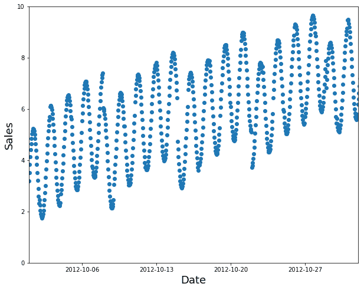

###### 图 1-19. 一个时间序列

一个随机子集是一个糟糕的选择（填补缺失太容易，且不代表你在生产中所需的），正如我们在图 1-20 中所看到的。

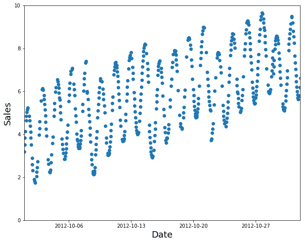

###### 图 1-20. 一个糟糕的训练子集

相反，使用早期数据作为训练集（以及后期数据作为验证集），如图 1-21 所示。

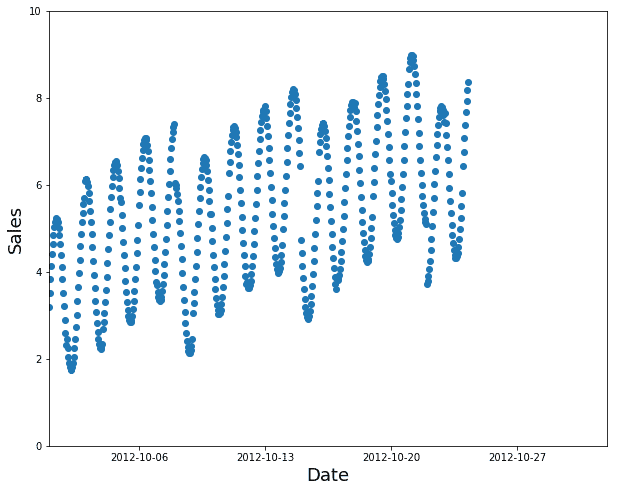

###### 图 1-21. 一个好的训练子集

例如，Kaggle 曾举办一场竞赛，要求[预测厄瓜多尔杂货店连锁店的销售额](https://oreil.ly/UQoXe)。 Kaggle 的训练数据从 2013 年 1 月 1 日到 2017 年 8 月 15 日，测试数据跨越了 2017 年 8 月 16 日到 2017 年 8 月 31 日。这样，竞赛组织者确保参赛者在*未来*时间段进行预测，从他们模型的角度来看。这类似于量化对冲基金交易员进行*回测*，以检查他们的模型是否能够根据过去的数据预测未来的时间段。

第二种常见情况是，当你可以很容易地预见到你将用来训练模型的数据与你将在生产中进行预测的数据可能在质量上有所不同时。

在 Kaggle [分心司机比赛](https://oreil.ly/zT_tC)中，自变量是司机在车轮上的照片，因变量是文本、吃东西或安全地向前看等类别。很多照片是同一司机在不同位置的照片，正如我们在图 1-22 中所看到的。如果你是一家保险公司根据这些数据构建模型，注意你最感兴趣的是模型在未见过的司机身上的表现（因为你可能只有一小部分人的训练数据）。为此，比赛的测试数据包括那些在训练集中没有出现的人的图像。


###### 图 1-22\. 训练数据中的两张图片

如果你将图 1-22 中的一张图片放入训练集，另一张放入验证集，你的模型将更容易预测验证集中的那张图片，因此它看起来表现得比在新人身上更好。另一个角度是，如果你在训练模型时使用了所有人，你的模型可能会过度拟合这些特定人的特点，而不仅仅是学习状态（发短信、吃东西等）。

在[Kaggle 渔业比赛](https://oreil.ly/iJwFf)中，也存在类似的动态，目的是识别渔船捕捞的鱼类物种，以减少对濒临灭绝种群的非法捕捞。测试集包括来自训练数据中没有出现的船只的图像，因此在这种情况下，你希望你的验证集也包括训练集中没有的船只。

有时可能不清楚你的验证数据会有什么不同。例如，对于使用卫星图像的问题，你需要收集更多信息，了解训练集是否只包含某些地理位置或来自地理分散的数据。

现在你已经尝试了如何构建模型，你可以决定接下来想深入研究什么。

# 一个*选择你自己的冒险*时刻

如果你想了解如何在实践中使用深度学习模型，包括如何识别和修复错误、创建一个真正的工作网络应用程序，并避免你的模型对你的组织或社会造成意外伤害，那么请继续阅读接下来的两章。如果你想开始学习深度学习在幕后是如何工作的基础知识，请跳到第四章。（你小时候有读过*选择你自己的冒险*系列书吗？嗯，这有点像那个……只不过比那本书系列包含更多的深度学习。）

你需要阅读所有这些章节才能在书中进一步前进，但你阅读它们的顺序完全取决于你。它们不相互依赖。如果你跳到第四章，我们会在最后提醒你回来阅读你跳过的章节，然后再继续前进。

# 问卷调查

阅读了一页又一页的散文之后，很难知道你真正需要专注和记住的关键事项。因此，我们准备了一份问题列表和建议的步骤清单，供你在每章末完成。所有答案都在章节的文本中，所以如果你对这里的任何事情不确定，重新阅读文本的那部分，并确保你理解了它。所有这些问题的答案也可以在[书的网站](https://book.fast.ai)上找到。如果你遇到困难，也可以访问[论坛](https://forums.fast.ai)寻求其他学习这些材料的人的帮助。

1.  你需要这些来进行深度学习吗？

    +   很多数学 T/F

    +   很多数据 T/F

    +   很多昂贵的电脑 T/F

    +   一个博士学位 T/F

1.  列出深度学习现在是世界上最好的工具的五个领域。

1.  第一个基于人工神经元原理的设备的名称是什么？

1.  根据同名书籍，分布式并行处理（PDP）的要求是什么？

1.  是什么两个理论误解阻碍了神经网络领域的发展？

1.  什么是 GPU？

1.  打开一个笔记本并执行包含：`1+1` 的单元格。会发生什么？

1.  跟随本章笔记本的精简版本中的每个单元格。在执行每个单元格之前，猜测会发生什么。

1.  完成[Jupyter Notebook 在线附录](https://oreil.ly/9uPZe)。

1.  为什么使用传统计算机程序来识别照片中的图像很困难？

1.  塞缪尔所说的“权重分配”是什么意思？

1.  在深度学习中，我们通常用什么术语来表示塞缪尔所说的“权重”？

1.  画一幅总结塞缪尔对机器学习模型看法的图片。

1.  为什么很难理解深度学习模型为什么会做出特定的预测？

1.  展示了一个定理的名称，该定理表明神经网络可以解决任何数学问题并达到任何精度水平是什么？

1.  为了训练模型，您需要什么？

1.  反馈循环如何影响预测性警务模型的推出？

1.  我们在猫识别模型中总是需要使用 224×224 像素的图像吗？

1.  分类和回归之间有什么区别？

1.  什么是验证集？什么是测试集？为什么我们需要它们？

1.  如果不提供验证集，fastai 会怎么做？

1.  我们总是可以使用随机样本作为验证集吗？为什么或为什么不？

1.  什么是过拟合？举个例子。

1.  什么是度量？它与损失有什么不同？

1.  预训练模型如何帮助？

1.  模型的“头”是什么？

1.  CNN 的早期层找到了什么样的特征？后期层呢？

1.  图像模型仅对照片有用吗？

1.  什么是架构？

1.  什么是分割？

1.  `y_range` 用于什么？什么时候需要它？

1.  什么是超参数？

1.  在组织中使用 AI 时避免失败的最佳方法是什么？

## 进一步研究

每章还有一个“进一步研究”部分，提出了一些在文本中没有完全回答的问题，或者给出了更高级的任务。这些问题的答案不在书的网站上；您需要自己进行研究！

1.  为什么 GPU 对深度学习有用？CPU 有什么不同之处，为什么对深度学习效果不佳？

1.  试着想出三个反馈循环可能影响机器学习使用的领域。看看是否能找到实践中发生这种情况的文档示例。
