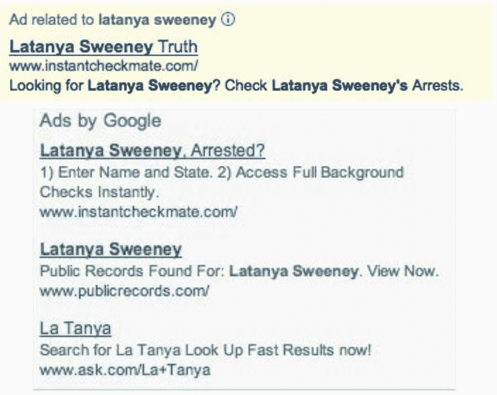
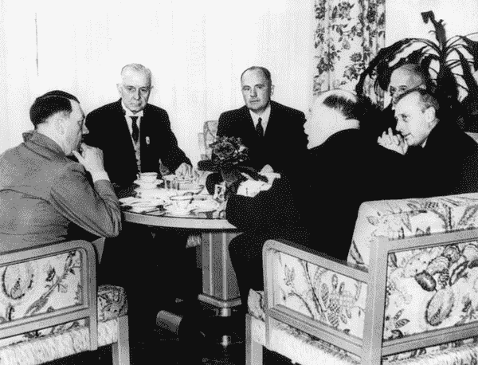
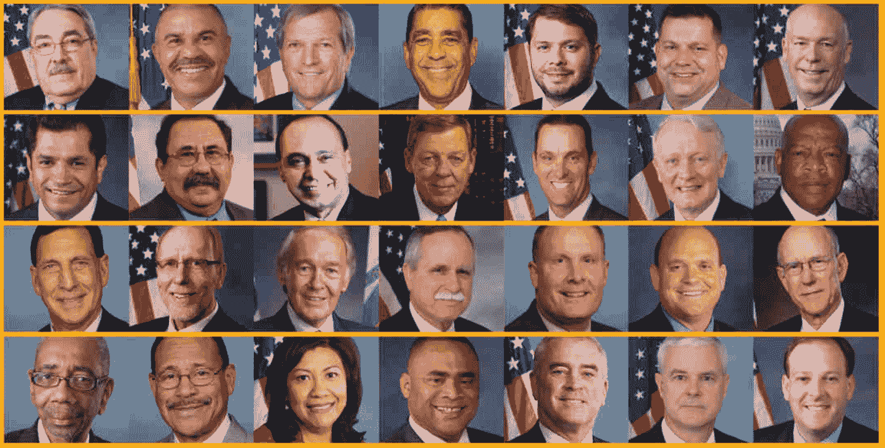
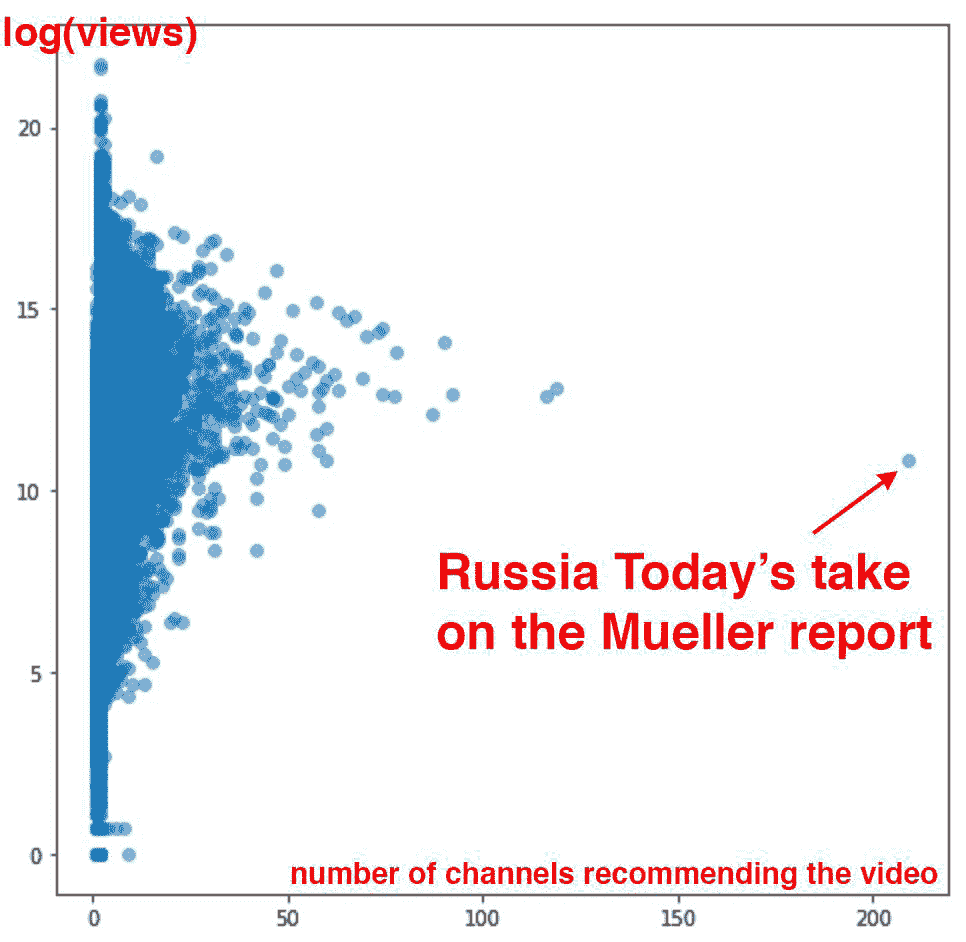
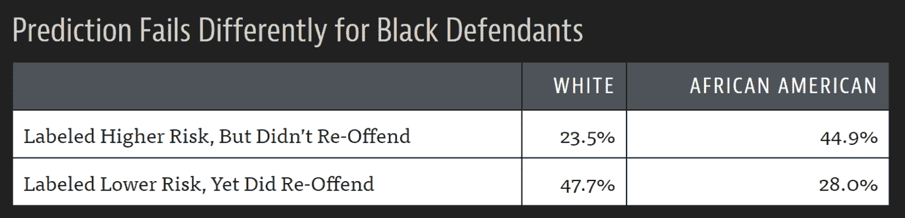
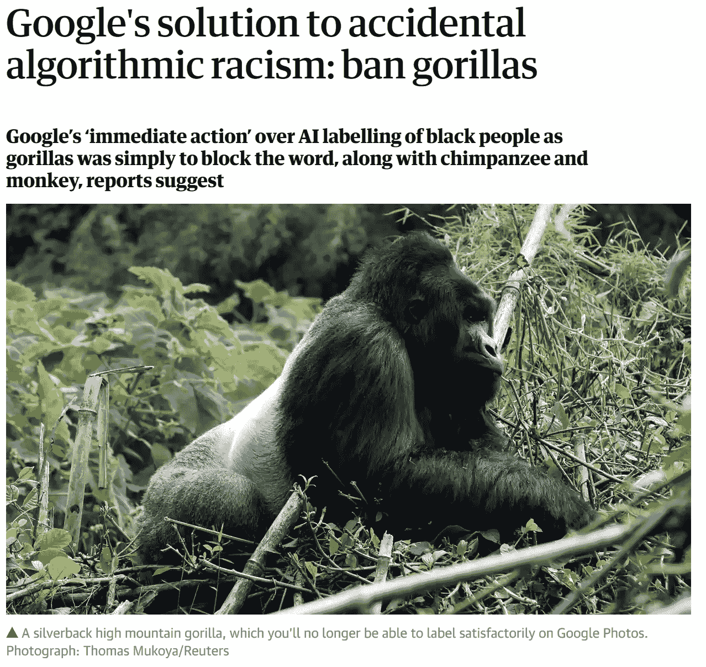
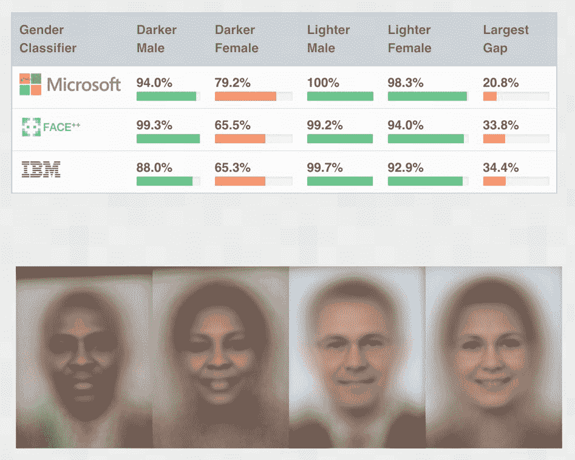
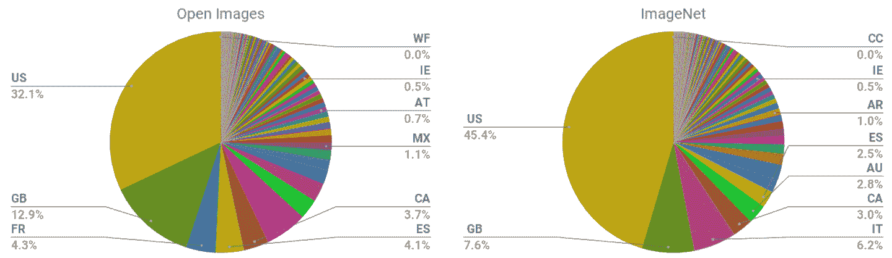
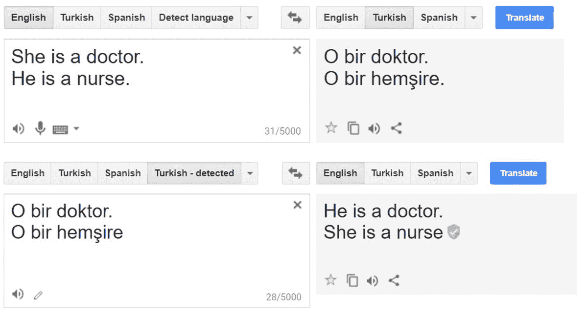
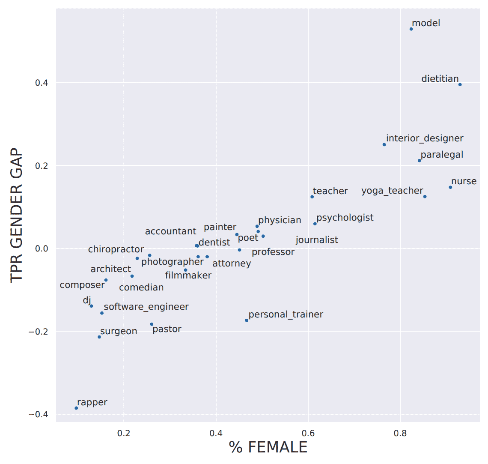

# 第三章：数据伦理

正如我们在第一章和第二章中讨论的，有时机器学习模型可能出错。它们可能有错误。它们可能被呈现出以前没有见过的数据，并以我们意料之外的方式行事。或者它们可能完全按设计工作，但被用于我们非常希望它们永远不要被用于的事情。

因为深度学习是如此强大的工具，可以用于很多事情，所以我们特别需要考虑我们选择的后果。哲学上对*伦理*的研究是对对错的研究，包括我们如何定义这些术语，识别对错行为，以及理解行为和后果之间的联系。*数据伦理*领域已经存在很长时间，许多学者都专注于这个领域。它被用来帮助定义许多司法管辖区的政策；它被用在大大小小的公司中，考虑如何最好地确保产品开发对社会的良好结果；它被研究人员用来确保他们正在做的工作被用于好的目的，而不是坏的目的。

因此，作为一个深度学习从业者，你很可能在某个时候会面临需要考虑数据伦理的情况。那么数据伦理是什么？它是伦理学的一个子领域，所以让我们从那里开始。

# 杰里米说

在大学里，伦理哲学是我的主要研究领域（如果我完成了论文，而不是辍学加入现实世界，它本来会是我的论文题目）。根据我花在研究伦理学上的年份，我可以告诉你这个：没有人真正同意什么是对什么是错，它们是否存在，如何识别它们，哪些人是好人哪些人是坏人，或者几乎任何其他事情。所以不要对理论抱太大期望！我们将在这里专注于例子和思考的起点，而不是理论。

在回答问题[“什么是伦理？”](https://oreil.ly/nyVh4) 应用伦理马库拉中心说，这个术语指的是以下内容：

+   有根据的对人类应该做什么的正确和错误的标准

+   研究和发展自己的伦理标准

没有正确答案的清单。没有应该和不应该做的清单。伦理是复杂的，依赖于背景。它涉及许多利益相关者的观点。伦理是一个你必须发展和实践的能力。在本章中，我们的目标是提供一些路标，帮助你在这个旅程中前进。

发现伦理问题最好是作为一个协作团队的一部分来做。这是你真正可以融入不同观点的唯一方式。不同人的背景将帮助他们看到你可能没有注意到的事情。与团队合作对于许多“锻炼肌肉”的活动都是有帮助的，包括这个。

这一章当然不是本书中唯一讨论数据伦理的部分，但是有一个地方专注于它一段时间是很好的。为了定位，也许最容易看一些例子。所以，我们挑选了三个我们认为有效地说明了一些关键主题的例子。

# 数据伦理的关键例子

我们将从三个具体的例子开始，这些例子说明了技术中三个常见的伦理问题（我们将在本章后面更深入地研究这些问题）：

救济程序

阿肯色州有缺陷的医疗保健算法让患者陷入困境。

反馈循环

YouTube 的推荐系统帮助引发了阴谋论繁荣。

偏见

当在谷歌上搜索传统的非裔美国人名字时，会显示犯罪背景调查的广告。

事实上，在本章中我们介绍的每个概念，我们都会提供至少一个具体的例子。对于每一个例子，想想在这种情况下你可以做什么，以及可能会有什么样的障碍阻止你完成。你会如何处理它们？你会注意什么？

## 错误和救济：用于医疗福利的错误算法

《The Verge》调查了在美国半数以上州使用的软件，以确定人们接受多少医疗保健，并在文章《当算法削减您的医疗保健时会发生什么》中记录了其发现。在阿肯色州实施算法后，数百人（许多患有严重残疾的人）的医疗保健被大幅削减。

例如，Tammy Dobbs 是一名患有脑瘫的女性，需要助手帮助她起床、上厕所、拿食物等，她的帮助时间突然减少了 20 小时每周。她无法得到任何解释为什么她的医疗保健被削减。最终，一场法庭案件揭示了算法的软件实施中存在错误，对患有糖尿病或脑瘫的人造成了负面影响。然而，Dobbs 和许多其他依赖这些医疗福利的人生活在恐惧中，担心他们的福利可能再次突然而莫名其妙地被削减。

## 反馈循环：YouTube 的推荐系统

当您的模型控制您获得的下一轮数据时，反馈循环可能会发生。返回的数据很快就会被软件本身破坏。

例如，YouTube 有 19 亿用户，他们每天观看超过 10 亿小时的 YouTube 视频。其推荐算法（由谷歌构建）旨在优化观看时间，负责约 70%的观看内容。但出现了问题：它导致了失控的反馈循环，导致《纽约时报》在 2019 年 2 月发表了标题为《YouTube 引发了阴谋论繁荣。能够控制吗？》的文章。表面上，推荐系统正在预测人们会喜欢什么内容，但它们也在很大程度上决定了人们甚至看到什么内容。

## 偏见：拉塔尼亚·斯威尼“被捕”

拉塔尼亚·斯威尼博士是哈佛大学的教授，也是该大学数据隐私实验室的主任。在论文《在线广告投放中的歧视》中，她描述了她发现谷歌搜索她的名字会出现“拉塔尼亚·斯威尼，被捕了？”的广告，尽管她是唯一已知的拉塔尼亚·斯威尼，从未被捕。然而，当她搜索其他名字，如“Kirsten Lindquist”时，她得到了更中立的广告，尽管 Kirsten Lindquist 已经被捕了三次。

###### 图 3-1。谷歌搜索显示关于拉塔尼亚·斯威尼（不存在的）被捕记录的广告

作为一名计算机科学家，她系统地研究了这个问题，并查看了 2000 多个名字。她发现了一个明显的模式：历史上黑人的名字会收到暗示这个人有犯罪记录的广告，而传统上的白人名字则会有更中立的广告。

这是偏见的一个例子。它可能对人们的生活产生重大影响，例如，如果一个求职者被谷歌搜索，可能会出现他们有犯罪记录的情况，而实际上并非如此。

## 这为什么重要？

考虑这些问题的一个非常自然的反应是：“那又怎样？这和我有什么关系？我是一名数据科学家，不是政治家。我不是公司的高级执行官之一，他们决定我们要做什么。我只是尽力构建我能构建的最具预测性的模型。”

这些是非常合理的问题。但我们将试图说服您，答案是每个训练模型的人都绝对需要考虑他们的模型将如何被使用，并考虑如何最好地确保它们被尽可能积极地使用。有一些你可以做的事情。如果你不这样做，事情可能会变得相当糟糕。

当技术人员以任何代价专注于技术时，发生的一个特别可怕的例子是 IBM 与纳粹德国的故事。2001 年，一名瑞士法官裁定认为“推断 IBM 的技术援助促进了纳粹在犯下反人类罪行时的任务，这些行为还涉及 IBM 机器进行的会计和分类，并在集中营中使用。”

你看，IBM 向纳粹提供了数据制表产品，以追踪大规模灭绝犹太人和其他群体。这是公司高层的决定，向希特勒及其领导团队推销。公司总裁托马斯·沃森亲自批准了 1939 年发布特殊的 IBM 字母排序机，以帮助组织波兰犹太人的驱逐。在图 3-2 中，阿道夫·希特勒（最左）与 IBM 首席执行官汤姆·沃森（左二）会面，希特勒在 1937 年授予沃森特别的“对帝国的服务”奖章。

###### 图 3-2. IBM 首席执行官汤姆·沃森与阿道夫·希特勒会面

但这并不是个案 - 该组织的涉入是广泛的。IBM 及其子公司在集中营现场提供定期培训和维护：打印卡片，配置机器，并在它们经常出现故障时进行维修。IBM 在其打孔卡系统上设置了每个人被杀害的方式，他们被分配到的组别以及跟踪他们通过庞大的大屠杀系统所需的后勤信息的分类。IBM 在集中营中对犹太人的代码是 8：约有 600 万人被杀害。对于罗姆人的代码是 12（纳粹将他们标记为“不合群者”，在“吉普赛营”中有超过 30 万人被杀害）。一般处决被编码为 4，毒气室中的死亡被编码为 6。

###### 图 3-3. IBM 在集中营中使用的打孔卡

当然，参与其中的项目经理、工程师和技术人员只是过着普通的生活。照顾家人，周日去教堂，尽力做好自己的工作。服从命令。市场营销人员只是尽力实现他们的业务发展目标。正如《IBM 与大屠杀》（Dialog Press）的作者埃德温·布莱克所观察到的：“对于盲目的技术官僚来说，手段比目的更重要。犹太人民的毁灭变得更不重要，因为 IBM 技术成就的振奋性只会因在面包排长队的时候赚取的奇幻利润而更加突出。”

退一步思考一下：如果你发现自己是一个最终伤害社会的系统的一部分，你会有什么感受？你会愿意了解吗？你如何帮助确保这种情况不会发生？我们在这里描述了最极端的情况，但今天观察到与人工智能和机器学习相关的许多负面社会后果，其中一些我们将在本章中描述。

这也不仅仅是道德负担。有时，技术人员会直接为他们的行为付出代价。例如，作为大众汽车丑闻的结果而被监禁的第一个人并不是监督该项目的经理，也不是公司的执行主管。而是其中一名工程师詹姆斯·梁，他只是听从命令。

当然，情况并非全是坏的 - 如果你参与的项目最终对一个人产生了巨大的积极影响，这会让你感到非常棒！

好的，希望我们已经说服您应该关心这个问题。但是您应该怎么做呢？作为数据科学家，我们自然倾向于通过优化某些指标来改进我们的模型。但是优化这个指标可能不会导致更好的结果。即使它确实有助于创造更好的结果，几乎肯定不会是唯一重要的事情。考虑一下从研究人员或从业者开发模型或算法到使用这项工作做出决策之间发生的步骤流程。如果我们希望获得我们想要的结果，整个流程必须被视为一个整体。

通常，从一端到另一端有一条非常长的链。如果您是一名研究人员，甚至可能不知道您的研究是否会被用于任何事情，或者如果您参与数据收集，那就更早了。但是没有人比您更适合告知所有参与这一链的人您的工作的能力、约束和细节。虽然没有“灵丹妙药”可以确保您的工作被正确使用，但通过参与这个过程，并提出正确的问题，您至少可以确保正确的问题正在被考虑。

有时，对于被要求做一项工作的正确回应就是说“不”。然而，我们经常听到的回应是：“如果我不做，别人会做。”但请考虑：如果您被选中做这项工作，那么您是他们找到的最合适的人——所以如果您不做，最合适的人就不会参与该项目。如果他们询问的前五个人也都说不，那就更好了！

# 将机器学习与产品设计整合

假设您做这项工作的原因是希望它被用于某些目的。否则，您只是在浪费时间。因此，让我们假设您的工作最终会有所作为。现在，当您收集数据并开发模型时，您会做出许多决定。您将以什么级别的聚合存储数据？应该使用什么损失函数？应该使用什么验证和训练集？您应该专注于实现的简单性、推理的速度还是模型的准确性？您的模型如何处理域外数据项？它可以进行微调，还是必须随时间从头开始重新训练？

这些不仅仅是算法问题。它们是数据产品设计问题。但是产品经理、高管、法官、记者、医生——最终会开发和使用您的模型的系统的人——将无法理解您所做的决定，更不用说改变它们了。

例如，两项研究发现亚马逊的面部识别软件产生了[不准确](https://oreil.ly/bL5D9)和[种族偏见](https://oreil.ly/cDYqz)的结果。亚马逊声称研究人员应该更改默认参数，但没有解释这将如何改变有偏见的结果。此外，事实证明，[亚马逊并没有指导使用其软件的警察部门](https://oreil.ly/I5OAj)这样做。可以想象，开发这些算法的研究人员和为警察提供指导的亚马逊文档人员之间存在很大的距离。

缺乏紧密整合导致社会、警察和亚马逊出现严重问题。结果表明，其系统错误地将 28 名国会议员与犯罪照片匹配！（而与犯罪照片错误匹配的国会议员是有色人种，如图 3-4 所示。）

###### 图 3-4. 亚马逊软件将国会议员与犯罪照片匹配

数据科学家需要成为跨学科团队的一部分。研究人员需要与最终使用他们研究成果的人密切合作。更好的是，领域专家们自己可以学到足够的知识，以便能够自己训练和调试一些模型——希望你们中的一些人正在阅读这本书！

现代职场是一个非常专业化的地方。每个人都倾向于有明确定义的工作要做。特别是在大公司，很难知道所有的细节。有时公司甚至会故意模糊正在进行的整体项目目标，如果他们知道员工不会喜欢答案的话。有时通过尽可能地将部分隔离来实现这一点。

换句话说，我们并不是说这些都很容易。这很难。真的很难。我们都必须尽力而为。我们经常看到那些参与这些项目更高层次背景的人，试图发展跨学科能力和团队的人，成为他们组织中最重要和最受奖励的成员之一。这是一种工作，往往受到高级主管的高度赞赏，即使有时被中层管理人员认为相当不舒服。

# 数据伦理学主题

数据伦理学是一个广阔的领域，我们无法涵盖所有内容。相反，我们将选择一些我们认为特别相关的主题：

+   追索和问责制的需求

+   反馈循环

+   偏见

+   虚假信息

让我们依次看看每一个。

## 追索和问责制

在一个复杂的系统中，很容易没有任何一个人感到对结果负责。虽然这是可以理解的，但这并不会带来好的结果。在早期的阿肯色州医疗保健系统的例子中，一个错误导致患有脑瘫的人失去了所需护理的访问权限，算法的创建者责怪政府官员，政府官员责怪那些实施软件的人。纽约大学教授[丹娜·博伊德](https://oreil.ly/KK5Hf)描述了这种现象：“官僚主义经常被用来转移或逃避责任……今天的算法系统正在扩展官僚主义。”

追索如此必要的另一个原因是数据经常包含错误。审计和纠错机制至关重要。加利福尼亚执法官员维护的一个涉嫌帮派成员的数据库发现充满了错误，包括 42 名不到 1 岁的婴儿被添加到数据库中（其中 28 名被标记为“承认是帮派成员”）。在这种情况下，没有流程来纠正错误或在添加后删除人员。另一个例子是美国信用报告系统：2012 年联邦贸易委员会（FTC）对信用报告进行的大规模研究发现，26%的消费者的档案中至少有一个错误，5%的错误可能是灾难性的。

然而，纠正这类错误的过程非常缓慢和不透明。当公共广播记者[鲍比·艾伦](https://oreil.ly/BUD6h)发现自己被错误列为有枪支罪时，他花了“十几个电话，一个县法院书记的手工操作和六周的时间来解决问题。而且这还是在我作为一名记者联系了公司的传播部门之后。”

作为机器学习从业者，我们并不总是认为理解我们的算法最终如何在实践中实施是我们的责任。但我们需要。

## 反馈循环

我们在第一章中解释了算法如何与环境互动以创建反馈循环，做出预测以加强在现实世界中采取的行动，从而导致更加明显朝着同一方向的预测。举个例子，让我们再次考虑 YouTube 的推荐系统。几年前，谷歌团队谈到他们如何引入了强化学习（与深度学习密切相关，但你的损失函数代表了潜在长时间后行动发生的结果）来改进 YouTube 的推荐系统。他们描述了如何使用一个算法，使推荐以优化观看时间为目标。

然而，人类往往被争议性内容所吸引。这意味着关于阴谋论之类的视频开始越来越多地被推荐给用户。此外，事实证明，对阴谋论感兴趣的人也是那些经常观看在线视频的人！因此，他们开始越来越多地被吸引到 YouTube。越来越多的阴谋论者在 YouTube 上观看视频导致算法推荐越来越多的阴谋论和其他极端内容，这导致更多的极端分子在 YouTube 上观看视频，更多的人在 YouTube 上形成极端观点，进而导致算法推荐更多的极端内容。系统失控了。

这种现象并不局限于这种特定类型的内容。2019 年 6 月，《纽约时报》发表了一篇关于 YouTube 推荐系统的文章，标题为[“在 YouTube 的数字游乐场，对恋童癖者敞开大门”](https://oreil.ly/81BEy)。文章以这个令人不安的故事开头：

> 当 Christiane C.的 10 岁女儿和一个朋友上传了一个在后院游泳池玩耍的视频时，她并没有在意……几天后……视频的观看次数已经达到了数千次。不久之后，观看次数已经增加到 40 万……“我再次看到视频，看到观看次数，我感到害怕，”Christiane 说。她有理由感到害怕。研究人员发现，YouTube 的自动推荐系统……开始向观看其他预备期、部分穿着少儿视频的用户展示这个视频。
> 
> 单独看，每个视频可能是完全无辜的，比如一个孩子制作的家庭影片。任何暴露的画面都是短暂的，看起来是偶然的。但是，当它们被组合在一起时，它们共享的特征变得明显。

YouTube 的推荐算法开始为恋童癖者策划播放列表，挑选出偶然包含预备期、部分穿着少儿的无辜家庭视频。

谷歌没有计划创建一个将家庭视频变成儿童色情片的系统。那么发生了什么？

这里的问题之一是指标在推动一个财政重要系统中的核心性。当一个算法有一个要优化的指标时，正如你所看到的，它会尽其所能来优化这个数字。这往往会导致各种边缘情况，与系统互动的人类会寻找、发现并利用这些边缘情况和反馈循环以谋取利益。

有迹象表明，这正是发生在 YouTube 的推荐系统中的情况。*卫报*发表了一篇题为[“一位前 YouTube 内部人员是如何调查其秘密算法的”](https://oreil.ly/yjnPT)的文章，讲述了前 YouTube 工程师 Guillaume Chaslot 创建了一个[网站](https://algotransparency.org)来跟踪这些问题。Chaslot 在罗伯特·穆勒“关于 2016 年总统选举中俄罗斯干预调查”的发布后发布了图表，如图 3-5 所示。

###### 图 3-5. 穆勒报告的报道

俄罗斯今日电视台对穆勒报告的报道在推荐频道中是一个极端的离群值。这表明俄罗斯今日电视台，一个俄罗斯国有媒体机构，成功地操纵了 YouTube 的推荐算法。不幸的是，这种系统缺乏透明度，使我们很难揭示我们正在讨论的问题。

本书的一位审阅者 Aurélien Géron，曾在 2013 年至 2016 年间领导 YouTube 的视频分类团队（远在这里讨论的事件之前）。他指出，涉及人类的反馈循环不仅是一个问题。也可能存在没有人类参与的反馈循环！他向我们讲述了 YouTube 的一个例子：

> 对视频的主题进行分类的一个重要信号是视频的来源频道。例如，上传到烹饪频道的视频很可能是烹饪视频。但我们如何知道一个频道的主题是什么？嗯...部分是通过查看它包含的视频的主题！你看到循环了吗？例如，许多视频有描述，指示拍摄视频所使用的相机。因此，一些视频可能被分类为“摄影”视频。如果一个频道有这样一个错误分类的视频，它可能被分类为“摄影”频道，使得未来在该频道上的视频更有可能被错误分类为“摄影”。这甚至可能导致失控的病毒般的分类！打破这种反馈循环的一种方法是对有和没有频道信号的视频进行分类。然后在对频道进行分类时，只能使用没有频道信号获得的类别。这样，反馈循环就被打破了。

有人和组织试图解决这些问题的积极例子。Meetup 的首席机器学习工程师 Evan Estola 讨论了男性对科技见面会表现出比女性更感兴趣的例子。因此，考虑性别可能会导致 Meetup 的算法向女性推荐更少的科技见面会，结果导致更少的女性了解并参加科技见面会，这可能导致算法向女性推荐更少的科技见面会，如此循环反馈。因此，Evan 和他的团队做出了道德决定，让他们的推荐算法不会创建这样的反馈循环，明确不在模型的那部分使用性别。看到一家公司不仅仅是盲目地优化指标，而是考虑其影响是令人鼓舞的。根据 Evan 的说法，“你需要决定在算法中不使用哪个特征...最优算法也许不是最适合投入生产的算法。”

尽管 Meetup 选择避免这种结果，但 Facebook 提供了一个允许失控的反馈循环肆虐的例子。与 YouTube 类似，它倾向于通过向用户介绍更多阴谋论来激化用户。正如虚构信息传播研究员 Renee DiResta 所写的那样：

> 一旦人们加入一个阴谋论倾向的[Facebook]群组，他们就会被算法路由到其他大量群组。加入反疫苗群组，你的建议将包括反转基因、化学尾迹观察、地平论者（是的，真的）和“自然治愈癌症”群组。推荐引擎不是将用户拉出兔子洞，而是将他们推得更深。

非常重要的是要记住这种行为可能会发生，并在看到自己项目中出现第一个迹象时，要么预见到一个反馈循环，要么采取积极行动来打破它。另一件要记住的事情是*偏见*，正如我们在上一章中简要讨论的那样，它可能与反馈循环以非常麻烦的方式相互作用。

## 偏见

在线讨论偏见往往会变得非常混乱。 “偏见”一词有很多不同的含义。统计学家经常认为，当数据伦理学家谈论偏见时，他们在谈论统计学术语“偏见”，但他们并没有。他们当然也没有在谈论出现在模型参数中的权重和偏见中的偏见！

他们所谈论的是社会科学概念中的偏见。在[“理解机器学习意外后果的框架”](https://oreil.ly/aF33V)中，麻省理工学院的 Harini Suresh 和 John Guttag 描述了机器学习中的六种偏见类型，总结在图 3-6 中。

###### 图 3-6。机器学习中的偏见可能来自多个来源（由 Harini Suresh 和 John V. Guttag 提供）

我们将讨论其中四种偏见类型，这些是我们在自己的工作中发现最有帮助的（有关其他类型的详细信息，请参阅论文）。

### 历史偏见

*历史偏见*源于人们的偏见，过程的偏见，以及社会的偏见。苏雷什和古塔格说：“历史偏见是数据生成过程的第一步存在的基本结构性问题，即使进行了完美的抽样和特征选择，它也可能存在。”

例如，以下是美国历史上*种族偏见*的几个例子，来自芝加哥大学 Sendhil Mullainathan 的《纽约时报》文章[“种族偏见，即使我们有良好意图”](https://oreil.ly/cBQop)：

+   当医生看到相同的档案时，他们更不可能向黑人患者推荐心脏导管化（一种有益的程序）。

+   在讨价还价购买二手车时，黑人被要求支付的初始价格高出 700 美元，并获得了远低于预期的让步。

+   在 Craigslist 上回应带有黑人姓名的公寓出租广告比带有白人姓名的回应要少。

+   一个全白人陪审团比一个黑人被告有 16 个百分点更有可能定罪，但当陪审团有一个黑人成员时，他们以相同的比率定罪。

在美国用于判决和保释决定的 COMPAS 算法是一个重要算法的例子，当[ProPublica](https://oreil.ly/1XocO)进行测试时，实际上显示出明显的种族偏见（图 3-7）。

###### 图 3-7。COMPAS 算法的结果

任何涉及人类的数据集都可能存在这种偏见：医疗数据、销售数据、住房数据、政治数据等等。由于潜在偏见是如此普遍，数据集中的偏见也非常普遍。甚至在计算机视觉中也会出现种族偏见，正如 Twitter 上一位 Google 照片用户分享的自动分类照片的例子所示，见图 3-8。

###### 图 3-8。其中一个标签是非常错误的...

是的，这正是你认为的：Google 照片将一位黑人用户的照片与她的朋友一起分类为“大猩猩”！这种算法错误引起了媒体的广泛关注。一位公司女发言人表示：“我们对此感到震惊和真诚地抱歉。自动图像标记仍然存在许多问题，我们正在研究如何防止将来发生这类错误。”

不幸的是，当输入数据存在问题时，修复机器学习系统中的问题是困难的。谷歌的第一次尝试并没有激发信心，正如*卫报*的报道所建议的那样（图 3-9）。

###### 图 3-9。谷歌对问题的第一次回应

这些问题当然不仅限于谷歌。麻省理工学院的研究人员研究了最受欢迎的在线计算机视觉 API，以了解它们的准确性。但他们并不只是计算一个准确性数字，而是查看了四个组的准确性，如图 3-10 所示。

###### 图 3-10。各种面部识别系统的性别和种族错误率

例如，IBM 的系统对较深肤色的女性有 34.7%的错误率，而对较浅肤色的男性只有 0.3%的错误率——错误率高出 100 多倍！一些人对这些实验的反应是错误的，他们声称差异仅仅是因为较深的皮肤更难被计算机识别。然而，事实是，由于这一结果带来的负面宣传，所有相关公司都大幅改进了他们对较深肤色的模型，以至于一年后，它们几乎和对较浅肤色的一样好。因此，这表明开发人员未能利用包含足够多较深肤色面孔的数据集，或者未能用较深肤色的面孔测试他们的产品。

麻省理工学院的一位研究人员 Joy Buolamwini 警告说：“我们已经进入了自信过度但准备不足的自动化时代。如果我们未能制定道德和包容性的人工智能，我们将冒着在机器中立的幌子下失去民权和性别平等所取得的成就的风险。”

问题的一部分似乎是流行数据集的构成存在系统性不平衡，用于训练模型。Shreya Shankar 等人的论文“没有代表性就没有分类：评估发展中国家开放数据集中的地理多样性问题”的摘要中指出，“我们分析了两个大型公开可用的图像数据集，以评估地理多样性，并发现这些数据集似乎存在明显的美洲中心和欧洲中心的代表性偏见。此外，我们分析了在这些数据集上训练的分类器，以评估这些训练分布的影响，并发现在不同地区的图像上表现出强烈的相对性能差异。”图 3-11 展示了论文中的一个图表，展示了当时（以及本书撰写时仍然如此）两个最重要的图像数据集的地理构成。

###### 图 3-11。流行训练集中的图像来源

绝大多数图像来自美国和其他西方国家，导致在 ImageNet 上训练的模型在其他国家和文化的场景中表现更差。例如，研究发现这样的模型在识别低收入国家的家庭物品（如肥皂、香料、沙发或床）时表现更差。图 3-12 展示了 Facebook AI Research 的 Terrance DeVries 等人的论文“目标识别对每个人都有效吗？”中的一幅图像，说明了这一点。

###### 图 3-12。目标检测的实际应用

在这个例子中，我们可以看到低收入肥皂的例子离准确还有很长的路要走，每个商业图像识别服务都预测“食物”是最可能的答案！

接下来我们将讨论，绝大多数人工智能研究人员和开发人员都是年轻的白人男性。我们看到的大多数项目都是使用产品开发团队的朋友和家人进行用户测试。鉴于此，我们刚刚讨论的问题不应该令人惊讶。

类似的历史偏见也存在于用作自然语言处理模型数据的文本中。这会在许多下游机器学习任务中出现。例如，据[广泛报道](https://oreil.ly/Vt_vT)，直到去年，Google 翻译在将土耳其中性代词“o”翻译成英语时显示了系统性偏见：当应用于通常与男性相关联的工作时，它使用“he”，而当应用于通常与女性相关联的工作时，它使用“she”（图 3-13）。

###### 图 3-13。文本数据集中的性别偏见

我们也在在线广告中看到这种偏见。例如，2019 年穆罕默德·阿里等人的一项[研究](https://oreil.ly/UGxuh)发现，即使放置广告的人没有故意歧视，Facebook 也会根据种族和性别向非常不同的受众展示广告。展示了同样文本但图片分别是白人家庭或黑人家庭的房屋广告被展示给了种族不同的受众。

### 测量偏见

在《“机器学习是否自动化了道德风险和错误”》一文中，Sendhil Mullainathan 和 Ziad Obermeyer 研究了一个模型，试图回答这个问题：使用历史电子健康记录（EHR）数据，哪些因素最能预测中风？这是该模型的前几个预测因素：

+   先前的中风

+   心血管疾病

+   意外伤害

+   良性乳腺肿块

+   结肠镜检查

+   鼻窦炎

然而，只有前两个与中风有关！根据我们迄今所学，你可能已经猜到原因。我们实际上并没有测量*中风*，中风是由于脑部某个区域由于血液供应中断而被剥夺氧气而发生的。我们测量的是谁有症状，去看医生，接受了适当的检查，*并且*被诊断出中风。实际上患中风不仅与这个完整列表相关联，还与那些会去看医生的人相关联（这受到谁能获得医疗保健、能否负担得起自付款、是否经历种族或性别歧视等影响）！如果你在发生*意外伤害*时可能会去看医生，那么在中风时你也可能会去看医生。

这是*测量偏见*的一个例子。当我们的模型因为测量错误、以错误方式测量或不恰当地将该测量纳入模型时，就会发生这种偏见。

### 聚合偏见

*聚合偏见*发生在模型未以包含所有适当因素的方式聚合数据，或者模型未包含必要的交互项、非线性等情况下。这在医疗环境中尤其常见。例如，糖尿病的治疗通常基于简单的单变量统计和涉及小组异质人群的研究。结果分析通常未考虑不同种族或性别。然而，事实证明糖尿病患者在[不同种族之间有不同的并发症](https://oreil.ly/gNS39)，HbA1c 水平（用于诊断和监测糖尿病的广泛指标）[在不同种族和性别之间以复杂方式不同](https://oreil.ly/nR4fx)。这可能导致人们被误诊或错误治疗，因为医疗决策基于不包含这些重要变量和交互作用的模型。

### 表征偏见

Maria De-Arteaga 等人的论文[“Bias in Bios: A Case Study of Semantic Representation Bias in a High-Stakes Setting”](https://oreil.ly/0iowq)的摘要指出，职业中存在性别不平衡（例如，女性更有可能成为护士，男性更有可能成为牧师），并表示“性别之间的真正阳性率差异与职业中现有的性别不平衡相关，这可能会加剧这些不平衡。”

换句话说，研究人员注意到，预测职业的模型不仅*反映*了潜在人口中的实际性别不平衡，而且*放大*了它！这种*表征偏差*是相当常见的，特别是对于简单模型。当存在明显、容易看到的基本关系时，简单模型通常会假定这种关系始终存在。正如论文中的图 3-14 所示，对于女性比例较高的职业，模型往往会高估该职业的普遍性。

###### 图 3-14。预测职业中的模型误差与该职业中女性比例的关系

例如，在训练数据集中，14.6%的外科医生是女性，然而在模型预测中，真正阳性中只有 11.6%是女性。因此，模型放大了训练集中存在的偏见。

既然我们已经看到这些偏见存在，我们可以采取什么措施来减轻它们呢？

### 解决不同类型的偏见

不同类型的偏见需要不同的缓解方法。虽然收集更多样化的数据集可以解决表征偏见，但这对历史偏见或测量偏见无济于事。所有数据集都包含偏见。没有完全无偏的数据集。该领域的许多研究人员一直在提出一系列建议，以便更好地记录决策、背景和有关特定数据集创建方式的细节，以及为什么在什么情况下使用它，以及其局限性。这样，使用特定数据集的人不会被其偏见和局限性所困扰。

我们经常听到这样的问题，“人类有偏见，那么算法偏见真的重要吗？”这个问题经常被提出，肯定有一些让提问者认为有道理的理由，但对我们来说似乎并不太合乎逻辑！独立于这是否合乎逻辑，重要的是要意识到算法（特别是机器学习算法！）和人类是不同的。考虑一下关于机器学习算法的这些观点：

机器学习可以创建反馈循环

少量偏见可能会因为反馈循环而迅速呈指数增长。

机器学习可能会放大偏见

人类偏见可能导致更多的机器学习偏见。

算法和人类的使用方式不同

在实践中，人类决策者和算法决策者并不是以插拔方式互换使用的。这些例子列在下一页的清单中。

技术就是力量

随之而来的是责任。

正如阿肯色州医疗保健的例子所示，机器学习通常在实践中实施并不是因为它能带来更好的结果，而是因为它更便宜和更高效。凯西·奥尼尔在她的书《数学毁灭的武器》（Crown）中描述了一个模式，即特权人士由人处理，而穷人由算法处理。这只是算法与人类决策者使用方式的许多方式之一。其他方式包括以下内容：

+   人们更有可能认为算法是客观或无误差的（即使他们有人类覆盖的选项）。

+   算法更有可能在没有上诉程序的情况下实施。

+   算法通常以规模使用。

+   算法系统成本低廉。

即使在没有偏见的情况下，算法（尤其是深度学习，因为它是一种如此有效和可扩展的算法）也可能导致负面社会问题，比如当用于*虚假信息*时。

## 虚假信息

*虚假信息*的历史可以追溯到数百甚至数千年前。它不一定是让某人相信错误的事情，而是经常用来播撒不和谐和不确定性，并让人们放弃寻求真相。收到矛盾的说法可能会导致人们认为他们永远无法知道该信任谁或什么。

有些人认为虚假信息主要是关于错误信息或*假新闻*，但实际上，虚假信息经常包含真相的种子，或者是脱离上下文的半真相。拉迪斯拉夫·比特曼是苏联的一名情报官员，后来叛逃到美国，并在 20 世纪 70 年代和 80 年代写了一些关于苏联宣传行动中虚假信息角色的书籍。在《克格勃和苏联虚假信息》（Pergamon）中，他写道“大多数活动都是精心设计的事实、半真相、夸大和故意谎言的混合物。”

在美国，近年来，FBI 详细描述了与 2016 年选举中的俄罗斯有关的大规模虚假信息活动。了解在这次活动中使用的虚假信息非常有教育意义。例如，FBI 发现俄罗斯的虚假信息活动经常组织两个独立的假“草根”抗议活动，一个支持某一方面，另一个支持另一方面，并让他们同时抗议！[休斯顿纪事报](https://oreil.ly/VyCkL)报道了其中一个奇怪事件（图 3-15）：

> 一个自称为“德克萨斯之心”的团体在社交媒体上组织了一场抗议活动，他们声称这是反对“德克萨斯伊斯兰化”的。在特拉维斯街的一边，我发现大约有 10 名抗议者。在另一边，我发现大约有 50 名反对抗议者。但我找不到集会的组织者。没有“德克萨斯之心”。我觉得这很奇怪，并在文章中提到：一个团体在自己的活动中缺席是什么样的团体？现在我知道为什么了。显然，集会的组织者当时在俄罗斯的圣彼得堡。“德克萨斯之心”是特别检察官罗伯特·穆勒最近指控试图干预美国总统选举的俄罗斯人中引用的一个互联网喷子团体。

###### 图 3-15。由德克萨斯之心组织的活动

虚假信息通常涉及协调的不真实行为活动。例如，欺诈账户可能试图让人们认为许多人持有特定观点。虽然大多数人喜欢认为自己是独立思考的，但实际上我们进化为受到内部群体的影响，并与外部群体对立。在线讨论可能会影响我们的观点，或改变我们认为可接受观点的范围。人类是社会动物，作为社会动物，我们受周围人的影响极大。越来越多的极端化发生在在线环境中；因此影响来自虚拟空间中的在线论坛和社交网络中的人们。

通过自动生成的文本进行虚假信息传播是一个特别重要的问题，这是由于深度学习提供的大大增强的能力。当我们深入研究创建语言模型时，我们会深入讨论这个问题第十章。

一种提出的方法是开发某种形式的数字签名，以无缝方式实施它，并创建我们应该信任仅经过验证的内容的规范。艾伦人工智能研究所的负责人奥伦·艾齐奥尼在一篇题为[“我们将如何防止基于人工智能的伪造？”](https://oreil.ly/8z7wm)的文章中写道：“人工智能正准备使高保真伪造变得廉价和自动化，可能会对民主、安全和社会造成灾难性后果。人工智能伪造的幽灵意味着我们需要采取行动，使数字签名成为验证数字内容的手段。”

虽然我们无法讨论深度学习和算法带来的所有伦理问题，但希望这个简短的介绍可以成为您的有用起点。现在我们将继续讨论如何识别伦理问题以及如何处理它们。

# 识别和解决伦理问题

错误是难免的。了解并处理错误需要成为包括机器学习在内的任何系统设计的一部分（还有许多其他系统）。数据伦理中提出的问题通常是复杂且跨学科的，但至关重要的是我们努力解决这些问题。

那么我们能做什么？这是一个重要的话题，但以下是一些解决伦理问题的步骤：

+   分析你正在进行的项目。

+   在您的公司实施流程以发现和解决伦理风险。

+   支持良好的政策。

+   增加多样性。

让我们逐步进行，从分析你正在进行的项目开始。

## 分析你正在进行的项目

在考虑工作的伦理影响时很容易忽略重要问题。一个极大的帮助是简单地提出正确的问题。Rachel Thomas 建议在数据项目的开发过程中考虑以下问题：

+   我们甚至应该这样做吗？

+   数据中存在什么偏见？

+   代码和数据可以进行审计吗？

+   不同子群体的错误率是多少？

+   基于简单规则的替代方案的准确性如何？

+   有哪些处理申诉或错误的流程？

+   构建它的团队有多少多样性？

这些问题可能有助于您识别未解决的问题，以及更容易理解和控制的可能替代方案。除了提出正确的问题外，考虑实施的实践和流程也很重要。

在这个阶段需要考虑的一件事是你正在收集和存储的数据。数据往往最终被用于不同于最初意图的目的。例如，IBM 在大屠杀之前就开始向纳粹德国出售产品，包括帮助纳粹德国进行的 1933 年人口普查，这次普查有效地识别出了比之前在德国被认可的犹太人更多。同样，美国人口普查数据被用来拘留二战期间的日裔美国人（他们是美国公民）。重要的是要认识到收集的数据和图像如何在以后被武器化。哥伦比亚大学教授[蒂姆·吴写道](https://oreil.ly/6L0QM)：“你必须假设 Facebook 或 Android 保存的任何个人数据都是世界各国政府将试图获取或盗贼将试图窃取的数据。”

## 实施流程

马库拉中心发布了[工程/设计实践的伦理工具包](https://oreil.ly/vDGGC)，其中包括在您的公司实施的具体实践，包括定期安排的扫描，以主动搜索伦理风险（类似于网络安全渗透测试），扩大伦理圈，包括各种利益相关者的观点，并考虑可怕的人（坏人如何滥用、窃取、误解、黑客、破坏或武器化您正在构建的东西？）。

即使您没有多样化的团队，您仍然可以尝试主动包括更广泛群体的观点，考虑这些问题（由马库拉中心提供）：

+   我们是否只是假设了谁/哪些团体和个人的利益、愿望、技能、经验和价值观，而没有实际咨询？

+   谁将直接受到我们产品影响的所有利益相关者？他们的利益是如何得到保护的？我们如何知道他们的真正利益是什么——我们有没有询问过？

+   哪些团体和个人将受到重大影响而间接受到影响？

+   谁可能会使用这个产品，而我们没有预料到会使用它，或者出于我们最初没有打算的目的？

### 伦理镜头

马库拉中心的另一个有用资源是其[技术和工程实践中的概念框架](https://oreil.ly/QnRTt)。这考虑了不同基础伦理镜头如何帮助识别具体问题，并列出以下方法和关键问题：

权利的观点

哪个选项最尊重所有利益相关者的权利？

正义的观点

哪个选项平等或成比例地对待人们？

功利主义的观点

哪个选项将产生最多的好处并造成最少的伤害？

共同利益的观点

哪个选项最好地服务于整个社区，而不仅仅是一些成员？

美德的观点

哪个选项会让我表现得像我想成为的那种人？

马库拉的建议包括更深入地探讨这些观点，包括通过*后果*的视角来审视一个项目：

+   谁将直接受到这个项目的影响？谁将间接受到影响？

+   总体上，这些影响可能会产生更多的好处还是伤害，以及什么*类型*的好处和伤害？

+   我们是否考虑了*所有*相关类型的伤害/好处（心理、政治、环境、道德、认知、情感、制度、文化）？

+   未来的后代可能会受到这个项目的影响吗？

+   这个项目可能会对社会中最弱势的人造成的伤害风险是否不成比例？好处是否会不成比例地给予富裕者？

+   我们是否充分考虑了“双重使用”和意外的下游影响？

另一种视角是*义务论*的视角，它侧重于*对*和*错*的基本概念：

+   我们必须尊重他人的哪些*权利*和对他人的*义务*？

+   这个项目可能会如何影响每个利益相关者的尊严和自主权？

+   信任和正义的考虑对这个设计/项目有何影响？

+   这个项目是否涉及与他人的冲突道德责任，或者与利益相关者的冲突权利？我们如何能够优先考虑这些？

帮助提出完整和周到的答案的最佳方法之一是确保提出问题的人是*多样化*的。

## 多样性的力量

根据[Element AI 的一项研究](https://oreil.ly/sO09p)，目前不到 12%的人工智能研究人员是女性。在种族和年龄方面的统计数据同样令人堪忧。当团队中的每个人背景相似时，他们很可能在道德风险方面有相似的盲点。*哈佛商业评论*（HBR）发表了许多研究，显示了多样化团队的许多好处，包括以下内容：

+   [“多样性如何推动创新”](https://oreil.ly/WRFSm)

+   [“当团队的认知多样性更高时，他们解决问题更快”](https://oreil.ly/vKy5b)

+   [“为什么多样化的团队更聪明”](https://oreil.ly/SFVBF)

+   [“捍卫您的研究：什么使一个团队更聪明？更多的女性”](https://oreil.ly/A1A5n)

多样性可以导致问题更早地被识别，并考虑更广泛的解决方案。例如，Tracy Chou 是 Quora 的一名早期工程师。她[描述了自己的经历](https://oreil.ly/n7WSn)，描述了她在内部为添加一个功能而进行倡导，该功能可以允许封锁恶意用户和其他不良行为者。Chou 回忆道，“我渴望参与这个功能的开发，因为我在网站上感到被挑衅和虐待（性别可能是一个原因）...但如果我没有那种个人视角，Quora 团队可能不会那么早地将构建封锁按钮作为优先事项。”骚扰经常会导致边缘群体的人离开在线平台，因此这种功能对于维护 Quora 社区的健康至关重要。

一个关键的方面要理解的是，女性离开科技行业的速度是男性的两倍以上。根据[哈佛商业评论](https://oreil.ly/ZIC7t)的数据，41%的从事科技行业的女性离开，而男性只有 17%。对 200 多本书籍、白皮书和文章的分析发现，她们离开的原因是“她们受到不公平对待；薪酬较低，不如男同事那样容易获得快速晋升，无法晋升。”

研究已经证实了一些使女性在职场中更难晋升的因素。女性在绩效评估中收到更多模糊的反馈和个性批评，而男性收到与业务结果相关的可操作建议（更有用）。女性经常被排除在更具创造性和创新性的角色之外，并且没有获得有助于晋升的高能见度的“拓展”任务。一项研究发现，即使阅读相同的脚本，男性的声音被认为比女性的声音更具有说服力、基于事实和逻辑。

统计数据显示，接受指导有助于男性晋升，但对女性没有帮助。背后的原因是，当女性接受指导时，这是关于她们应该如何改变和获得更多自我认识的建议。当男性接受指导时，这是对他们权威的公开认可。猜猜哪个对于晋升更有用？

只要合格的女性继续退出科技行业，教更多女孩编程并不能解决困扰该领域的多样性问题。多样性倡议往往主要关注白人女性，尽管有色人种女性面临许多额外障碍。在对从事 STEM 研究的 60 名有色人种女性进行的采访中，100%的人表示曾经遭受过歧视。

技术领域的招聘过程特别混乱。一项表明这种功能障碍的研究来自 Triplebyte，这是一家帮助将软件工程师安置到公司的公司，作为这一过程的一部分进行了标准化的技术面试。该公司拥有一个引人入胜的数据集：300 多名工程师在考试中的表现结果，以及这些工程师在各种公司的面试过程中的表现结果。[Triplebyte 的研究](https://oreil.ly/2Wtw4)中的第一个发现是，“每家公司寻找的程序员类型往往与公司的需求或业务无关。相反，它们反映了公司文化和创始人的背景。”

这对于试图进入深度学习领域的人来说是一个挑战，因为大多数公司的深度学习团队今天都是由学者创立的。这些团队往往寻找“像他们一样”的人——也就是说，能够解决复杂数学问题并理解密集行话的人。他们并不总是知道如何发现那些真正擅长使用深度学习解决实际问题的人。

这为那些愿意超越地位和门第，专注于结果的公司提供了一个巨大的机会！

## 公平、问责和透明度

计算机科学家的专业协会 ACM 举办了一个名为“公平性、问责制和透明度会议”的数据伦理会议（ACM FAccT），以前使用的缩写是 FAT，现在使用不那么有争议的 FAccT。微软也有一个专注于 AI 中的公平性、问责制、透明度和伦理的团队（FATE）。在本节中，我们将使用缩写 FAccT 来指代公平性、问责制和透明度的概念。

FAccT 是一些人用来考虑伦理问题的一种视角。一个有用的资源是 Solon Barocas 等人的免费在线书籍《公平性与机器学习：限制与机会》，该书“提供了一个将公平性视为中心问题而不是事后想法的机器学习视角”。然而，它也警告说，“它故意范围狭窄……机器学习伦理的狭窄框架可能会诱使技术人员和企业专注于技术干预，而回避有关权力和问责制的更深层次问题。我们警告不要陷入这种诱惑。”与提供 FAccT 伦理方法概述的重点不同（最好在像那样的书籍中完成），我们的重点将放在这种狭窄框架的局限性上。

考虑伦理视角是否完整的一个好方法是尝试提出一个例子，其中视角和我们自己的伦理直觉给出不同的结果。Os Keyes 等人在他们的论文中以图形方式探讨了这一点。该论文的摘要如下：

> 算法系统的伦理含义在人机交互和对技术设计、开发和政策感兴趣的更广泛社区中已经被广泛讨论。在本文中，我们探讨了一个著名的伦理框架——公平性、问责制和透明度——在一个旨在解决食品安全和人口老龄化等各种社会问题的算法中的应用。通过使用各种标准化的算法审计和评估形式，我们大大增加了算法对 FAT 框架的遵从，从而实现了更具伦理和善意的系统。我们讨论了这如何可以作为其他研究人员或从业者的指南，帮助他们确保在工作中的算法系统产生更好的伦理结果。

在本文中，相当有争议的提议（“将老年人变成高营养浆料”）和结果（“大大增加算法对 FAT 框架的遵从，从而实现更具伦理和善意的系统”）是相互矛盾的……至少可以这么说！

在哲学中，尤其是伦理哲学中，这是最有效的工具之一：首先，提出一个过程、定义、一组问题等，旨在解决问题。然后尝试提出一个例子，其中明显的解决方案导致一个没有人会认为可接受的提议。这可以进一步完善解决方案。

到目前为止，我们关注的是您和您的组织可以做的事情。但有时个人或组织的行动是不够的。有时政府也需要考虑政策影响。

# 政策的作用

我们经常与那些渴望技术或设计修复成为解决我们所讨论问题的全部解决方案的人交谈；例如，对数据进行去偏见的技术方法，或者制定技术不那么容易上瘾的设计指南。虽然这些措施可能有用，但它们不足以解决导致我们目前状态的根本问题。例如，只要创造上瘾的技术是有利可图的，公司将继续这样做，无论这是否会导致推广阴谋论并污染我们的信息生态系统。虽然个别设计师可能会尝试调整产品设计，但在基础利润激励措施改变之前，我们不会看到实质性的变化。

## 监管的有效性

要看看是什么导致公司采取具体行动，考虑 Facebook 的以下两个行为示例。2018 年，联合国调查发现 Facebook 在缅甸罗兴亚人持续种族灭绝中发挥了“决定性作用”，联合国秘书长安东尼奥·古特雷斯将罗兴亚人描述为“世界上最受歧视的人之一，如果不是最受歧视的人”。自 2013 年以来，当地活动人士一直在警告 Facebook 高管，称他们的平台被用来传播仇恨言论和煽动暴力。2015 年，他们被警告说，Facebook 可能在缅甸扮演与卢旺达种族灭绝期间广播电台扮演的相同角色（那里有一百万人被杀）。然而，到 2015 年底，Facebook 只雇用了四名会说缅甸语的承包商。正如一位知情人士所说，“这不是事后诸葛亮。这个问题的规模很大，而且已经显而易见。”扎克伯格在国会听证会上承诺雇佣“几十人”来解决缅甸的种族灭绝问题（2018 年，数年后种族灭绝已经开始，包括 2017 年 8 月之后至少摧毁了北拉钦邦至少 288 个村庄）。

这与 Facebook 迅速[在德国雇佣了 1,200 人](https://oreil.ly/q_8Dz)以避免根据德国新法律反对仇恨言论面临高达 5000 万欧元的昂贵罚款形成鲜明对比。显然，在这种情况下，Facebook 更多地是对财务处罚的威胁做出反应，而不是对一个种族少数群体的系统性破坏。

在[一篇关于隐私问题的文章](https://oreil.ly/K5YKf)中，马切伊·塞格洛夫斯基与环境运动进行了类比：

> 这一监管项目在第一世界取得了如此成功，以至于我们可能忘记了之前的生活是什么样子。今天在雅加达和德里杀死成千上万人的浓烟曾经是[伦敦的象征](https://oreil.ly/pLzU7)。俄亥俄州的奎哈霍加河曾经[经常起火](https://oreil.ly/qrU5v)。在一个特别可怕的意外后果的例子中，添加到汽油中的四乙基铅[导致全球暴力犯罪率上升](https://oreil.ly/4ngvr)了五十年。这些伤害都不能通过告诉人们用钱包投票，或者仔细审查他们给予业务的每家公司的环境政策，或者停止使用相关技术来解决。这需要跨越司法辖区的协调和有时高度技术化的监管来解决。在一些情况下，比如[禁止商用制冷剂](https://oreil.ly/o839J)导致臭氧层消耗，这种监管需要全球共识。我们已经到了需要在隐私法中进行类似转变的时候。

## 权利和政策

清洁空气和清洁饮用水是几乎不可能通过个人市场决策来保护的公共物品，而是需要协调的监管行动。同样，许多技术误用的意外后果造成的伤害涉及公共物品，比如污染的信息环境或恶化的环境隐私。隐私往往被框定为个人权利，然而广泛监视会产生社会影响（即使有一些个人可以选择退出也是如此）。

我们在科技领域看到的许多问题都是人权问题，比如一个带有偏见的算法建议黑人被告应该获得更长的监禁，特定的工作广告只显示给年轻人，或者警察使用面部识别来识别抗议者。解决人权问题的适当场所通常是法律。

我们需要监管和法律变革，以及个人的道德行为。个人行为的改变无法解决不一致的利润激励、外部性（即企业在向更广泛社会转嫁成本和危害的同时获得巨额利润）或系统性失败。然而，法律永远不可能涵盖所有边缘案例，重要的是个人软件开发人员和数据科学家能够在实践中做出道德决策。

## 汽车：历史先例

我们面临的问题是复杂的，没有简单的解决方案。这可能令人沮丧，但我们在考虑历史上人们已经解决的其他重大挑战时找到了希望。一个例子是增加汽车安全的运动，被提及为[“数据集数据表”](https://oreil.ly/nqG_r)一书中的案例研究，作者是 Timnit Gebru 等人，以及设计播客[99% Invisible](https://oreil.ly/2HGPd)。早期汽车没有安全带，仪表盘上有金属旋钮，在事故中可能刺入人们的头颅，常规平板玻璃窗以危险的方式破碎，非可折叠转向柱刺穿驾驶员。然而，汽车公司甚至不愿讨论安全作为他们可以帮助解决的问题，普遍的看法是汽车就是它们的样子，是使用它们的人造成了问题。

消费者安全活动家和倡导者经过几十年的努力，改变了国家对汽车公司可能需要通过监管来解决一些责任的讨论。可折叠转向柱发明后，由于没有财务激励，几年内并未实施。主要汽车公司通用汽车公司雇佣了私家侦探，试图挖掘消费者安全倡导者拉尔夫·纳德的黑材料。安全带、碰撞测试假人和可折叠转向柱的要求是重大胜利。直到 2011 年，汽车公司才被要求开始使用代表普通女性的碰撞测试假人，而不仅仅是代表普通男性的身体；在此之前，女性在相同冲击下的车祸中受伤的可能性比男性高 40%。这是偏见、政策和技术产生重要后果的生动例证。

# 结论

从二进制逻辑的背景出发，伦理学中缺乏明确答案可能一开始会令人沮丧。然而，我们的工作如何影响世界，包括意外后果和工作被不良行为者武器化的影响，是我们可以（也应该！）考虑的最重要问题之一。尽管没有简单的答案，但有明确的陷阱要避免和实践要遵循，以朝着更具道德行为迈进。

许多人（包括我们！）正在寻找更令人满意、扎实的答案，以解决技术带来的有害影响。然而，考虑到我们面临的问题的复杂性、广泛性和跨学科性质，没有简单的解决方案。Julia Angwin，ProPublica 前资深记者，专注于算法偏见和监视问题（也是 2016 年调查 COMPAS 累犯算法的调查人员之一，该算法帮助引发了 FAccT 领域），在 2019 年的一次采访中表示：

> 我坚信，要解决问题，必须先诊断问题，而我们仍处于诊断阶段。如果您考虑到世纪之交和工业化，我们经历了，我不知道，30 年的童工、无限工作时间、糟糕的工作条件，需要大量记者揭发和倡导来诊断问题并对其有所了解，然后通过积极行动来改变法律。我觉得我们正处于数据信息的第二次工业化...我认为我的角色是尽可能清楚地表明问题的不利方面，并准确诊断问题，以便能够解决。这是艰苦的工作，需要更多的人来做。

令人欣慰的是，Angwin 认为我们在很大程度上仍处于诊断阶段：如果您对这些问题的理解感到不完整，那是正常和自然的。目前还没有“治疗”方法，但我们继续努力更好地理解和解决我们面临的问题是至关重要的。

我们这本书的一位审阅者 Fred Monroe 曾在对冲基金交易领域工作。他在阅读本章后告诉我们，这里讨论的许多问题（数据分布与模型训练不同、部署和扩展后反馈循环对模型的影响等）也是构建盈利交易模型的关键问题。考虑到社会后果所需做的事情将与考虑组织、市场和客户后果所需做的事情有很多重叠，因此认真思考伦理问题也可以帮助您认真思考如何使您的数据产品更普遍地成功！

# 问卷

1.  伦理是否提供了“正确答案”清单？

1.  在考虑伦理问题时，与不同背景的人合作如何有助于解决问题？

1.  IBM 在纳粹德国的角色是什么？为什么公司会参与其中？为什么工人会参与其中？

1.  第一个在大众柴油丑闻中被监禁的人的角色是什么？

1.  加利福尼亚执法官员维护的涉嫌黑帮成员数据库存在什么问题？

1.  为什么 YouTube 的推荐算法会向恋童癖者推荐部分裸露儿童的视频，尽管谷歌的员工没有编程这个功能？

1.  指标的中心性存在哪些问题？

1.  为什么 Meetup.com 在其技术见面会的推荐系统中没有包括性别？

1.  根据 Suresh 和 Guttag，机器学习中有哪六种偏见类型？

1.  在美国历史上，有哪两个种族偏见的例子？

1.  ImageNet 中的大多数图像来自哪里？

1.  在论文“机器学习是否自动化道德风险和错误？”中，为什么鼻窦炎被发现与中风有关？

1.  代表性偏见是什么？

1.  在决策方面，机器和人有何不同？

1.  虚假信息和“假新闻”是一回事吗？

1.  通过自动生成的文本传播虚假信息为什么是一个特别重要的问题？

1.  马库拉中心描述的五种伦理视角是什么？

1.  政策在解决数据伦理问题方面是否是一个合适的工具？

## 进一步研究

1.  阅读文章“当算法削减您的医疗保健”（链接）。未来如何避免类似问题？

1.  研究更多关于 YouTube 推荐系统及其社会影响的信息。你认为推荐系统是否必须始终具有带有负面结果的反馈循环？谷歌可以采取什么方法来避免这种情况？政府呢？

1.  阅读论文[“在线广告投放中的歧视”](https://oreil.ly/jgKpM)。你认为谷歌应该对 Sweeney 博士发生的事情负责吗？什么是一个合适的回应？

1.  跨学科团队如何帮助避免负面后果？

1.  阅读论文[“机器学习是否自动化了道德风险和错误？”](https://oreil.ly/tLLOf) 你认为应该采取什么行动来处理这篇论文中指出的问题？

1.  阅读文章[“我们将如何防止基于 AI 的伪造？”](https://oreil.ly/6MQe4) 你认为 Etzioni 提出的方法能行得通吗？为什么？

1.  完成部分“分析你正在进行的项目”。

1.  考虑一下你的团队是否可以更多元化。如果可以，有哪些方法可能会有所帮助？

# 实践中的深度学习：总结！

恭喜！你已经完成了书的第一部分。在这一部分中，我们试图向你展示深度学习可以做什么，以及你如何使用它来创建真实的应用和产品。在这一点上，如果你花一些时间尝试你所学到的东西，你将从这本书中获得更多。也许你一直在学习的过程中已经在做这些事情了，如果是这样，太棒了！如果没有，也没关系——现在是开始自己尝试实验的好时机。

如果你还没有去过[书的网站](https://book.fast.ai)，现在就去吧。非常重要的是你要设置好自己来运行这些笔记本。成为一个有效的深度学习从业者就是要不断练习，所以你需要训练模型。所以，如果你还没有开始运行这些笔记本，请现在就去运行！并查看网站上的任何重要更新或通知；深度学习变化迅速，我们无法改变这本书中印刷的文字，所以你需要查看网站以确保你拥有最新的信息。

确保你已经完成了以下步骤：

1.  连接到书网站上推荐的 GPU Jupyter 服务器之一。

1.  自己运行第一个笔记本。

1.  上传你在第一个笔记本中找到的图像；然后尝试一些不同类型的图像，看看会发生什么。

1.  运行第二个笔记本，根据你提出的图像搜索查询收集你自己的数据集。

1.  思考一下如何利用深度学习来帮助你自己的项目，包括你可以使用什么类型的数据，可能会遇到什么问题，以及你如何在实践中可能会减轻这些问题。

在书的下一部分，你将了解深度学习是如何以及为什么起作用的，而不仅仅是看到你如何在实践中使用它。了解如何以及为什么对从业者和研究人员都很重要，因为在这个相当新的领域中，几乎每个项目都需要一定程度的定制和调试。你对深度学习的基础理解越深入，你的模型就会越好。这些基础对于高管、产品经理等人来说不那么重要（尽管仍然有用，所以请继续阅读！），但对于任何正在训练和部署模型的人来说都是至关重要的。
