# 第四章：底层：训练数字分类器


在第二章中看到训练各种模型的样子后，现在让我们深入了解并看看究竟发生了什么。我们将使用计算机视觉来介绍深度学习的基本工具和概念。

确切地说，我们将讨论数组和张量的作用以及广播的作用，这是一种使用它们表达性地的强大技术。我们将解释随机梯度下降（SGD），这是通过自动更新权重学习的机制。我们将讨论基本分类任务的损失函数的选择，以及小批量的作用。我们还将描述基本神经网络正在执行的数学。最后，我们将把所有这些部分组合起来。

在未来的章节中，我们还将深入研究其他应用，并看看这些概念和工具如何泛化。但本章是关于奠定基础的。坦率地说，这也使得这是最困难的章节之一，因为这些概念彼此相互依赖。就像一个拱门，所有的石头都需要放在正确的位置才能支撑结构。也像一个拱门，一旦发生这种情况，它就是一个强大的结构，可以支撑其他事物。但是需要一些耐心来组装。

让我们开始吧。第一步是考虑图像在计算机中是如何表示的。

# 像素：计算机视觉的基础

要理解计算机视觉模型中发生的事情，我们首先必须了解计算机如何处理图像。我们将使用计算机视觉中最著名的数据集之一 MNIST 进行实验。MNIST 包含由国家标准与技术研究所收集的手写数字图像，并由 Yann Lecun 及其同事整理成一个机器学习数据集。Lecun 在 1998 年使用 MNIST 在 LeNet-5 中，这是第一个演示实用手写数字序列识别的计算机系统。这是人工智能历史上最重要的突破之一。

对于这个初始教程，我们只是尝试创建一个模型，可以将任何图像分类为 3 或 7。所以让我们下载一个包含这些数字图像的 MNIST 样本：

```py
path = untar_data(URLs.MNIST_SAMPLE)
```

我们可以使用`ls`来查看此目录中的内容，这是 fastai 添加的一个方法。这个方法返回一个特殊的 fastai 类`L`的对象，它具有 Python 内置`list`的所有功能，还有更多功能。其中一个方便的功能是，在打印时，它会显示项目的计数，然后列出项目本身（如果项目超过 10 个，它只显示前几个）：

```py
path.ls()
```

```py
(#9) [Path('cleaned.csv'),Path('item_list.txt'),Path('trained_model.pkl'),Path('
 > models'),Path('valid'),Path('labels.csv'),Path('export.pkl'),Path('history.cs
 > v'),Path('train')]
```

MNIST 数据集遵循机器学习数据集的常见布局：训练集和验证（和/或测试）集分开存放。让我们看看训练集中的内容：

```py
(path/'train').ls()
```

```py
(#2) [Path('train/7'),Path('train/3')]
```

有一个包含 3 的文件夹，和一个包含 7 的文件夹。在机器学习术语中，我们说“3”和“7”是这个数据集中的*标签*（或目标）。让我们看看其中一个文件夹中的内容（使用`sorted`确保我们都得到相同的文件顺序）：

```py
threes = (path/'train'/'3').ls().sorted()
sevens = (path/'train'/'7').ls().sorted()
threes
```

```py
(#6131) [Path('train/3/10.png'),Path('train/3/10000.png'),Path('train/3/10011.pn
 > g'),Path('train/3/10031.png'),Path('train/3/10034.png'),Path('train/3/10042.p
 > ng'),Path('train/3/10052.png'),Path('train/3/1007.png'),Path('train/3/10074.p
 > ng'),Path('train/3/10091.png')...]
```

正如我们所预期的那样，它充满了图像文件。让我们现在看一个。这是一个手写数字 3 的图像，来自著名的手写数字 MNIST 数据集：

```py
im3_path = threes[1]
im3 = Image.open(im3_path)
im3
```

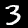

在这里，我们使用*Python Imaging Library*（PIL）中的`Image`类，这是最广泛使用的 Python 包，用于打开、操作和查看图像。Jupyter 知道 PIL 图像，所以它会自动为我们显示图像。

在计算机中，一切都以数字表示。要查看构成这幅图像的数字，我们必须将其转换为*NumPy 数组*或*PyTorch 张量*。例如，这是转换为 NumPy 数组后图像的一部分的样子：

```py
array(im3)[4:10,4:10]
```

```py
array([[  0,   0,   0,   0,   0,   0],
       [  0,   0,   0,   0,   0,  29],
       [  0,   0,   0,  48, 166, 224],
       [  0,  93, 244, 249, 253, 187],
       [  0, 107, 253, 253, 230,  48],
       [  0,   3,  20,  20,  15,   0]], dtype=uint8)
```

`4:10`表示我们请求从索引 4（包括）到 10（不包括）的行，列也是一样。NumPy 从上到下，从左到右索引，因此此部分位于图像的左上角附近。这里是一个 PyTorch 张量：

```py
tensor(im3)[4:10,4:10]
```

```py
tensor([[  0,   0,   0,   0,   0,   0],
        [  0,   0,   0,   0,   0,  29],
        [  0,   0,   0,  48, 166, 224],
        [  0,  93, 244, 249, 253, 187],
        [  0, 107, 253, 253, 230,  48],
        [  0,   3,  20,  20,  15,   0]], dtype=torch.uint8)
```

我们可以切片数组，只选择包含数字顶部部分的部分，然后使用 Pandas DataFrame 使用渐变对值进行着色，这清楚地显示了图像是如何由像素值创建的：

```py
im3_t = tensor(im3)
df = pd.DataFrame(im3_t[4:15,4:22])
df.style.set_properties(**{'font-size':'6pt'}).background_gradient('Greys')
```

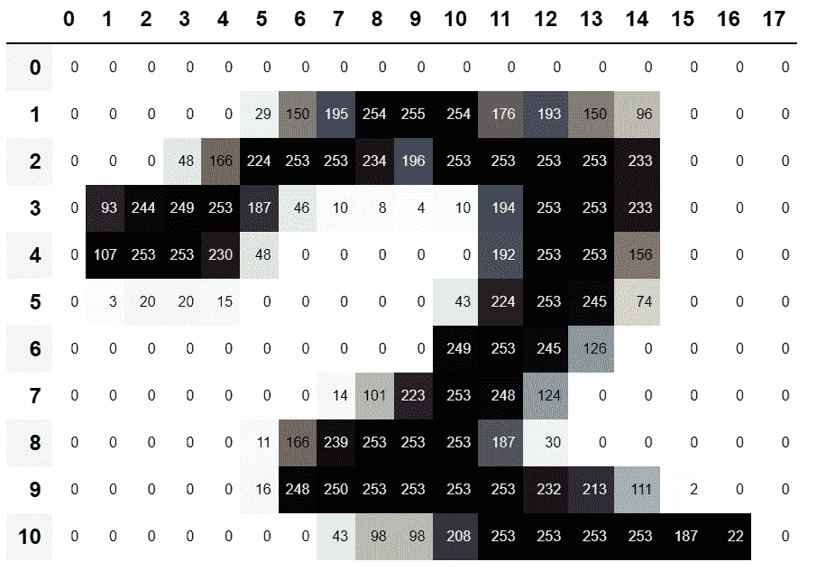

你可以看到，背景白色像素存储为数字 0，黑色为数字 255，灰色在两者之间。整个图像横向包含 28 个像素，纵向包含 28 个像素，总共 768 个像素。（这比你从手机相机得到的图像要小得多，手机相机有数百万像素，但对于我们的初始学习和实验来说，这是一个方便的大小。我们将很快构建更大的全彩图像。）

所以，现在你已经看到了计算机对图像的看法，让我们回顾一下我们的目标：创建一个能够识别 3 和 7 的模型。你会如何让计算机做到这一点呢？

# 停下来思考！

在继续阅读之前，花点时间考虑一下计算机可能如何识别这两个数字。它可能能够看到什么样的特征？它可能如何识别这些特征？它如何将它们结合起来？学习最好的方式是尝试自己解决问题，而不仅仅是阅读别人的答案；所以离开这本书几分钟，拿一张纸和笔，写下一些想法。

# 第一次尝试：像素相似度

所以，这是一个第一个想法：我们可以找到每个 3 的像素的平均值，然后对 7 做同样的操作。这将给我们两组平均值，定义了我们可能称之为“理想”3 和 7。然后，为了将图像分类为一个数字或另一个数字，我们看看这两个理想数字中图像与哪个更相似。这肯定似乎比没有好，所以这将成为一个很好的基线。

# 术语：基线

一个简单的模型，你有信心应该表现得相当不错。它应该简单实现和易于测试，这样你就可以测试每个改进的想法，并确保它们始终优于基线。如果没有以合理的基线开始，很难知道你的超级花哨的模型是否好用。创建基线的一个好方法是做我们在这里做的事情：考虑一个简单、易于实现的模型。另一个好方法是四处寻找解决类似问题的其他人，并在你的数据集上下载并运行他们的代码。最好两者都尝试一下！

我们简单模型的第一步是获取我们两组像素值的平均值。在这个过程中，我们将学习很多有趣的 Python 数值编程技巧！

让我们创建一个包含所有 3 的张量堆叠在一起。我们已经知道如何创建包含单个图像的张量。要创建一个包含目录中所有图像的张量，我们将首先使用 Python 列表推导来创建一个单个图像张量的普通列表。

我们将使用 Jupyter 在途中做一些小的检查——在这种情况下，确保返回的项目数量看起来合理：

```py
seven_tensors = [tensor(Image.open(o)) for o in sevens]
three_tensors = [tensor(Image.open(o)) for o in threes]
len(three_tensors),len(seven_tensors)
```

```py
(6131, 6265)
```

# 列表推导

列表和字典推导是 Python 的一个很棒的特性。许多 Python 程序员每天都在使用它们，包括本书的作者们——它们是“Python 的成语”。但是来自其他语言的程序员可能以前从未见过它们。许多很棒的教程只需一次网络搜索，所以我们现在不会花很长时间讨论它们。这里有一个快速的解释和示例，让您开始。列表推导看起来像这样：`new_list = [f(o) for o in a_list if o>0]`。这将返回`a_list`中大于 0 的每个元素，在将其传递给函数`f`之后。这里有三个部分：您正在迭代的集合（`a_list`），一个可选的过滤器（`if o>0`），以及对每个元素执行的操作（`f(o)`）。不仅写起来更短，而且比用循环创建相同列表的替代方法更快。

我们还将检查其中一张图像是否正常。由于我们现在有张量（Jupyter 默认会将其打印为值），而不是 PIL 图像（Jupyter 默认会显示图像），我们需要使用 fastai 的`show_image`函数来显示它：

```py
show_image(three_tensors[1]);
```

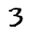

对于每个像素位置，我们想要计算该像素的强度在所有图像上的平均值。为了做到这一点，我们首先将此列表中的所有图像组合成一个三维张量。描述这样的张量最常见的方式是称之为*rank-3 张量*。我们经常需要将集合中的单个张量堆叠成一个张量。不出所料，PyTorch 带有一个名为`stack`的函数，我们可以用它来实现这个目的。

PyTorch 中的一些操作，如取平均值，需要我们将整数类型转换为浮点类型。由于我们稍后会需要这个，我们现在也将我们的堆叠张量转换为`float`。在 PyTorch 中进行转换就像写下您希望转换为的类型名称，并将其视为方法一样简单。

通常，当图像是浮点数时，像素值应该在 0 到 1 之间，所以我们也会在这里除以 255：

```py
stacked_sevens = torch.stack(seven_tensors).float()/255
stacked_threes = torch.stack(three_tensors).float()/255
stacked_threes.shape
```

```py
torch.Size([6131, 28, 28])
```

张量最重要的属性也许是其*形状*。这告诉您每个轴的长度。在这种情况下，我们可以看到我们有 6,131 张图像，每张图像大小为 28×28 像素。关于这个张量没有特别的地方表明第一个轴是图像的数量，第二个是高度，第三个是宽度——张量的语义完全取决于我们以及我们如何构建它。就 PyTorch 而言，它只是内存中的一堆数字。

张量形状的*长度*是其秩：

```py
len(stacked_threes.shape)
```

```py
3
```

对于您来说，将张量术语的这些部分记忆并加以实践非常重要：*秩*是张量中轴或维度的数量；*形状*是张量每个轴的大小。

# Alexis 说

要小心，因为术语“维度”有时以两种方式使用。考虑我们生活在“三维空间”中，其中物理位置可以用长度为 3 的向量`v`描述。但根据 PyTorch，属性`v.ndim`（看起来确实像`v`的“维度数量”）等于一，而不是三！为什么？因为`v`是一个向量，它是一个秩为一的张量，这意味着它只有一个*轴*（即使该轴的长度为三）。换句话说，有时维度用于描述轴的大小（“空间是三维的”），而其他时候用于描述秩或轴的数量（“矩阵有两个维度”）。当感到困惑时，我发现将所有陈述转换为秩、轴和长度这些明确的术语是有帮助的。

我们也可以直接使用`ndim`来获取张量的秩：

```py
stacked_threes.ndim
```

```py
3
```

最后，我们可以计算理想的 3 是什么样子的。我们通过沿着我们堆叠的 rank-3 张量的维度 0 取平均值来计算所有图像张量的平均值。这是索引所有图像的维度。

换句话说，对于每个像素位置，这将计算所有图像中该像素的平均值。结果将是每个像素位置的一个值，或者一个单独的图像。这就是它：

```py
mean3 = stacked_threes.mean(0)
show_image(mean3);
```

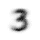

根据这个数据集，这是理想的数字 3！（您可能不喜欢，但这就是顶级数字 3 表现的样子。）您可以看到在所有图像都认为应该是暗的地方非常暗，但在图像不一致的地方变得模糊。

让我们对 7 做同样的事情，但一次将所有步骤放在一起以节省时间：

```py
mean7 = stacked_sevens.mean(0)
show_image(mean7);
```

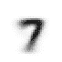

现在让我们选择一个任意的 3，并测量它与我们的“理想数字”的*距离*。

# 停下来思考一下！

您如何计算特定图像与我们的每个理想数字之间的相似程度？在继续前进之前，请记得远离这本书，记录一些想法！研究表明，通过解决问题、实验和尝试新想法，您参与学习过程时，召回和理解会显著提高。

这是一个示例 3：

```py
a_3 = stacked_threes[1]
show_image(a_3);
```


我们如何确定它与我们理想的 3 之间的距离？我们不能简单地将此图像的像素之间的差异相加，并与理想数字进行比较。一些差异将是正的，而另一些将是负的，这些差异将相互抵消，导致一种情况，即在某些地方太暗而在其他地方太亮的图像可能被显示为与理想的总差异为零。那将是误导性的！

为了避免这种情况，数据科学家在这种情况下使用两种主要方法来测量距离：

+   取差值的*绝对值*的平均值（绝对值是将负值替换为正值的函数）。这被称为*平均绝对差*或*L1 范数*。

+   取差值的*平方*的平均值（使所有值变为正数），然后取*平方根*（撤销平方）。这被称为*均方根误差*（RMSE）或*L2 范数*。

# 忘记数学是可以的

在这本书中，我们通常假设您已经完成了高中数学，并且至少记得一些内容 - 但每个人都会忘记一些东西！这完全取决于您在此期间有理由练习的内容。也许您已经忘记了*平方根*是什么，或者它们究竟是如何工作的。没问题！每当您遇到本书中没有完全解释的数学概念时，不要只是继续前进；相反，停下来查一下。确保您理解基本概念，它是如何工作的，以及为什么我们可能会使用它。刷新您理解的最佳地方之一是 Khan Academy。例如，Khan Academy 有一个很棒的[平方根介绍](https://oreil.ly/T7mxH)。

现在让我们尝试这两种方法：

```py
dist_3_abs = (a_3 - mean3).abs().mean()
dist_3_sqr = ((a_3 - mean3)**2).mean().sqrt()
dist_3_abs,dist_3_sqr
```

```py
(tensor(0.1114), tensor(0.2021))
```

```py
dist_7_abs = (a_3 - mean7).abs().mean()
dist_7_sqr = ((a_3 - mean7)**2).mean().sqrt()
dist_7_abs,dist_7_sqr
```

```py
(tensor(0.1586), tensor(0.3021))
```

在这两种情况下，我们的 3 与“理想”的 3 之间的距离小于与理想的 7 之间的距离，因此在这种情况下，我们简单的模型将给出正确的预测。

PyTorch 已经提供了这两种作为*损失函数*。您会在`torch.nn.functional`中找到这些，PyTorch 团队建议将其导入为`F`（并且默认情况下以这个名称在 fastai 中可用）：

```py
F.l1_loss(a_3.float(),mean7), F.mse_loss(a_3,mean7).sqrt()
```

```py
(tensor(0.1586), tensor(0.3021))
```

在这里，`MSE`代表*均方误差*，`l1`是标准数学术语*平均绝对值*的缩写（在数学中称为*L1 范数*）。

# Sylvain 说

直观地，L1 范数和均方误差（MSE）之间的区别在于，后者会比前者更严厉地惩罚更大的错误（并对小错误更宽容）。

# 杰里米说

当我第一次遇到这个 L1 的东西时，我查了一下看它到底是什么意思。我在谷歌上发现它是使用“绝对值”作为“向量范数”，所以我查了“向量范数”并开始阅读：“给定一个实数或复数域 F 上的向量空间 V，V 上的范数是一个非负值的任意函数 p: V → \[0,+∞)，具有以下属性：对于所有的 a ∈ F 和所有的 u, v ∈ V，p(u + v) ≤ p(u) + p(v)…”然后我停止阅读。“唉，我永远也理解不了数学！”我想，这已经是第一千次了。从那时起，我学到了每当实践中出现这些复杂的数学术语时，我可以用一点点代码来替换它们！比如，*L1 损失* 只等于 `(a-b).abs().mean()`，其中 `a` 和 `b` 是张量。我猜数学家们只是和我想法不同…我会确保在本书中，每当出现一些数学术语时，我会给你相应的代码片段，并用通俗的语言解释发生了什么。

我们刚刚在 PyTorch 张量上完成了各种数学运算。如果你之前在 PyTorch 中进行过数值编程，你可能会发现这些与 NumPy 数组相似。让我们来看看这两个重要的数据结构。

## NumPy 数组和 PyTorch 张量

[NumPy](https://numpy.org) 是 Python 中用于科学和数值编程最广泛使用的库。它提供了类似的功能和类似的 API，与 PyTorch 提供的功能相似；然而，它不支持使用 GPU 或计算梯度，这两者对于深度学习都是至关重要的。因此，在本书中，我们通常会在可能的情况下使用 PyTorch 张量而不是 NumPy 数组。

（请注意，fastai 在 NumPy 和 PyTorch 中添加了一些功能，使它们更加相似。如果本书中的任何代码在您的计算机上无法运行，可能是因为您忘记在笔记本的开头包含类似这样的一行代码：`from fastai.vision.all import *`。）

但是数组和张量是什么，为什么你应该关心呢？

Python 相对于许多语言来说速度较慢。在 Python、NumPy 或 PyTorch 中快速的任何东西，很可能是另一种语言（特别是 C）编写（并优化）的编译对象的包装器。事实上，*NumPy 数组和 PyTorch 张量可以比纯 Python 快几千倍完成计算*。

NumPy 数组是一个多维数据表，所有项都是相同类型的。由于可以是任何类型，它们甚至可以是数组的数组，内部数组可能是不同大小的 - 这被称为 *不规则数组*。通过“多维数据表”，我们指的是，例如，一个列表（一维）、一个表或矩阵（二维）、一个表的表或立方体（三维），等等。如果所有项都是简单类型，如整数或浮点数，NumPy 将它们存储为紧凑的 C 数据结构在内存中。这就是 NumPy 的优势所在。NumPy 有各种运算符和方法，可以在这些紧凑结构上以优化的 C 速度运行计算，因为它们是用优化的 C 编写的。

PyTorch 张量几乎与 NumPy 数组相同，但有一个额外的限制，可以解锁额外的功能。它与 NumPy 数组相同，也是一个多维数据表，所有项都是相同类型的。然而，限制是张量不能使用任何旧类型 - 它必须对所有组件使用单一基本数值类型。因此，张量不像真正的数组数组那样灵活。例如，PyTorch 张量不能是不规则的。它始终是一个形状规则的多维矩形结构。

NumPy 在这些结构上支持的绝大多数方法和运算符在 PyTorch 上也支持，但 PyTorch 张量具有额外的功能。一个主要功能是这些结构可以存在于 GPU 上，这样它们的计算将被优化为 GPU，并且可以运行得更快（给定大量值进行处理）。此外，PyTorch 可以自动计算这些操作的导数，包括操作的组合。正如你将看到的，没有这种能力，实际上是不可能进行深度学习的。

# Sylvain 说

如果你不知道 C 是什么，不用担心：你根本不需要它。简而言之，它是一种低级语言（低级意味着更类似于计算机内部使用的语言），与 Python 相比非常快。为了在 Python 中利用其速度，尽量避免编写循环，用直接作用于数组或张量的命令替换它们。

也许对于 Python 程序员来说，学习如何有效地使用数组/张量 API 是最重要的新编码技能。我们将在本书的后面展示更多技巧，但现在这里是你需要知道的关键事项的摘要。

要创建一个数组或张量，将列表（或列表的列表，或列表的列表的列表等）传递给`array`或`tensor`：

```py
data = [[1,2,3],[4,5,6]]
arr = array (data)
tns = tensor(data)
```

```py
arr  # numpy
```

```py
array([[1, 2, 3],
       [4, 5, 6]])
```

```py
tns  # pytorch
```

```py
tensor([[1, 2, 3],
        [4, 5, 6]])
```

以下所有操作都是在张量上展示的，但 NumPy 数组的语法和结果是相同的。

你可以选择一行（请注意，与 Python 中的列表一样，张量是从 0 开始索引的，所以 1 指的是第二行/列）：

```py
tns[1]
```

```py
tensor([4, 5, 6])
```

或者通过使用`:`来指示*所有第一个轴*（我们有时将张量/数组的维度称为*轴*）选择一列。

```py
tns[:,1]
```

```py
tensor([2, 5])
```

你可以结合 Python 切片语法（`[*start*:*end*]`，其中*`end`*被排除）来选择一行或一列的一部分：

```py
tns[1,1:3]
```

```py
tensor([5, 6])
```

你可以使用标准运算符，如`+`、`-`、`*`和`/`：

```py
tns+1
```

```py
tensor([[2, 3, 4],
        [5, 6, 7]])
```

张量有一个类型：

```py
tns.type()
```

```py
'torch.LongTensor'
```

并且会根据需要自动更改该类型；例如，从`int`到`float`：

```py
tns*1.5
```

```py
tensor([[1.5000, 3.0000, 4.5000],
        [6.0000, 7.5000, 9.0000]])
```

那么，我们的基准模型好吗？为了量化这一点，我们必须定义一个度量。

# 使用广播计算度量

回想一下*度量*是基于我们模型的预测和数据集中正确标签计算出来的一个数字，以告诉我们我们的模型有多好。例如，我们可以使用我们在上一节中看到的两个函数之一，均方误差或平均绝对误差，并计算整个数据集上它们的平均值。然而，这两个数字对大多数人来说并不是很容易理解；实际上，我们通常使用*准确度*作为分类模型的度量。

正如我们讨论过的，我们想要在*验证集*上计算我们的度量。这样我们就不会无意中过拟合——也就是说，训练一个模型只在我们的训练数据上表现良好。这对于我们在这里作为第一次尝试使用的像素相似度模型来说并不是真正的风险，因为它没有经过训练的组件，但我们仍然会使用一个验证集来遵循正常的实践，并为我们稍后的第二次尝试做好准备。

为了获得一个验证集，我们需要完全从训练数据中删除一些数据，这样模型根本就看不到它。事实证明，MNIST 数据集的创建者已经为我们做了这个。你还记得*valid*这个整个独立的目录吗？这个目录就是为此而设立的！

所以，让我们从那个目录中为我们的 3 和 7 创建张量。这些是我们将用来计算度量的张量，用来衡量我们第一次尝试模型的质量，这个度量衡量了与理想图像的距离：

```py
valid_3_tens = torch.stack([tensor(Image.open(o))
                            for o in (path/'valid'/'3').ls()])
valid_3_tens = valid_3_tens.float()/255
valid_7_tens = torch.stack([tensor(Image.open(o))
                            for o in (path/'valid'/'7').ls()])
valid_7_tens = valid_7_tens.float()/255
valid_3_tens.shape,valid_7_tens.shape
```

```py
(torch.Size([1010, 28, 28]), torch.Size([1028, 28, 28]))
```

在进行操作时检查形状是一个好习惯。在这里我们看到两个张量，一个代表了 1,010 张大小为 28×28 的 3 的验证集，另一个代表了 1,028 张大小为 28×28 的 7 的验证集。

我们最终想要编写一个函数`is_3`，它将决定任意图像是 3 还是 7。它将通过确定任意图像更接近我们的两个“理想数字”中的哪一个来实现这一点。为此，我们需要定义*距离*的概念——即，计算两个图像之间距离的函数。

我们可以编写一个简单的函数，使用与我们在上一节中编写的表达式非常相似的表达式来计算平均绝对误差：

```py
def mnist_distance(a,b): return (a-b).abs().mean((-1,-2))
mnist_distance(a_3, mean3)
```

```py
tensor(0.1114)
```

这是我们先前为这两个图像之间的距离计算的相同值，理想数字 3 `mean_3`和任意样本 3 `a_3`，它们都是形状为`[28,28]`的单个图像张量。

但是要计算整体准确度的指标，我们需要计算验证集中*每张*图像到理想数字 3 的距离。我们如何进行这种计算？我们可以编写一个循环，遍历验证集张量`valid_3_tens`中堆叠的所有单图像张量，其形状为`[1010,28,28]`，表示 1,010 张图像。但是有一种更好的方法。

当我们使用相同的距离函数，设计用于比较两个单个图像，但将表示 3 的验证集张量`valid_3_tens`作为参数传入时，会发生一些有趣的事情：

```py
valid_3_dist = mnist_distance(valid_3_tens, mean3)
valid_3_dist, valid_3_dist.shape
```

```py
(tensor([0.1050, 0.1526, 0.1186,  ..., 0.1122, 0.1170, 0.1086]),
 torch.Size([1010]))
```

它没有抱怨形状不匹配，而是为每个单个图像返回了一个距离（即，长度为 1,010 的秩-1 张量）。这是如何发生的？

再看看我们的函数`mnist_distance`，您会看到我们在那里有减法`(a-b)`。魔术技巧在于 PyTorch 在尝试在不同秩的两个张量之间执行简单的减法操作时，将使用*广播*：它将自动扩展秩较小的张量，使其大小与秩较大的张量相同。广播是一种重要的功能，使张量代码更容易编写。

在广播后，使两个参数张量具有相同的秩后，PyTorch 对于秩相同的两个张量应用其通常的逻辑：它对两个张量的每个对应元素执行操作，并返回张量结果。例如：

```py
tensor([1,2,3]) + tensor([1,1,1])
```

```py
tensor([2, 3, 4])
```

因此，在这种情况下，PyTorch 将`mean3`视为一个表示单个图像的秩-2 张量，就好像它是 1,010 个相同图像的副本，然后从我们的验证集中的每个 3 中减去每个副本。您期望这个张量的形状是什么？在查看这里的答案之前，请尝试自己想出来：

```py
(valid_3_tens-mean3).shape
```

```py
torch.Size([1010, 28, 28])
```

我们正在计算我们的理想数字 3 与验证集中的每个 1,010 个 3 之间的差异，对于每个 28×28 图像，结果形状为`[1010,28,28]`。

有关广播实现的一些重要要点，使其不仅对于表达性有价值，而且对于性能也有价值：

+   PyTorch 实际上并没有将`mean3`复制 1,010 次。它*假装*它是一个具有该形状的张量，但不分配任何额外内存。

+   它在 C 中完成整个计算（或者，如果您使用 GPU，则在 CUDA 中，相当于 GPU 上的 C），比纯 Python 快数万倍（在 GPU 上甚至快数百万倍！）。

这适用于 PyTorch 中所有广播和逐元素操作和函数。*这是您要了解的最重要的技术，以创建高效的 PyTorch 代码。*

接下来在`mnist_distance`中我们看到`abs`。现在您可能能猜到将其应用于张量时会发生什么。它将方法应用于张量中的每个单独元素，并返回结果的张量（即，它逐元素应用方法）。因此，在这种情况下，我们将得到 1,010 个绝对值。

最后，我们的函数调用`mean((-1,-2))`。元组`(-1,-2)`表示一系列轴。在 Python 中，`-1`指的是最后一个元素，`-2`指的是倒数第二个元素。因此，在这种情况下，这告诉 PyTorch 我们要对张量的最后两个轴的值进行平均。最后两个轴是图像的水平和垂直维度。在对最后两个轴进行平均后，我们只剩下第一个张量轴，它索引我们的图像，这就是为什么我们的最终大小是`(1010)`。换句话说，对于每个图像，我们对该图像中所有像素的强度进行了平均。

在本书中，我们将学习更多关于广播的知识，特别是在第十七章中，并且也会经常进行实践。

我们可以使用`mnist_distance`来确定一幅图像是否为 3，方法是使用以下逻辑：如果问题中的数字与理想的 3 之间的距离小于到理想的 7 的距离，则它是一个 3。这个函数将自动进行广播，并逐个应用，就像所有 PyTorch 函数和运算符一样：

```py
def is_3(x): return mnist_distance(x,mean3) < mnist_distance(x,mean7)
```

让我们在我们的示例案例上测试一下：

```py
is_3(a_3), is_3(a_3).float()
```

```py
(tensor(True), tensor(1.))
```

请注意，当我们将布尔响应转换为浮点数时，`True`会得到`1.0`，`False`会得到`0.0`。

由于广播，我们还可以在所有 3 的完整验证集上进行测试：

```py
is_3(valid_3_tens)
```

```py
tensor([True, True, True,  ..., True, True, True])
```

现在我们可以计算每个 3 和 7 的准确率，方法是对所有 3 的函数取平均值，对所有 7 的函数取其倒数的平均值：

```py
accuracy_3s =      is_3(valid_3_tens).float() .mean()
accuracy_7s = (1 - is_3(valid_7_tens).float()).mean()

accuracy_3s,accuracy_7s,(accuracy_3s+accuracy_7s)/2
```

```py
(tensor(0.9168), tensor(0.9854), tensor(0.9511))
```

这看起来是一个相当不错的开始！我们在 3 和 7 上都获得了超过 90%的准确率，我们已经看到了如何使用广播方便地定义度量。但让我们诚实一点：3 和 7 是非常不同的数字。到目前为止，我们只对 10 个可能的数字中的 2 个进行分类。所以我们需要做得更好！

为了做得更好，也许现在是时候尝试一个真正学习的系统了，一个可以自动修改自身以提高性能的系统。换句话说，现在是时候谈论训练过程和 SGD 了。

# 随机梯度下降

你还记得 Arthur Samuel 在第一章中描述机器学习的方式吗？

> 假设我们安排一些自动手段来测试任何当前权重分配的有效性，以实际性能为基础，并提供一种机制来改变权重分配以最大化性能。我们不需要详细了解这种程序的细节，就可以看到它可以完全自动化，并且可以看到一个这样编程的机器会从中学习。

正如我们讨论过的，这是让我们拥有一个可以变得越来越好的模型的关键，可以学习。但我们的像素相似性方法实际上并没有做到这一点。我们没有任何权重分配，也没有任何根据测试权重分配的有效性来改进的方法。换句话说，我们无法通过修改一组参数来改进我们的像素相似性方法。为了充分利用深度学习的力量，我们首先必须按照 Samuel 描述的方式来表示我们的任务。

与其尝试找到图像与“理想图像”之间的相似性，我们可以查看每个单独的像素，并为每个像素提出一组权重，使得最高的权重与最有可能为特定类别的黑色像素相关联。例如，向右下方的像素不太可能被激活为 7，因此它们对于 7 的权重应该很低，但它们很可能被激活为 8，因此它们对于 8 的权重应该很高。这可以表示为一个函数和每个可能类别的一组权重值，例如，成为数字 8 的概率：

```py
def pr_eight(x,w) = (x*w).sum()
```

在这里，我们假设`X`是图像，表示为一个向量—换句话说，所有行都堆叠在一起形成一个长长的单行。我们假设权重是一个向量`W`。如果我们有了这个函数，我们只需要一种方法来更新权重，使它们变得更好一点。通过这种方法，我们可以重复这个步骤多次，使权重变得越来越好，直到我们能够使它们尽可能好。

我们希望找到导致我们的函数对于那些是 8 的图像结果高，对于那些不是的图像结果低的向量`W`的特定值。搜索最佳向量`W`是搜索最佳函数以识别 8 的一种方式。（因为我们还没有使用深度神经网络，我们受到我们的函数能力的限制，我们将在本章后面解决这个约束。）

更具体地说，以下是将这个函数转化为机器学习分类器所需的步骤：

1.  *初始化*权重。

1.  对于每个图像，使用这些权重来*预测*它是 3 还是 7。

1.  基于这些预测，计算模型有多好（它的*损失*）。

1.  计算*梯度*，它衡量了每个权重的变化如何改变损失。

1.  根据这个计算，*改变*（即，改变）所有权重。

1.  回到步骤 2 并*重复*这个过程。

1.  迭代直到你决定*停止*训练过程（例如，因为模型已经足够好或者你不想再等待了）。

这七个步骤，如图 4-1 所示，是所有深度学习模型训练的关键。深度学习完全依赖于这些步骤，这是非常令人惊讶和反直觉的。令人惊奇的是，这个过程可以解决如此复杂的问题。但是，正如你将看到的，它确实可以！

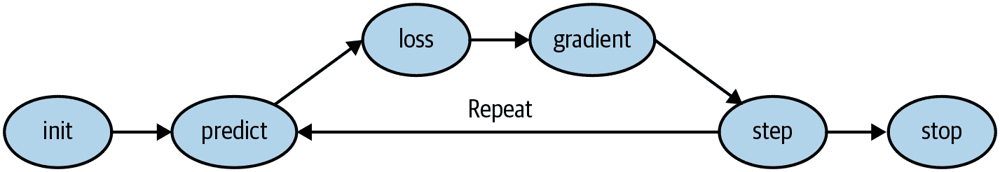

###### 图 4-1. 梯度下降过程

每个步骤都有许多方法，我们将在本书的其余部分学习它们。这些细节对于深度学习从业者来说非常重要，但事实证明，对于每个步骤的一般方法都遵循一些基本原则。以下是一些建议：

初始化

我们将参数初始化为随机值。这可能听起来令人惊讶。我们当然可以做其他选择，比如将它们初始化为该类别激活该像素的百分比—但由于我们已经知道我们有一种方法来改进这些权重，结果证明只是从随机权重开始就可以完全正常运行。

损失

这就是 Samuel 所说的*根据实际表现测试任何当前权重分配的有效性*。我们需要一个函数，如果模型的表现好，它将返回一个小的数字（标准方法是将小的损失视为好的，大的损失视为坏的，尽管这只是一种约定）。

步骤

一个简单的方法来判断一个权重是否应该增加一点或减少一点就是尝试一下：增加一点权重，看看损失是增加还是减少。一旦找到正确的方向，你可以再多改变一点或少改变一点，直到找到一个效果好的量。然而，这很慢！正如我们将看到的，微积分的魔力使我们能够直接找出每个权重应该朝哪个方向改变，大概改变多少，而不必尝试所有这些小的改变。这样做的方法是通过计算*梯度*。这只是一种性能优化；我们也可以通过使用更慢的手动过程得到完全相同的结果。

停止

一旦我们决定要为模型训练多少个周期（之前的列表中给出了一些建议），我们就会应用这个决定。对于我们的数字分类器，我们会继续训练，直到模型的准确率开始变差，或者我们用完时间为止。

在将这些步骤应用于我们的图像分类问题之前，让我们在一个更简单的情况下看看它们是什么样子。首先我们将定义一个非常简单的函数，二次函数—假设这是我们的损失函数，`x`是函数的权重参数：

```py
def f(x): return x**2
```

这是该函数的图表：

```py
plot_function(f, 'x', 'x**2')
```

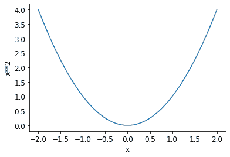

我们之前描述的步骤序列从选择参数的随机值开始，并计算损失的值：

```py
plot_function(f, 'x', 'x**2')
plt.scatter(-1.5, f(-1.5), color='red');
```

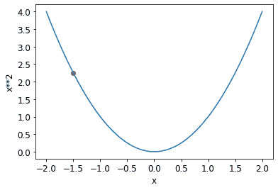

现在我们来看看如果我们稍微增加或减少参数会发生什么—*调整*。这只是特定点的斜率：

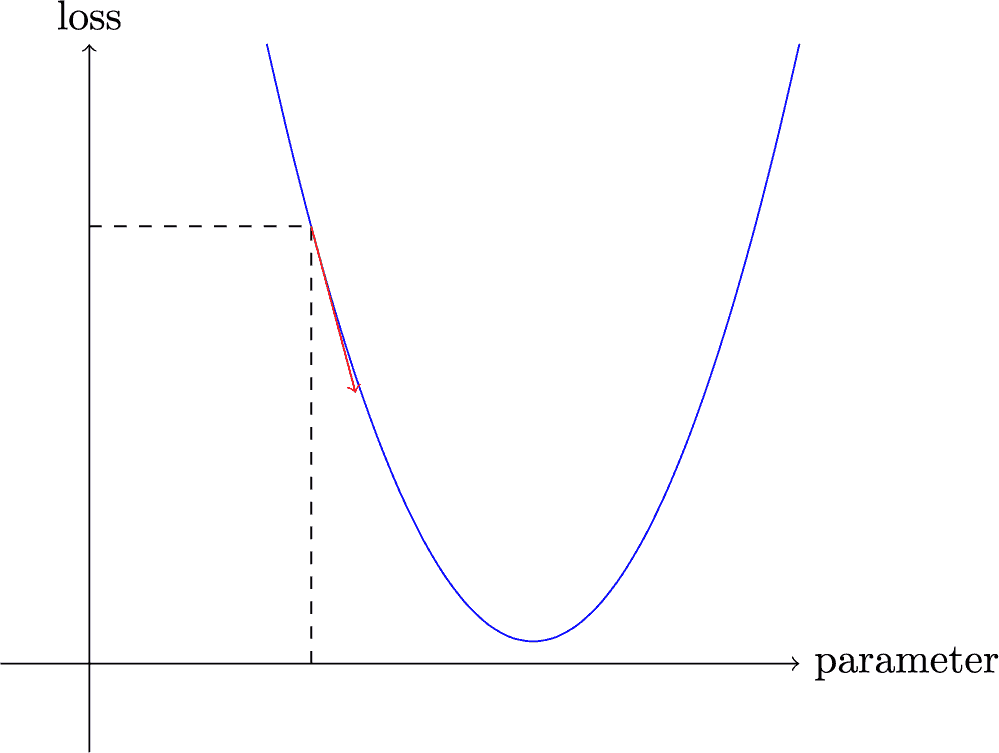

我们可以稍微改变我们的权重朝着斜坡的方向，计算我们的损失和调整，然后再重复几次。最终，我们将到达曲线上的最低点：

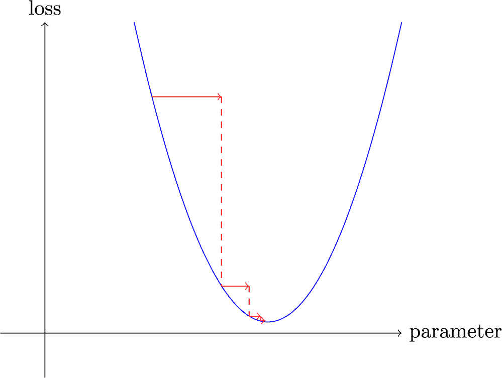

这个基本思想最早可以追溯到艾萨克·牛顿，他指出我们可以以这种方式优化任意函数。无论我们的函数变得多么复杂，梯度下降的这种基本方法不会有太大变化。我们在本书后面看到的唯一微小变化是一些方便的方法，可以让我们更快地找到更好的步骤。

## 计算梯度

唯一的魔法步骤是计算梯度的部分。正如我们提到的，我们使用微积分作为性能优化；它让我们更快地计算当我们调整参数时我们的损失会上升还是下降。换句话说，梯度将告诉我们我们需要改变每个权重多少才能使我们的模型更好。

您可能还记得高中微积分课上的*导数*告诉您函数参数的变化会如何改变其结果。如果不记得，不用担心；我们很多人高中毕业后就忘了微积分！但在继续之前，您需要对导数有一些直观的理解，所以如果您对此一头雾水，可以前往 Khan Academy 完成[基本导数课程](https://oreil.ly/nyd0R)。您不必自己计算导数；您只需要知道导数是什么。

导数的关键点在于：对于任何函数，比如我们在前一节中看到的二次函数，我们可以计算它的导数。导数是另一个函数。它计算的是变化，而不是值。例如，在值为 3 时，二次函数的导数告诉我们函数在值为 3 时的变化速度。更具体地说，您可能还记得梯度被定义为*上升/水平移动*；也就是说，函数值的变化除以参数值的变化。当我们知道我们的函数将如何变化时，我们就知道我们需要做什么来使它变小。这是机器学习的关键：有一种方法来改变函数的参数使其变小。微积分为我们提供了一个计算的捷径，即导数，它让我们直接计算我们函数的梯度。

一个重要的事情要注意的是我们的函数有很多需要调整的权重，所以当我们计算导数时，我们不会得到一个数字，而是很多个—每个权重都有一个梯度。但在这里没有数学上的技巧；您可以计算相对于一个权重的导数，将其他所有权重视为常数，然后对每个其他权重重复这个过程。这就是计算所有梯度的方法，对于每个权重。

刚才我们提到您不必自己计算任何梯度。这怎么可能？令人惊讶的是，PyTorch 能够自动计算几乎任何函数的导数！而且，它计算得非常快。大多数情况下，它至少与您手动创建的任何导数函数一样快。让我们看一个例子。

首先，让我们选择一个张量数值，我们想要梯度：

```py
xt = tensor(3.).requires_grad_()
```

注意特殊方法`requires_grad_`？这是我们告诉 PyTorch 我们想要计算梯度的神奇咒语。这实质上是给变量打上标记，这样 PyTorch 就会记住如何计算您要求的其他直接计算的梯度。

# Alexis 说

如果您来自数学或物理学，这个 API 可能会让您困惑。在这些背景下，函数的“梯度”只是另一个函数（即，它的导数），因此您可能期望与梯度相关的 API 提供给您一个新函数。但在深度学习中，“梯度”通常意味着函数的导数在特定参数值处的*值*。PyTorch API 也将重点放在参数上，而不是您实际计算梯度的函数。起初可能感觉有些反常，但这只是一个不同的视角。

现在我们用这个值计算我们的函数。注意 PyTorch 打印的不仅是计算的值，还有一个提示，它有一个梯度函数将在需要时用来计算我们的梯度：

```py
yt = f(xt)
yt
```

```py
tensor(9., grad_fn=<PowBackward0>)
```

最后，我们告诉 PyTorch 为我们计算梯度：

```py
yt.backward()
```

这里的`backward`指的是*反向传播*，这是计算每一层导数的过程的名称。我们将在第十七章中看到这是如何精确完成的，当我们从头开始计算深度神经网络的梯度时。这被称为网络的*反向传播*，与*前向传播*相对，前者是计算激活的地方。如果`backward`只是被称为`calculate_grad`，生活可能会更容易，但深度学习的人确实喜欢在任何地方添加行话！

我们现在可以通过检查我们张量的`grad`属性来查看梯度：

```py
xt.grad
```

```py
tensor(6.)
```

如果您记得高中微积分规则，`x**2`的导数是`2*x`，我们有`x=3`，所以梯度应该是`2*3=6`，这就是 PyTorch 为我们计算的结果！

现在我们将重复前面的步骤，但使用一个向量参数来计算我们的函数：

```py
xt = tensor([3.,4.,10.]).requires_grad_()
xt
```

```py
tensor([ 3.,  4., 10.], requires_grad=True)
```

并且我们将`sum`添加到我们的函数中，以便它可以接受一个向量（即，一个秩为 1 的张量）并返回一个标量（即，一个秩为 0 的张量）：

```py
def f(x): return (x**2).sum()

yt = f(xt)
yt
```

```py
tensor(125., grad_fn=<SumBackward0>)
```

我们的梯度是`2*xt`，正如我们所期望的！

```py
yt.backward()
xt.grad
```

```py
tensor([ 6.,  8., 20.])
```

梯度告诉我们函数的斜率；它们并不告诉我们要调整参数多远。但它们确实给了我们一些想法：如果斜率非常大，那可能意味着我们需要更多的调整，而如果斜率非常小，那可能意味着我们接近最优值。

## 使用学习率进行步进

根据梯度值来决定如何改变我们的参数是深度学习过程中的一个重要部分。几乎所有方法都从一个基本思想开始，即将梯度乘以一些小数字，称为*学习率*（LR）。学习率通常是 0.001 到 0.1 之间的数字，尽管它可以是任何值。通常人们通过尝试几个学习率来选择一个，并找出哪个在训练后产生最佳模型的结果（我们将在本书后面展示一个更好的方法，称为*学习率查找器*）。一旦选择了学习率，您可以使用这个简单函数调整参数：

```py
w -= w.grad * lr
```

这被称为*调整*您的参数，使用*优化步骤*。

如果您选择的学习率太低，可能意味着需要执行很多步骤。图 4-2 说明了这一点。

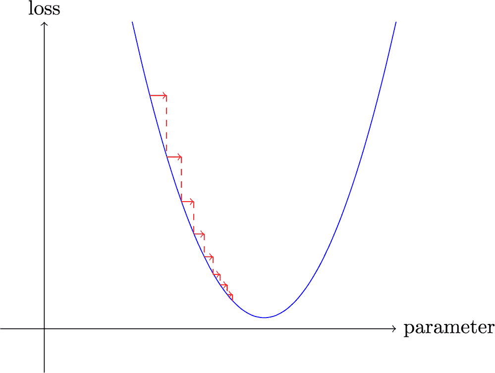

###### 图 4-2。学习率过低的梯度下降

但选择一个学习率太高的学习率更糟糕——它可能导致损失变得*更糟*，正如我们在图 4-3 中看到的！

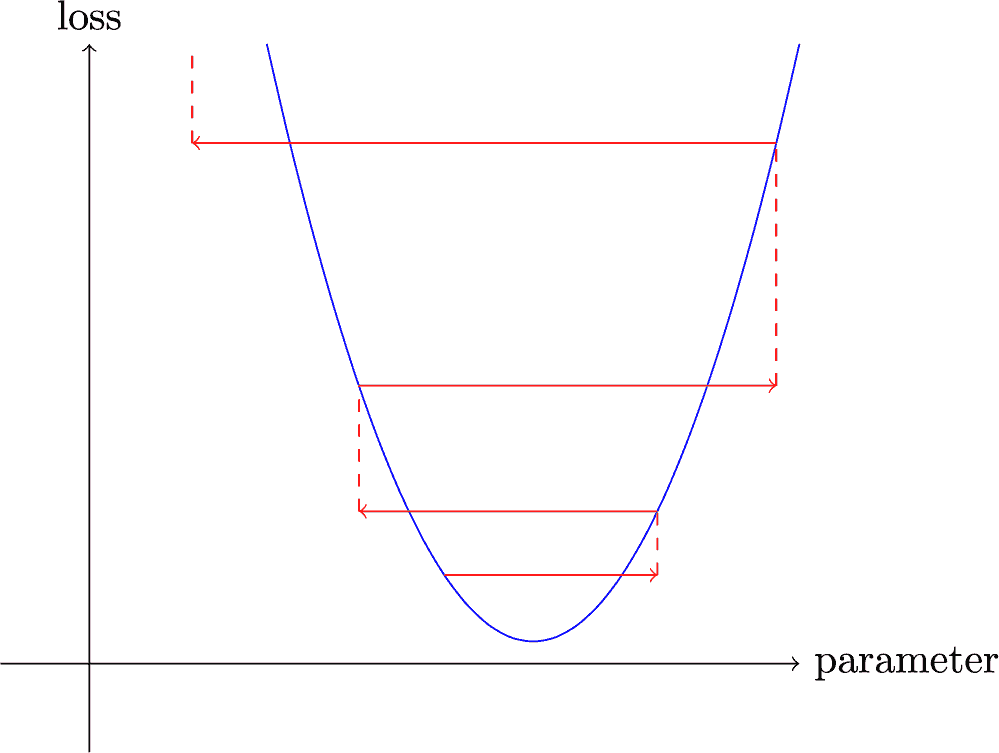

###### 图 4-3\. 学习率过高的梯度下降

如果学习率太高，它也可能会“弹跳”而不是发散；图 4-4 显示了这样做需要许多步骤才能成功训练。

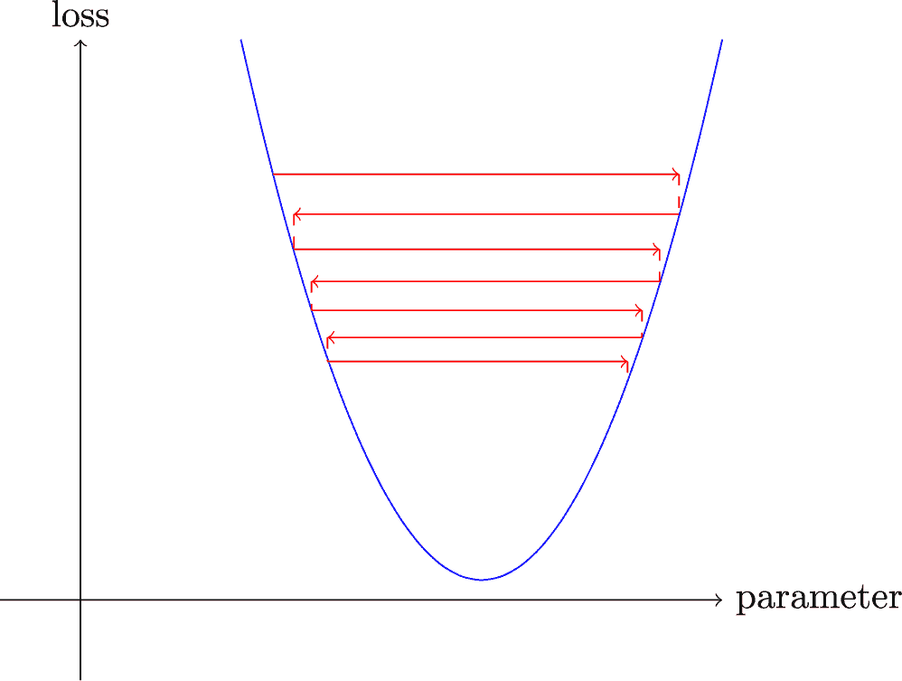

###### 图 4-4\. 带有弹跳学习率的梯度下降

现在让我们在一个端到端的示例中应用所有这些。

## 一个端到端的 SGD 示例

我们已经看到如何使用梯度来最小化我们的损失。现在是时候看一个 SGD 示例，并看看如何找到最小值来训练模型以更好地拟合数据。

让我们从一个简单的合成示例模型开始。想象一下，您正在测量过山车通过顶峰时的速度。它会开始快速，然后随着上坡而变慢；在顶部最慢，然后在下坡时再次加速。您想建立一个关于速度随时间变化的模型。如果您每秒手动测量速度 20 秒，它可能看起来像这样：

```py
time = torch.arange(0,20).float(); time
```

```py
tensor([ 0.,  1.,  2.,  3.,  4.,  5.,  6.,  7.,  8.,  9., 10., 11., 12., 13.,
 > 14., 15., 16., 17., 18., 19.])
```

```py
speed = torch.randn(20)*3 + 0.75*(time-9.5)**2 + 1
plt.scatter(time,speed);
```

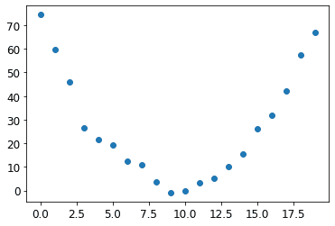

我们添加了一些随机噪声，因为手动测量不够精确。这意味着很难回答问题：过山车的速度是多少？使用 SGD，我们可以尝试找到一个与我们的观察相匹配的函数。我们无法考虑每种可能的函数，所以让我们猜测它将是二次的；即，一个形式为`a*(time**2)+(b*time)+c`的函数。

我们希望清楚地区分函数的输入（我们测量过山车速度的时间）和其参数（定义*我们正在尝试的*二次函数的值）。因此，让我们将参数收集在一个参数中，从而在函数的签名中分离输入`t`和参数`params`：

```py
def f(t, params):
    a,b,c = params
    return a*(t**2) + (b*t) + c
```

换句话说，我们已经将找到最佳拟合数据的最佳函数的问题限制为找到最佳*二次*函数。这极大地简化了问题，因为每个二次函数都由三个参数`a`、`b`和`c`完全定义。因此，要找到最佳二次函数，我们只需要找到最佳的`a`、`b`和`c`的值。

如果我们可以解决二次函数的三个参数的问题，我们就能够对其他具有更多参数的更复杂函数应用相同的方法——比如神经网络。让我们先找到`f`的参数，然后我们将回来对 MNIST 数据集使用神经网络做同样的事情。

首先，我们需要定义“最佳”是什么意思。我们通过选择一个*损失函数*来精确定义这一点，该函数将根据预测和目标返回一个值，其中函数的较低值对应于“更好”的预测。对于连续数据，通常使用*均方误差*：

```py
def mse(preds, targets): return ((preds-targets)**2).mean()
```

现在，让我们按照我们的七步流程进行工作。

### 第一步：初始化参数

首先，我们将参数初始化为随机值，并告诉 PyTorch 我们要使用`requires_grad_`跟踪它们的梯度：

```py
params = torch.randn(3).requires_grad_()
```

### 第二步：计算预测

接下来，我们计算预测：

```py
preds = f(time, params)
```

让我们创建一个小函数来查看我们的预测与目标的接近程度，并看一看：

```py
def show_preds(preds, ax=None):
    if ax is None: ax=plt.subplots()[1]
    ax.scatter(time, speed)
    ax.scatter(time, to_np(preds), color='red')
    ax.set_ylim(-300,100)
```

```py
show_preds(preds)
```

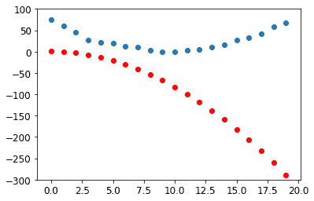

这看起来并不接近——我们的随机参数表明过山车最终会倒退，因为我们有负速度！

### 第三步：计算损失

我们计算损失如下：

```py
loss = mse(preds, speed)
loss
```

```py
tensor(25823.8086, grad_fn=<MeanBackward0>)
```

我们的目标现在是改进这一点。为了做到这一点，我们需要知道梯度。

### 第四步：计算梯度

下一步是计算梯度，或者近似参数需要如何改变：

```py
loss.backward()
params.grad
```

```py
tensor([-53195.8594,  -3419.7146,   -253.8908])
```

```py
params.grad * 1e-5
```

```py
tensor([-0.5320, -0.0342, -0.0025])
```

我们可以利用这些梯度来改进我们的参数。我们需要选择一个学习率（我们将在下一章中讨论如何在实践中做到这一点；现在，我们将使用 1e-5 或 0.00001）：

```py
params
```

```py
tensor([-0.7658, -0.7506,  1.3525], requires_grad=True)
```

### 第 5 步：调整权重

现在我们需要根据刚刚计算的梯度更新参数：

```py
lr = 1e-5
params.data -= lr * params.grad.data
params.grad = None
```

# Alexis 说

理解这一点取决于记住最近的历史。为了计算梯度，我们在`loss`上调用`backward`。但是这个`loss`本身是通过`mse`计算的，而`mse`又以`preds`作为输入，`preds`是使用`f`计算的，`f`以`params`作为输入，`params`是我们最初调用`required_grads_`的对象，这是最初的调用，现在允许我们在`loss`上调用`backward`。这一系列函数调用代表了函数的数学组合，使得 PyTorch 能够在幕后使用微积分的链式法则来计算这些梯度。

让我们看看损失是否有所改善：

```py
preds = f(time,params)
mse(preds, speed)
```

```py
tensor(5435.5366, grad_fn=<MeanBackward0>)
```

再看一下图表：

```py
show_preds(preds)
```

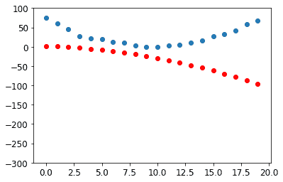

我们需要重复这个过程几次，所以我们将创建一个应用一步的函数：

```py
def apply_step(params, prn=True):
    preds = f(time, params)
    loss = mse(preds, speed)
    loss.backward()
    params.data -= lr * params.grad.data
    params.grad = None
    if prn: print(loss.item())
    return preds
```

### 第 6 步：重复这个过程

现在我们进行迭代。通过循环和进行许多改进，我们希望达到一个好的结果：

```py
for i in range(10): apply_step(params)
```

```py
5435.53662109375
1577.4495849609375
847.3780517578125
709.22265625
683.0757446289062
678.12451171875
677.1839599609375
677.0025024414062
676.96435546875
676.9537353515625
```

损失正在下降，正如我们所希望的！但仅仅看这些损失数字掩盖了一个事实，即每次迭代代表尝试一个完全不同的二次函数，以找到最佳可能的二次函数。如果我们不打印出损失函数，而是在每一步绘制函数，我们可以看到形状是如何接近我们的数据的最佳可能的二次函数：

```py
_,axs = plt.subplots(1,4,figsize=(12,3))
for ax in axs: show_preds(apply_step(params, False), ax)
plt.tight_layout()
```

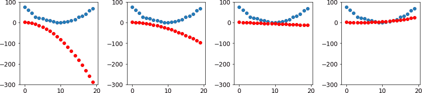

### 第 7 步：停止

我们刚刚决定在任意选择的 10 个 epochs 后停止。在实践中，我们会观察训练和验证损失以及我们的指标，以决定何时停止，正如我们所讨论的那样。

## 总结梯度下降

现在您已经看到每个步骤中发生的事情，让我们再次看一下我们的梯度下降过程的图形表示（图 4-5）并进行一个快速回顾。


###### 图 4-5\. 梯度下降过程

在开始时，我们模型的权重可以是随机的（从头开始训练）或来自预训练模型（迁移学习）。在第一种情况下，我们从输入得到的输出与我们想要的完全无关，即使在第二种情况下，预训练模型也可能不太擅长我们所针对的特定任务。因此，模型需要学习更好的权重。

我们首先将模型给出的输出与我们的目标进行比较（我们有标记数据，所以我们知道模型应该给出什么结果），使用一个*损失函数*，它返回一个数字，我们希望通过改进我们的权重使其尽可能低。为了做到这一点，我们从训练集中取出一些数据项（如图像）并将它们馈送给我们的模型。我们使用我们的损失函数比较相应的目标，我们得到的分数告诉我们我们的预测有多么错误。然后我们稍微改变权重使其稍微更好。

为了找出如何改变权重使损失稍微变好，我们使用微积分来计算*梯度*。（实际上，我们让 PyTorch 为我们做这个！）让我们考虑一个类比。想象一下你在山上迷路了，你的车停在最低点。为了找到回去的路，你可能会朝着随机方向走，但那可能不会有太大帮助。由于你知道你的车在最低点，你最好是往下走。通过始终朝着最陡峭的下坡方向迈出一步，你最终应该到达目的地。我们使用梯度的大小（即坡度的陡峭程度）来告诉我们应该迈多大一步；具体来说，我们将梯度乘以我们选择的一个称为*学习率*的数字来决定步长。然后我们*迭代*直到达到最低点，那将是我们的停车场；然后我们可以*停止*。

我们刚刚看到的所有内容都可以直接转换到 MNIST 数据集，除了损失函数。现在让我们看看如何定义一个好的训练目标。

# MNIST 损失函数

我们已经有了我们的`x`—也就是我们的自变量，图像本身。我们将它们全部连接成一个单一的张量，并且还将它们从矩阵列表（一个秩为 3 的张量）转换为向量列表（一个秩为 2 的张量）。我们可以使用`view`来做到这一点，`view`是一个 PyTorch 方法，可以改变张量的形状而不改变其内容。`-1`是`view`的一个特殊参数，意思是“使这个轴尽可能大以适应所有数据”：

```py
train_x = torch.cat([stacked_threes, stacked_sevens]).view(-1, 28*28)
```

我们需要为每张图片标记。我们将使用`1`表示 3，`0`表示 7：

```py
train_y = tensor([1]*len(threes) + [0]*len(sevens)).unsqueeze(1)
train_x.shape,train_y.shape
```

```py
(torch.Size([12396, 784]), torch.Size([12396, 1]))
```

在 PyTorch 中，当索引时，`Dataset`需要返回一个`(x,y)`元组。Python 提供了一个`zip`函数，当与`list`结合使用时，可以简单地实现这个功能：

```py
dset = list(zip(train_x,train_y))
x,y = dset[0]
x.shape,y
```

```py
(torch.Size([784]), tensor([1]))
```

```py
valid_x = torch.cat([valid_3_tens, valid_7_tens]).view(-1, 28*28)
valid_y = tensor([1]*len(valid_3_tens) + [0]*len(valid_7_tens)).unsqueeze(1)
valid_dset = list(zip(valid_x,valid_y))
```

现在我们需要为每个像素（最初是随机的）分配一个权重（这是我们七步过程中的*初始化*步骤）：

```py
def init_params(size, std=1.0): return (torch.randn(size)*std).requires_grad_()
```

```py
weights = init_params((28*28,1))
```

函数`weights*pixels`不够灵活—当像素等于 0 时，它总是等于 0（即其*截距*为 0）。你可能还记得高中数学中线的公式是`y=w*x+b`；我们仍然需要`b`。我们也会将其初始化为一个随机数：

```py
bias = init_params(1)
```

在神经网络中，方程`y=w*x+b`中的`w`被称为*权重*，`b`被称为*偏置*。权重和偏置一起构成*参数*。

# 术语：参数

模型的*权重*和*偏置*。权重是方程`w*x+b`中的`w`，偏置是该方程中的`b`。

现在我们可以为一张图片计算一个预测：

```py
(train_x[0]*weights.T).sum() + bias
```

```py
tensor([20.2336], grad_fn=<AddBackward0>)
```

虽然我们可以使用 Python 的`for`循环来计算每张图片的预测，但那将非常慢。因为 Python 循环不在 GPU 上运行，而且因为 Python 在一般情况下循环速度较慢，我们需要尽可能多地使用高级函数来表示模型中的计算。

在这种情况下，有一个非常方便的数学运算可以为矩阵的每一行计算`w*x`—它被称为*矩阵乘法*。图 4-6 展示了矩阵乘法的样子。

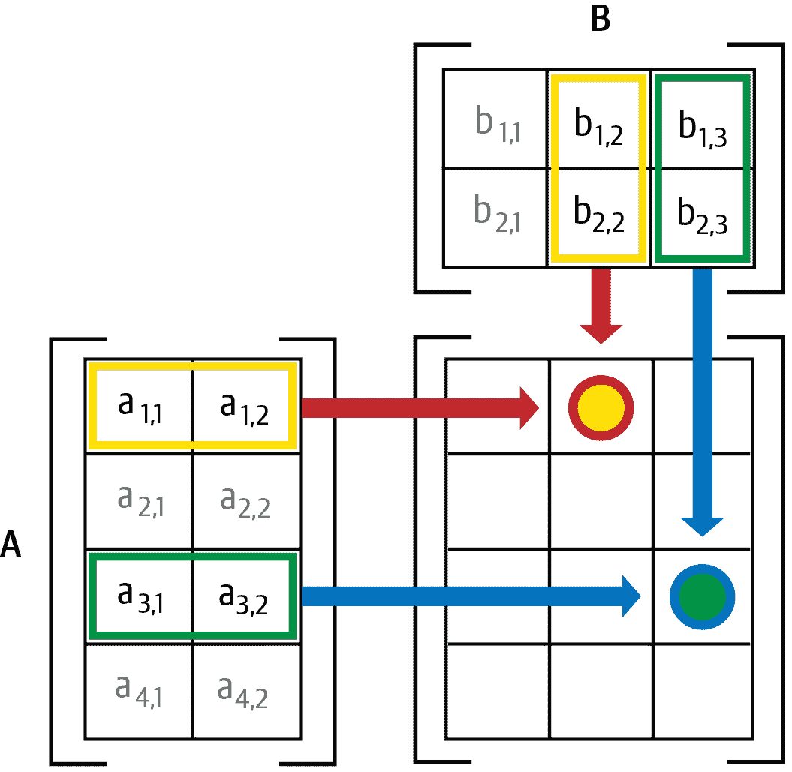

###### 图 4-6\. 矩阵乘法

这幅图展示了两个矩阵`A`和`B`相乘。结果的每个项目，我们称之为`AB`，包含了`A`的对应行的每个项目与`B`的对应列的每个项目相乘后相加。例如，第 1 行第 2 列（带有红色边框的黄色点）计算为<math alttext="a 下标 1，1 乘以 b 下标 1，2 加上 a 下标 1，2 乘以 b 下标 2，2">。如果您需要复习矩阵乘法，我们建议您查看 Khan Academy 的“矩阵乘法简介”，因为这是深度学习中最重要的数学运算。

在 Python 中，矩阵乘法用`@`运算符表示。让我们试一试：

```py
def linear1(xb): return xb@weights + bias
preds = linear1(train_x)
preds
```

```py
tensor([[20.2336],
        [17.0644],
        [15.2384],
        ...,
        [18.3804],
        [23.8567],
        [28.6816]], grad_fn=<AddBackward0>)
```

第一个元素与我们之前计算的相同，正如我们所期望的。这个方程`batch @ weights + bias`是任何神经网络的两个基本方程之一（另一个是*激活函数*，我们马上会看到）。

让我们检查我们的准确性。为了确定输出代表 3 还是 7，我们只需检查它是否大于 0，因此我们可以计算每个项目的准确性（使用广播，因此没有循环！）如下：

```py
corrects = (preds>0.0).float() == train_y
corrects
```

```py
tensor([[ True],
        [ True],
        [ True],
        ...,
        [False],
        [False],
        [False]])
```

```py
corrects.float().mean().item()
```

```py
0.4912068545818329
```

现在让我们看看一个权重的微小变化对准确性的影响是什么：

```py
weights[0] *= 1.0001
```

```py
preds = linear1(train_x)
((preds>0.0).float() == train_y).float().mean().item()
```

```py
0.4912068545818329
```

正如我们所看到的，我们需要梯度来通过 SGD 改进我们的模型，为了计算梯度，我们需要一个*损失函数*，它代表了我们的模型有多好。这是因为梯度是损失函数如何随着对权重的微小调整而变化的度量。

因此，我们需要选择一个损失函数。显而易见的方法是使用准确性作为我们的度量标准，也作为我们的损失函数。在这种情况下，我们将为每个图像计算我们的预测，收集这些值以计算总体准确性，然后计算每个权重相对于总体准确性的梯度。

不幸的是，我们在这里有一个重要的技术问题。函数的梯度是其*斜率*，或者是其陡峭程度，可以定义为*上升与下降*——也就是说，函数值上升或下降的幅度，除以我们改变输入的幅度。我们可以用数学方式写成：

```py
(y_new – y_old) / (x_new – x_old)
```

当`x_new`非常类似于`x_old`时，这给出了梯度的良好近似，这意味着它们的差异非常小。但是，只有当预测从 3 变为 7，或者反之时，准确性才会发生变化。问题在于，从`x_old`到`x_new`的权重的微小变化不太可能导致任何预测发生变化，因此`(y_new - y_old)`几乎总是为 0。换句话说，梯度几乎在任何地方都为 0。

权重值的微小变化通常不会改变准确性。这意味着使用准确性作为损失函数是没有用的——如果我们这样做，大多数时候我们的梯度将为 0，模型将无法从该数字中学习。

# Sylvain 说

在数学术语中，准确性是一个几乎在任何地方都是常数的函数（除了阈值 0.5），因此它的导数几乎在任何地方都是零（在阈值处为无穷大）。这将导致梯度为 0 或无穷大，这对于更新模型是没有用的。

相反，我们需要一个损失函数，当我们的权重导致稍微更好的预测时，给出稍微更好的损失。那么，“稍微更好的预测”具体是什么样呢？在这种情况下，这意味着如果正确答案是 3，则分数稍高，或者如果正确答案是 7，则分数稍低。

现在让我们编写这样一个函数。它是什么形式？

损失函数接收的不是图像本身，而是模型的预测。因此，让我们做一个参数`prds`，值在 0 和 1 之间，其中每个值是图像是 3 的预测。它是一个矢量（即，一个秩-1 张量），索引在图像上。

损失函数的目的是衡量预测值与真实值之间的差异，即目标（又称标签）。因此，让我们再做一个参数`trgts`，其值为 0 或 1，告诉图像实际上是 3 还是不是 3。它也是一个矢量（即，另一个秩-1 张量），索引在图像上。

例如，假设我们有三幅图像，我们知道其中一幅是 3，一幅是 7，一幅是 3。假设我们的模型以高置信度（`0.9`）预测第一幅是 3，以轻微置信度（`0.4`）预测第二幅是 7，以公平置信度（`0.2`），但是错误地预测最后一幅是 7。这意味着我们的损失函数将接收这些值作为其输入：

```py
trgts  = tensor([1,0,1])
prds   = tensor([0.9, 0.4, 0.2])
```

这是一个测量`predictions`和`targets`之间距离的损失函数的第一次尝试：

```py
def mnist_loss(predictions, targets):
    return torch.where(targets==1, 1-predictions, predictions).mean()
```

我们正在使用一个新函数，`torch.where(a,b,c)`。这与运行列表推导`[b[i] if a[i] else c[i] for i in range(len(a))]`相同，只是它在张量上运行，以 C/CUDA 速度运行。简单来说，这个函数将衡量每个预测离 1 有多远，如果应该是 1 的话，以及它离 0 有多远，如果应该是 0 的话，然后它将取所有这些距离的平均值。

# 阅读文档

学习 PyTorch 这样的函数很重要，因为在 Python 中循环张量的速度是 Python 速度，而不是 C/CUDA 速度！现在尝试运行`help(torch.where)`来阅读此函数的文档，或者更好的是，在 PyTorch 文档站点上查找。

让我们在我们的`prds`和`trgts`上尝试一下：

```py
torch.where(trgts==1, 1-prds, prds)
```

```py
tensor([0.1000, 0.4000, 0.8000])
```

您可以看到，当预测更准确时，当准确预测更自信时（绝对值更高），以及当不准确预测更不自信时，此函数返回较低的数字。在 PyTorch 中，我们始终假设损失函数的较低值更好。由于我们需要一个标量作为最终损失，`mnist_loss`取前一个张量的平均值：

```py
mnist_loss(prds,trgts)
```

```py
tensor(0.4333)
```

例如，如果我们将对一个“错误”目标的预测从`0.2`更改为`0.8`，损失将减少，表明这是一个更好的预测：

```py
mnist_loss(tensor([0.9, 0.4, 0.8]),trgts)
```

```py
tensor(0.2333)
```

`mnist_loss`当前定义的一个问题是它假设预测总是在 0 和 1 之间。因此，我们需要确保这实际上是这种情况！恰好有一个函数可以做到这一点，让我们来看看。

## Sigmoid

`sigmoid`函数总是输出一个介于 0 和 1 之间的数字。它的定义如下：

```py
def sigmoid(x): return 1/(1+torch.exp(-x))
```

PyTorch 为我们定义了一个加速版本，所以我们不需要自己的。这是深度学习中一个重要的函数，因为我们经常希望确保数值在 0 和 1 之间。它看起来是这样的：

```py
plot_function(torch.sigmoid, title='Sigmoid', min=-4, max=4)
```

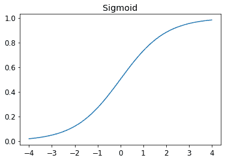

正如您所看到的，它接受任何输入值，正数或负数，并将其压缩为 0 和 1 之间的输出值。它还是一个只上升的平滑曲线，这使得 SGD 更容易找到有意义的梯度。

让我们更新`mnist_loss`，首先对输入应用`sigmoid`：

```py
def mnist_loss(predictions, targets):
    predictions = predictions.sigmoid()
    return torch.where(targets==1, 1-predictions, predictions).mean()
```

现在我们可以确信我们的损失函数将起作用，即使预测不在 0 和 1 之间。唯一需要的是更高的预测对应更高的置信度。

定义了一个损失函数，现在是一个好时机回顾为什么这样做。毕竟，我们已经有了一个度量标准，即整体准确率。那么为什么我们定义了一个损失？

关键区别在于指标用于驱动人类理解，而损失用于驱动自动学习。为了驱动自动学习，损失必须是一个具有有意义导数的函数。它不能有大的平坦部分和大的跳跃，而必须是相当平滑的。这就是为什么我们设计了一个损失函数，可以对置信水平的小变化做出响应。这个要求意味着有时它实际上并不完全反映我们试图实现的目标，而是我们真正目标和一个可以使用其梯度进行优化的函数之间的妥协。损失函数是针对数据集中的每个项目计算的，然后在时代结束时，所有损失值都被平均，整体均值被报告为时代。

另一方面，指标是我们关心的数字。这些是在每个时代结束时打印的值，告诉我们我们的模型表现如何。重要的是，我们学会关注这些指标，而不是损失，来评估模型的性能。

## SGD 和小批次

现在我们有了一个适合驱动 SGD 的损失函数，我们可以考虑学习过程的下一阶段涉及的一些细节，即根据梯度改变或更新权重。这被称为*优化步骤*。

要进行优化步骤，我们需要计算一个或多个数据项的损失。我们应该使用多少？我们可以为整个数据集计算并取平均值，或者可以为单个数据项计算。但这两种方法都不理想。为整个数据集计算将需要很长时间。为单个数据项计算将不会使用太多信息，因此会导致不精确和不稳定的梯度。您将费力更新权重，但只考虑这将如何改善模型在该单个数据项上的性能。

因此，我们做出妥协：我们一次计算几个数据项的平均损失。这被称为*小批次*。小批次中的数据项数量称为*批次大小*。较大的批次大小意味着您将从损失函数中获得更准确和稳定的数据集梯度估计，但这将需要更长时间，并且您将在每个时代处理较少的小批次。选择一个好的批次大小是您作为深度学习从业者需要做出的决定之一，以便快速准确地训练您的模型。我们将在本书中讨论如何做出这个选择。

使用小批次而不是在单个数据项上计算梯度的另一个很好的理由是，实际上，我们几乎总是在加速器上进行训练，例如 GPU。这些加速器只有在一次有很多工作要做时才能表现良好，因此如果我们可以给它们很多数据项来处理，这将是有帮助的。使用小批次是实现这一目标的最佳方法之一。但是，如果您一次给它们太多数据来处理，它们会耗尽内存——让 GPU 保持愉快也是棘手的！

正如您在第二章中关于数据增强的讨论中所看到的，如果我们在训练过程中可以改变一些东西，我们会获得更好的泛化能力。我们可以改变的一个简单而有效的事情是将哪些数据项放入每个小批次。我们通常不是简单地按顺序枚举我们的数据集，而是在每个时代之前随机洗牌，然后创建小批次。PyTorch 和 fastai 提供了一个类，可以为您执行洗牌和小批次整理，称为`DataLoader`。

`DataLoader`可以将任何 Python 集合转换为一个迭代器，用于生成多个批次，就像这样：

```py
coll = range(15)
dl = DataLoader(coll, batch_size=5, shuffle=True)
list(dl)
```

```py
[tensor([ 3, 12,  8, 10,  2]),
 tensor([ 9,  4,  7, 14,  5]),
 tensor([ 1, 13,  0,  6, 11])]
```

对于训练模型，我们不只是想要任何 Python 集合，而是一个包含独立和相关变量（模型的输入和目标）的集合。包含独立和相关变量元组的集合在 PyTorch 中被称为`Dataset`。这是一个极其简单的`Dataset`的示例：

```py
ds = L(enumerate(string.ascii_lowercase))
ds
```

```py
(#26) [(0, 'a'),(1, 'b'),(2, 'c'),(3, 'd'),(4, 'e'),(5, 'f'),(6, 'g'),(7,
 > 'h'),(8, 'i'),(9, 'j')...]
```

当我们将`Dataset`传递给`DataLoader`时，我们将得到许多批次，它们本身是表示独立和相关变量批次的张量元组：

```py
dl = DataLoader(ds, batch_size=6, shuffle=True)
list(dl)
```

```py
[(tensor([17, 18, 10, 22,  8, 14]), ('r', 's', 'k', 'w', 'i', 'o')),
 (tensor([20, 15,  9, 13, 21, 12]), ('u', 'p', 'j', 'n', 'v', 'm')),
 (tensor([ 7, 25,  6,  5, 11, 23]), ('h', 'z', 'g', 'f', 'l', 'x')),
 (tensor([ 1,  3,  0, 24, 19, 16]), ('b', 'd', 'a', 'y', 't', 'q')),
 (tensor([2, 4]), ('c', 'e'))]
```

我们现在准备为使用 SGD 的模型编写我们的第一个训练循环！

# 把所有东西放在一起

是时候实现我们在图 4-1 中看到的过程了。在代码中，我们的过程将为每个时期实现类似于这样的东西：

```py
for x,y in dl:
    pred = model(x)
    loss = loss_func(pred, y)
    loss.backward()
    parameters -= parameters.grad * lr
```

首先，让我们重新初始化我们的参数：

```py
weights = init_params((28*28,1))
bias = init_params(1)
```

`DataLoader`可以从`Dataset`创建：

```py
dl = DataLoader(dset, batch_size=256)
xb,yb = first(dl)
xb.shape,yb.shape
```

```py
(torch.Size([256, 784]), torch.Size([256, 1]))
```

我们将对验证集执行相同的操作：

```py
valid_dl = DataLoader(valid_dset, batch_size=256)
```

让我们创建一个大小为 4 的小批量进行测试：

```py
batch = train_x[:4]
batch.shape
```

```py
torch.Size([4, 784])
```

```py
preds = linear1(batch)
preds
```

```py
tensor([[-11.1002],
        [  5.9263],
        [  9.9627],
        [ -8.1484]], grad_fn=<AddBackward0>)
```

```py
loss = mnist_loss(preds, train_y[:4])
loss
```

```py
tensor(0.5006, grad_fn=<MeanBackward0>)
```

现在我们可以计算梯度了：

```py
loss.backward()
weights.grad.shape,weights.grad.mean(),bias.grad
```

```py
(torch.Size([784, 1]), tensor(-0.0001), tensor([-0.0008]))
```

让我们把所有这些放在一个函数中：

```py
def calc_grad(xb, yb, model):
    preds = model(xb)
    loss = mnist_loss(preds, yb)
    loss.backward()
```

并测试它：

```py
calc_grad(batch, train_y[:4], linear1)
weights.grad.mean(),bias.grad
```

```py
(tensor(-0.0002), tensor([-0.0015]))
```

但是看看如果我们调用两次会发生什么：

```py
calc_grad(batch, train_y[:4], linear1)
weights.grad.mean(),bias.grad
```

```py
(tensor(-0.0003), tensor([-0.0023]))
```

梯度已经改变了！这是因为`loss.backward` *添加*了`loss`的梯度到当前存储的任何梯度中。因此，我们首先必须将当前梯度设置为 0：

```py
weights.grad.zero_()
bias.grad.zero_();
```

# 原地操作

PyTorch 中以下划线结尾的方法会*原地*修改它们的对象。例如，`bias.zero_`会将张量`bias`的所有元素设置为 0。

我们唯一剩下的步骤是根据梯度和学习率更新权重和偏差。当我们这样做时，我们必须告诉 PyTorch 不要对这一步骤进行梯度计算，否则当我们尝试在下一个批次计算导数时会变得混乱！如果我们将张量的`data`属性赋值，PyTorch 将不会对该步骤进行梯度计算。这是我们用于一个时期的基本训练循环：

```py
def train_epoch(model, lr, params):
    for xb,yb in dl:
        calc_grad(xb, yb, model)
        for p in params:
            p.data -= p.grad*lr
            p.grad.zero_()
```

我们还想通过查看验证集的准确性来检查我们的表现。要决定输出是否代表 3 或 7，我们只需检查它是否大于 0。因此，我们可以计算每个项目的准确性（使用广播，所以没有循环！）如下：

```py
(preds>0.0).float() == train_y[:4]
```

```py
tensor([[False],
        [ True],
        [ True],
        [False]])
```

这给了我们计算验证准确性的这个函数：

```py
def batch_accuracy(xb, yb):
    preds = xb.sigmoid()
    correct = (preds>0.5) == yb
    return correct.float().mean()
```

我们可以检查它是否有效：

```py
batch_accuracy(linear1(batch), train_y[:4])
```

```py
tensor(0.5000)
```

然后把批次放在一起：

```py
def validate_epoch(model):
    accs = [batch_accuracy(model(xb), yb) for xb,yb in valid_dl]
    return round(torch.stack(accs).mean().item(), 4)
```

```py
validate_epoch(linear1)
```

```py
0.5219
```

这是我们的起点。让我们训练一个时期，看看准确性是否提高：

```py
lr = 1.
params = weights,bias
train_epoch(linear1, lr, params)
validate_epoch(linear1)
```

```py
0.6883
```

然后再做几次：

```py
for i in range(20):
    train_epoch(linear1, lr, params)
    print(validate_epoch(linear1), end=' ')
```

```py
0.8314 0.9017 0.9227 0.9349 0.9438 0.9501 0.9535 0.9564 0.9594 0.9618 0.9613
 > 0.9638 0.9643 0.9652 0.9662 0.9677 0.9687 0.9691 0.9691 0.9696
```

看起来不错！我们的准确性已经接近“像素相似性”方法的准确性，我们已经创建了一个通用的基础可以构建。我们的下一步将是创建一个将处理 SGD 步骤的对象。在 PyTorch 中，它被称为*优化器*。

## 创建一个优化器

因为这是一个如此通用的基础，PyTorch 提供了一些有用的类来使实现更容易。我们可以做的第一件事是用 PyTorch 的`nn.Linear`模块替换我们的`linear`函数。*模块*是从 PyTorch `nn.Module`类继承的类的对象。这个类的对象的行为与标准 Python 函数完全相同，您可以使用括号调用它们，它们将返回模型的激活。

`nn.Linear`做的事情与我们的`init_params`和`linear`一样。它包含了*权重*和*偏差*在一个单独的类中。这是我们如何复制上一节中的模型：

```py
linear_model = nn.Linear(28*28,1)
```

每个 PyTorch 模块都知道它有哪些可以训练的参数；它们可以通过`parameters`方法获得：

```py
w,b = linear_model.parameters()
w.shape,b.shape
```

```py
(torch.Size([1, 784]), torch.Size([1]))
```

我们可以使用这些信息创建一个优化器：

```py
class BasicOptim:
    def __init__(self,params,lr): self.params,self.lr = list(params),lr

    def step(self, *args, **kwargs):
        for p in self.params: p.data -= p.grad.data * self.lr

    def zero_grad(self, *args, **kwargs):
        for p in self.params: p.grad = None
```

我们可以通过传入模型的参数来创建优化器：

```py
opt = BasicOptim(linear_model.parameters(), lr)
```

我们的训练循环现在可以简化：

```py
def train_epoch(model):
    for xb,yb in dl:
        calc_grad(xb, yb, model)
        opt.step()
        opt.zero_grad()
```

我们的验证函数不需要任何更改：

```py
validate_epoch(linear_model)
```

```py
0.4157
```

让我们把我们的小训练循环放在一个函数中，让事情变得更简单：

```py
def train_model(model, epochs):
    for i in range(epochs):
        train_epoch(model)
        print(validate_epoch(model), end=' ')
```

结果与上一节相同：

```py
train_model(linear_model, 20)
```

```py
0.4932 0.8618 0.8203 0.9102 0.9331 0.9468 0.9555 0.9629 0.9658 0.9673 0.9687
 > 0.9707 0.9726 0.9751 0.9761 0.9761 0.9775 0.978 0.9785 0.9785
```

fastai 提供了`SGD`类，默认情况下与我们的`BasicOptim`做相同的事情：

```py
linear_model = nn.Linear(28*28,1)
opt = SGD(linear_model.parameters(), lr)
train_model(linear_model, 20)
```

```py
0.4932 0.852 0.8335 0.9116 0.9326 0.9473 0.9555 0.9624 0.9648 0.9668 0.9692
 > 0.9712 0.9731 0.9746 0.9761 0.9765 0.9775 0.978 0.9785 0.9785
```

fastai 还提供了`Learner.fit`，我们可以使用它来代替`train_model`。要创建一个`Learner`，我们首先需要创建一个`DataLoaders`，通过传入我们的训练和验证`DataLoader`：

```py
dls = DataLoaders(dl, valid_dl)
```

要创建一个`Learner`而不使用应用程序（如`cnn_learner`），我们需要传入本章中创建的所有元素：`DataLoaders`，模型，优化函数（将传递参数），损失函数，以及可选的任何要打印的指标：

```py
learn = Learner(dls, nn.Linear(28*28,1), opt_func=SGD,
                loss_func=mnist_loss, metrics=batch_accuracy)
```

现在我们可以调用`fit`：

```py
learn.fit(10, lr=lr)
```

| epoch | train_loss | valid_loss | batch_accuracy | time |
| --- | --- | --- | --- | --- |
| 0 | 0.636857 | 0.503549 | 0.495584 | 00:00 |
| 1 | 0.545725 | 0.170281 | 0.866045 | 00:00 |
| 2 | 0.199223 | 0.184893 | 0.831207 | 00:00 |
| 3 | 0.086580 | 0.107836 | 0.911187 | 00:00 |
| 4 | 0.045185 | 0.078481 | 0.932777 | 00:00 |
| 5 | 0.029108 | 0.062792 | 0.946516 | 00:00 |
| 6 | 0.022560 | 0.053017 | 0.955348 | 00:00 |
| 7 | 0.019687 | 0.046500 | 0.962218 | 00:00 |
| 8 | 0.018252 | 0.041929 | 0.965162 | 00:00 |
| 9 | 0.017402 | 0.038573 | 0.967615 | 00:00 |

正如您所看到的，PyTorch 和 fastai 类并没有什么神奇之处。它们只是方便的预打包部件，使您的生活变得更轻松！（它们还提供了许多我们将在未来章节中使用的额外功能。）

有了这些类，我们现在可以用神经网络替换我们的线性模型。

# 添加非线性

到目前为止，我们已经有了一个优化函数的一般过程，并且我们已经在一个无聊的函数上尝试了它：一个简单的线性分类器。线性分类器在能做什么方面受到限制。为了使其更复杂一些（并且能够处理更多任务），我们需要在两个线性分类器之间添加一些非线性（即与 ax+b 不同的东西）——这就是给我们神经网络的东西。

这是一个基本神经网络的完整定义：

```py
def simple_net(xb):
    res = xb@w1 + b1
    res = res.max(tensor(0.0))
    res = res@w2 + b2
    return res
```

就是这样！在`simple_net`中，我们只有两个线性分类器，它们之间有一个`max`函数。

在这里，`w1`和`w2`是权重张量，`b1`和`b2`是偏置张量；也就是说，这些参数最初是随机初始化的，就像我们在上一节中所做的一样：

```py
w1 = init_params((28*28,30))
b1 = init_params(30)
w2 = init_params((30,1))
b2 = init_params(1)
```

关键点是`w1`有 30 个输出激活（这意味着`w2`必须有 30 个输入激活，以便匹配）。这意味着第一层可以构建 30 个不同的特征，每个特征代表不同的像素混合。您可以将`30`更改为任何您喜欢的数字，以使模型更复杂或更简单。

那个小函数`res.max(tensor(0.0))`被称为*修正线性单元*，也被称为*ReLU*。我们认为我们都可以同意*修正线性单元*听起来相当花哨和复杂...但实际上，它不过是`res.max(tensor(0.0))`——换句话说，用零替换每个负数。这个微小的函数在 PyTorch 中也可以作为`F.relu`使用：

```py
plot_function(F.relu)
```

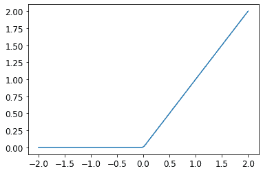

# Jeremy 说

深度学习中有大量行话，包括*修正线性单元*等术语。绝大多数这些行话并不比我们在这个例子中看到的一行代码更复杂。事实是，学术界为了发表论文，他们需要让论文听起来尽可能令人印象深刻和复杂。他们通过引入行话来实现这一点。不幸的是，这导致该领域变得比应该更加令人生畏和难以进入。您确实需要学习这些行话，因为否则论文和教程对您来说将毫无意义。但这并不意味着您必须觉得这些行话令人生畏。只需记住，当您遇到以前未见过的单词或短语时，它几乎肯定是指一个非常简单的概念。

基本思想是通过使用更多的线性层，我们的模型可以进行更多的计算，从而模拟更复杂的函数。但是，直接将一个线性布局放在另一个线性布局之后是没有意义的，因为当我们将事物相乘然后多次相加时，可以用不同的事物相乘然后只相加一次来替代！也就是说，一系列任意数量的线性层可以被替换为具有不同参数集的单个线性层。

但是，如果我们在它们之间放置一个非线性函数，比如`max`，这就不再成立了。现在每个线性层都有点解耦，可以做自己有用的工作。`max`函数特别有趣，因为它作为一个简单的`if`语句运行。

# Sylvain 说

数学上，我们说两个线性函数的组合是另一个线性函数。因此，我们可以堆叠任意多个线性分类器在一起，而它们之间没有非线性函数，这将与一个线性分类器相同。

令人惊讶的是，可以数学证明这个小函数可以解决任何可计算问题，只要你能找到`w1`和`w2`的正确参数，并且使这些矩阵足够大。对于任何任意波动的函数，我们可以将其近似为一堆连接在一起的线条；为了使其更接近波动函数，我们只需使用更短的线条。这被称为*通用逼近定理*。我们这里的三行代码被称为*层*。第一和第三行被称为*线性层*，第二行代码被称为*非线性*或*激活函数*。

就像在前一节中一样，我们可以利用 PyTorch 简化这段代码：

```py
simple_net = nn.Sequential(
    nn.Linear(28*28,30),
    nn.ReLU(),
    nn.Linear(30,1)
)
```

`nn.Sequential`创建一个模块，依次调用列出的每个层或函数。

`nn.ReLU`是一个 PyTorch 模块，与`F.relu`函数完全相同。大多数可以出现在模型中的函数也有相同的模块形式。通常，只需将`F`替换为`nn`并更改大小写。在使用`nn.Sequential`时，PyTorch 要求我们使用模块版本。由于模块是类，我们必须实例化它们，这就是为什么在这个例子中看到`nn.ReLU`。

因为`nn.Sequential`是一个模块，我们可以获取它的参数，它将返回它包含的所有模块的所有参数的列表。让我们试一试！由于这是一个更深层的模型，我们将使用更低的学习率和更多的周期：

```py
learn = Learner(dls, simple_net, opt_func=SGD,
                loss_func=mnist_loss, metrics=batch_accuracy)
```

```py
learn.fit(40, 0.1)
```

我们这里不展示 40 行输出，以节省空间；训练过程记录在`learn.recorder`中，输出表存储在`values`属性中，因此我们可以绘制训练过程中的准确性：

```py
plt.plot(L(learn.recorder.values).itemgot(2));
```

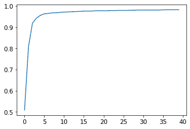

我们可以查看最终的准确性：

```py
learn.recorder.values[-1][2]
```

```py
0.982826292514801
```

在这一点上，我们有一些非常神奇的东西：

+   给定正确的参数集，可以解决任何问题到任何精度的函数（神经网络）

+   找到任何函数的最佳参数集的方法（随机梯度下降）

这就是为什么深度学习可以做出如此奇妙的事情。相信这些简单技术的组合确实可以解决任何问题是我们发现许多学生必须迈出的最大步骤之一。这似乎太好了，以至于难以置信——事情肯定应该比这更困难和复杂吧？我们的建议是：试一试！我们刚刚在 MNIST 数据集上尝试了一下，你已经看到了结果。由于我们自己从头开始做所有事情（除了计算梯度），所以你知道背后没有隐藏任何特殊的魔法。

## 更深入地探讨

我们不必止步于只有两个线性层。我们可以添加任意数量的线性层，只要在每对线性层之间添加一个非线性。然而，正如您将了解的那样，模型变得越深，实际中优化参数就越困难。在本书的后面，您将学习一些简单但非常有效的训练更深层模型的技巧。

我们已经知道，一个带有两个线性层的单个非线性足以逼近任何函数。那么为什么要使用更深的模型呢？原因是性能。通过更深的模型（具有更多层），我们不需要使用太多参数；事实证明，我们可以使用更小的矩阵，更多的层，获得比使用更大的矩阵和少量层获得更好的结果。

这意味着我们可以更快地训练模型，并且它将占用更少的内存。在 1990 年代，研究人员如此专注于通用逼近定理，以至于很少有人尝试超过一个非线性。这种理论但不实际的基础阻碍了该领域多年。然而，一些研究人员确实尝试了深度模型，并最终能够证明这些模型在实践中表现得更好。最终，出现了理论结果，解释了为什么会发生这种情况。今天，几乎不可能找到任何人只使用一个非线性的神经网络。

当我们使用与我们在第一章中看到的相同方法训练一个 18 层模型时会发生什么：

```py
dls = ImageDataLoaders.from_folder(path)
learn = cnn_learner(dls, resnet18, pretrained=False,
                    loss_func=F.cross_entropy, metrics=accuracy)
learn.fit_one_cycle(1, 0.1)
```

| 时代 | 训练损失 | 验证损失 | 准确性 | 时间 |
| --- | --- | --- | --- | --- |
| 0 | 0.082089 | 0.009578 | 0.997056 | 00:11 |

近乎 100%的准确性！这与我们简单的神经网络相比有很大的差异。但是在本书的剩余部分中，您将学习到一些小技巧，可以让您自己从头开始获得如此出色的结果。您已经了解了关键的基础知识。 （当然，即使您知道所有技巧，您几乎总是希望使用 PyTorch 和 fastai 提供的预构建类，因为它们可以帮助您省去自己考虑所有细节的麻烦。）

# 术语回顾

恭喜：您现在知道如何从头开始创建和训练深度神经网络了！我们经历了很多步骤才达到这一点，但您可能会惊讶于它实际上是多么简单。

既然我们已经到了这一点，现在是一个很好的机会来定义和回顾一些术语和关键概念。

神经网络包含很多数字，但它们只有两种类型：计算的数字和这些数字计算出的参数。这给我们学习最重要的两个术语：

激活

计算的数字（线性和非线性层）

参数

随机初始化并优化的数字（即定义模型的数字）

在本书中，我们经常谈论激活和参数。请记住它们具有特定的含义。它们是数字。它们不是抽象概念，而是实际存在于您的模型中的具体数字。成为一名优秀的深度学习从业者的一部分是习惯于查看您的激活和参数，并绘制它们以及测试它们是否正确运行的想法。

我们的激活和参数都包含在 *张量* 中。这些只是正规形状的数组—例如，一个矩阵。矩阵有行和列；我们称这些为 *轴* 或 *维度*。张量的维度数是它的 *等级*。有一些特殊的张量：

+   等级-0：标量

+   等级-1：向量

+   等级-2：矩阵

神经网络包含多个层。每一层都是*线性*或*非线性*的。我们通常在神经网络中交替使用这两种类型的层。有时人们将线性层及其后续的非线性一起称为一个单独的层。是的，这很令人困惑。有时非线性被称为*激活函数*。

表 4-1 总结了与 SGD 相关的关键概念。

表 4-1\. 深度学习词汇表

| 术语 | 意义 |
| --- | --- |
| ReLU | 对负数返回 0 且不改变正数的函数。 |
| 小批量 | 一小组输入和标签，聚集在两个数组中。在这个批次上更新梯度下降步骤（而不是整个 epoch）。 |
| 前向传播 | 将模型应用于某些输入并计算预测。 |
| 损失 | 代表我们的模型表现如何（好或坏）的值。 |
| 梯度 | 损失相对于模型某个参数的导数。 |
| 反向传播 | 计算损失相对于所有模型参数的梯度。 |
| 梯度下降 | 沿着梯度相反方向迈出一步，使模型参数稍微变得更好。 |
| 学习率 | 当应用 SGD 更新模型参数时我们所采取的步骤的大小。 |

# *选择你的冒险* 提醒

在你兴奋地想要窥探内部机制时，你选择跳过第 2 和第三章节了吗？好吧，这里提醒你现在回到第二章，因为你很快就会需要了解那些内容！

# 问卷调查

1.  灰度图像在计算机上是如何表示的？彩色图像呢？

1.  `MNIST_SAMPLE`数据集中的文件和文件夹是如何结构化的？为什么？

1.  解释“像素相似性”方法如何工作以对数字进行分类。

1.  什么是列表推导？现在创建一个从列表中选择奇数并将其加倍的列表推导。

1.  什么是秩-3 张量？

1.  张量秩和形状之间有什么区别？如何从形状中获取秩？

1.  RMSE 和 L1 范数是什么？

1.  如何才能比 Python 循环快几千倍地一次性对数千个数字进行计算？

1.  创建一个包含从 1 到 9 的数字的 3×3 张量或数组。将其加倍。选择右下角的四个数字。

1.  广播是什么？

1.  度量通常是使用训练集还是验证集计算的？为什么？

1.  SGD 是什么？

1.  为什么 SGD 使用小批量？

1.  SGD 在机器学习中有哪七个步骤？

1.  我们如何初始化模型中的权重？

1.  什么是损失？

1.  为什么我们不能总是使用高学习率？

1.  什么是梯度？

1.  你需要知道如何自己计算梯度吗？

1.  为什么我们不能将准确率作为损失函数使用？

1.  绘制 Sigmoid 函数。它的形状有什么特别之处？

1.  损失函数和度量之间有什么区别？

1.  使用学习率计算新权重的函数是什么？

1.  `DataLoader`类是做什么的？

1.  编写伪代码，显示每个 epoch 中 SGD 所采取的基本步骤。

1.  创建一个函数，如果传递两个参数`[1,2,3,4]`和`'abcd'`，则返回`[(1, 'a'), (2, 'b'), (3, 'c'), (4, 'd')]`。该输出数据结构有什么特别之处？

1.  PyTorch 中的`view`是做什么的？

1.  神经网络中的偏差参数是什么？我们为什么需要它们？

1.  Python 中的`@`运算符是做什么的？

1.  `backward`方法是做什么的？

1.  为什么我们必须将梯度清零？

1.  我们需要向`Learner`传递什么信息？

1.  展示训练循环的基本步骤的 Python 或伪代码。

1.  ReLU 是什么？为值从`-2`到`+2`绘制一个图。

1.  什么是激活函数？

1.  `F.relu`和`nn.ReLU`之间有什么区别？

1.  通用逼近定理表明，任何函数都可以使用一个非线性逼近得到所需的精度。那么为什么我们通常使用更多的非线性函数？

## 进一步研究

1.  从头开始创建自己的`Learner`实现，基于本章展示的训练循环。

1.  使用完整的 MNIST 数据集完成本章的所有步骤（不仅仅是 3 和 7）。这是一个重要的项目，需要花费相当多的时间来完成！您需要进行一些研究，以找出如何克服在途中遇到的障碍。
