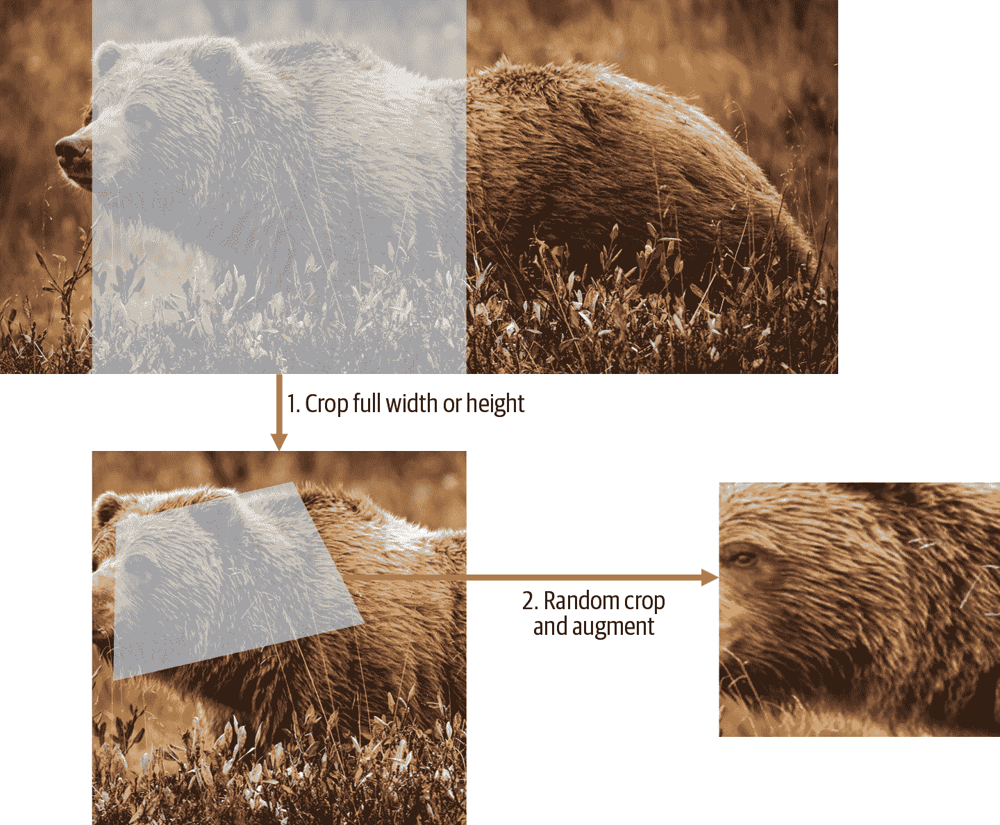
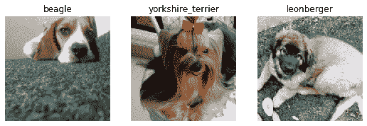
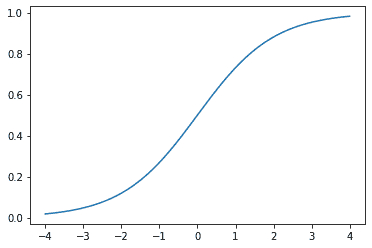
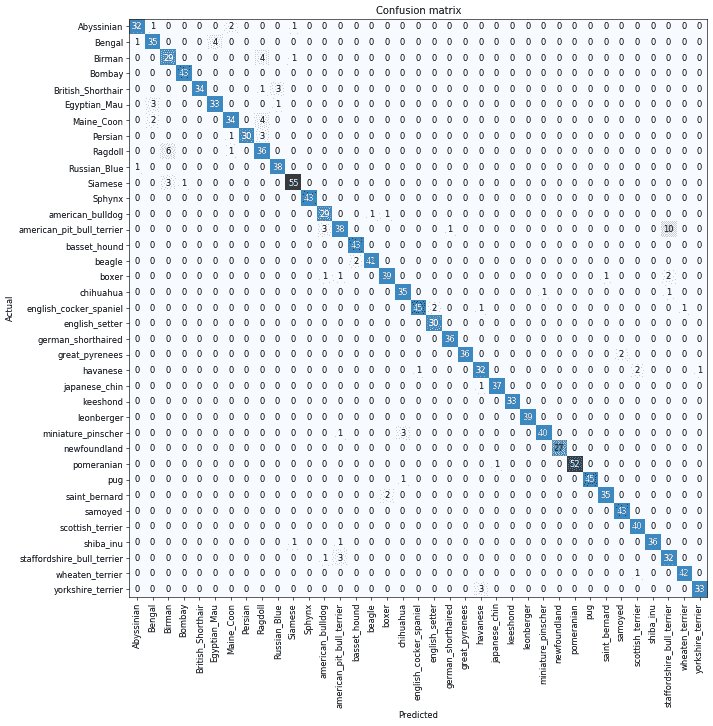
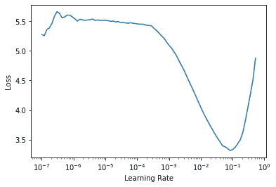
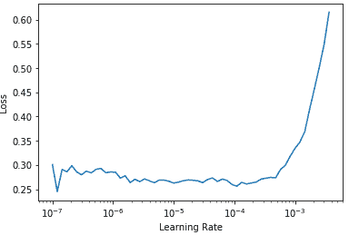
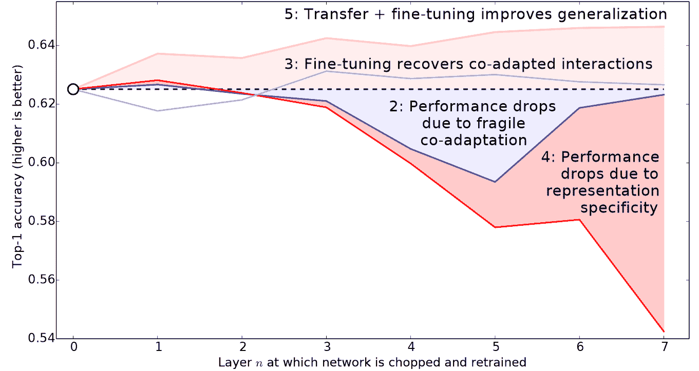
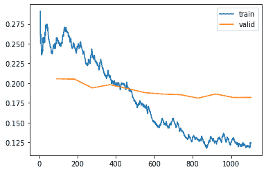

# 第五章：图像分类


现在您了解了深度学习是什么、它的用途以及如何创建和部署模型，现在是时候深入了！在理想的世界中，深度学习从业者不必了解每个细节是如何在底层工作的。但事实上，我们还没有生活在理想的世界中。事实是，要使您的模型真正起作用并可靠地工作，您必须正确处理很多细节，并检查很多细节。这个过程需要能够在训练神经网络时查看内部情况，找到可能的问题，并知道如何解决它们。

因此，从本书开始，我们将深入研究深度学习的机制。计算机视觉模型的架构是什么，自然语言处理模型的架构是什么，表格模型的架构是什么等等？如何创建一个与您特定领域需求匹配的架构？如何从训练过程中获得最佳结果？如何加快速度？随着数据集的变化，您必须做出哪些改变？

我们将从重复第一章中查看的相同基本应用程序开始，但我们将做两件事：

+   让它们变得更好。

+   将它们应用于更多类型的数据。

为了做这两件事，我们将不得不学习深度学习难题的所有部分。这包括不同类型的层、正则化方法、优化器、如何将层组合成架构、标记技术等等。但我们不会一次性把所有这些东西都扔给你；我们将根据需要逐步引入它们，以解决与我们正在处理的项目相关的实际问题。

# 从狗和猫到宠物品种

在我们的第一个模型中，我们学会了如何区分狗和猫。就在几年前，这被认为是一个非常具有挑战性的任务——但今天，这太容易了！我们将无法向您展示训练模型时的细微差别，因为我们在不担心任何细节的情况下获得了几乎完美的结果。但事实证明，同一数据集还允许我们解决一个更具挑战性的问题：找出每张图像中显示的宠物品种是什么。

在第一章中，我们将应用程序呈现为已解决的问题。但这不是实际情况下的工作方式。我们从一个我们一无所知的数据集开始。然后我们必须弄清楚它是如何组合的，如何从中提取我们需要的数据，以及这些数据是什么样子的。在本书的其余部分，我们将向您展示如何在实践中解决这些问题，包括理解我们正在处理的数据以及在进行建模时测试的所有必要中间步骤。

我们已经下载了宠物数据集，并且可以使用与第一章相同的代码获取到该数据集的路径：

```py
from fastai2.vision.all import *
path = untar_data(URLs.PETS)
```

现在，如果我们要理解如何从每个图像中提取每只宠物的品种，我们需要了解数据是如何布局的。数据布局的细节是深度学习难题的重要组成部分。数据通常以以下两种方式之一提供：

+   表示数据项的个别文件，例如文本文档或图像，可能组织成文件夹或具有表示有关这些项信息的文件名

+   数据表（例如，以 CSV 格式）中的数据，其中每行是一个项目，可能包括文件名，提供表中数据与其他格式（如文本文档和图像）中数据之间的连接

有一些例外情况——特别是在基因组学等领域，可能存在二进制数据库格式或甚至网络流——但总体而言，您将处理的绝大多数数据集将使用这两种格式的某种组合。

要查看数据集中的内容，我们可以使用`ls`方法：

```py
path.ls()
```

```py
(#3) [Path('annotations'),Path('images'),Path('models')]
```

我们可以看到这个数据集为我们提供了*images*和*annotations*目录。数据集的[网站](https://oreil.ly/xveoN)告诉我们*annotations*目录包含有关宠物所在位置而不是它们是什么的信息。在本章中，我们将进行分类，而不是定位，也就是说我们关心的是宠物是什么，而不是它们在哪里。因此，我们暂时会忽略*annotations*目录。那么，让我们来看看*images*目录里面的内容：

```py
(path/"images").ls()
```

```py
(#7394) [Path('images/great_pyrenees_173.jpg'),Path('images/wheaten_terrier_46.j
 > pg'),Path('images/Ragdoll_262.jpg'),Path('images/german_shorthaired_3.jpg'),P
 > ath('images/american_bulldog_196.jpg'),Path('images/boxer_188.jpg'),Path('ima
 > ges/staffordshire_bull_terrier_173.jpg'),Path('images/basset_hound_71.jpg'),P
 > ath('images/staffordshire_bull_terrier_37.jpg'),Path('images/yorkshire_terrie
 > r_18.jpg')...]
```

在 fastai 中，大多数返回集合的函数和方法使用一个名为`L`的类。这个类可以被认为是普通 Python `list`类型的增强版本，具有用于常见操作的附加便利。例如，当我们在笔记本中显示这个类的对象时，它会以这里显示的格式显示。首先显示的是集合中的项目数，前面带有`#`。在前面的输出中，你还会看到列表后面有省略号。这意味着只显示了前几个项目，这是件好事，因为我们不希望屏幕上出现超过 7000 个文件名！

通过检查这些文件名，我们可以看到它们似乎是如何结构化的。每个文件名包含宠物品种，然后是一个下划线（`_`），一个数字，最后是文件扩展名。我们需要创建一段代码，从单个`Path`中提取品种。Jupyter 笔记本使这变得容易，因为我们可以逐渐构建出可用的东西，然后用于整个数据集。在这一点上，我们必须小心不要做太多假设。例如，如果你仔细观察，你可能会注意到一些宠物品种包含多个单词，因此我们不能简单地在找到的第一个`_`字符处中断。为了让我们能够测试我们的代码，让我们挑选出一个这样的文件名：

```py
fname = (path/"images").ls()[0]
```

从这样的字符串中提取信息的最强大和灵活的方法是使用*regular expression*，也称为*regex*。正则表达式是一种特殊的字符串，用正则表达式语言编写，它指定了一个一般规则，用于决定另一个字符串是否通过测试（即“匹配”正则表达式），并且可能用于从另一个字符串中提取特定部分。在这种情况下，我们需要一个正则表达式从文件名中提取宠物品种。

我们没有空间在这里为您提供完整的正则表达式教程，但有许多优秀的在线教程，我们知道你们中的许多人已经熟悉这个神奇的工具。如果你不熟悉，那完全没问题——这是一个让你纠正的绝佳机会！我们发现正则表达式是我们编程工具包中最有用的工具之一，我们的许多学生告诉我们，这是他们最兴奋学习的事情之一。所以赶紧去谷歌搜索“正则表达式教程”吧，然后在你看得很开心之后回到这里。[书籍网站](https://book.fast.ai)也提供了我们喜欢的教程列表。

# 亚历克西斯说

正则表达式不仅非常方便，而且还有有趣的起源。它们之所以被称为“regular”，是因为它们最初是“regular”语言的示例，这是乔姆斯基层次结构中最低的一级。这是语言学家诺姆·乔姆斯基开发的一种语法分类，他还写了《句法结构》，这是一项寻找人类语言基础形式语法的开创性工作。这是计算的魅力之一：你每天使用的工具可能实际上来自太空船。

当你编写正则表达式时，最好的方法是首先针对一个示例尝试。让我们使用`findall`方法来对`fname`对象的文件名尝试一个正则表达式：

```py
re.findall(r'(.+)_\d+.jpg$', fname.name)
```

```py
['great_pyrenees']
```

这个正则表达式提取出所有字符，直到最后一个下划线字符，只要后续字符是数字，然后是 JPEG 文件扩展名。

现在我们确认了正则表达式对示例的有效性，让我们用它来标记整个数据集。fastai 提供了许多类来帮助标记。对于使用正则表达式进行标记，我们可以使用`RegexLabeller`类。在这个例子中，我们使用了数据块 API，我们在第二章中看到过（实际上，我们几乎总是使用数据块 API——它比我们在第一章中看到的简单工厂方法更灵活）：

```py
pets = DataBlock(blocks = (ImageBlock, CategoryBlock),
                 get_items=get_image_files,
                 splitter=RandomSplitter(seed=42),
                 get_y=using_attr(RegexLabeller(r'(.+)_\d+.jpg$'), 'name'),
                 item_tfms=Resize(460),
                 batch_tfms=aug_transforms(size=224, min_scale=0.75))
dls = pets.dataloaders(path/"images")
```

这个`DataBlock`调用中一个重要的部分是我们以前没有见过的这两行：

```py
item_tfms=Resize(460),
batch_tfms=aug_transforms(size=224, min_scale=0.75)
```

这些行实现了一个我们称之为*预调整*的 fastai 数据增强策略。预调整是一种特殊的图像增强方法，旨在最大限度地减少数据破坏，同时保持良好的性能。

# 预调整

我们需要我们的图像具有相同的尺寸，这样它们可以整合成张量传递给 GPU。我们还希望最小化我们执行的不同增强计算的数量。性能要求表明，我们应该尽可能将我们的增强变换组合成更少的变换（以减少计算数量和损失操作的数量），并将图像转换为统一尺寸（以便在 GPU 上更有效地处理）。

挑战在于，如果在调整大小到增强尺寸之后执行各种常见的数据增强变换，可能会引入虚假的空白区域，降低数据质量，或两者兼而有之。例如，将图像旋转 45 度会在新边界的角落区域填充空白，这不会教会模型任何东西。许多旋转和缩放操作将需要插值来创建像素。这些插值像素是从原始图像数据派生的，但质量较低。

为了解决这些挑战，预调整采用了图 5-1 中显示的两种策略：

1.  将图像调整为相对“大”的尺寸，即明显大于目标训练尺寸。

1.  将所有常见的增强操作（包括调整大小到最终目标大小）组合成一个，并在 GPU 上一次性执行组合操作，而不是单独执行操作并多次插值。

第一步是调整大小，创建足够大的图像，使其内部区域有多余的边距，以允许进一步的增强变换而不会产生空白区域。这个转换通过调整大小为一个正方形，使用一个大的裁剪尺寸来实现。在训练集上，裁剪区域是随机选择的，裁剪的大小被选择为覆盖图像宽度或高度中较小的那个。在第二步中，GPU 用于所有数据增强，并且所有潜在破坏性操作都一起完成，最后进行单次插值。



###### 图 5-1。训练集上的预调整

这张图片展示了两个步骤：

1.  *裁剪全宽或全高*：这在`item_tfms`中，因此它应用于每个单独的图像，然后再复制到 GPU。它用于确保所有图像具有相同的尺寸。在训练集上，裁剪区域是随机选择的。在验证集上，总是选择图像的中心正方形。

1.  *随机裁剪和增强*：这在`batch_tfms`中，因此它一次在 GPU 上应用于整个批次，这意味着速度快。在验证集上，只有调整大小到模型所需的最终大小。在训练集上，首先进行随机裁剪和任何其他增强。

要在 fastai 中实现此过程，您可以使用`Resize`作为具有大尺寸的项目转换，以及`RandomResizedCrop`作为具有较小尺寸的批处理转换。如果在`aug_transforms`函数中包含`min_scale`参数，`RandomResizedCrop`将为您添加，就像在上一节中的`DataBlock`调用中所做的那样。或者，您可以在初始`Resize`中使用`pad`或`squish`而不是`crop`（默认值）。

图 5-2 显示了一个图像经过缩放、插值、旋转，然后再次插值（这是所有其他深度学习库使用的方法），显示在右侧，以及一个图像经过缩放和旋转作为一个操作，然后插值一次（fastai 方法），显示在左侧。


###### 图 5-2。fastai 数据增强策略（左）与传统方法（右）的比较

您可以看到右侧的图像定义不够清晰，在左下角有反射填充伪影；此外，左上角的草完全消失了。我们发现，在实践中，使用预调整显著提高了模型的准确性，通常也会加快速度。

fastai 库还提供了简单的方法来检查您的数据在训练模型之前的外观，这是一个非常重要的步骤。我们将在下一步中看到这些。

## 检查和调试 DataBlock

我们永远不能假设我们的代码完美运行。编写`DataBlock`就像编写蓝图一样。如果您的代码中有语法错误，您将收到错误消息，但是您无法保证您的模板会按照您的意图在数据源上运行。因此，在训练模型之前，您应该始终检查您的数据。

您可以使用`show_batch`方法来执行此操作：

```py
dls.show_batch(nrows=1, ncols=3)
```



查看每个图像，并检查每个图像是否具有正确的宠物品种标签。通常，数据科学家使用的数据可能不如领域专家熟悉：例如，我实际上不知道这些宠物品种中的许多是什么。由于我不是宠物品种的专家，我会在这一点上使用谷歌图像搜索一些这些品种，并确保图像看起来与我在输出中看到的相似。

如果在构建`DataBlock`时出现错误，您可能在此步骤之前不会看到它。为了调试这个问题，我们鼓励您使用`summary`方法。它将尝试从您提供的源创建一个批次，并提供大量细节。此外，如果失败，您将准确地看到错误发生的位置，并且库将尝试为您提供一些帮助。例如，一个常见的错误是忘记使用`Resize`转换，因此最终得到不同大小的图片并且无法将它们整理成批次。在这种情况下，摘要将如下所示（请注意，自撰写时可能已更改确切文本，但它将给您一个概念）：

```py
pets1 = DataBlock(blocks = (ImageBlock, CategoryBlock),
                 get_items=get_image_files,
                 splitter=RandomSplitter(seed=42),
                 get_y=using_attr(RegexLabeller(r'(.+)_\d+.jpg$'), 'name'))
pets1.summary(path/"images")
```

```py
Setting-up type transforms pipelines
Collecting items from /home/sgugger/.fastai/data/oxford-iiit-pet/images
Found 7390 items
2 datasets of sizes 5912,1478
Setting up Pipeline: PILBase.create
Setting up Pipeline: partial -> Categorize

Building one sample
  Pipeline: PILBase.create
    starting from
      /home/sgugger/.fastai/data/oxford-iiit-pet/images/american_bulldog_83.jpg
    applying PILBase.create gives
      PILImage mode=RGB size=375x500
  Pipeline: partial -> Categorize
    starting from
      /home/sgugger/.fastai/data/oxford-iiit-pet/images/american_bulldog_83.jpg
    applying partial gives
      american_bulldog
    applying Categorize gives
      TensorCategory(12)

Final sample: (PILImage mode=RGB size=375x500, TensorCategory(12))

Setting up after_item: Pipeline: ToTensor
Setting up before_batch: Pipeline:
Setting up after_batch: Pipeline: IntToFloatTensor

Building one batch
Applying item_tfms to the first sample:
  Pipeline: ToTensor
    starting from
      (PILImage mode=RGB size=375x500, TensorCategory(12))
    applying ToTensor gives
      (TensorImage of size 3x500x375, TensorCategory(12))

Adding the next 3 samples

No before_batch transform to apply

Collating items in a batch
Error! It's not possible to collate your items in a batch
Could not collate the 0-th members of your tuples because got the following
shapes:
torch.Size([3, 500, 375]),torch.Size([3, 375, 500]),torch.Size([3, 333, 500]),
torch.Size([3, 375, 500])
```

您可以看到我们如何收集数据并拆分数据，如何从文件名转换为*样本*（元组（图像，类别）），然后应用了哪些项目转换以及如何在批处理中无法整理这些样本（因为形状不同）。

一旦您认为数据看起来正确，我们通常建议下一步应该使用它来训练一个简单的模型。我们经常看到人们将实际模型的训练推迟得太久。结果，他们不知道他们的基准结果是什么样的。也许您的问题不需要大量花哨的领域特定工程。或者数据似乎根本无法训练模型。这些都是您希望尽快了解的事情。

对于这个初始测试，我们将使用与第一章中使用的相同简单模型：

```py
learn = cnn_learner(dls, resnet34, metrics=error_rate)
learn.fine_tune(2)
```

| epoch | train_loss | valid_loss | error_rate | time |
| --- | --- | --- | --- | --- |
| 0 | 1.491732 | 0.337355 | 0.108254 | 00:18 |
| epoch | train_loss | valid_loss | error_rate | time |
| --- | --- | --- | --- | --- |
| 0 | 0.503154 | 0.293404 | 0.096076 | 00:23 |
| 1 | 0.314759 | 0.225316 | 0.066306 | 00:23 |

正如我们之前简要讨论过的，当我们拟合模型时显示的表格展示了每个训练周期后的结果。记住，一个周期是对数据中所有图像的完整遍历。显示的列是训练集中项目的平均损失、验证集上的损失，以及我们请求的任何指标——在这种情况下是错误率。

请记住*损失*是我们决定用来优化模型参数的任何函数。但是我们实际上并没有告诉 fastai 我们想要使用什么损失函数。那么它在做什么呢？fastai 通常会根据您使用的数据和模型类型尝试选择适当的损失函数。在这种情况下，我们有图像数据和分类结果，所以 fastai 会默认使用*交叉熵损失*。

# 交叉熵损失

*交叉熵损失*是一个类似于我们在上一章中使用的损失函数，但是（正如我们将看到的）有两个好处：

+   即使我们的因变量有两个以上的类别，它也能正常工作。

+   这将导致更快速、更可靠的训练。

要理解交叉熵损失如何处理具有两个以上类别的因变量，我们首先必须了解损失函数看到的实际数据和激活是什么样子的。

## 查看激活和标签

让我们看看我们模型的激活。要从我们的`DataLoaders`中获取一批真实数据，我们可以使用`one_batch`方法：

```py
x,y = dls.one_batch()
```

正如您所见，这返回了因变量和自变量，作为一个小批量。让我们看看我们的因变量中包含什么：

```py
y
```

```py
TensorCategory([11,  0,  0,  5, 20,  4, 22, 31, 23, 10, 20,  2,  3, 27, 18, 23,
 > 33,  5, 24,  7,  6, 12,  9, 11, 35, 14, 10, 15,  3,  3, 21,  5, 19, 14, 12,
 > 15, 27,  1, 17, 10,  7,  6, 15, 23, 36,  1, 35,  6,
         4, 29, 24, 32,  2, 14, 26, 25, 21,  0, 29, 31, 18,  7,  7, 17],
 > device='cuda:5')
```

我们的批量大小是 64，因此在这个张量中有 64 行。每行是一个介于 0 和 36 之间的整数，代表我们 37 种可能的宠物品种。我们可以通过使用`Learner.get_preds`来查看预测（我们神经网络最后一层的激活）。这个函数默认返回预测和目标，但由于我们已经有了目标，我们可以通过将其赋值给特殊变量`_`来有效地忽略它们：

```py
preds,_ = learn.get_preds(dl=[(x,y)])
preds[0]
```

```py
tensor([7.9069e-04, 6.2350e-05, 3.7607e-05, 2.9260e-06, 1.3032e-05, 2.5760e-05,
 > 6.2341e-08, 3.6400e-07, 4.1311e-06, 1.3310e-04, 2.3090e-03, 9.9281e-01,
 > 4.6494e-05, 6.4266e-07, 1.9780e-06, 5.7005e-07,
        3.3448e-06, 3.5691e-03, 3.4385e-06, 1.1578e-05, 1.5916e-06, 8.5567e-08,
 > 5.0773e-08, 2.2978e-06, 1.4150e-06, 3.5459e-07, 1.4599e-04, 5.6198e-08,
 > 3.4108e-07, 2.0813e-06, 8.0568e-07, 4.3381e-07,
        1.0069e-05, 9.1020e-07, 4.8714e-06, 1.2734e-06, 2.4735e-06])
```

实际预测是 37 个介于 0 和 1 之间的概率，总和为 1：

```py
len(preds[0]),preds[0].sum()
```

```py
(37, tensor(1.0000))
```

为了将我们模型的激活转换为这样的预测，我们使用了一个叫做*softmax*的激活函数。

## Softmax

在我们的分类模型中，我们在最后一层使用 softmax 激活函数，以确保激活值都在 0 到 1 之间，并且它们总和为 1。

Softmax 类似于我们之前看到的 sigmoid 函数。作为提醒，sigmoid 看起来像这样：

```py
plot_function(torch.sigmoid, min=-4,max=4)
```



我们可以将这个函数应用于神经网络的一个激活列，并得到一个介于 0 和 1 之间的数字列，因此对于我们的最后一层来说，这是一个非常有用的激活函数。

现在想象一下，如果我们希望目标中有更多类别（比如我们的 37 种宠物品种）。这意味着我们需要比单个列更多的激活：我们需要一个激活*每个类别*。例如，我们可以创建一个预测 3 和 7 的神经网络，返回两个激活，每个类别一个——这将是创建更一般方法的一个很好的第一步。让我们只是使用一些标准差为 2 的随机数（因此我们将`randn`乘以 2）作为示例，假设我们有六个图像和两个可能的类别（其中第一列代表 3，第二列代表 7）：

```py
acts = torch.randn((6,2))*2
acts
```

```py
tensor([[ 0.6734,  0.2576],
        [ 0.4689,  0.4607],
        [-2.2457, -0.3727],
        [ 4.4164, -1.2760],
        [ 0.9233,  0.5347],
        [ 1.0698,  1.6187]])
```

我们不能直接对这个进行 sigmoid 运算，因为我们得不到行相加为 1 的结果（我们希望 3 的概率加上 7 的概率等于 1）：

```py
acts.sigmoid()
```

```py
tensor([[0.6623, 0.5641],
        [0.6151, 0.6132],
        [0.0957, 0.4079],
        [0.9881, 0.2182],
        [0.7157, 0.6306],
        [0.7446, 0.8346]])
```

在第四章中，我们的神经网络为每个图像创建了一个单一激活，然后通过`sigmoid`函数传递。这个单一激活代表了模型对输入是 3 的置信度。二进制问题是分类问题的一种特殊情况，因为目标可以被视为单个布尔值，就像我们在`mnist_loss`中所做的那样。但是二进制问题也可以在任意数量的类别的分类器的更一般上下文中考虑：在这种情况下，我们碰巧有两个类别。正如我们在熊分类器中看到的，我们的神经网络将为每个类别返回一个激活。

那么在二进制情况下，这些激活实际上表示什么？一对激活仅仅表示输入是 3 还是 7 的*相对*置信度。总体值，无论它们是高还是低，都不重要，重要的是哪个更高，以及高多少。

我们期望，由于这只是表示相同问题的另一种方式，我们应该能够直接在我们的神经网络的两个激活版本上使用`sigmoid`。事实上我们可以！我们只需取神经网络激活之间的*差异*，因为这反映了我们对输入是 3 还是 7 更有把握的程度，然后取其 sigmoid：

```py
(acts[:,0]-acts[:,1]).sigmoid()
```

```py
tensor([0.6025, 0.5021, 0.1332, 0.9966, 0.5959, 0.3661])
```

第二列（它是 7 的概率）将是该值从 1 中减去的值。现在，我们需要一种适用于多于两列的方法。事实证明，这个名为`softmax`的函数正是这样的：

```py
def softmax(x): return exp(x) / exp(x).sum(dim=1, keepdim=True)
```

# 术语：指数函数（exp）

定义为`e**x`，其中`e`是一个特殊的数字，约等于 2.718。它是自然对数函数的倒数。请注意，`exp`始终为正，并且增长*非常*迅速！

让我们检查`softmax`是否为第一列返回与`sigmoid`相同的值，以及这些值从 1 中减去的值为第二列：

```py
sm_acts = torch.softmax(acts, dim=1)
sm_acts
```

```py
tensor([[0.6025, 0.3975],
        [0.5021, 0.4979],
        [0.1332, 0.8668],
        [0.9966, 0.0034],
        [0.5959, 0.4041],
        [0.3661, 0.6339]])
```

`softmax`是`sigmoid`的多类别等价物——每当我们有超过两个类别且类别的概率必须加起来为 1 时，我们必须使用它，即使只有两个类别，我们通常也会使用它，只是为了使事情更加一致。我们可以创建其他具有所有激活在 0 和 1 之间且总和为 1 的属性的函数；然而，没有其他函数与我们已经看到是平滑且对称的 sigmoid 函数具有相同的关系。此外，我们很快将看到 softmax 函数与我们将在下一节中看到的损失函数密切配合。

如果我们有三个输出激活，就像在我们的熊分类器中一样，为单个熊图像计算 softmax 看起来会像图 5-3 那样。


###### 图 5-3. 熊分类器上 softmax 的示例

实际上，这个函数是做什么的呢？取指数确保我们所有的数字都是正数，然后除以总和确保我们将得到一堆加起来等于 1 的数字。指数还有一个很好的特性：如果我们激活中的某个数字略大于其他数字，指数将放大这个差异（因为它呈指数增长），这意味着在 softmax 中，该数字将更接近 1。

直观地，softmax 函数*真的*想要在其他类别中选择一个类别，因此在我们知道每张图片都有一个明确标签时，训练分类器时是理想的选择。（请注意，在推断过程中可能不太理想，因为有时您可能希望模型告诉您它在训练过程中看到的类别中没有识别出任何一个，并且不选择一个类别，因为它的激活分数略高。在这种情况下，最好使用多个二进制输出列来训练模型，每个列使用 sigmoid 激活。）

Softmax 是交叉熵损失的第一部分，第二部分是对数似然。

## 对数似然

在上一章中为我们的 MNIST 示例计算损失时，我们使用了这个：

```py
def mnist_loss(inputs, targets):
    inputs = inputs.sigmoid()
    return torch.where(targets==1, 1-inputs, inputs).mean()
```

就像我们从 sigmoid 到 softmax 的转变一样，我们需要扩展损失函数，使其能够处理不仅仅是二元分类，还需要能够对任意数量的类别进行分类（在本例中，我们有 37 个类别）。我们的激活，在 softmax 之后，介于 0 和 1 之间，并且对于预测批次中的每一行，总和为 1。我们的目标是介于 0 和 36 之间的整数。

在二元情况下，我们使用`torch.where`在`inputs`和`1-inputs`之间进行选择。当我们将二元分类作为具有两个类别的一般分类问题处理时，它变得更容易，因为（正如我们在前一节中看到的）现在有两列包含等同于`inputs`和`1-inputs`的内容。因此，我们只需要从适当的列中进行选择。让我们尝试在 PyTorch 中实现这一点。对于我们合成的 3 和 7 的示例，假设这些是我们的标签：

```py
targ = tensor([0,1,0,1,1,0])
```

这些是 softmax 激活：

```py
sm_acts
```

```py
tensor([[0.6025, 0.3975],
        [0.5021, 0.4979],
        [0.1332, 0.8668],
        [0.9966, 0.0034],
        [0.5959, 0.4041],
        [0.3661, 0.6339]])
```

然后对于每个`targ`项，我们可以使用它来使用张量索引选择`sm_acts`的适当列，如下所示：

```py
idx = range(6)
sm_acts[idx, targ]
```

```py
tensor([0.6025, 0.4979, 0.1332, 0.0034, 0.4041, 0.3661])
```

为了准确了解这里发生了什么，让我们将所有列放在一起放在一个表中。这里，前两列是我们的激活，然后是目标，行索引，最后是前面代码中显示的结果：

| 3 | 7 | targ | idx | loss |
| --- | --- | --- | --- | --- |
| 0.602469 | 0.397531 | 0 | 0 | 0.602469 |
| 0.502065 | 0.497935 | 1 | 1 | 0.497935 |
| 0.133188 | 0.866811 | 0 | 2 | 0.133188 |
| 0.99664 | 0.00336017 | 1 | 3 | 0.00336017 |
| 0.595949 | 0.404051 | 1 | 4 | 0.404051 |
| 0.366118 | 0.633882 | 0 | 5 | 0.366118 |

从这个表中可以看出，最后一列可以通过将`targ`和`idx`列作为索引，指向包含`3`和`7`列的两列矩阵来计算。这就是`sm_acts[idx, targ]`的作用。

这里真正有趣的是，这种方法同样适用于超过两列的情况。想象一下，如果我们为每个数字（0 到 9）添加一个激活列，然后`targ`包含从 0 到 9 的数字。只要激活列总和为 1（如果我们使用 softmax，它们将是这样），我们将有一个损失函数，显示我们预测每个数字的准确程度。

我们只从包含正确标签的列中选择损失。我们不需要考虑其他列，因为根据 softmax 的定义，它们加起来等于 1 减去与正确标签对应的激活。因此，使正确标签的激活尽可能高必须意味着我们也在降低其余列的激活。

PyTorch 提供了一个与`sm_acts[range(n), targ]`完全相同的函数（除了它取负数，因为之后应用对数时，我们将得到负数），称为`nll_loss`（*NLL*代表*负对数似然*）：

```py
-sm_acts[idx, targ]
```

```py
tensor([-0.6025, -0.4979, -0.1332, -0.0034, -0.4041, -0.3661])
```

```py
F.nll_loss(sm_acts, targ, reduction='none')
```

```py
tensor([-0.6025, -0.4979, -0.1332, -0.0034, -0.4041, -0.3661])
```

尽管它的名字是这样的，但这个 PyTorch 函数并不取对数。我们将在下一节看到原因，但首先，让我们看看为什么取对数会有用。

## 取对数

在前一节中我们看到的函数作为损失函数效果很好，但我们可以让它更好一些。问题在于我们使用的是概率，概率不能小于 0 或大于 1。这意味着我们的模型不会在乎它是预测 0.99 还是 0.999。确实，这些数字非常接近，但从另一个角度来看，0.999 比 0.99 自信程度高 10 倍。因此，我们希望将我们的数字从 0 到 1 转换为从负无穷到无穷。有一个数学函数可以做到这一点：*对数*（可用`torch.log`）。它对小于 0 的数字没有定义，并且如下所示：

```py
plot_function(torch.log, min=0,max=4)
```


“对数”这个词让你想起了什么吗？对数函数有这个恒等式：

```py
y = b**a
a = log(y,b)
```

在这种情况下，我们假设`log(y,b)`返回*log y 以 b 为底*。然而，PyTorch 并没有这样定义`log`：Python 中的`log`使用特殊数字`e`（2.718…）作为底。

也许对数是您在过去 20 年中没有考虑过的东西。但对于深度学习中的许多事情来说，对数是一个非常关键的数学概念，所以现在是一个很好的时机来刷新您的记忆。关于对数的关键事情是这样的关系：

```py
log(a*b) = log(a)+log(b)
```

当我们以这种格式看到它时，它看起来有点无聊；但想想这实际上意味着什么。这意味着当基础信号呈指数或乘法增长时，对数会线性增加。例如，在地震严重程度的里氏震级和噪音级别的分贝尺中使用。它也经常用于金融图表中，我们希望更清楚地显示复合增长率。计算机科学家喜欢使用对数，因为这意味着可以用加法代替修改，这样可以避免产生计算机难以处理的难以处理的规模。

# Sylvain 说

不仅是计算机科学家喜欢对数！在计算机出现之前，工程师和科学家使用一种称为*滑尺*的特殊尺子，通过添加对数来进行乘法运算。对数在物理学中被广泛用于乘法非常大或非常小的数字，以及许多其他领域。

对我们的概率取正对数或负对数的平均值（取决于是否是正确或不正确的类）给出了*负对数似然*损失。在 PyTorch 中，`nll_loss`假设您已经对 softmax 取了对数，因此不会为您执行对数运算。

# 令人困惑的名称，注意

`nll_loss`中的“nll”代表“负对数似然”，但实际上它根本不进行对数运算！它假设您已经*已经*进行了对数运算。PyTorch 有一个名为`log_softmax`的函数，以快速准确的方式结合了`log`和`softmax`。`nll_loss`设计用于在`log_softmax`之后使用。

当我们首先进行 softmax，然后对其进行对数似然，这种组合被称为*交叉熵损失*。在 PyTorch 中，这可以通过`nn.CrossEntropyLoss`来实现（实际上执行`log_softmax`然后`nll_loss`）：

```py
loss_func = nn.CrossEntropyLoss()
```

正如您所看到的，这是一个类。实例化它会给您一个像函数一样行为的对象：

```py
loss_func(acts, targ)
```

```py
tensor(1.8045)
```

所有 PyTorch 损失函数都以两种形式提供，刚刚显示的类形式以及在`F`命名空间中提供的普通函数形式：

```py
F.cross_entropy(acts, targ)
```

```py
tensor(1.8045)
```

两者都可以正常工作，并且可以在任何情况下使用。我们注意到大多数人倾向于使用类版本，并且在 PyTorch 的官方文档和示例中更常见，因此我们也会倾向于使用它。

默认情况下，PyTorch 损失函数取所有项目的损失的平均值。您可以使用`reduction='none'`来禁用这一点：

```py
nn.CrossEntropyLoss(reduction='none')(acts, targ)
```

```py
tensor([0.5067, 0.6973, 2.0160, 5.6958, 0.9062, 1.0048])
```

# Sylvain 说

当我们考虑交叉熵损失的梯度时，一个有趣的特性就出现了。`cross_entropy(a,b)`的梯度是`softmax(a)-b`。由于`softmax(a)`是模型的最终激活，这意味着梯度与预测和目标之间的差异成比例。这与回归中的均方误差相同（假设没有像`y_range`添加的最终激活函数），因为`(a-b)**2`的梯度是`2*(a-b)`。由于梯度是线性的，我们不会看到梯度的突然跳跃或指数增加，这应该导致模型的平滑训练。

我们现在已经看到了隐藏在我们损失函数背后的所有部分。但是，虽然这可以对我们的模型表现如何（好或坏）进行评估，但它对于帮助我们知道它是否好并没有任何帮助。现在让我们看看一些解释我们模型预测的方法。

# 模型解释

直接解释损失函数非常困难，因为它们被设计为计算机可以区分和优化的东西，而不是人类可以理解的东西。这就是为什么我们有指标。这些指标不用于优化过程，而只是帮助我们这些可怜的人类理解发生了什么。在这种情况下，我们的准确率已经看起来相当不错！那么我们在哪里犯了错误呢？

我们在第一章中看到，我们可以使用混淆矩阵来查看模型表现好和表现不佳的地方：

```py
interp = ClassificationInterpretation.from_learner(learn)
interp.plot_confusion_matrix(figsize=(12,12), dpi=60)
```



哦，亲爱的——在这种情况下，混淆矩阵很难阅读。我们有 37 种宠物品种，这意味着在这个巨大矩阵中有 37×37 个条目！相反，我们可以使用`most_confused`方法，它只显示混淆矩阵中预测错误最多的单元格（这里至少有 5 个或更多）：

```py
interp.most_confused(min_val=5)
```

```py
[('american_pit_bull_terrier', 'staffordshire_bull_terrier', 10),
 ('Ragdoll', 'Birman', 6)]
```

由于我们不是宠物品种专家，很难知道这些类别错误是否反映了识别品种时的实际困难。因此，我们再次求助于谷歌。一点点搜索告诉我们，这里显示的最常见的类别错误是即使是专家育种者有时也会对其存在分歧的品种差异。因此，这让我们有些安慰，我们正在走在正确的道路上。

我们似乎有一个良好的基线。现在我们可以做些什么来使它变得更好呢？

# 改进我们的模型

我们现在将探讨一系列技术，以改进我们模型的训练并使其更好。在此过程中，我们将更详细地解释迁移学习以及如何尽可能最好地微调我们的预训练模型，而不破坏预训练权重。

在训练模型时，我们需要设置的第一件事是学习率。我们在上一章中看到，它需要恰到好处才能尽可能高效地训练，那么我们如何选择一个好的学习率呢？fastai 提供了一个工具来帮助。

## 学习率查找器

在训练模型时，我们可以做的最重要的事情之一是确保我们有正确的学习率。如果我们的学习率太低，训练模型可能需要很多个 epoch。这不仅浪费时间，还意味着我们可能会出现过拟合的问题，因为每次完整地遍历数据时，我们都给了模型记住数据的机会。

那么我们就把学习率调得很高，对吗？当然，让我们试试看会发生什么：

```py
learn = cnn_learner(dls, resnet34, metrics=error_rate)
learn.fine_tune(1, base_lr=0.1)
```

| epoch | train_loss | valid_loss | error_rate | time |
| --- | --- | --- | --- | --- |
| 0 | 8.946717 | 47.954632 | 0.893775 | 00:20 |
| epoch | train_loss | valid_loss | error_rate | time |
| --- | --- | --- | --- | --- |
| 0 | 7.231843 | 4.119265 | 0.954668 | 00:24 |

这看起来不太好。发生了什么呢。优化器朝着正确的方向迈出了一步，但它迈得太远，完全超过了最小损失。多次重复这样的过程会使其越来越远，而不是越来越接近！

我们该如何找到完美的学习率——既不太高也不太低？在 2015 年，研究员 Leslie Smith 提出了一个绝妙的想法，称为*学习率查找器*。他的想法是从一个非常非常小的学习率开始，一个我们永远不会认为它太大而无法处理的学习率。我们用这个学习率进行一个 mini-batch，找到之后的损失，然后按一定百分比增加学习率（例如每次加倍）。然后我们再做另一个 mini-batch，跟踪损失，并再次加倍学习率。我们一直这样做，直到损失变得更糟，而不是更好。这是我们知道我们走得太远的时候。然后我们选择一个比这个点稍低的学习率。我们建议选择以下任一：

+   比最小损失达到的地方少一个数量级（即最小值除以 10）

+   最后一次损失明显减少的点

学习率查找器计算曲线上的这些点来帮助您。这两个规则通常给出大致相同的值。在第一章中，我们没有指定学习率，而是使用了 fastai 库的默认值（即 1e-3）：

```py
learn = cnn_learner(dls, resnet34, metrics=error_rate)
lr_min,lr_steep = learn.lr_find()
```



```py
print(f"Minimum/10: {lr_min:.2e}, steepest point: {lr_steep:.2e}")
```

```py
Minimum/10: 8.32e-03, steepest point: 6.31e-03
```

我们可以看到在 1e-6 到 1e-3 的范围内，没有什么特别的事情发生，模型不会训练。然后损失开始减少，直到达到最小值，然后再次增加。我们不希望学习率大于 1e-1，因为这会导致训练发散（您可以自行尝试），但 1e-1 已经太高了：在这个阶段，我们已经离开了损失稳定下降的阶段。

在这个学习率图中，看起来学习率约为 3e-3 可能是合适的，所以让我们选择这个：

```py
learn = cnn_learner(dls, resnet34, metrics=error_rate)
learn.fine_tune(2, base_lr=3e-3)
```

| epoch | train_loss | valid_loss | error_rate | time |
| --- | --- | --- | --- | --- |
| 0 | 1.071820 | 0.427476 | 0.133965 | 00:19 |
| epoch | train_loss | valid_loss | error_rate | time |
| --- | --- | --- | --- | --- |
| 0 | 0.738273 | 0.541828 | 0.150880 | 00:24 |
| 1 | 0.401544 | 0.266623 | 0.081867 | 00:24 |

# 对数刻度

学习率查找器图表采用对数刻度，这就是为什么在 1e-3 和 1e-2 之间的中间点在 3e-3 和 4e-3 之间。这是因为我们主要关心学习率的数量级。

有趣的是，学习率查找器是在 2015 年才被发现的，而神经网络自上世纪 50 年代以来一直在发展。在那段时间里，找到一个好的学习率可能是从业者面临的最重要和最具挑战性的问题。解决方案不需要任何高级数学、巨大的计算资源、庞大的数据集或其他任何使其对任何好奇的研究人员不可及的东西。此外，Smith 并不是某个独家的硅谷实验室的一部分，而是作为一名海军研究员工作。所有这些都是为了说：在深度学习中的突破性工作绝对不需要访问大量资源、精英团队或先进的数学思想。还有很多工作需要做，只需要一点常识、创造力和坚韧不拔。

现在我们有了一个好的学习率来训练我们的模型，让我们看看如何微调预训练模型的权重。

## 解冻和迁移学习

我们在第一章中简要讨论了迁移学习的工作原理。我们看到基本思想是，一个预训练模型，可能在数百万数据点（如 ImageNet）上训练，被为另一个任务进行微调。但这到底意味着什么？

我们现在知道，卷积神经网络由许多线性层组成，每对之间有一个非线性激活函数，然后是一个或多个最终的线性层，最后是一个诸如 softmax 之类的激活函数。最终的线性层使用一个具有足够列数的矩阵，使得输出大小与我们模型中的类数相同（假设我们正在进行分类）。

当我们在迁移学习设置中进行微调时，这个最终的线性层对我们来说可能没有任何用处，因为它专门设计用于对原始预训练数据集中的类别进行分类。因此，在进行迁移学习时，我们会将其移除、丢弃，并用一个新的线性层替换，该线性层具有我们所需任务的正确输出数量（在这种情况下，将有 37 个激活）。

这个新添加的线性层将完全随机的权重。因此，在微调之前，我们的模型具有完全随机的输出。但这并不意味着它是一个完全随机的模型！最后一个层之前的所有层都经过精心训练，以便在一般的图像分类任务中表现良好。正如我们在[Zeiler 和 Fergus 论文](https://oreil.ly/aTRwE)中看到的那样，在第一章中（参见图 1-10 到 1-13），前几层编码了一般概念，比如找到梯度和边缘，后面的层编码了对我们仍然有用的概念，比如找到眼球和毛发。

我们希望以这样的方式训练模型，使其能够记住预训练模型中的所有这些通常有用的想法，用它们来解决我们的特定任务（分类宠物品种），并仅根据我们特定任务的具体要求进行调整。

在微调时，我们的挑战是用能够正确实现我们所需任务（分类宠物品种）的权重替换我们添加的线性层中的随机权重，而不破坏精心预训练的权重和其他层。一个简单的技巧可以实现这一点：告诉优化器仅更新那些随机添加的最终层中的权重。根本不要改变神经网络的其他部分的权重。这被称为*冻结*那些预训练的层。

当我们从预训练网络创建模型时，fastai 会自动为我们冻结所有预训练层。当我们调用`fine_tune`方法时，fastai 会做两件事：

+   训练随机添加的层一个周期，同时冻结所有其他层

+   解冻所有层，并根据请求的周期数进行训练

尽管这是一个合理的默认方法，但对于您的特定数据集，您可能通过稍微不同的方式做事情来获得更好的结果。`fine_tune`方法有一些参数可以用来改变其行为，但如果您想获得自定义行为，直接调用底层方法可能更容易。请记住，您可以使用以下语法查看该方法的源代码：

```py
learn.fine_tune??
```

所以让我们尝试手动操作。首先，我们将使用`fit_one_cycle`训练随机添加的层三个周期。正如在第一章中提到的，`fit_one_cycle`是在不使用`fine_tune`的情况下训练模型的建议方法。我们将在本书后面看到原因；简而言之，`fit_one_cycle`的作用是以低学习率开始训练，逐渐增加学习率进行第一部分的训练，然后在最后一部分的训练中逐渐降低学习率：

```py
learn = cnn_learner(dls, resnet34, metrics=error_rate)
learn.fit_one_cycle(3, 3e-3)
```

| epoch | train_loss | valid_loss | error_rate | time |
| --- | --- | --- | --- | --- |
| 0 | 1.188042 | 0.355024 | 0.102842 | 00:20 |
| 1 | 0.534234 | 0.302453 | 0.094723 | 00:20 |
| 2 | 0.325031 | 0.222268 | 0.074425 | 00:20 |

然后我们将解冻模型：

```py
learn.unfreeze()
```

并再次运行`lr_find`，因为有更多层要训练，而且已经训练了三个周期的权重，意味着我们之前找到的学习率不再合适：

```py
learn.lr_find()
```

```py
(1.0964782268274575e-05, 1.5848931980144698e-06)
```



请注意，图表与随机权重时有所不同：我们没有那种表明模型正在训练的陡峭下降。这是因为我们的模型已经训练过了。在这里，我们有一个相对平坦的区域，然后是一个急剧增加的区域，我们应该选择在那个急剧增加之前的一个点，例如 1e-5。具有最大梯度的点不是我们在这里寻找的，应该被忽略。

让我们以适当的学习率进行训练：

```py
learn.fit_one_cycle(6, lr_max=1e-5)
```

| epoch | train_loss | valid_loss | error_rate | time |
| --- | --- | --- | --- | --- |
| 0 | 0.263579 | 0.217419 | 0.069012 | 00:24 |
| 1 | 0.253060 | 0.210346 | 0.062923 | 00:24 |
| 2 | 0.224340 | 0.207357 | 0.060217 | 00:24 |
| 3 | 0.200195 | 0.207244 | 0.061570 | 00:24 |
| 4 | 0.194269 | 0.200149 | 0.059540 | 00:25 |
| 5 | 0.173164 | 0.202301 | 0.059540 | 00:25 |

这稍微改进了我们的模型，但我们还可以做更多。预训练模型的最深层可能不需要像最后一层那样高的学习率，因此我们可能应该为这些层使用不同的学习率——这被称为使用*区分性*学习率。

## 区分性学习率

即使我们解冻后，我们仍然非常关心那些预训练权重的质量。我们不会期望那些预训练参数的最佳学习率与随机添加参数的学习率一样高，即使在我们为随机添加参数调整了几个轮数之后。请记住，预训练权重已经在数百个轮数中，在数百万张图像上进行了训练。

此外，您还记得我们在第一章中看到的图像吗？显示每个层学习的内容？第一层学习非常简单的基础知识，如边缘和梯度检测器；这些对于几乎任何任务都可能非常有用。后面的层学习更复杂的概念，如“眼睛”和“日落”，这些对您的任务可能完全没有用（也许您正在对汽车型号进行分类）。因此，让后面的层比前面的层更快地微调是有道理的。

因此，fastai 的默认方法是使用区分性学习率。这种技术最初是在我们将在第十章中介绍的 NLP 迁移学习的 ULMFiT 方法中开发的。就像深度学习中的许多好主意一样，这个方法非常简单：对神经网络的早期层使用较低的学习率，对后期层（尤其是随机添加的层）使用较高的学习率。这个想法基于[Jason Yosinski 等人](https://oreil.ly/j3640)在 2014 年展示的见解，即在迁移学习中，神经网络的不同层应该以不同的速度训练，如图 5-4 所示。



###### 图 5-4。不同层和训练方法对迁移学习的影响（由 Jason Yosinski 等人提供）

fastai 允许您在任何需要学习率的地方传递 Python `slice`对象。传递的第一个值将是神经网络最早层的学习率，第二个值将是最后一层的学习率。中间的层将在该范围内等距地乘法地具有学习率。让我们使用这种方法复制先前的训练，但这次我们只将我们网络的*最低*层的学习率设置为 1e-6；其他层将增加到 1e-4。让我们训练一段时间，看看会发生什么：

```py
learn = cnn_learner(dls, resnet34, metrics=error_rate)
learn.fit_one_cycle(3, 3e-3)
learn.unfreeze()
learn.fit_one_cycle(12, lr_max=slice(1e-6,1e-4))
```

| 轮数 | 训练损失 | 验证损失 | 错误率 | 时间 |
| --- | --- | --- | --- | --- |
| 0 | 1.145300 | 0.345568 | 0.119756 | 00:20 |
| 1 | 0.533986 | 0.251944 | 0.077131 | 00:20 |
| 2 | 0.317696 | 0.208371 | 0.069012 | 00:20 |
| 轮数 | 训练损失 | 验证损失 | 错误率 | 时间 |
| --- | --- | --- | --- | --- |
| 0 | 0.257977 | 0.205400 | 0.067659 | 00:25 |
| 1 | 0.246763 | 0.205107 | 0.066306 | 00:25 |
| 2 | 0.240595 | 0.193848 | 0.062246 | 00:25 |
| 3 | 0.209988 | 0.198061 | 0.062923 | 00:25 |
| 4 | 0.194756 | 0.193130 | 0.064276 | 00:25 |
| 5 | 0.169985 | 0.187885 | 0.056157 | 00:25 |
| 6 | 0.153205 | 0.186145 | 0.058863 | 00:25 |
| 7 | 0.141480 | 0.185316 | 0.053451 | 00:25 |
| 8 | 0.128564 | 0.180999 | 0.051421 | 00:25 |
| 9 | 0.126941 | 0.186288 | 0.054127 | 00:25 |
| 10 | 0.130064 | 0.181764 | 0.054127 | 00:25 |
| 11 | 0.124281 | 0.181855 | 0.054127 | 00:25 |

现在微调效果很好！

fastai 可以展示训练和验证损失的图表：

```py
learn.recorder.plot_loss()
```



正如你所看到的，训练损失一直在变得越来越好。但请注意，最终验证损失的改善会减缓，有时甚至会变得更糟！这是模型开始过拟合的时候。特别是，模型开始对其预测变得过于自信。但这并不意味着它一定变得不准确。看一下每个 epoch 的训练结果表，你会经常看到准确率持续提高，即使验证损失变得更糟。最终，重要的是你的准确率，或者更一般地说是你选择的指标，而不是损失。损失只是我们给计算机的函数，帮助我们优化。

在训练模型时，你还需要做出的另一个决定是训练多长时间。我们将在下面考虑这个问题。

## 选择 epochs 的数量

通常情况下，你会发现在选择训练多少个 epochs 时，你受到的限制更多是时间，而不是泛化和准确性。因此，你训练的第一步应该是简单地选择一个你愿意等待的时间内可以完成的 epochs 数量。然后查看训练和验证损失图，特别是你的指标。如果你看到它们甚至在最后几个 epochs 中仍在变得更好，那么你就知道你没有训练得太久。

另一方面，你可能会发现你选择的指标在训练结束时确实变得更糟。记住，我们不仅仅是在寻找验证损失变得更糟，而是实际的指标。你的验证损失在训练过程中会先变得更糟，因为模型变得过于自信，只有后来才会因为错误地记忆数据而变得更糟。在实践中，我们只关心后一种情况。记住，我们的损失函数是我们用来让优化器有东西可以区分和优化的，实际上我们关心的不是这个。

在 1cycle 训练出现之前，通常会在每个 epoch 结束时保存模型，然后从所有保存的模型中选择准确率最高的模型。这被称为*早停*。然而，这不太可能给出最好的答案，因为那些中间的 epochs 出现在学习率还没有机会达到小值的情况下，这时它才能真正找到最佳结果。因此，如果你发现你过拟合了，你应该重新从头开始训练模型，并根据之前找到最佳结果的地方选择一个总的 epochs 数量。

如果你有时间训练更多的 epochs，你可能会选择用这段时间来训练更多的参数，也就是使用更深的架构。

## 更深的架构

一般来说，具有更多参数的模型可以更准确地对数据进行建模。（对于这个泛化有很多很多的例外情况，这取决于你使用的架构的具体情况，但现在这是一个合理的经验法则。）对于我们将在本书中看到的大多数架构，你可以通过简单地添加更多层来创建更大的版本。然而，由于我们想使用预训练模型，我们需要确保选择已经为我们预训练的层数。

这就是为什么在实践中，架构往往只有少数几种变体。例如，在本章中使用的 ResNet 架构有 18、34、50、101 和 152 层的变体，都是在 ImageNet 上预训练的。一个更大的（更多层和参数；有时被描述为模型的*容量*）ResNet 版本总是能够给我们更好的训练损失，但它可能更容易过拟合，因为它有更多参数可以过拟合。

总的来说，一个更大的模型能够更好地捕捉数据的真实基本关系，以及捕捉和记忆你个别图像的具体细节。

然而，使用更深的模型将需要更多的 GPU 内存，因此你可能需要降低批量大小以避免*内存不足错误*。当你尝试将太多内容装入 GPU 时，就会发生这种情况，看起来像这样：

```py
Cuda runtime error: out of memory
```

当发生这种情况时，你可能需要重新启动你的笔记本。解决方法是使用较小的批量大小，这意味着在任何给定时间通过你的模型传递较小的图像组。你可以通过使用`bs=`创建你想要的批量大小来调用。

更深层次架构的另一个缺点是训练时间要长得多。一个可以大大加快速度的技术是*混合精度训练*。这指的是在训练过程中尽可能使用不那么精确的数字（半精度浮点数，也称为 fp16）。截至 2020 年初，几乎所有当前的 NVIDIA GPU 都支持一种特殊功能，称为*张量核心*，可以将神经网络训练速度提高 2-3 倍。它们还需要更少的 GPU 内存。要在 fastai 中启用此功能，只需在创建`Learner`后添加`to_fp16()`（你还需要导入模块）。

你实际上无法提前知道适合你特定问题的最佳架构——你需要尝试一些训练。所以现在让我们尝试使用混合精度的 ResNet-50：

```py
from fastai2.callback.fp16 import *
learn = cnn_learner(dls, resnet50, metrics=error_rate).to_fp16()
learn.fine_tune(6, freeze_epochs=3)
```

| epoch | train_loss | valid_loss | error_rate | time |
| --- | --- | --- | --- | --- |
| 0 | 1.427505 | 0.310554 | 0.098782 | 00:21 |
| 1 | 0.606785 | 0.302325 | 0.094723 | 00:22 |
| 2 | 0.409267 | 0.294803 | 0.091340 | 00:21 |
| epoch | train_loss | valid_loss | error_rate | time |
| --- | --- | --- | --- | --- |
| 0 | 0.261121 | 0.274507 | 0.083897 | 00:26 |
| 1 | 0.296653 | 0.318649 | 0.084574 | 00:26 |
| 2 | 0.242356 | 0.253677 | 0.069012 | 00:26 |
| 3 | 0.150684 | 0.251438 | 0.065629 | 00:26 |
| 4 | 0.094997 | 0.239772 | 0.064276 | 00:26 |
| 5 | 0.061144 | 0.228082 | 0.054804 | 00:26 |

你会看到我们又回到使用`fine_tune`，因为它非常方便！我们可以传递`freeze_epochs`告诉 fastai 在冻结时训练多少个周期。它将自动为大多数数据集更改学习率。 

在这种情况下，我们没有从更深的模型中看到明显的优势。这是值得记住的——对于你的特定情况，更大的模型不一定是更好的模型！确保在扩大规模之前尝试小模型。

# 结论

在本章中，你学到了一些重要的实用技巧，既可以为建模准备图像数据（预调整大小，数据块摘要），也可以为拟合模型（学习率查找器，解冻，区分性学习率，设置周期数，使用更深的架构）。使用这些工具将帮助你更快地构建更准确的图像模型。

我们还讨论了交叉熵损失。这本书的这部分值得花费大量时间。在实践中，你可能不太可能需要自己从头开始实现交叉熵损失，但你需要理解该函数的输入和输出，因为它（或它的变体，正如我们将在下一章中看到的）几乎在每个分类模型中使用。因此，当你想要调试一个模型，或将一个模型投入生产，或提高一个模型的准确性时，你需要能够查看其激活和损失，并理解发生了什么以及为什么。如果你不理解你的损失函数，你就无法正确地做到这一点。

如果交叉熵损失函数还没有“点亮”你的灯泡，不要担心——你会理解的！首先，回到前一章，确保你真正理解了`mnist_loss`。然后逐渐地通过本章的笔记本单元格，逐步了解交叉熵损失的每个部分。确保你理解每个计算在做什么以及为什么。尝试自己创建一些小张量，并将它们传递给函数，看看它们返回什么。

记住：在实现交叉熵损失时所做的选择并不是唯一可能的选择。就像我们在回归中可以在均方误差和平均绝对差（L1）之间进行选择一样，这里也可以改变细节。如果您对可能有效的其他函数有其他想法，请随时在本章的笔记本中尝试！（但要注意：您可能会发现模型训练速度较慢，准确性较低。这是因为交叉熵损失的梯度与激活和目标之间的差异成比例，因此 SGD 始终会为权重提供一个很好的缩放步长。）

# 问卷调查

1.  为什么我们首先在 CPU 上调整大小到较大尺寸，然后在 GPU 上调整到较小尺寸？

1.  如果您不熟悉正则表达式，请查找正则表达式教程和一些问题集，并完成它们。查看书籍网站以获取建议。

1.  对于大多数深度学习数据集，数据通常以哪两种方式提供？

1.  查阅`L`的文档，并尝试使用它添加的一些新方法。

1.  查阅 Python `pathlib`模块的文档，并尝试使用`Path`类的几种方法。

1.  给出两个图像转换可能降低数据质量的示例。

1.  fastai 提供了哪种方法来查看`DataLoaders`中的数据？

1.  fastai 提供了哪种方法来帮助您调试`DataBlock`？

1.  在彻底清理数据之前，是否应该暂停训练模型？

1.  在 PyTorch 中，交叉熵损失是由哪两个部分组合而成的？

1.  softmax 确保的激活函数的两个属性是什么？为什么这很重要？

1.  何时可能希望激活函数不具有这两个属性？

1.  自己计算图 5-3 中的`exp`和`softmax`列（即在电子表格、计算器或笔记本中）。

1.  为什么我们不能使用`torch.where`为标签可能有多于两个类别的数据集创建损失函数？

1.  log（-2）的值是多少？为什么？

1.  选择学习率时有哪两个好的经验法则来自学习率查找器？

1.  `fine_tune`方法执行了哪两个步骤？

1.  在 Jupyter Notebook 中，如何获取方法或函数的源代码？

1.  什么是区分性学习率？

1.  当将 Python `slice`对象作为学习率传递给 fastai 时，它是如何解释的？

1.  为什么在使用 1cycle 训练时，提前停止是一个不好的选择？

1.  `resnet50`和`resnet101`之间有什么区别？

1.  `to_fp16`是做什么的？

## 进一步研究

1.  找到 Leslie Smith 撰写的介绍学习率查找器的论文，并阅读。

1.  看看是否可以提高本章分类器的准确性。您能达到的最佳准确性是多少？查看论坛和书籍网站，看看其他学生在这个数据集上取得了什么成就以及他们是如何做到的。
