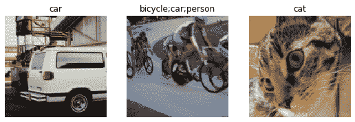
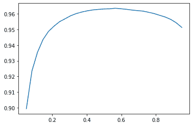
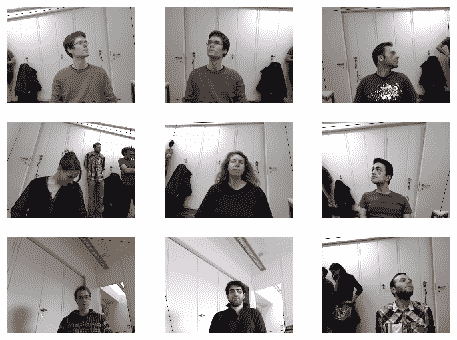
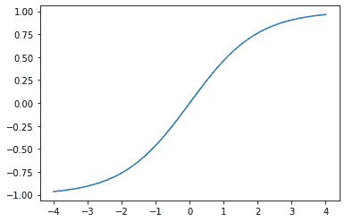
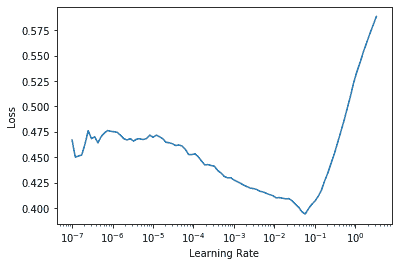
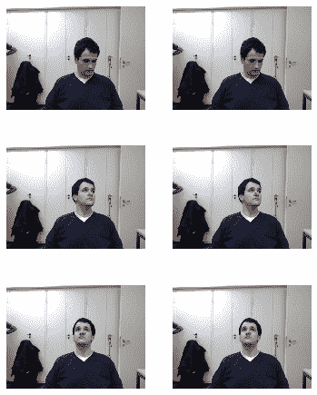

# 第六章：其他计算机视觉问题


在上一章中，你学习了一些在实践中训练模型的重要技术。选择学习率和周期数等考虑因素对于获得良好结果非常重要。

在本章中，我们将看到另外两种计算机视觉问题：多标签分类和回归。第一种情况发生在你想要预测每个图像的多个标签（有时甚至没有标签），第二种情况发生在你的标签是一个或多个数字——数量而不是类别。

在这个过程中，我们将更深入地研究深度学习模型中的输出激活、目标和损失函数。

# 多标签分类

*多标签分类*指的是识别图像中可能不只包含一种对象类别的问题。可能有多种对象，或者在你寻找的类别中根本没有对象。

例如，这对我们的熊分类器来说是一个很好的方法。我们在第二章中推出的熊分类器的一个问题是，如果用户上传了任何不是熊的东西，模型仍然会说它是灰熊、黑熊或泰迪熊之一——它无法预测“根本不是熊”。事实上，在我们完成本章后，你可以回到你的图像分类器应用程序，尝试使用多标签技术重新训练它，然后通过传入一个不属于你识别类别的图像来测试它。

实际上，我们并没有看到很多人为这个目的训练多标签分类器的例子——但我们经常看到用户和开发人员抱怨这个问题。看起来这个简单的解决方案并不被广泛理解或赞赏！因为在实践中，很可能有一些图像没有匹配项或有多个匹配项，所以我们应该预期在实践中，多标签分类器比单标签分类器更具普适性。

首先让我们看看多标签数据集是什么样的；然后我们将解释如何准备好供我们的模型使用。你会发现模型的架构与前一章并没有改变；只有损失函数改变了。让我们从数据开始。

## 数据

对于我们的示例，我们将使用 PASCAL 数据集，该数据集中的每个图像可以有多种分类对象。

我们首先按照通常的方式下载和提取数据集：

```py
from fastai.vision.all import *
path = untar_data(URLs.PASCAL_2007)
```

这个数据集与我们之前看到的不同，它不是按文件名或文件夹结构化的，而是附带一个 CSV 文件，告诉我们每个图像要使用的标签。我们可以通过将其读入 Pandas DataFrame 来检查 CSV 文件：

```py
df = pd.read_csv(path/'train.csv')
df.head()
```

|  | 文件名 | 标签 | 是否有效 |
| --- | --- | --- | --- |
| 0 | 000005.jpg | 椅子 | True |
| 1 | 000007.jpg | 汽车 | True |
| 2 | 000009.jpg | 马 人 | True |
| 3 | 000012.jpg | 汽车 | False |
| 4 | 000016.jpg | 自行车 | True |

正如你所看到的，每个图像中的类别列表显示为一个以空格分隔的字符串。

既然我们已经看到了数据的样子，让我们准备好进行模型训练。

## 构建数据块

我们如何将`DataFrame`对象转换为`DataLoaders`对象？我们通常建议在可能的情况下使用数据块 API 来创建`DataLoaders`对象，因为它提供了灵活性和简单性的良好组合。在这里，我们将展示使用数据块 API 构建`DataLoaders`对象的实践步骤，以这个数据集为例。

正如我们所看到的，PyTorch 和 fastai 有两个主要类用于表示和访问训练集或验证集：

`数据集`

返回单个项目的独立变量和依赖变量的元组的集合

`数据加载器`

提供一系列小批量的迭代器，其中每个小批量是一批独立变量和一批因变量的组合

除此之外，fastai 还提供了两个类来将您的训练和验证集合在一起：

`Datasets`

包含一个训练`Dataset`和一个验证`Dataset`的迭代器

`DataLoaders`

包含一个训练`DataLoader`和一个验证`DataLoader`的对象

由于`DataLoader`是建立在`Dataset`之上并为其添加附加功能（将多个项目整合成一个小批量），通常最容易的方法是首先创建和测试`Datasets`，然后再查看`DataLoaders`。

当我们创建`DataBlock`时，我们逐步逐步构建，并使用笔记本检查我们的数据。这是一个很好的方式，可以确保您在编码时保持动力，并留意任何问题。易于调试，因为您知道如果出现问题，它就在您刚刚输入的代码行中！

让我们从没有参数创建的数据块开始，这是最简单的情况：

```py
dblock = DataBlock()
```

我们可以从中创建一个`Datasets`对象。唯一需要的是一个源——在这种情况下是我们的 DataFrame：

```py
dsets = dblock.datasets(df)
```

这包含一个`train`和一个`valid`数据集，我们可以对其进行索引：

```py
dsets.train[0]
```

```py
(fname       008663.jpg
 labels      car person
 is_valid    False
 Name: 4346, dtype: object,
 fname       008663.jpg
 labels      car person
 is_valid    False
 Name: 4346, dtype: object)
```

正如您所看到的，这只是简单地两次返回 DataFrame 的一行。这是因为默认情况下，数据块假定我们有两个东西：输入和目标。我们需要从 DataFrame 中获取适当的字段，可以通过传递`get_x`和`get_y`函数来实现：

```py
dblock = DataBlock(get_x = lambda r: r['fname'], get_y = lambda r: r['labels'])
dsets = dblock.datasets(df)
dsets.train[0]
```

```py
('005620.jpg', 'aeroplane')
```

正如您所看到的，我们并没有以通常的方式定义函数，而是使用了 Python 的`lambda`关键字。这只是定义并引用函数的一种快捷方式。以下更冗长的方法是相同的：

```py
def get_x(r): return r['fname']
def get_y(r): return r['labels']
dblock = DataBlock(get_x = get_x, get_y = get_y)
dsets = dblock.datasets(df)
dsets.train[0]
```

```py
('002549.jpg', 'tvmonitor')
```

Lambda 函数非常适合快速迭代，但不兼容序列化，因此我们建议您在训练后要导出您的`Learner`时使用更冗长的方法（如果您只是在尝试实验，lambda 是可以的）。

我们可以看到独立变量需要转换为完整路径，以便我们可以将其作为图像打开，而因变量需要根据空格字符（这是 Python 的`split`函数的默认值）进行拆分，以便它变成一个列表：

```py
def get_x(r): return path/'train'/r['fname']
def get_y(r): return r['labels'].split(' ')
dblock = DataBlock(get_x = get_x, get_y = get_y)
dsets = dblock.datasets(df)
dsets.train[0]
```

```py
(Path('/home/sgugger/.fastai/data/pascal_2007/train/008663.jpg'),
 ['car', 'person'])
```

要实际打开图像并将其转换为张量，我们需要使用一组转换；块类型将为我们提供这些。我们可以使用先前使用过的相同块类型，只有一个例外：`ImageBlock`将再次正常工作，因为我们有一个指向有效图像的路径，但`CategoryBlock`不会起作用。问题在于该块返回一个单个整数，但我们需要为每个项目有多个标签。为了解决这个问题，我们使用`MultiCategoryBlock`。这种类型的块期望接收一个字符串列表，就像我们在这种情况下所做的那样，所以让我们来测试一下：

```py
dblock = DataBlock(blocks=(ImageBlock, MultiCategoryBlock),
                   get_x = get_x, get_y = get_y)
dsets = dblock.datasets(df)
dsets.train[0]
```

```py
(PILImage mode=RGB size=500x375,
 TensorMultiCategory([0., 0., 0., 0., 0., 0., 0., 0., 0., 0., 0., 1., 0., 0.,
 > 0., 0., 0., 0., 0., 0.]))
```

正如您所看到的，我们的类别列表的编码方式与常规的`CategoryBlock`不同。在那种情况下，我们有一个整数表示哪个类别存在，基于它在我们的词汇表中的位置。然而，在这种情况下，我们有一系列 0，其中任何位置上有一个 1 表示该类别存在。例如，如果第二和第四位置上有一个 1，那意味着词汇项二和四在这个图像中存在。这被称为*独热编码*。我们不能简单地使用类别索引列表的原因是每个列表的长度都不同，而 PyTorch 需要张量，其中所有内容必须是相同长度。

# 行话：独热编码

使用一个 0 向量，其中每个位置都表示数据中表示的位置，以编码一个整数列表。

让我们来看看这个例子中类别代表什么（我们使用方便的`torch.where`函数，告诉我们条件为真或假的所有索引）：

```py
idxs = torch.where(dsets.train[0][1]==1.)[0]
dsets.train.vocab[idxs]
```

```py
(#1) ['dog']
```

使用 NumPy 数组、PyTorch 张量和 fastai 的`L`类，我们可以直接使用列表或向量进行索引，这使得很多代码（比如这个例子）更清晰、更简洁。

到目前为止，我们忽略了列`is_valid`，这意味着`DataBlock`一直在使用默认的随机拆分。要明确选择我们验证集的元素，我们需要编写一个函数并将其传递给`splitter`（或使用 fastai 的预定义函数或类之一）。它将获取项目（这里是我们整个 DataFrame）并必须返回两个（或更多）整数列表：

```py
def splitter(df):
    train = df.index[~df['is_valid']].tolist()
    valid = df.index[df['is_valid']].tolist()
    return train,valid

dblock = DataBlock(blocks=(ImageBlock, MultiCategoryBlock),
                   splitter=splitter,
                   get_x=get_x,
                   get_y=get_y)

dsets = dblock.datasets(df)
dsets.train[0]
```

```py
(PILImage mode=RGB size=500x333,
 TensorMultiCategory([0., 0., 0., 0., 0., 0., 1., 0., 0., 0., 0., 0., 0., 0.,
 > 0., 0., 0., 0., 0., 0.]))
```

正如我们讨论过的，`DataLoader`将`Dataset`中的项目整理成一个小批量。这是一个张量的元组，其中每个张量简单地堆叠了`Dataset`项目中该位置的项目。

现在我们已经确认了单个项目看起来没问题，还有一步，我们需要确保我们可以创建我们的`DataLoaders`，即确保每个项目的大小相同。为了做到这一点，我们可以使用`RandomResizedCrop`：

```py
dblock = DataBlock(blocks=(ImageBlock, MultiCategoryBlock),
                   splitter=splitter,
                   get_x=get_x,
                   get_y=get_y,
                   item_tfms = RandomResizedCrop(128, min_scale=0.35))
dls = dblock.dataloaders(df)
```

现在我们可以显示我们数据的一个样本：

```py
dls.show_batch(nrows=1, ncols=3)
```



请记住，如果在从`DataBlock`创建`DataLoaders`时出现任何问题，或者如果您想查看`DataBlock`的确切情况，您可以使用我们在上一章中介绍的`summary`方法。

我们的数据现在已经准备好用于训练模型。正如我们将看到的，当我们创建我们的`Learner`时，没有任何变化，但在幕后，fastai 库将为我们选择一个新的损失函数：二元交叉熵。

## 二元交叉熵

现在我们将创建我们的`Learner`。我们在第四章中看到，`Learner`对象包含四个主要内容：模型、`DataLoaders`对象、优化器和要使用的损失函数。我们已经有了我们的`DataLoaders`，我们可以利用 fastai 的`resnet`模型（稍后我们将学习如何从头开始创建），并且我们知道如何创建一个`SGD`优化器。因此，让我们专注于确保我们有一个合适的损失函数。为此，让我们使用`cnn_learner`创建一个`Learner`，这样我们就可以查看它的激活：

```py
learn = cnn_learner(dls, resnet18)
```

我们还看到，`Learner`中的模型通常是从`nn.Module`继承的类的对象，并且我们可以使用括号调用它，它将返回模型的激活。你应该将独立变量作为一个小批量传递给它。我们可以尝试从我们的`DataLoader`中获取一个小批量，然后将其传递给模型：

```py
x,y = dls.train.one_batch()
activs = learn.model(x)
activs.shape
```

```py
torch.Size([64, 20])
```

想想为什么`activs`有这种形状——我们的批量大小为 64，我们需要计算 20 个类别中的每一个的概率。这是其中一个激活的样子：

```py
activs[0]
```

```py
tensor([ 2.0258, -1.3543,  1.4640,  1.7754, -1.2820, -5.8053,  3.6130,  0.7193,
 > -4.3683, -2.5001, -2.8373, -1.8037,  2.0122,  0.6189,  1.9729,  0.8999,
 > -2.6769, -0.3829,  1.2212,  1.6073],
       device='cuda:0', grad_fn=<SelectBackward>)
```

# 获取模型激活

知道如何手动获取一个小批量并将其传递到模型中，并查看激活和损失，对于调试模型非常重要。这对学习也非常有帮助，这样你就可以清楚地看到发生了什么。

它们还没有缩放到 0 到 1 之间，但我们学会了如何在第四章中使用`sigmoid`函数来做到这一点。我们还看到了如何基于此计算损失——这是我们在第四章中的损失函数，加上了在前一章中讨论的`log`：

```py
def binary_cross_entropy(inputs, targets):
    inputs = inputs.sigmoid()
    return -torch.where(targets==1, inputs, 1-inputs).log().mean()
```

请注意，由于我们有一个独热编码的因变量，我们不能直接使用`nll_loss`或`softmax`（因此我们不能使用`cross_entropy`）：

+   正如我们所看到的，`softmax`要求所有预测总和为 1，并且倾向于使一个激活远远大于其他激活（因为使用了`exp`）；然而，我们可能有多个我们确信出现在图像中的对象，因此限制激活的最大总和为 1 并不是一个好主意。出于同样的原因，如果我们认为*任何*类别都不出现在图像中，我们可能希望总和*小于*1。

+   正如我们所看到的，`nll_loss`返回的是一个激活值：与项目的单个标签对应的单个激活值。当我们有多个标签时，这是没有意义的。

另一方面，`binary_cross_entropy`函数，即`mnist_loss`加上`log`，正是我们所需要的，这要归功于 PyTorch 的逐元素操作的魔力。每个激活将与每个列的每个目标进行比较，因此我们不必做任何事情使此函数适用于多个列。

# Jeremy Says

我真的很喜欢使用像 PyTorch 这样的库，具有广播和逐元素操作，因为我经常发现我可以编写的代码同样适用于单个项目或一批项目，而无需更改。`binary_cross_entropy`就是一个很好的例子。通过使用这些操作，我们不必自己编写循环，可以依赖 PyTorch 根据我们正在处理的张量的秩适当地执行我们需要的循环。

PyTorch 已经为我们提供了这个函数。实际上，它提供了许多版本，名称相当令人困惑！

`F.binary_cross_entropy`及其模块等效`nn.BCELoss`计算一个独热编码目标的交叉熵，但不包括初始的`sigmoid`。通常，对于独热编码目标，您将希望使用`F.binary_cross_entropy_with_logits`（或`nn.BCEWithLogitsLoss`），它们在一个函数中同时执行 sigmoid 和二元交叉熵，就像前面的例子一样。

对于单标签数据集（如 MNIST 或 Pet 数据集），其中目标被编码为单个整数，相应的是`F.nll_loss`或`nn.NLLLoss`（没有初始 softmax 的版本），以及`F.cross_entropy`或`nn.CrossEntropyLoss`（具有初始 softmax 的版本）。

由于我们有一个独热编码的目标，我们将使用`BCEWithLogitsLoss`：

```py
loss_func = nn.BCEWithLogitsLoss()
loss = loss_func(activs, y)
loss
```

```py
tensor(1.0082, device='cuda:5', grad_fn=<BinaryCrossEntropyWithLogitsBackward>)
```

我们不需要告诉 fastai 使用这个损失函数（尽管如果我们想要的话可以这样做），因为它将自动为我们选择。fastai 知道`DataLoaders`具有多个类别标签，因此默认情况下将使用`nn.BCEWithLogitsLoss`。

与前一章相比的一个变化是我们使用的指标：因为这是一个多标签问题，我们不能使用准确度函数。为什么呢？嗯，准确度是这样比较我们的输出和我们的目标的：

```py
def accuracy(inp, targ, axis=-1):
    "Compute accuracy with `targ` when `pred` is bs * n_classes"
    pred = inp.argmax(dim=axis)
    return (pred == targ).float().mean()
```

预测的类是具有最高激活的类（这就是`argmax`的作用）。这里不起作用，因为我们可能在单个图像上有多个预测。在对我们的激活应用 sigmoid（使它们在 0 和 1 之间）之后，我们需要通过选择*阈值*来决定哪些是 0，哪些是 1。高于阈值的每个值将被视为 1，低于阈值的每个值将被视为 0：

```py
def accuracy_multi(inp, targ, thresh=0.5, sigmoid=True):
    "Compute accuracy when `inp` and `targ` are the same size."
    if sigmoid: inp = inp.sigmoid()
    return ((inp>thresh)==targ.bool()).float().mean()
```

如果我们直接将`accuracy_multi`作为指标传递，它将使用`threshold`的默认值，即 0.5。我们可能希望调整该默认值并创建一个具有不同默认值的新版本的`accuracy_multi`。为了帮助解决这个问题，Python 中有一个名为`partial`的函数。它允许我们*绑定*一个带有一些参数或关键字参数的函数，从而创建该函数的新版本，每当调用它时，总是包含这些参数。例如，这里是一个接受两个参数的简单函数：

```py
def say_hello(name, say_what="Hello"): return f"{say_what} {name}."
say_hello('Jeremy'),say_hello('Jeremy', 'Ahoy!')
```

```py
('Hello Jeremy.', 'Ahoy! Jeremy.')
```

我们可以通过使用`partial`切换到该函数的法语版本：

```py
f = partial(say_hello, say_what="Bonjour")
f("Jeremy"),f("Sylvain")
```

```py
('Bonjour Jeremy.', 'Bonjour Sylvain.')
```

现在我们可以训练我们的模型。让我们尝试将准确度阈值设置为 0.2 作为我们的指标：

```py
learn = cnn_learner(dls, resnet50, metrics=partial(accuracy_multi, thresh=0.2))
learn.fine_tune(3, base_lr=3e-3, freeze_epochs=4)
```

| epoch | train_loss | valid_loss | accuracy_multi | time |
| --- | --- | --- | --- | --- |
| 0 | 0.903610 | 0.659728 | 0.263068 | 00:07 |
| 1 | 0.724266 | 0.346332 | 0.525458 | 00:07 |
| 2 | 0.415597 | 0.125662 | 0.937590 | 00:07 |
| 3 | 0.254987 | 0.116880 | 0.945418 | 00:07 |
| epoch | train_loss | valid_loss | accuracy_multi | time |
| --- | --- | --- | --- | --- |
| 0 | 0.123872 | 0.132634 | 0.940179 | 00:08 |
| 1 | 0.112387 | 0.113758 | 0.949343 | 00:08 |
| 2 | 0.092151 | 0.104368 | 0.951195 | 00:08 |

选择阈值很重要。如果选择的阈值太低，通常会选择错误标记的对象。我们可以通过改变我们的度量标准然后调用`validate`来看到这一点，它会返回验证损失和度量标准：

```py
learn.metrics = partial(accuracy_multi, thresh=0.1)
learn.validate()
```

```py
(#2) [0.10436797887086868,0.93057781457901]
```

如果选择的阈值太高，将只选择模型非常有信心的对象：

```py
learn.metrics = partial(accuracy_multi, thresh=0.99)
learn.validate()
```

```py
(#2) [0.10436797887086868,0.9416930675506592]
```

我们可以通过尝试几个级别并查看哪个效果最好来找到最佳阈值。如果我们只抓取一次预测，这将快得多：

```py
preds,targs = learn.get_preds()
```

然后我们可以直接调用度量标准。请注意，默认情况下，`get_preds`会为我们应用输出激活函数（在本例中为 sigmoid），因此我们需要告诉`accuracy_multi`不要应用它：

```py
accuracy_multi(preds, targs, thresh=0.9, sigmoid=False)
```

```py
TensorMultiCategory(0.9554)
```

现在我们可以使用这种方法找到最佳阈值水平：

```py
xs = torch.linspace(0.05,0.95,29)
accs = [accuracy_multi(preds, targs, thresh=i, sigmoid=False) for i in xs]
plt.plot(xs,accs);
```



在这种情况下，我们使用验证集来选择一个超参数（阈值），这就是验证集的目的。有时学生们表达了他们的担忧，即我们可能会对验证集*过拟合*，因为我们正在尝试很多值来找出哪个是最好的。然而，正如你在图中看到的，改变阈值在这种情况下会产生一个平滑的曲线，因此我们显然没有选择不合适的异常值。这是一个很好的例子，说明你必须小心理论（不要尝试很多超参数值，否则可能会过拟合验证集）与实践（如果关系是平滑的，这样做是可以的）之间的区别。

这结束了本章专门讨论多标签分类的部分。接下来，我们将看一下回归问题。

# 回归

很容易将深度学习模型视为被分类到领域中，如*计算机视觉*、*NLP*等等。事实上，这就是 fastai 对其应用程序进行分类的方式——主要是因为大多数人习惯于这样思考事物。

但实际上，这隐藏了一个更有趣和更深入的视角。一个模型由其独立和依赖变量以及其损失函数定义。这意味着实际上有比简单的基于领域的分割更广泛的模型数组。也许我们有一个独立变量是图像，一个依赖变量是文本（例如，从图像生成标题）；或者我们有一个独立变量是文本，一个依赖变量是图像（例如，从标题生成图像——这实际上是深度学习可以做到的！）；或者我们有图像、文本和表格数据作为独立变量，我们试图预测产品购买……可能性真的是无穷无尽的。

要能够超越固定应用程序，为新问题制定自己的新颖解决方案，真正理解数据块 API（也许还有我们将在本书后面看到的中间层 API）是有帮助的。举个例子，让我们考虑*图像回归*的问题。这指的是从一个独立变量是图像，依赖变量是一个或多个浮点数的数据集中学习。通常我们看到人们将图像回归视为一个完全独立的应用程序——但正如你在这里看到的，我们可以将其视为数据块 API 上的另一个 CNN。

我们将直接跳到图像回归的一个有点棘手的变体，因为我们知道你已经准备好了！我们将做一个关键点模型。*关键点*指的是图像中表示的特定位置——在这种情况下，我们将使用人物的图像，并且我们将寻找每个图像中人脸的中心。这意味着我们实际上将为每个图像预测*两个*值：人脸中心的行和列。

## 数据组装

我们将在这一部分使用[Biwi Kinect Head Pose 数据集](https://oreil.ly/-4cO-)。我们将像往常一样开始下载数据集：

```py
path = untar_data(URLs.BIWI_HEAD_POSE)
```

让我们看看我们有什么！

```py
path.ls()
```

```py
(#50) [Path('13.obj'),Path('07.obj'),Path('06.obj'),Path('13'),Path('10'),Path('
 > 02'),Path('11'),Path('01'),Path('20.obj'),Path('17')...]
```

有 24 个从 01 到 24 编号的目录（它们对应不同的被摄人物），以及每个目录对应的*.obj*文件（我们这里不需要）。让我们看看其中一个目录的内容：

```py
(path/'01').ls()
```

```py
(#1000) [Path('01/frame_00281_pose.txt'),Path('01/frame_00078_pose.txt'),Path('0
 > 1/frame_00349_rgb.jpg'),Path('01/frame_00304_pose.txt'),Path('01/frame_00207_
 > pose.txt'),Path('01/frame_00116_rgb.jpg'),Path('01/frame_00084_rgb.jpg'),Path
 > ('01/frame_00070_rgb.jpg'),Path('01/frame_00125_pose.txt'),Path('01/frame_003
 > 24_rgb.jpg')...]
```

在子目录中，我们有不同的帧。每个帧都带有一个图像（*_rgb.jpg*）和一个姿势文件（*_pose.txt*）。我们可以使用`get_image_files`轻松递归获取所有图像文件，然后编写一个函数，将图像文件名转换为其关联的姿势文件：

```py
img_files = get_image_files(path)
def img2pose(x): return Path(f'{str(x)[:-7]}pose.txt')
img2pose(img_files[0])
```

```py
Path('13/frame_00349_pose.txt')
```

让我们来看看我们的第一张图片：

```py
im = PILImage.create(img_files[0])
im.shape
```

```py
(480, 640)
```

```py
im.to_thumb(160)
```


[Biwi 数据集网站](https://oreil.ly/wHL28)用于解释与每个图像关联的姿势文本文件的格式，显示头部中心的位置。这些细节对我们来说并不重要，所以我们只会展示我们用来提取头部中心点的函数：

```py
cal = np.genfromtxt(path/'01'/'rgb.cal', skip_footer=6)
def get_ctr(f):
    ctr = np.genfromtxt(img2pose(f), skip_header=3)
    c1 = ctr[0] * cal[0][0]/ctr[2] + cal[0][2]
    c2 = ctr[1] * cal[1][1]/ctr[2] + cal[1][2]
    return tensor([c1,c2])
```

这个函数将坐标作为两个项目的张量返回：

```py
get_ctr(img_files[0])
```

```py
tensor([384.6370, 259.4787])
```

我们可以将此函数传递给`DataBlock`作为`get_y`，因为它负责为每个项目标记。我们将将图像调整为其输入大小的一半，以加快训练速度。

一个重要的要点是我们不应该只使用随机分割器。在这个数据集中，同一个人出现在多个图像中，但我们希望确保我们的模型可以泛化到它尚未见过的人。数据集中的每个文件夹包含一个人的图像。因此，我们可以创建一个分割器函数，仅为一个人返回`True`，从而使验证集仅包含该人的图像。

与以前的数据块示例的唯一区别是第二个块是`PointBlock`。这是必要的，以便 fastai 知道标签代表坐标；这样，它就知道在进行数据增强时，应该对这些坐标执行与图像相同的增强：

```py
biwi = DataBlock(
    blocks=(ImageBlock, PointBlock),
    get_items=get_image_files,
    get_y=get_ctr,
    splitter=FuncSplitter(lambda o: o.parent.name=='13'),
    batch_tfms=[*aug_transforms(size=(240,320)),
                Normalize.from_stats(*imagenet_stats)]
)
```

# 点和数据增强

我们不知道其他库（除了 fastai）会自动且正确地将数据增强应用于坐标。因此，如果您使用另一个库，可能需要禁用这些问题的数据增强。

在进行任何建模之前，我们应该查看我们的数据以确认它看起来没问题：

```py
dls = biwi.dataloaders(path)
dls.show_batch(max_n=9, figsize=(8,6))
```



看起来不错！除了通过视觉查看批次外，还可以查看底层张量（尤其是作为学生；这将有助于澄清您对模型实际看到的内容的理解）：

```py
xb,yb = dls.one_batch()
xb.shape,yb.shape
```

```py
(torch.Size([64, 3, 240, 320]), torch.Size([64, 1, 2]))
```

确保您了解为什么这些是我们小批量的形状。

这是依赖变量的一个示例行：

```py
yb[0]
```

```py
tensor([[0.0111, 0.1810]], device='cuda:5')
```

正如您所看到的，我们不必使用单独的*图像回归*应用程序；我们所要做的就是标记数据并告诉 fastai 独立变量和因变量代表什么类型的数据。

创建我们的`Learner`也是一样的。我们将使用与之前相同的函数，只有一个新参数，然后我们就可以准备训练我们的模型了。

## 训练模型

像往常一样，我们可以使用`cnn_learner`来创建我们的`Learner`。还记得在第一章中我们如何使用`y_range`告诉 fastai 我们目标的范围吗？我们将在这里做同样的事情（fastai 和 PyTorch 中的坐标始终在-1 和+1 之间重新缩放）：

```py
learn = cnn_learner(dls, resnet18, y_range=(-1,1))
```

`y_range`在 fastai 中使用`sigmoid_range`实现，其定义如下：

```py
def sigmoid_range(x, lo, hi): return torch.sigmoid(x) * (hi-lo) + lo
```

如果定义了`y_range`，则将其设置为模型的最终层。花点时间思考一下这个函数的作用，以及为什么它强制模型在范围`(lo,hi)`内输出激活。

这是它的样子：

```py
plot_function(partial(sigmoid_range,lo=-1,hi=1), min=-4, max=4)
```



我们没有指定损失函数，这意味着我们得到了 fastai 选择的默认值。让我们看看它为我们选择了什么：

```py
dls.loss_func
```

```py
FlattenedLoss of MSELoss()
```

这是有道理的，因为当坐标被用作因变量时，大多数情况下我们可能会尽可能地预测接近某个值；这基本上就是 `MSELoss`（均方误差损失）所做的。如果你想使用不同的损失函数，你可以通过使用 `loss_func` 参数将其传递给 `cnn_learner`。

还要注意，我们没有指定任何指标。这是因为均方误差已经是这个任务的一个有用指标（尽管在我们取平方根之后可能更易解释）。

我们可以使用学习率查找器选择一个好的学习率：

```py
learn.lr_find()
```



我们将尝试一个学习率为 2e-2：

```py
lr = 2e-2
learn.fit_one_cycle(5, lr)
```

| epoch | train_loss | valid_loss | time |
| --- | --- | --- | --- |
| 0 | 0.045840 | 0.012957 | 00:36 |
| 1 | 0.006369 | 0.001853 | 00:36 |
| 2 | 0.003000 | 0.000496 | 00:37 |
| 3 | 0.001963 | 0.000360 | 00:37 |
| 4 | 0.001584 | 0.000116 | 00:36 |

通常情况下，当我们运行这个时，我们得到的损失大约是 0.0001，这对应于这个平均坐标预测误差：

```py
math.sqrt(0.0001)
```

```py
0.01
```

这听起来非常准确！但是重要的是要用 `Learner.show_results` 查看我们的结果。左侧是实际（*真实*）坐标，右侧是我们模型的预测：

```py
learn.show_results(ds_idx=1, max_n=3, figsize=(6,8))
```



令人惊讶的是，仅仅几分钟的计算，我们就创建了一个如此准确的关键点模型，而且没有任何特定领域的应用。这就是在灵活的 API 上构建并使用迁移学习的力量！特别引人注目的是，我们能够如此有效地使用迁移学习，即使在完全不同的任务之间；我们的预训练模型是用来进行图像分类的，而我们对图像回归进行了微调。

# 结论

在乍一看完全不同的问题（单标签分类、多标签分类和回归）中，我们最终使用相同的模型，只是输出的数量不同。唯一改变的是损失函数，这就是为什么重要的是要仔细检查你是否为你的问题使用了正确的损失函数。

fastai 将自动尝试从您构建的数据中选择正确的损失函数，但如果您使用纯 PyTorch 构建您的 `DataLoader`，请确保您认真考虑您选择的损失函数，并记住您很可能想要以下内容：

+   `nn.CrossEntropyLoss` 用于单标签分类

+   `nn.BCEWithLogitsLoss` 用于多标签分类

+   `nn.MSELoss` 用于回归

# 问卷

1.  多标签分类如何提高熊分类器的可用性？

1.  在多标签分类问题中，我们如何对因变量进行编码？

1.  如何访问 DataFrame 的行和列，就像它是一个矩阵一样？

1.  如何从 DataFrame 中按名称获取列？

1.  `Dataset` 和 `DataLoader` 之间有什么区别？

1.  `Datasets` 对象通常包含什么？

1.  `DataLoaders` 对象通常包含什么？

1.  `lambda` 在 Python 中是做什么的？

1.  如何使用数据块 API 自定义独立变量和因变量的创建方法？

1.  当使用一个独热编码的目标时，为什么 softmax 不是一个合适的输出激活函数？

1.  当使用一个独热编码的目标时，为什么 `nll_loss` 不是一个合适的损失函数？

1.  `nn.BCELoss` 和 `nn.BCEWithLogitsLoss` 之间有什么区别？

1.  为什么在多标签问题中不能使用常规准确率？

1.  何时可以在验证集上调整超参数？

1.  `y_range` 在 fastai 中是如何实现的？（看看你是否可以自己实现并在不偷看的情况下测试！）

1.  回归问题是什么？对于这样的问题应该使用什么损失函数？

1.  为了确保 fastai 库将相同的数据增强应用于您的输入图像和目标点坐标，您需要做什么？

## 进一步研究

1.  阅读关于 Pandas DataFrames 的教程，并尝试一些看起来有趣的方法。查看书籍网站上推荐的教程。

1.  使用多标签分类重新训练熊分类器。看看你是否可以使其有效地处理不包含任何熊的图像，包括在 Web 应用程序中显示该信息。尝试一张包含两种熊的图像。检查在单标签数据集上使用多标签分类是否会影响准确性。
