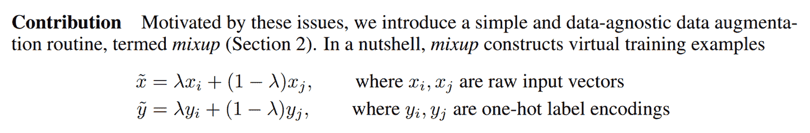
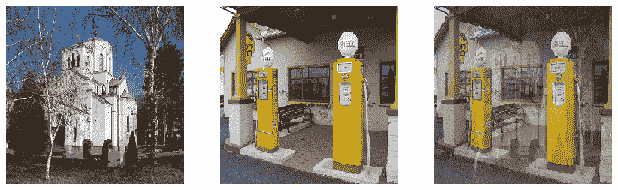

# 第七章：训练一个最先进的模型


本章介绍了更高级的技术，用于训练图像分类模型并获得最先进的结果。如果您想了解更多关于深度学习的其他应用，并稍后回来，您可以跳过它——后续章节不会假设您已掌握这些材料。

我们将看一下什么是归一化，一种强大的数据增强技术叫做 Mixup，渐进式调整大小方法，以及测试时间增强。为了展示所有这些，我们将从头开始训练一个模型（不使用迁移学习），使用一个名为 Imagenette 的 ImageNet 子集。它包含了原始 ImageNet 数据集中 10 个非常不同的类别的子集，使得在我们想要进行实验时训练更快。

这将比我们之前的数据集更难做得好，因为我们使用全尺寸、全彩色的图像，这些图像是不同大小、不同方向、不同光照等对象的照片。因此，在本章中，我们将介绍一些重要的技术，以便充分利用您的数据集，特别是当您从头开始训练，或者使用迁移学习在一个与预训练模型使用的非常不同类型的数据集上训练模型时。

# Imagenette

当 fast.ai 刚开始时，人们主要使用三个主要数据集来构建和测试计算机视觉模型：

ImageNet

1.3 百万张各种尺寸的图像，大约 500 像素宽，分为 1,000 个类别，需要几天时间来训练

MNIST

50,000 个 28×28 像素的灰度手写数字

CIFAR10

60,000 个 32×32 像素的彩色图像，分为 10 类

问题在于较小的数据集无法有效地泛化到大型 ImageNet 数据集。在 ImageNet 上表现良好的方法通常必须在 ImageNet 上开发和训练。这导致许多人认为，只有拥有巨大计算资源的研究人员才能有效地为发展图像分类算法做出贡献。

我们认为这似乎是不太可能成立的。我们从未见过一项研究表明 ImageNet 恰好是正确的大小，其他数据集无法提供有用的见解。因此，我们希望创建一个新的数据集，研究人员可以快速、廉价地测试他们的算法，但也能提供可能在完整的 ImageNet 数据集上起作用的见解。

大约三个小时后，我们创建了 Imagenette。我们从完整的 ImageNet 中选择了 10 个看起来非常不同的类别。正如我们所希望的那样，我们能够快速、廉价地创建一个能够识别这些类别的分类器。然后我们尝试了一些算法调整，看它们如何影响 Imagenette。我们发现一些效果不错的，并在 ImageNet 上进行了测试，我们很高兴地发现我们的调整在 ImageNet 上也效果很好！

这里有一个重要的信息：您得到的数据集不一定是您想要的数据集。特别是不太可能是您想要进行开发和原型设计的数据集。您应该力求迭代速度不超过几分钟——也就是说，当您想尝试一个新想法时，您应该能够在几分钟内训练一个模型并查看其效果。如果做一个实验花费的时间更长，考虑如何减少数据集的规模，或简化模型，以提高实验速度。您做的实验越多，效果就越好！

让我们从这个数据集开始：

```py
from fastai.vision.all import *
path = untar_data(URLs.IMAGENETTE)
```

首先，我们将使用在第五章中介绍的*预调整*技巧将我们的数据集放入`DataLoaders`对象中：

```py
dblock = DataBlock(blocks=(ImageBlock(), CategoryBlock()),
                   get_items=get_image_files,
                   get_y=parent_label,
                   item_tfms=Resize(460),
                   batch_tfms=aug_transforms(size=224, min_scale=0.75))
dls = dblock.dataloaders(path, bs=64)
```

然后我们将进行一个作为基线的训练运行：

```py
model = xresnet50()
learn = Learner(dls, model, loss_func=CrossEntropyLossFlat(), metrics=accuracy)
learn.fit_one_cycle(5, 3e-3)
```

| epoch | train_loss | valid_loss | accuracy | time |
| --- | --- | --- | --- | --- |
| 0 | 1.583403 | 2.064317 | 0.401792 | 01:03 |
| 1 | 1.208877 | 1.260106 | 0.601568 | 01:02 |
| 2 | 0.925265 | 1.036154 | 0.664302 | 01:03 |
| 3 | 0.730190 | 0.700906 | 0.777819 | 01:03 |
| 4 | 0.585707 | 0.541810 | 0.825243 | 01:03 |

这是一个很好的基准，因为我们没有使用预训练模型，但我们可以做得更好。当使用从头开始训练的模型，或者对与预训练使用的数据集非常不同的数据集进行微调时，一些额外的技术就变得非常重要。在本章的其余部分，我们将考虑一些您需要熟悉的关键方法。第一个方法是*归一化*您的数据。

# 归一化

在训练模型时，如果您的输入数据是*归一化*的，那将会有所帮助——也就是说，具有平均值为 0 和标准差为 1。但大多数图像和计算机视觉库使用像素值在 0 到 255 之间，或者在 0 到 1 之间；在任何一种情况下，您的数据都不会具有平均值为 0 和标准差为 1。

让我们获取一批数据并查看这些值，通过对除了通道轴之外的所有轴进行平均，通道轴是轴 1：

```py
x,y = dls.one_batch()
x.mean(dim=[0,2,3]),x.std(dim=[0,2,3])
```

```py
(TensorImage([0.4842, 0.4711, 0.4511], device='cuda:5'),
 TensorImage([0.2873, 0.2893, 0.3110], device='cuda:5'))
```

正如我们预期的那样，平均值和标准差与期望值不太接近。幸运的是，在 fastai 中对数据进行归一化很容易，只需添加`Normalize`转换。这会一次作用于整个小批量数据，因此您可以将其添加到数据块的`batch_tfms`部分。您需要传递给此转换您想要使用的平均值和标准差；fastai 已经定义了标准的 ImageNet 平均值和标准差。（如果您没有向`Normalize`转换传递任何统计数据，fastai 将自动从您的数据的一个批次中计算出它们。）

让我们添加这个转换（使用`imagenet_stats`，因为 Imagenette 是 ImageNet 的一个子集），现在看一下一个批次：

```py
def get_dls(bs, size):
    dblock = DataBlock(blocks=(ImageBlock, CategoryBlock),
                   get_items=get_image_files,
                   get_y=parent_label,
                   item_tfms=Resize(460),
                   batch_tfms=[*aug_transforms(size=size, min_scale=0.75),
                               Normalize.from_stats(*imagenet_stats)])
    return dblock.dataloaders(path, bs=bs)
```

```py
dls = get_dls(64, 224)
```

```py
x,y = dls.one_batch()
x.mean(dim=[0,2,3]),x.std(dim=[0,2,3])
```

```py
(TensorImage([-0.0787,  0.0525,  0.2136], device='cuda:5'),
 TensorImage([1.2330, 1.2112, 1.3031], device='cuda:5'))
```

让我们来看看这对训练我们的模型有什么影响：

```py
model = xresnet50()
learn = Learner(dls, model, loss_func=CrossEntropyLossFlat(), metrics=accuracy)
learn.fit_one_cycle(5, 3e-3)
```

| epoch | train_loss | valid_loss | accuracy | time |
| --- | --- | --- | --- | --- |
| 0 | 1.632865 | 2.250024 | 0.391337 | 01:02 |
| 1 | 1.294041 | 1.579932 | 0.517177 | 01:02 |
| 2 | 0.960535 | 1.069164 | 0.657207 | 01:04 |
| 3 | 0.730220 | 0.767433 | 0.771845 | 01:05 |
| 4 | 0.577889 | 0.550673 | 0.824496 | 01:06 |

尽管在这里只有一点帮助，但在使用预训练模型时，归一化变得尤为重要。预训练模型只知道如何处理之前见过的数据类型。如果训练数据的平均像素值为 0，但您的数据的像素最小可能值为 0，那么模型将看到与预期完全不同的东西！

这意味着当您分发模型时，您需要同时分发用于归一化的统计数据，因为任何使用它进行推断或迁移学习的人都需要使用相同的统计数据。同样，如果您使用别人训练过的模型，请确保您了解他们使用的归一化统计数据，并进行匹配。

在之前的章节中，我们不必处理归一化，因为通过`cnn_learner`使用预训练模型时，fastai 库会自动添加适当的`Normalize`转换；模型已经使用`Normalize`中的某些统计数据进行了预训练（通常来自 ImageNet 数据集），因此库可以为您填充这些数据。请注意，这仅适用于预训练模型，这就是为什么在从头开始训练时需要在这里手动添加这些信息的原因。

到目前为止，我们所有的训练都是在尺寸为 224 的情况下进行的。我们本可以在那之前从较小的尺寸开始训练。这被称为*渐进调整*。

# 渐进调整

当 fast.ai 及其学生团队在 2018 年赢得 DAWNBench 比赛时，其中最重要的创新之一是非常简单的事情：使用小图像开始训练，然后使用大图像结束训练。在大部分时期使用小图像进行训练有助于训练完成得更快。使用大图像完成训练使最终准确率更高。我们称这种方法为*渐进式调整大小*。

# 术语：渐进式调整大小

在训练过程中逐渐使用越来越大的图像。

正如我们所看到的，卷积神经网络学习的特征类型与图像的大小无关——早期层发现边缘和梯度等内容，而后期层可能发现鼻子和日落等内容。因此，当我们在训练中途更改图像大小时，并不意味着我们必须为我们的模型找到完全不同的参数。

但显然小图像和大图像之间存在一些差异，因此我们不应该期望我们的模型继续完全不变地工作得很好。这让你想起了什么吗？当我们开发这个想法时，它让我们想起了迁移学习！我们试图让我们的模型学会做一些与以前学会的有点不同的事情。因此，在调整图像大小后，我们应该能够使用`fine_tune`方法。

渐进式调整大小还有一个额外的好处：它是另一种数据增强形式。因此，您应该期望看到使用渐进式调整大小训练的模型具有更好的泛化能力。

要实现渐进式调整大小，最方便的方法是首先创建一个`get_dls`函数，该函数接受图像大小和批量大小，就像我们在前一节中所做的那样，并返回您的`DataLoaders`。

现在，您可以使用小尺寸创建您的`DataLoaders`，并以通常的方式使用`fit_one_cycle`，训练的时期比您可能以其他方式做的要少：

```py
dls = get_dls(128, 128)
learn = Learner(dls, xresnet50(), loss_func=CrossEntropyLossFlat(),
                metrics=accuracy)
learn.fit_one_cycle(4, 3e-3)
```

| epoch | train_loss | valid_loss | accuracy | time |
| --- | --- | --- | --- | --- |
| 0 | 1.902943 | 2.447006 | 0.401419 | 00:30 |
| 1 | 1.315203 | 1.572992 | 0.525765 | 00:30 |
| 2 | 1.001199 | 0.767886 | 0.759149 | 00:30 |
| 3 | 0.765864 | 0.665562 | 0.797984 | 00:30 |

然后，您可以在`Learner`内部替换`DataLoaders`，并进行微调：

```py
learn.dls = get_dls(64, 224)
learn.fine_tune(5, 1e-3)
```

| epoch | train_loss | valid_loss | accuracy | time |
| --- | --- | --- | --- | --- |
| 0 | 0.985213 | 1.654063 | 0.565721 | 01:06 |
| epoch | train_loss | valid_loss | accuracy | time |
| --- | --- | --- | --- | --- |
| 0 | 0.706869 | 0.689622 | 0.784541 | 01:07 |
| 1 | 0.739217 | 0.928541 | 0.712472 | 01:07 |
| 2 | 0.629462 | 0.788906 | 0.764003 | 01:07 |
| 3 | 0.491912 | 0.502622 | 0.836445 | 01:06 |
| 4 | 0.414880 | 0.431332 | 0.863331 | 01:06 |

正如您所看到的，我们的性能要好得多，而在每个时期的小图像上的初始训练速度要快得多。

您可以根据需要重复增加大小并训练更多时期的过程，为您希望的图像大小——但当然，如果使用大于磁盘上图像大小的图像大小，您将不会获得任何好处。

请注意，对于迁移学习，渐进式调整大小实际上可能会损害性能。如果您的预训练模型与您的迁移学习任务和数据集非常相似，并且是在类似大小的图像上训练的，那么权重不需要进行太多更改。在这种情况下，使用较小的图像进行训练可能会损坏预训练权重。

另一方面，如果迁移学习任务将使用与预训练任务中使用的图像大小、形状或风格不同的图像，渐进式调整大小可能会有所帮助。像往常一样，“它会有帮助吗？”的答案是“试试看！”

我们还可以尝试将数据增强应用于验证集。到目前为止，我们只在训练集上应用了数据增强；验证集始终获得相同的图像。但也许我们可以尝试为验证集的几个增强版本进行预测并取平均值。我们将在下一步考虑这种方法。

# 测试时间增强

我们一直在使用随机裁剪作为一种获取一些有用数据增强的方法，这导致更好的泛化，并且需要更少的训练数据。当我们使用随机裁剪时，fastai 将自动为验证集使用中心裁剪——也就是说，它将选择图像中心的最大正方形区域，而不会超出图像的边缘。

这通常会带来问题。例如，在多标签数据集中，有时图像边缘会有小物体；这些物体可能会被中心裁剪完全裁剪掉。即使对于像我们的宠物品种分类示例这样的问题，也有可能关键特征，例如鼻子的颜色，可能会被裁剪掉。

解决这个问题的一个方法是完全避免随机裁剪。相反，我们可以简单地压缩或拉伸矩形图像以适应正方形空间。但是这样我们会错过一个非常有用的数据增强，并且还会使图像识别对我们的模型更加困难，因为它必须学会识别被压缩和拉伸的图像，而不仅仅是正确比例的图像。

另一个解决方案是在验证时不进行中心裁剪，而是从原始矩形图像中选择若干区域进行裁剪，将每个区域通过我们的模型，然后取预测的最大值或平均值。事实上，我们不仅可以对不同裁剪进行此操作，还可以对所有测试时间增强参数的不同值进行操作。这被称为*测试时间增强*（TTA）。

# 术语：测试时间增强（TTA）

在推断或验证期间，使用数据增强创建每个图像的多个版本，然后取每个增强版本的预测的平均值或最大值。

根据数据集的不同，测试时间增强可以显著提高准确性。它不会改变训练所需的时间，但会增加验证或推断所需的时间，数量取决于请求的测试时间增强图像数量。默认情况下，fastai 将使用未增强的中心裁剪图像加上四个随机增强的图像。

您可以将任何`DataLoader`传递给 fastai 的`tta`方法；默认情况下，它将使用您的验证集：

```py
preds,targs = learn.tta()
accuracy(preds, targs).item()
```

```py
0.8737863898277283
```

正如我们所看到的，使用 TTA 可以显著提高性能，而无需额外的训练。但是，它会使推断变慢——如果你对 TTA 平均了五张图像，推断将变慢五倍。

我们已经看到了一些数据增强如何帮助训练更好的模型。现在让我们专注于一种名为*混合*的新数据增强技术。

# 混合

混合（Mixup）是在 2017 年张宏毅等人的论文《*混合：超越经验风险最小化*》中引入的一种强大的数据增强技术，可以提供极高的准确性，特别是当你没有太多数据，也没有经过预训练的模型，该模型是在与你的数据集相似的数据上训练的。该论文解释道：“虽然数据增强始终会导致改进的泛化，但该过程取决于数据集，并因此需要专业知识的使用。”例如，将图像翻转作为数据增强的一部分是很常见的，但是你应该只水平翻转还是同时垂直翻转呢？答案是取决于你的数据集。此外，如果（例如）翻转对你来说提供的数据增强不够，你不能“多翻转”。有助于拥有数据增强技术，可以“调高”或“调低”变化的程度，以找到最适合你的方法。

对于每个图像，Mixup 的工作方式如下：

1.  随机从数据集中选择另一个图像。

1.  随机选择一个权重。

1.  使用步骤 2 中的权重对所选图像和您的图像进行加权平均；这将是您的自变量。

1.  将这个图像的标签与您的图像的标签进行加权平均（使用相同的权重）；这将是您的因变量。

在伪代码中，我们这样做（其中`t`是我们加权平均值的权重）：

```py
image2,target2 = dataset[randint(0,len(dataset)]
t = random_float(0.5,1.0)
new_image = t * image1 + (1-t) * image2
new_target = t * target1 + (1-t) * target2
```

为了使其正常工作，我们的目标需要进行独热编码。该论文使用图 7-1 中的方程式描述了这一点（其中<math alttext="lamda"><mi>λ</mi></math>与我们伪代码中的`t`相同）。



###### 图 7-1。Mixup 论文摘录

图 7-2 展示了在 Mixup 中进行图像*线性组合*的样子。



###### 图 7-2。混合教堂和加油站

第三个图像是通过将第一个图像的 0.3 倍和第二个图像的 0.7 倍相加而构建的。在这个例子中，模型应该预测“教堂”还是“加油站”？正确答案是 30%的教堂和 70%的加油站，因为如果我们采用独热编码目标的线性组合，那就是我们将得到的结果。例如，假设我们有 10 个类别，“教堂”由索引 2 表示，“加油站”由索引 7 表示。独热编码表示如下：

```py
[0, 0, 1, 0, 0, 0, 0, 0, 0, 0] and [0, 0, 0, 0, 0, 0, 0, 1, 0, 0]
```

这是我们的最终目标：

```py
[0, 0, 0.3, 0, 0, 0, 0, 0.7, 0, 0]
```

fastai 通过向我们的`Learner`添加一个*callback*来完成所有这些操作。`Callback`是 fastai 中用于在训练循环中注入自定义行为的内容（如学习率调度或混合精度训练）。您将在第十六章中学习有关回调的所有内容，包括如何制作自己的回调。目前，您只需要知道使用`cbs`参数将回调传递给`Learner`。

这是我们如何使用 Mixup 训练模型的方式：

```py
model = xresnet50()
learn = Learner(dls, model, loss_func=CrossEntropyLossFlat(),
                metrics=accuracy, cbs=Mixup)
learn.fit_one_cycle(5, 3e-3)
```

当我们用这种方式“混合”的数据训练模型时会发生什么？显然，训练会更加困难，因为很难看清每个图像中的内容。模型必须为每个图像预测两个标签，而不仅仅是一个，并且还必须弄清楚每个标签的权重。然而，过拟合似乎不太可能成为问题，因为我们不会在每个时代中显示相同的图像，而是显示两个图像的随机组合。

与我们看到的其他增强方法相比，Mixup 需要更多的时代来训练以获得更好的准确性。您可以尝试使用[fastai repo](https://oreil.ly/lrGXE)中的*examples/train_imagenette.py*脚本来训练 Imagenette，使用 Mixup 和不使用 Mixup。在撰写本文时，[Imagenette repo](https://oreil.ly/3Gt56)中的排行榜显示，Mixup 用于训练超过 80 个时代的所有领先结果，而对于更少的时代，不使用 Mixup。这与我们使用 Mixup 的经验一致。

Mixup 如此令人兴奋的原因之一是它可以应用于除照片之外的数据类型。事实上，有些人甚至已经展示了通过在模型内部的激活上使用 Mixup 而获得良好结果，而不仅仅是在输入上使用 Mixup——这使得 Mixup 也可以用于 NLP 和其他数据类型。

Mixup 为我们处理的另一个微妙问题是，我们之前看到的模型实际上永远无法完美。问题在于我们的标签是 1 和 0，但 softmax 和 sigmoid 的输出永远无法等于 1 或 0。这意味着训练我们的模型会使我们的激活值越来越接近这些值，这样我们做的时代越多，我们的激活值就会变得越极端。

使用 Mixup，我们不再有这个问题，因为我们的标签只有在我们碰巧与同一类别的另一幅图像“混合”时才会完全是 1 或 0。其余时间，我们的标签将是一个线性组合，比如我们在之前的教堂和加油站示例中得到的 0.7 和 0.3。

然而，这种方法的一个问题是 Mixup“意外地”使标签大于 0 或小于 1。也就是说，我们并没有*明确*告诉我们的模型我们想以这种方式改变标签。因此，如果我们想要使标签更接近或远离 0 和 1，我们必须改变 Mixup 的数量，这也会改变数据增强的数量，这可能不是我们想要的。然而，有一种更直接处理的方法，那就是使用*标签平滑*。

# 标签平滑

在损失的理论表达中，在分类问题中，我们的目标是独热编码的（在实践中，我们倾向于避免这样做以节省内存，但我们计算的损失与使用独热编码时相同）。这意味着模型被训练为对所有类别返回 0，只有一个类别返回 1。即使是 0.999 也不是“足够好”；模型将获得梯度并学会以更高的信心预测激活。这会鼓励过拟合，并在推理时给出一个不会给出有意义概率的模型：即使不太确定，它总是会为预测的类别说 1，只是因为它是这样训练的。

如果您的数据不完全标记，这可能会变得非常有害。在我们在第二章中研究的熊分类器中，我们看到一些图像被错误标记，或包含两种不同种类的熊。一般来说，您的数据永远不会是完美的。即使标签是人工制作的，也可能出现错误，或者在难以标记的图像上存在不同意见。

相反，我们可以用一个比 1 稍微小一点的数字替换所有的 1，用一个比 0 稍微大一点的数字替换所有的 0，然后进行训练。这就是*标签平滑*。通过鼓励模型变得不那么自信，标签平滑将使您的训练更加健壮，即使存在错误标记的数据。结果将是一个在推理时更好泛化的模型。

这就是标签平滑在实践中的工作方式：我们从独热编码的标签开始，然后用<math alttext="StartFraction epsilon Over upper N EndFraction"><mfrac><mi>ϵ</mi> <mi>N</mi></mfrac></math>（这是希腊字母*epsilon*，在介绍标签平滑的[论文](https://oreil.ly/L3ypf)和 fastai 代码中使用）替换所有的 0，其中<math alttext="upper N"><mi>N</mi></math>是类别数，<math alttext="epsilon"><mi>ϵ</mi></math>是一个参数（通常为 0.1，这意味着我们对标签有 10%的不确定性）。由于我们希望标签总和为 1，我们还用<math alttext="1 minus epsilon plus StartFraction epsilon Over upper N EndFraction"><mrow><mn>1</mn> <mo>-</mo> <mi>ϵ</mi> <mo>+</mo> <mfrac><mi>ϵ</mi> <mi>N</mi></mfrac></mrow></math>替换 1。这样，我们不会鼓励模型过于自信地预测。在我们的 Imagenette 示例中有 10 个类别，目标变成了这样（这里是对应于索引 3 的目标）：

```py
[0.01, 0.01, 0.01, 0.91, 0.01, 0.01, 0.01, 0.01, 0.01, 0.01]
```

在实践中，我们不想对标签进行独热编码，幸运的是我们也不需要（独热编码只是用来解释标签平滑和可视化的）。

在实践中使用这个方法，我们只需要在调用`Learner`时改变损失函数：

```py
model = xresnet50()
learn = Learner(dls, model, loss_func=LabelSmoothingCrossEntropy(),
                metrics=accuracy)
learn.fit_one_cycle(5, 3e-3)
```

与 Mixup 一样，您通常在训练更多时期后才会看到标签平滑带来的显著改进。自己尝试一下：在标签平滑显示改进之前，您需要训练多少个时期？

# 结论

您现在已经看到了训练计算机视觉中最先进模型所需的一切，无论是从头开始还是使用迁移学习。现在您只需要在自己的问题上进行实验！看看使用 Mixup 和/或标签平滑进行更长时间的训练是否可以避免过拟合并给出更好的结果。尝试渐进式调整大小和测试时间增强。

最重要的是，记住，如果您的数据集很大，那么在整个数据集上进行原型设计是没有意义的。找到一个代表整体的小子集，就像我们在 Imagenette 上所做的那样，并在其上进行实验。

在接下来的三章中，我们将看到 fastai 直接支持的其他应用程序：协同过滤、表格建模和处理文本。在本书的下一部分中，我们将回到计算机视觉，深入研究卷积神经网络在第十三章中。

# 问卷

1.  ImageNet 和 Imagenette 之间有什么区别？在什么情况下最好在其中一个上进行实验而不是另一个？

1.  什么是归一化？

1.  为什么在使用预训练模型时我们不需要关心归一化？

1.  什么是渐进式调整大小？

1.  在自己的项目中实现渐进式调整大小。有帮助吗？

1.  什么是测试时间增强？如何在 fastai 中使用它？

1.  在推理中使用 TTA 比常规推理更慢还是更快？为什么？

1.  什么是 Mixup？如何在 fastai 中使用它？

1.  为什么 Mixup 可以防止模型过于自信？

1.  为什么使用 Mixup 进行五个时期的训练最终比不使用 Mixup 训练更糟糕？

1.  标签平滑背后的理念是什么？

1.  您的数据中有哪些问题可以通过标签平滑来解决？

1.  在使用五个类别的标签平滑时，与索引 1 相关联的目标是什么？

1.  当您想在新数据集上快速进行原型实验时，应该采取的第一步是什么？

## 进一步研究

1.  使用 fastai 文档构建一个函数，将图像裁剪为每个角落的正方形；然后实现一种 TTA 方法，该方法对中心裁剪和这四个裁剪的预测进行平均。有帮助吗？比 fastai 的 TTA 方法更好吗？

1.  在 arXiv 上找到 Mixup 论文并阅读。选择一两篇介绍 Mixup 变体的较新文章并阅读它们；然后尝试在您的问题上实现它们。

1.  找到使用 Mixup 训练 Imagenette 的脚本，并将其用作在自己项目上进行长时间训练的示例。执行它并查看是否有帮助。

1.  阅读侧边栏["标签平滑，论文"](＃label_smoothing）；然后查看原始论文的相关部分，看看您是否能够理解。不要害怕寻求帮助！
