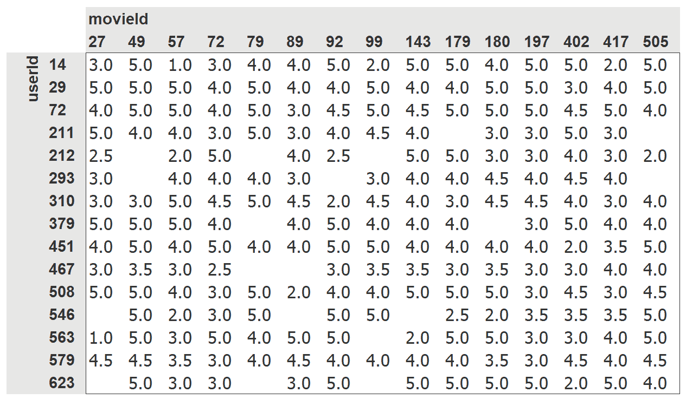
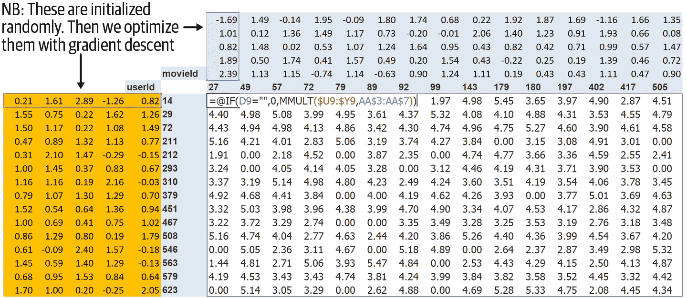
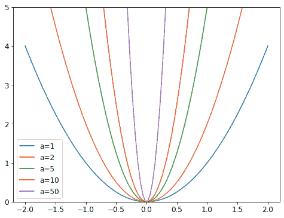
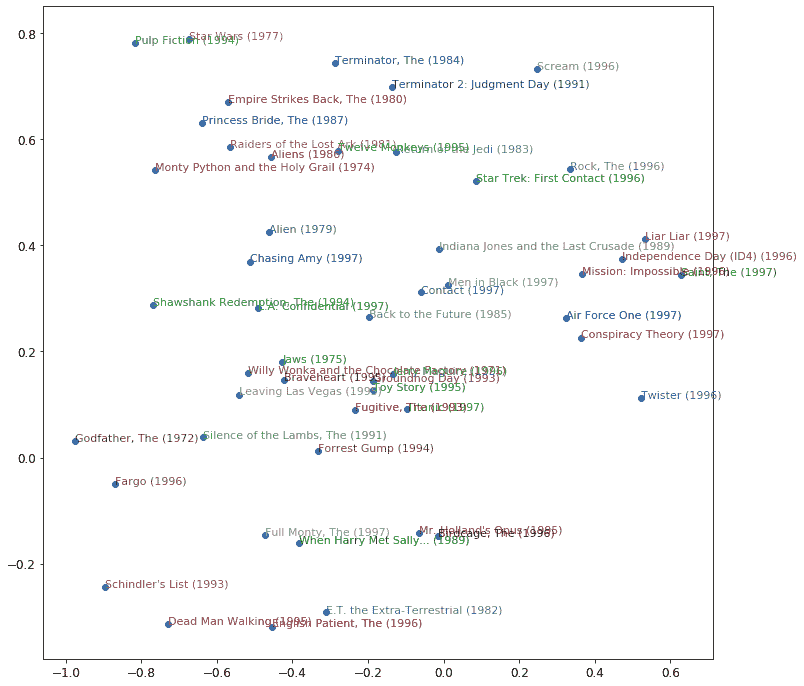

# 第八章：协同过滤深入探讨


解决的一个常见问题是有一定数量的用户和产品，您想推荐哪些产品最有可能对哪些用户有用。存在许多变体：例如，推荐电影（如 Netflix 上），确定在主页上为用户突出显示什么，决定在社交媒体动态中显示什么故事等。解决这个问题的一般方法称为*协同过滤*，工作原理如下：查看当前用户使用或喜欢的产品，找到其他使用或喜欢类似产品的用户，然后推荐那些用户使用或喜欢的其他产品。

例如，在 Netflix 上，您可能观看了很多科幻、充满动作并且是上世纪 70 年代制作的电影。Netflix 可能不知道您观看的这些电影的特定属性，但它将能够看到观看了与您观看相同电影的其他人也倾向于观看其他科幻、充满动作并且是上世纪 70 年代制作的电影。换句话说，要使用这种方法，我们不一定需要了解电影的任何信息，只需要知道谁喜欢观看它们。

这种方法可以解决更一般的一类问题，不一定涉及用户和产品。实际上，在协同过滤中，我们更常用*项目*这个术语，而不是*产品*。项目可以是人们点击的链接、为患者选择的诊断等。

关键的基础概念是*潜在因素*。在 Netflix 的例子中，我们假设您喜欢老式、充满动作的科幻电影。但您从未告诉 Netflix 您喜欢这类电影。Netflix 也不需要在其电影表中添加列，说明哪些电影属于这些类型。尽管如此，必须存在一些关于科幻、动作和电影年龄的潜在概念，这些概念对于至少一些人的电影观看决策是相关的。

在本章中，我们将解决这个电影推荐问题。我们将从获取适合协同过滤模型的一些数据开始。

# 数据初探

我们无法访问 Netflix 的完整电影观看历史数据集，但有一个很好的数据集可供我们使用，称为[MovieLens](https://oreil.ly/gP3Q5)。该数据集包含数千万部电影排名（电影 ID、用户 ID 和数字评分的组合），尽管我们只会使用其中的 10 万部作为示例。如果您感兴趣，可以尝试在完整的 2500 万推荐数据集上复制这种方法，您可以从他们的网站上获取。

该数据集可通过通常的 fastai 函数获得：

```py
from fastai.collab import *
from fastai.tabular.all import *
path = untar_data(URLs.ML_100k)
```

根据*README*，主表位于文件*u.data*中。它是以制表符分隔的，列分别是用户、电影、评分和时间戳。由于这些名称没有编码，我们需要在使用 Pandas 读取文件时指定它们。以下是打开此表并查看的方法：

```py
ratings = pd.read_csv(path/'u.data', delimiter='\t', header=None,
                      names=['user','movie','rating','timestamp'])
ratings.head()
```

|  | 用户 | 电影 | 评分 | 时间戳 |
| --- | --- | --- | --- | --- |
| 0 | 196 | 242 | 3 | 881250949 |
| 1 | 186 | 302 | 3 | 891717742 |
| 2 | 22 | 377 | 1 | 878887116 |
| 3 | 244 | 51 | 2 | 880606923 |
| 4 | 166 | 346 | 1 | 886397596 |

尽管这包含了我们需要的所有信息，但这并不是人类查看这些数据的特别有用的方式。图 8-1 将相同数据交叉制表成了一个人类友好的表格。



###### 图 8-1. 电影和用户的交叉表

我们只选择了一些最受欢迎的电影和观看电影最多的用户，作为这个交叉表示例。这个表格中的空单元格是我们希望我们的模型学会填充的内容。这些是用户尚未评论电影的地方，可能是因为他们还没有观看。对于每个用户，我们希望找出他们最有可能喜欢哪些电影。

如果我们知道每个用户对电影可能属于的每个重要类别的喜好程度，比如流派、年龄、喜欢的导演和演员等，以及我们对每部电影的相同信息，那么填写这个表格的一个简单方法是将这些信息相乘，然后使用组合。例如，假设这些因子的范围在-1 到+1 之间，正数表示更强的匹配，负数表示更弱的匹配，类别是科幻、动作和老电影，那么我们可以表示电影《最后的绝地武士》如下：

```py
last_skywalker = np.array([0.98,0.9,-0.9])
```

在这里，例如，我们将*非常科幻*评分为 0.98，*非常不老*评分为-0.9。我们可以表示喜欢现代科幻动作电影的用户如下：

```py
user1 = np.array([0.9,0.8,-0.6])
```

现在我们可以计算这种组合之间的匹配：

```py
(user1*last_skywalker).sum()
```

```py
2.1420000000000003
```

当我们将两个向量相乘并将结果相加时，这被称为*点积*。它在机器学习中被广泛使用，并构成了矩阵乘法的基础。我们将在第十七章中更多地研究矩阵乘法和点积。

# 术语：点积

将两个向量的元素相乘，然后将结果相加的数学运算。

另一方面，我们可以表示电影《卡萨布兰卡》如下：

```py
casablanca = np.array([-0.99,-0.3,0.8])
```

这种组合之间的匹配如下所示：

```py
(user1*casablanca).sum()
```

```py
-1.611
```

由于我们不知道潜在因子是什么，也不知道如何为每个用户和电影评分，我们应该学习它们。

# 学习潜在因子

在指定模型的结构和学习模型之间，实际上几乎没有什么区别，因为我们可以使用我们的一般梯度下降方法。

这种方法的第一步是随机初始化一些参数。这些参数将是每个用户和电影的一组潜在因子。我们将不得不决定要使用多少个。我们将很快讨论如何选择这些，但为了说明，让我们现在使用 5 个。因为每个用户将有一组这些因子，每部电影也将有一组这些因子，我们可以在交叉表中的用户和电影旁边显示这些随机初始化的值，然后我们可以填写这些组合的点积。例如，图 8-2 显示了在 Microsoft Excel 中的样子，顶部左侧的单元格公式显示为示例。

这种方法的第二步是计算我们的预测。正如我们讨论过的，我们可以通过简单地将每部电影与每个用户进行点积来实现这一点。例如，如果第一个潜在用户因子代表用户喜欢动作电影的程度，第一个潜在电影因子代表电影是否有很多动作，那么如果用户喜欢动作电影并且电影中有很多动作，或者用户不喜欢动作电影并且电影中没有任何动作，这两者的乘积将特别高。另一方面，如果存在不匹配（用户喜欢动作电影但电影不是动作片，或者用户不喜欢动作电影但电影是动作片），乘积将非常低。



###### 图 8-2. 交叉表中的潜在因子

第三步是计算我们的损失。我们可以使用任何损失函数，让我们现在选择均方误差，因为这是一种合理的表示预测准确性的方法。

这就是我们需要的全部内容。有了这个，我们可以使用随机梯度下降来优化我们的参数（潜在因素），以最小化损失。在每一步中，随机梯度下降优化器将使用点积计算每部电影与每个用户之间的匹配，并将其与每个用户给出的每部电影的实际评分进行比较。然后它将计算这个值的导数，并通过学习率乘以这个值来调整权重。经过多次这样的操作，损失会变得越来越好，推荐也会变得越来越好。

要使用通常的`Learner.fit`函数，我们需要将我们的数据放入`DataLoaders`中，所以让我们现在专注于这一点。

# 创建 DataLoaders

在展示数据时，我们宁愿看到电影标题而不是它们的 ID。表`u.item`包含 ID 与标题的对应关系：

```py
movies = pd.read_csv(path/'u.item',  delimiter='|', encoding='latin-1',
                     usecols=(0,1), names=('movie','title'), header=None)
movies.head()
```

|  | 电影 | 标题 |
| --- | --- | --- |
| 0 | 1 | 玩具总动员（1995） |
| 1 | 2 | 黄金眼（1995） |
| 2 | 3 | 四个房间（1995） |
| 3 | 4 | 短小（1995） |
| 4 | 5 | 复制猫（1995） |

我们可以将这个表与我们的`ratings`表合并，以获得按标题分类的用户评分：

```py
ratings = ratings.merge(movies)
ratings.head()
```

|  | 用户 | 电影 | 评分 | 时间戳 | 标题 |
| --- | --- | --- | --- | --- | --- |
| 0 | 196 | 242 | 3 | 881250949 | 科洛亚（1996） |
| 1 | 63 | 242 | 3 | 875747190 | 科洛亚（1996） |
| 2 | 226 | 242 | 5 | 883888671 | 科洛亚（1996） |
| 3 | 154 | 242 | 3 | 879138235 | 科洛亚（1996） |
| 4 | 306 | 242 | 5 | 876503793 | 科洛亚（1996） |

然后我们可以从这个表构建一个`DataLoaders`对象。默认情况下，它将使用第一列作为用户，第二列作为项目（这里是我们的电影），第三列作为评分。在我们的情况下，我们需要更改`item_name`的值，以使用标题而不是 ID：

```py
dls = CollabDataLoaders.from_df(ratings, item_name='title', bs=64)
dls.show_batch()
```

|  | 用户 | 标题 | 评分 |
| --- | --- | --- | --- |
| 0 | 207 | 四个婚礼和一个葬礼（1994） | 3 |
| 1 | 565 | 日残余（1993） | 5 |
| 2 | 506 | 小孩（1995） | 1 |
| 3 | 845 | 追求艾米（1997） | 3 |
| 4 | 798 | 人类（1993） | 2 |
| 5 | 500 | 低俗法则（1986） | 4 |
| 6 | 409 | 无事生非（1993） | 3 |
| 7 | 721 | 勇敢的心（1995） | 5 |
| 8 | 316 | 精神病患者（1960） | 2 |
| 9 | 883 | 判决之夜（1993） | 5 |

为了在 PyTorch 中表示协同过滤，我们不能直接使用交叉表表示，特别是如果我们希望它适应我们的深度学习框架。我们可以将我们的电影和用户潜在因素表表示为简单的矩阵：

```py
n_users  = len(dls.classes['user'])
n_movies = len(dls.classes['title'])
n_factors = 5

user_factors = torch.randn(n_users, n_factors)
movie_factors = torch.randn(n_movies, n_factors)
```

要计算特定电影和用户组合的结果，我们必须查找电影在我们的电影潜在因素矩阵中的索引，以及用户在我们的用户潜在因素矩阵中的索引；然后我们可以在两个潜在因素向量之间进行点积。但*查找索引*不是我们的深度学习模型知道如何执行的操作。它们知道如何执行矩阵乘积和激活函数。

幸运的是，我们可以将*查找索引*表示为矩阵乘积。技巧是用单热编码向量替换我们的索引。这是一个例子，展示了如果我们将一个向量乘以一个表示索引 3 的单热编码向量会发生什么：

```py
one_hot_3 = one_hot(3, n_users).float()
user_factors.t() @ one_hot_3
```

```py
tensor([-0.4586, -0.9915, -0.4052, -0.3621, -0.5908])
```

它给我们的结果与矩阵中索引 3 处的向量相同：

```py
user_factors[3]
```

```py
tensor([-0.4586, -0.9915, -0.4052, -0.3621, -0.5908])
```

如果我们一次为几个索引这样做，我们将得到一个独热编码向量的矩阵，这个操作将是一个矩阵乘法！这将是使用这种架构构建模型的一种完全可接受的方式，只是它会比必要的使用更多的内存和时间。我们知道没有真正的基础原因来存储独热编码向量，或者通过搜索找到数字 1 的出现 - 我们应该能够直接使用整数索引到数组中。因此，大多数深度学习库，包括 PyTorch，都包括一个特殊的层，它就是这样做的；它使用整数索引到一个向量中，但其导数的计算方式使其与使用独热编码向量进行矩阵乘法时完全相同。这被称为*嵌入*。

# 术语：嵌入

通过一个独热编码矩阵相乘，使用计算快捷方式，可以通过直接索引来实现。这是一个非常简单概念的相当花哨的词。您将独热编码矩阵相乘的东西（或者使用计算快捷方式，直接索引）称为*嵌入矩阵*。

在计算机视觉中，我们有一种非常简单的方法通过其 RGB 值获取像素的所有信息：彩色图像中的每个像素由三个数字表示。这三个数字给我们红色、绿色和蓝色，这足以让我们的模型在之后工作。

对于手头的问题，我们没有同样简单的方法来描述用户或电影。可能与流派有关：如果给定用户喜欢爱情片，他们可能会给爱情片更高的评分。其他因素可能是电影是更注重动作还是对话，或者是否有一个特定的演员，用户可能特别喜欢。

我们如何确定用来描述这些数字的数字？答案是，我们不确定。我们将让我们的模型*学习*它们。通过分析用户和电影之间的现有关系，我们的模型可以自己找出看起来重要或不重要的特征。

这就是嵌入。我们将为我们的每个用户和每个电影分配一个特定长度的随机向量（这里，`n_factors=5`），并将使它们成为可学习的参数。这意味着在每一步，当我们通过比较我们的预测和目标来计算损失时，我们将计算损失相对于这些嵌入向量的梯度，并根据 SGD（或其他优化器）的规则更新它们。

一开始，这些数字没有任何意义，因为我们是随机选择的，但在训练结束时，它们将有意义。通过学习关于用户和电影之间关系的现有数据，没有任何其他信息，我们将看到它们仍然获得一些重要特征，并且可以将大片与独立电影、动作片与爱情片等区分开来。

我们现在有能力从头开始创建我们的整个模型。

# 从头开始协同过滤

在我们可以用 PyTorch 编写模型之前，我们首先需要学习面向对象编程和 Python 的基础知识。如果您以前没有进行过面向对象编程，我们将在这里为您进行快速介绍，但我们建议您在继续之前查阅教程并进行一些练习。

面向对象编程中的关键思想是*类*。我们在本书中一直在使用类，比如`DataLoader`、`String`和`Learner`。Python 还让我们很容易地创建新类。这是一个简单类的示例：

```py
class Example:
    def __init__(self, a): self.a = a
    def say(self,x): return f'Hello {self.a}, {x}.'
```

这其中最重要的部分是一个特殊的方法叫做`__init__`（发音为*dunder init*）。在 Python 中，任何像这样用双下划线包围的方法都被认为是特殊的。它表示与这个方法名称相关联一些额外的行为。对于`__init__`，这是 Python 在创建新对象时将调用的方法。因此，这是你可以在对象创建时设置任何需要初始化的状态的地方。当用户构造类的实例时包含的任何参数都将作为参数传递给`__init__`方法。请注意，在类内定义的任何方法的第一个参数是`self`，因此你可以使用它来设置和获取任何你需要的属性：

```py
ex = Example('Sylvain')
ex.say('nice to meet you')
```

```py
'Hello Sylvain, nice to meet you.'
```

还要注意，创建一个新的 PyTorch 模块需要继承自`Module`。*继承*是一个重要的面向对象的概念，在这里我们不会详细讨论——简而言之，它意味着我们可以向现有类添加额外的行为。PyTorch 已经提供了一个`Module`类，它提供了一些我们想要构建的基本基础。因此，我们在定义类的名称后面添加这个*超类*的名称，如下面的示例所示。

你需要知道创建一个新的 PyTorch 模块的最后一件事是，当调用你的模块时，PyTorch 将调用你的类中的一个名为`forward`的方法，并将包含在调用中的任何参数传递给它。这是定义我们的点积模型的类：

```py
class DotProduct(Module):
    def __init__(self, n_users, n_movies, n_factors):
        self.user_factors = Embedding(n_users, n_factors)
        self.movie_factors = Embedding(n_movies, n_factors)

    def forward(self, x):
        users = self.user_factors(x[:,0])
        movies = self.movie_factors(x[:,1])
        return (users * movies).sum(dim=1)
```

如果你以前没有见过面向对象的编程，不用担心；在这本书中你不需要经常使用它。我们在这里提到这种方法只是因为大多数在线教程和文档将使用面向对象的语法。

请注意，模型的输入是一个形状为`batch_size x 2`的张量，其中第一列（`x[:, 0]`）包含用户 ID，第二列（`x[:, 1]`）包含电影 ID。如前所述，我们使用*嵌入*层来表示我们的用户和电影潜在因子的矩阵：

```py
x,y = dls.one_batch()
x.shape
```

```py
torch.Size([64, 2])
```

现在我们已经定义了我们的架构并创建了参数矩阵，我们需要创建一个`Learner`来优化我们的模型。在过去，我们使用了特殊函数，比如`cnn_learner`，为特定应用程序为我们设置了一切。由于我们在这里从头开始做事情，我们将使用普通的`Learner`类：

```py
model = DotProduct(n_users, n_movies, 50)
learn = Learner(dls, model, loss_func=MSELossFlat())
```

现在我们准备拟合我们的模型：

```py
learn.fit_one_cycle(5, 5e-3)
```

| epoch | train_loss | valid_loss | time |
| --- | --- | --- | --- |
| 0 | 1.326261 | 1.295701 | 00:12 |
| 1 | 1.091352 | 1.091475 | 00:11 |
| 2 | 0.961574 | 0.977690 | 00:11 |
| 3 | 0.829995 | 0.893122 | 00:11 |
| 4 | 0.781661 | 0.876511 | 00:12 |

我们可以做的第一件事是让这个模型更好一点，强制这些预测值在 0 到 5 之间。为此，我们只需要使用`sigmoid_range`，就像第六章中那样。我们经验性地发现，最好让范围略微超过 5，所以我们使用`(0, 5.5)`：

```py
class DotProduct(Module):
    def __init__(self, n_users, n_movies, n_factors, y_range=(0,5.5)):
        self.user_factors = Embedding(n_users, n_factors)
        self.movie_factors = Embedding(n_movies, n_factors)
        self.y_range = y_range

    def forward(self, x):
        users = self.user_factors(x[:,0])
        movies = self.movie_factors(x[:,1])
        return sigmoid_range((users * movies).sum(dim=1), *self.y_range)
```

```py
model = DotProduct(n_users, n_movies, 50)
learn = Learner(dls, model, loss_func=MSELossFlat())
learn.fit_one_cycle(5, 5e-3)
```

| epoch | train_loss | valid_loss | time |
| --- | --- | --- | --- |
| 0 | 0.976380 | 1.001455 | 00:12 |
| 1 | 0.875964 | 0.919960 | 00:12 |
| 2 | 0.685377 | 0.870664 | 00:12 |
| 3 | 0.483701 | 0.874071 | 00:12 |
| 4 | 0.385249 | 0.878055 | 00:12 |

这是一个合理的开始，但我们可以做得更好。一个明显缺失的部分是，有些用户在推荐中只是更积极或更消极，有些电影只是比其他电影更好或更差。但在我们的点积表示中，我们没有任何方法来编码这两件事。如果你只能说一部电影，例如，它非常科幻，非常动作导向，非常不老旧，那么你实际上没有办法说大多数人是否喜欢它。

这是因为在这一点上我们只有权重；我们没有偏差。如果我们为每个用户有一个可以添加到我们的分数中的单个数字，对于每部电影也是如此，那么这将非常好地处理这个缺失的部分。因此，首先让我们调整我们的模型架构：

```py
class DotProductBias(Module):
    def __init__(self, n_users, n_movies, n_factors, y_range=(0,5.5)):
        self.user_factors = Embedding(n_users, n_factors)
        self.user_bias = Embedding(n_users, 1)
        self.movie_factors = Embedding(n_movies, n_factors)
        self.movie_bias = Embedding(n_movies, 1)
        self.y_range = y_range

    def forward(self, x):
        users = self.user_factors(x[:,0])
        movies = self.movie_factors(x[:,1])
        res = (users * movies).sum(dim=1, keepdim=True)
        res += self.user_bias(x[:,0]) + self.movie_bias(x[:,1])
        return sigmoid_range(res, *self.y_range)
```

让我们尝试训练这个模型，看看效果如何：

```py
model = DotProductBias(n_users, n_movies, 50)
learn = Learner(dls, model, loss_func=MSELossFlat())
learn.fit_one_cycle(5, 5e-3)
```

| epoch | train_loss | valid_loss | time |
| --- | --- | --- | --- |
| 0 | 0.929161 | 0.936303 | 00:13 |
| 1 | 0.820444 | 0.861306 | 00:13 |
| 2 | 0.621612 | 0.865306 | 00:14 |
| 3 | 0.404648 | 0.886448 | 00:13 |
| 4 | 0.292948 | 0.892580 | 00:13 |

但是，结果并不比之前更好（至少在训练结束时）。为什么呢？如果我们仔细观察这两次训练，我们会发现验证损失在中间停止改善并开始变差。正如我们所见，这是过拟合的明显迹象。在这种情况下，没有办法使用数据增强，所以我们将不得不使用另一种正则化技术。一个有帮助的方法是*权重衰减*。

## Weight Decay

权重衰减，或*L2 正则化*，包括将所有权重的平方和添加到损失函数中。为什么这样做？因为当我们计算梯度时，它会为梯度增加一个贡献，鼓励权重尽可能小。

为什么它可以防止过拟合？这个想法是，系数越大，损失函数中的峡谷就会越尖锐。如果我们以抛物线的基本例子`y = a * (x**2)`为例，`a`越大，抛物线就越*狭窄*：



因此，让我们的模型学习高参数可能导致它用一个过于复杂、具有非常尖锐变化的函数拟合训练集中的所有数据点，这将导致过拟合。

限制我们的权重过大会阻碍模型的训练，但会产生一个更好泛化的状态。回顾一下理论，权重衰减（或`wd`）是一个控制我们在损失中添加的平方和的参数（假设`parameters`是所有参数的张量）：

```py
loss_with_wd = loss + wd * (parameters**2).sum()
```

然而，在实践中，计算那个大和并将其添加到损失中将非常低效（也许在数值上不稳定）。如果你还记得一点高中数学，你可能会记得`p**2`关于`p`的导数是`2*p`，所以将那个大和添加到我们的损失中，实际上等同于这样做：

```py
parameters.grad += wd * 2 * parameters
```

实际上，由于`wd`是我们选择的一个参数，我们可以使它变为两倍大，所以在这个方程中我们甚至不需要`*2`。要在 fastai 中使用权重衰减，在调用`fit`或`fit_one_cycle`时传递`wd`即可（可以同时传递）：

```py
model = DotProductBias(n_users, n_movies, 50)
learn = Learner(dls, model, loss_func=MSELossFlat())
learn.fit_one_cycle(5, 5e-3, wd=0.1)
```

| epoch | train_loss | valid_loss | time |
| --- | --- | --- | --- |
| 0 | 0.972090 | 0.962366 | 00:13 |
| 1 | 0.875591 | 0.885106 | 00:13 |
| 2 | 0.723798 | 0.839880 | 00:13 |
| 3 | 0.586002 | 0.823225 | 00:13 |
| 4 | 0.490980 | 0.823060 | 00:13 |

好多了！

## 创建我们自己的嵌入模块

到目前为止，我们使用`Embedding`而没有考虑它是如何工作的。让我们重新创建`DotProductBias`，*不*使用这个类。我们需要为每个嵌入初始化一个随机权重矩阵。然而，我们必须小心。回想一下第四章中提到的，优化器要求能够从模块的`parameters`方法中获取模块的所有参数。然而，这并不是完全自动发生的。如果我们只是将一个张量作为`Module`的属性添加，它不会包含在`parameters`中：

```py
class T(Module):
    def __init__(self): self.a = torch.ones(3)

L(T().parameters())
```

```py
(#0) []
```

要告诉`Module`我们希望将一个张量视为参数，我们必须将其包装在`nn.Parameter`类中。这个类不添加任何功能（除了自动为我们调用`requires_grad_`）。它只用作一个“标记”，以显示要包含在`parameters`中的内容：

```py
class T(Module):
    def __init__(self): self.a = nn.Parameter(torch.ones(3))

L(T().parameters())
```

```py
(#1) [Parameter containing:
tensor([1., 1., 1.], requires_grad=True)]
```

所有 PyTorch 模块都使用`nn.Parameter`来表示任何可训练参数，这就是为什么我们直到现在都不需要显式使用这个包装器：

```py
class T(Module):
    def __init__(self): self.a = nn.Linear(1, 3, bias=False)

t = T()
L(t.parameters())
```

```py
(#1) [Parameter containing:
tensor([[-0.9595],
        [-0.8490],
        [ 0.8159]], requires_grad=True)]
```

```py
type(t.a.weight)
```

```py
torch.nn.parameter.Parameter
```

我们可以创建一个张量作为参数，进行随机初始化，如下所示：

```py
def create_params(size):
    return nn.Parameter(torch.zeros(*size).normal_(0, 0.01))
```

让我们再次使用这个来创建`DotProductBias`，但不使用`Embedding`：

```py
class DotProductBias(Module):
    def __init__(self, n_users, n_movies, n_factors, y_range=(0,5.5)):
        self.user_factors = create_params([n_users, n_factors])
        self.user_bias = create_params([n_users])
        self.movie_factors = create_params([n_movies, n_factors])
        self.movie_bias = create_params([n_movies])
        self.y_range = y_range

    def forward(self, x):
        users = self.user_factors[x[:,0]]
        movies = self.movie_factors[x[:,1]]
        res = (users*movies).sum(dim=1)
        res += self.user_bias[x[:,0]] + self.movie_bias[x[:,1]]
        return sigmoid_range(res, *self.y_range)
```

然后让我们再次训练它，以检查我们是否得到了与前一节中看到的大致相同的结果：

```py
model = DotProductBias(n_users, n_movies, 50)
learn = Learner(dls, model, loss_func=MSELossFlat())
learn.fit_one_cycle(5, 5e-3, wd=0.1)
```

| epoch | train_loss | valid_loss | time |
| --- | --- | --- | --- |
| 0 | 0.962146 | 0.936952 | 00:14 |
| 1 | 0.858084 | 0.884951 | 00:14 |
| 2 | 0.740883 | 0.838549 | 00:14 |
| 3 | 0.592497 | 0.823599 | 00:14 |
| 4 | 0.473570 | 0.824263 | 00:14 |

现在，让我们看看我们的模型学到了什么。

# 解释嵌入和偏差

我们的模型已经很有用，因为它可以为我们的用户提供电影推荐，但看到它发现了什么参数也很有趣。最容易解释的是偏差。以下是偏差向量中值最低的电影：

```py
movie_bias = learn.model.movie_bias.squeeze()
idxs = movie_bias.argsort()[:5]
[dls.classes['title'][i] for i in idxs]
```

```py
['Children of the Corn: The Gathering (1996)',
 'Lawnmower Man 2: Beyond Cyberspace (1996)',
 'Beautician and the Beast, The (1997)',
 'Crow: City of Angels, The (1996)',
 'Home Alone 3 (1997)']
```

想想这意味着什么。它表明对于这些电影中的每一部，即使用户与其潜在因素非常匹配（稍后我们将看到，这些因素往往代表动作水平、电影年龄等等），他们通常仍然不喜欢它。我们本可以简单地按照电影的平均评分对其进行排序，但查看学到的偏差告诉我们更有趣的事情。它告诉我们不仅仅是电影是人们不喜欢观看的类型，而且即使是他们本来会喜欢的类型，人们也倾向于不喜欢观看！同样地，以下是偏差最高的电影：

```py
idxs = movie_bias.argsort(descending=True)[:5]
[dls.classes['title'][i] for i in idxs]
```

```py
['L.A. Confidential (1997)',
 'Titanic (1997)',
 'Silence of the Lambs, The (1991)',
 'Shawshank Redemption, The (1994)',
 'Star Wars (1977)']
```

因此，例如，即使您通常不喜欢侦探电影，您可能会喜欢*LA 机密*！

直接解释嵌入矩阵并不那么容易。对于人类来说，因素太多了。但有一种技术可以提取出这种矩阵中最重要的基础*方向*，称为*主成分分析*（PCA）。我们不会在本书中详细讨论这个，因为您要成为深度学习从业者并不特别重要，但如果您感兴趣，我们建议您查看 fast.ai 课程[面向程序员的计算线性代数](https://oreil.ly/NLj2R)。图 8-3 显示了基于两个最强的 PCA 组件的电影的外观。



###### 图 8-3. 基于两个最强的 PCA 组件的电影表示

我们可以看到模型似乎已经发现了*经典*与*流行文化*电影的概念，或者这里代表的是*广受好评*。

# 杰里米说

无论我训练多少模型，我永远不会停止被这些随机初始化的数字组合所感动和惊讶，这些数字通过如此简单的机制训练，竟然能够自己发现关于我的数据的东西。我几乎觉得可以欺骗，我可以创建一个能够做有用事情的代码，而从未真正告诉它如何做这些事情！

我们从头开始定义了我们的模型，以教给您内部情况，但您可以直接使用 fastai 库来构建它。我们将在下一节看看如何做到这一点。

## 使用 fastai.collab

我们可以使用 fastai 的`collab_learner`使用先前显示的确切结构创建和训练协同过滤模型：

```py
learn = collab_learner(dls, n_factors=50, y_range=(0, 5.5))
```

```py
learn.fit_one_cycle(5, 5e-3, wd=0.1)
```

| epoch | train_loss | valid_loss | time |
| --- | --- | --- | --- |
| 0 | 0.931751 | 0.953806 | 00:13 |
| 1 | 0.851826 | 0.878119 | 00:13 |
| 2 | 0.715254 | 0.834711 | 00:13 |
| 3 | 0.583173 | 0.821470 | 00:13 |
| 4 | 0.496625 | 0.821688 | 00:13 |

通过打印模型可以看到层的名称：

```py
learn.model
```

```py
EmbeddingDotBias(
  (u_weight): Embedding(944, 50)
  (i_weight): Embedding(1635, 50)
  (u_bias): Embedding(944, 1)
  (i_bias): Embedding(1635, 1)
)
```

我们可以使用这些来复制我们在上一节中所做的任何分析，例如：

```py
movie_bias = learn.model.i_bias.weight.squeeze()
idxs = movie_bias.argsort(descending=True)[:5]
[dls.classes['title'][i] for i in idxs]
```

```py
['Titanic (1997)',
 "Schindler's List (1993)",
 'Shawshank Redemption, The (1994)',
 'L.A. Confidential (1997)',
 'Silence of the Lambs, The (1991)']
```

我们可以使用这些学到的嵌入来查看*距离*。

## 嵌入距离

在二维地图上，我们可以通过使用毕达哥拉斯定理的公式来计算两个坐标之间的距离：<math alttext="StartRoot x squared plus y squared EndRoot"><msqrt><mrow><msup><mi>x</mi> <mn>2</mn></msup> <mo>+</mo> <msup><mi>y</mi> <mn>2</mn></msup></mrow></msqrt></math>（假设*x*和*y*是每个轴上坐标之间的距离）。对于一个 50 维的嵌入，我们可以做完全相同的事情，只是将所有 50 个坐标距离的平方相加。

如果有两部几乎相同的电影，它们的嵌入向量也必须几乎相同，因为喜欢它们的用户几乎完全相同。这里有一个更一般的想法：电影的相似性可以由喜欢这些电影的用户的相似性来定义。这直接意味着两部电影的嵌入向量之间的距离可以定义这种相似性。我们可以利用这一点找到与“沉默的羔羊”最相似的电影：

```py
movie_factors = learn.model.i_weight.weight
idx = dls.classes['title'].o2i['Silence of the Lambs, The (1991)']
distances = nn.CosineSimilarity(dim=1)(movie_factors, movie_factors[idx][None])
idx = distances.argsort(descending=True)[1]
dls.classes['title'][idx]
```

```py
'Dial M for Murder (1954)'
```

现在我们已经成功训练了一个模型，让我们看看如何处理没有用户数据的情况。我们如何向新用户推荐？

# 引导协同过滤模型

在实践中使用协同过滤模型的最大挑战是“引导问题”。这个问题的最极端版本是没有用户，因此没有历史可供学习。您向您的第一个用户推荐什么产品？

但即使您是一家历史悠久的公司，拥有长期的用户交易记录，您仍然会面临一个问题：当新用户注册时，您该怎么办？实际上，当您向您的产品组合添加新产品时，您该怎么办？这个问题没有魔法解决方案，而我们建议的解决方案实际上只是“运用常识”的变体。您可以将新用户分配为其他用户所有嵌入向量的平均值，但这会带来一个问题，即该潜在因素的特定组合可能并不常见（例如，科幻因素的平均值可能很高，而动作因素的平均值可能很低，但很少有人喜欢科幻而不喜欢动作）。最好选择一个特定用户来代表“平均品味”。

更好的方法是使用基于用户元数据的表格模型来构建您的初始嵌入向量。当用户注册时，考虑一下您可以询问哪些问题来帮助您了解他们的口味。然后，您可以创建一个模型，其中因变量是用户的嵌入向量，而自变量是您问他们的问题的结果，以及他们的注册元数据。我们将在下一节中看到如何创建这些类型的表格模型。（您可能已经注意到，当您注册 Pandora 和 Netflix 等服务时，它们往往会问您一些关于您喜欢的电影或音乐类型的问题；这就是它们如何提出您的初始协同过滤推荐的方式。）

需要注意的一点是，一小部分非常热情的用户可能最终会有效地为整个用户群设置推荐。这是一个非常常见的问题，例如，在电影推荐系统中。看动漫的人往往会看很多动漫，而且不怎么看其他东西，花很多时间在网站上评分。因此，动漫往往在许多“有史以来最佳电影”列表中被过度代表。在这种特殊情况下，很明显您有一个代表性偏见的问题，但如果偏见发生在潜在因素中，可能一点也不明显。

这样的问题可能会改变您的用户群体的整体构成，以及您系统的行为。这特别是由于正反馈循环。如果您的一小部分用户倾向于设定您的推荐系统的方向，他们自然会吸引更多类似他们的人来到您的系统。这当然会放大原始的表征偏见。这种偏见是一种被指数级放大的自然倾向。您可能已经看到一些公司高管对他们的在线平台如何迅速恶化表示惊讶，以至于表达了与创始人价值观不符的价值观。在存在这种类型的反馈循环的情况下，很容易看到这种分歧如何迅速发生，以及以一种隐藏的方式，直到为时已晚。

在这样一个自我强化的系统中，我们可能应该预期这些反馈循环是常态，而不是例外。因此，您应该假设您会看到它们，为此做好计划，并提前确定如何处理这些问题。尝试考虑反馈循环可能在您的系统中表示的所有方式，以及您如何能够在数据中识别它们。最终，这又回到了我们关于如何在推出任何类型的机器学习系统时避免灾难的最初建议。这一切都是为了确保有人参与其中；有仔细的监控，以及一个渐进和周到的推出。

我们的点积模型效果相当不错，并且是许多成功的现实世界推荐系统的基础。这种协同过滤方法被称为*概率矩阵分解*（PMF）。另一种方法，通常在给定相同数据时效果类似，是深度学习。

# 协同过滤的深度学习

将我们的架构转换为深度学习模型的第一步是获取嵌入查找的结果并将这些激活连接在一起。这给我们一个矩阵，然后我们可以按照通常的方式通过线性层和非线性传递它们。

由于我们将连接嵌入矩阵，而不是取它们的点积，所以两个嵌入矩阵可以具有不同的大小（不同数量的潜在因素）。fastai 有一个函数`get_emb_sz`，根据 fast.ai 发现在实践中往往效果良好的启发式方法，返回推荐的嵌入矩阵大小：

```py
embs = get_emb_sz(dls)
embs
```

```py
[(944, 74), (1635, 101)]
```

让我们实现这个类：

```py
class CollabNN(Module):
    def __init__(self, user_sz, item_sz, y_range=(0,5.5), n_act=100):
        self.user_factors = Embedding(*user_sz)
        self.item_factors = Embedding(*item_sz)
        self.layers = nn.Sequential(
            nn.Linear(user_sz[1]+item_sz[1], n_act),
            nn.ReLU(),
            nn.Linear(n_act, 1))
        self.y_range = y_range

    def forward(self, x):
        embs = self.user_factors(x[:,0]),self.item_factors(x[:,1])
        x = self.layers(torch.cat(embs, dim=1))
        return sigmoid_range(x, *self.y_range)
```

并使用它创建一个模型：

```py
model = CollabNN(*embs)
```

`CollabNN`以与本章中先前类似的方式创建我们的`Embedding`层，只是现在我们使用`embs`大小。`self.layers`与我们在第四章为 MNIST 创建的迷你神经网络是相同的。然后，在`forward`中，我们应用嵌入，连接结果，并通过迷你神经网络传递。最后，我们像以前的模型一样应用`sigmoid_range`。

让我们看看它是否训练：

```py
learn = Learner(dls, model, loss_func=MSELossFlat())
learn.fit_one_cycle(5, 5e-3, wd=0.01)
```

| epoch | train_loss | valid_loss | time |
| --- | --- | --- | --- |
| 0 | 0.940104 | 0.959786 | 00:15 |
| 1 | 0.893943 | 0.905222 | 00:14 |
| 2 | 0.865591 | 0.875238 | 00:14 |
| 3 | 0.800177 | 0.867468 | 00:14 |
| 4 | 0.760255 | 0.867455 | 00:14 |

如果您在调用`collab_learner`时传递`use_nn=True`（包括为您调用`get_emb_sz`），fastai 在`fastai.collab`中提供了这个模型，并且让您轻松创建更多层。例如，在这里我们创建了两个隐藏层，分别为大小 100 和 50：

```py
learn = collab_learner(dls, use_nn=True, y_range=(0, 5.5), layers=[100,50])
learn.fit_one_cycle(5, 5e-3, wd=0.1)
```

| epoch | train_loss | valid_loss | time |
| --- | --- | --- | --- |
| 0 | 1.002747 | 0.972392 | 00:16 |
| 1 | 0.926903 | 0.922348 | 00:16 |
| 2 | 0.877160 | 0.893401 | 00:16 |
| 3 | 0.838334 | 0.865040 | 00:16 |
| 4 | 0.781666 | 0.864936 | 00:16 |

`learn.model`是`EmbeddingNN`类型的对象。让我们看一下 fastai 对这个类的代码：

```py
@delegates(TabularModel)
class EmbeddingNN(TabularModel):
    def __init__(self, emb_szs, layers, **kwargs):
        super().__init__(emb_szs, layers=layers, n_cont=0, out_sz=1, **kwargs)
```

哇，这不是很多代码！这个类*继承*自`TabularModel`，这是它获取所有功能的地方。在`__init__`中，它调用`TabularModel`中的相同方法，传递`n_cont=0`和`out_sz=1`；除此之外，它只传递它收到的任何参数。

尽管`EmbeddingNN`的结果比点积方法稍差一些（这显示了为领域精心构建架构的力量），但它确实允许我们做一件非常重要的事情：我们现在可以直接将其他用户和电影信息、日期和时间信息或任何可能与推荐相关的信息纳入考虑。这正是`TabularModel`所做的。事实上，我们现在已经看到，`EmbeddingNN`只是一个`TabularModel`，其中`n_cont=0`和`out_sz=1`。因此，我们最好花一些时间了解`TabularModel`，以及如何使用它获得出色的结果！我们将在下一章中做到这一点。

# 结论

对于我们的第一个非计算机视觉应用，我们研究了推荐系统，并看到梯度下降如何从评分历史中学习有关项目的内在因素或偏差。然后，这些因素可以为我们提供有关数据的信息。

我们还在 PyTorch 中构建了我们的第一个模型。在书的下一部分中，我们将做更多这样的工作，但首先，让我们完成对深度学习的其他一般应用的探讨，继续处理表格数据。

# 问卷

1.  协同过滤解决了什么问题？

1.  它是如何解决的？

1.  为什么协同过滤预测模型可能无法成为非常有用的推荐系统？

1.  协同过滤数据的交叉表表示是什么样的？

1.  编写代码创建 MovieLens 数据的交叉表表示（您可能需要进行一些网络搜索！）。

1.  什么是潜在因素？为什么它是“潜在”的？

1.  什么是点积？使用纯 Python 和列表手动计算点积。

1.  `pandas.DataFrame.merge`是做什么的？

1.  什么是嵌入矩阵？

1.  嵌入和一个独热编码向量矩阵之间的关系是什么？

1.  如果我们可以使用独热编码向量来做同样的事情，为什么我们需要`Embedding`？

1.  在我们开始训练之前，嵌入包含什么内容（假设我们没有使用预训练模型）？

1.  创建一个类（尽量不要偷看！）并使用它。

1.  `x[:,0]`返回什么？

1.  重写`DotProduct`类（尽量不要偷看！）并用它训练模型。

1.  在 MovieLens 中使用什么样的损失函数是好的？为什么？

1.  如果我们在 MovieLens 中使用交叉熵损失会发生什么？我们需要如何更改模型？

1.  点积模型中偏差的用途是什么？

1.  权重衰减的另一个名称是什么？

1.  写出权重衰减的方程（不要偷看！）。

1.  写出权重衰减的梯度方程。为什么它有助于减少权重？

1.  为什么减少权重会导致更好的泛化？

1.  PyTorch 中的`argsort`是做什么的？

1.  对电影偏差进行排序是否会得到与按电影平均评分相同的结果？为什么/为什么不？

1.  如何打印模型中层的名称和详细信息？

1.  协同过滤中的“自举问题”是什么？

1.  如何处理新用户的自举问题？对于新电影呢？

1.  反馈循环如何影响协同过滤系统？

1.  在协同过滤中使用神经网络时，为什么我们可以为电影和用户使用不同数量的因素？

1.  为什么在`CollabNN`模型中有一个`nn.Sequential`？

1.  如果我们想要向协同过滤模型添加有关用户和项目的元数据，或者有关日期和时间等信息，应该使用什么样的模型？

## 进一步研究

1.  看看`Embedding`版本的`DotProductBias`和`create_params`版本之间的所有差异，并尝试理解为什么需要进行每一项更改。如果不确定，尝试撤销每个更改以查看发生了什么。（注意：甚至在`forward`中使用的括号类型也已更改！）

1.  找到另外三个协同过滤正在使用的领域，并在这些领域中确定这种方法的优缺点。

1.  使用完整的 MovieLens 数据集完成这个笔记本，并将结果与在线基准进行比较。看看你能否提高准确性。在书的网站和 fast.ai 论坛上寻找想法。请注意，完整数据集中有更多列，看看你是否也可以使用这些列（下一章可能会给你一些想法）。

1.  为 MovieLens 创建一个使用交叉熵损失的模型，并将其与本章中的模型进行比较。
