# 第九章：表格建模深入探讨


表格建模将数据以表格形式（如电子表格或 CSV 文件）呈现。目标是基于其他列中的值来预测一列中的值。在本章中，我们将不仅看深度学习，还将看更一般的机器学习技术，如随机森林，因为根据您的问题，它们可能会给出更好的结果。

我们将看看我们应该如何预处理和清理数据，以及如何在训练后解释我们模型的结果，但首先我们将看看如何通过使用嵌入将包含类别的列馈送到期望数字的模型中。

# 分类嵌入

在表格数据中，某些列可能包含数值数据，如“年龄”，而其他列包含字符串值，如“性别”。数值数据可以直接输入模型（经过一些可选的预处理），但其他列需要转换为数字。由于这些值对应不同的类别，我们通常将这种类型的变量称为*分类变量*。第一种类型被称为*连续* *变量*。

# 术语：连续和分类变量

连续变量是数值数据，如“年龄”，可以直接输入模型，因为可以直接进行加法和乘法。分类变量包含多个离散级别，如“电影 ID”，对于这些级别，加法和乘法没有意义（即使它们以数字形式存储）。

2015 年底，[Rossmann 销售竞赛](https://oreil.ly/U85_1)在 Kaggle 上举行。参赛者获得了有关德国各个商店的各种信息，并被要求尝试预测若干天的销售额。目标是帮助公司适当管理库存，并能够满足需求而不必持有不必要的库存。官方训练集提供了大量有关商店的信息。允许参赛者使用额外的数据，只要这些数据是公开的并对所有参与者可用。

其中一位金牌得主使用了深度学习，在已知的最先进深度学习表格模型的早期示例中。他们的方法涉及远少于其他金牌得主的基于领域知识的特征工程。论文[“分类变量的实体嵌入”](https://oreil.ly/VmgoU)描述了他们的方法。在[书籍网站](https://book.fast.ai)的在线专章中，我们展示了如何从头开始复制它，并获得论文中显示的相同准确性。在论文的摘要中，作者（Cheng Guo 和 Felix Bekhahn）说：

> 实体嵌入不仅可以减少内存使用量并加快神经网络的速度，与独热编码相比，更重要的是通过将相似值映射到嵌入空间中的相邻位置，揭示了分类变量的固有属性...[它]在具有大量高基数特征的数据集中特别有用，其他方法往往容易过拟合...由于实体嵌入为分类变量定义了距离度量，因此可以用于可视化分类数据和数据聚类。

当我们构建协同过滤模型时，我们已经注意到了所有这些要点。然而，我们可以清楚地看到这些见解远不止于协同过滤。

该论文还指出（正如我们在前一章中讨论的），嵌入层与在每个独热编码输入层之后放置普通线性层完全等效。作者使用图 9-1 中的图表来展示这种等效性。请注意，“密集层”是与“线性层”相同含义的术语，而独热编码层代表输入。

这一见解很重要，因为我们已经知道如何训练线性层，所以从架构和训练算法的角度来看，嵌入层只是另一层。我们在前一章中实践中也看到了这一点，当我们构建了一个与这个图表完全相同的协同过滤神经网络时。

就像我们分析了电影评论的嵌入权重一样，实体嵌入论文的作者分析了他们的销售预测模型的嵌入权重。他们发现的结果非常惊人，并展示了他们的第二个关键见解：嵌入将分类变量转换为连续且有意义的输入。

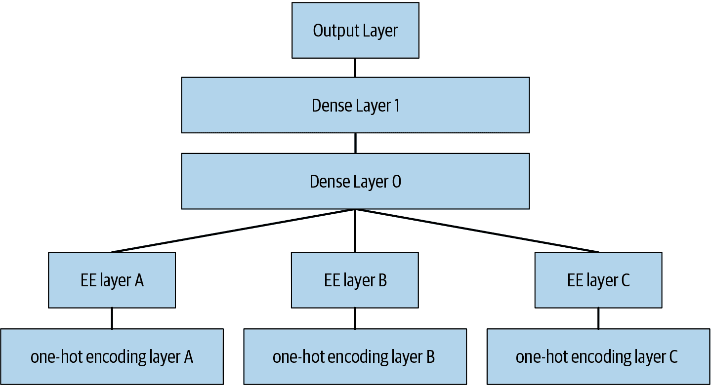

###### 图 9-1。神经网络中的实体嵌入（由 Cheng Guo 和 Felix Berkhahn 提供）

图 9-2 中的图像说明了这些想法。它们基于论文中使用的方法，以及我们添加的一些分析。

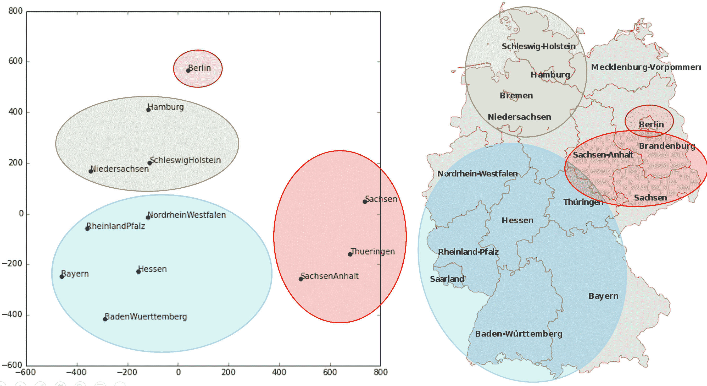

###### 图 9-2。状态嵌入和地图（由 Cheng Guo 和 Felix Berkhahn 提供）

左侧是`State`类别可能值的嵌入矩阵图。对于分类变量，我们称变量的可能值为其“级别”（或“类别”或“类别”），因此这里一个级别是“柏林”，另一个是“汉堡”等。右侧是德国地图。德国各州的实际物理位置不是提供的数据的一部分，但模型本身学会了它们必须在哪里，仅基于商店销售的行为！

您还记得我们谈论过嵌入之间的*距离*吗？论文的作者绘制了商店嵌入之间的距离与商店之间的实际地理距离之间的关系（参见图 9-3）。他们发现它们非常接近！

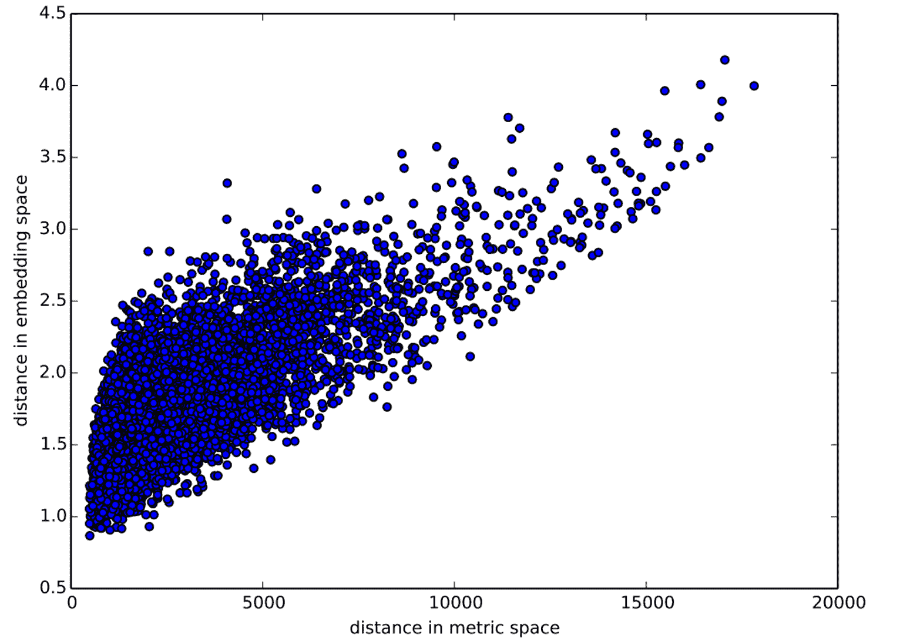

###### 图 9-3。存储距离（由 Cheng Guo 和 Felix Berkhahn 提供）

我们甚至尝试绘制一周中的日期和一年中的月份的嵌入，发现在日历上彼此相邻的日期和月份也在嵌入中靠近，如图 9-4 所示。

这两个示例中突出的是，我们向模型提供了基本关于离散实体的分类数据（例如德国各州或一周中的日期），然后模型学习了这些实体的嵌入，定义了它们之间的连续距离概念。由于嵌入距离是基于数据中的真实模式学习的，因此该距离往往与我们的直觉相匹配。

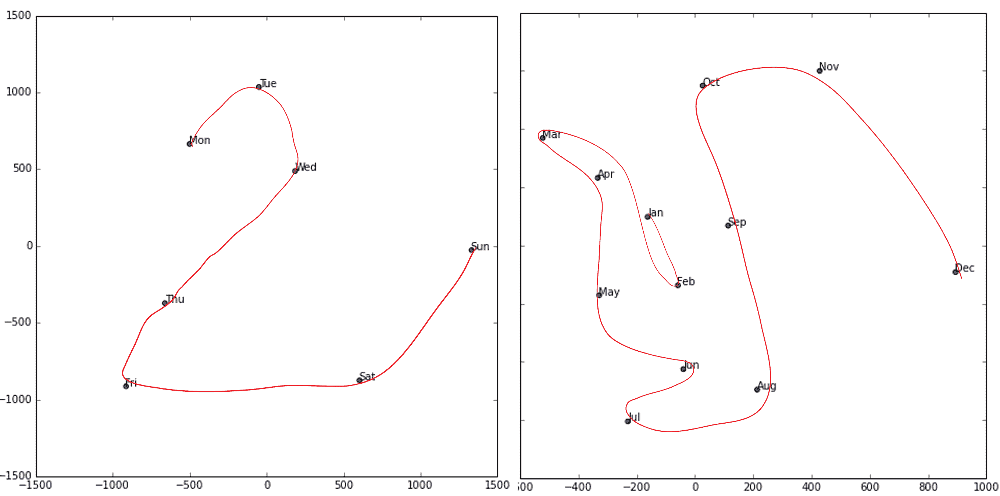

###### 图 9-4。日期嵌入（由 Cheng Guo 和 Felix Berkhahn 提供）

此外，嵌入本身是有价值的，因为模型更擅长理解连续变量。这并不奇怪，因为模型由许多连续参数权重和连续激活值构成，这些值通过梯度下降（一种用于找到连续函数最小值的学习算法）进行更新。

另一个好处是，我们可以将连续嵌入值与真正连续的输入数据简单地结合在一起：我们只需连接变量并将连接输入到我们的第一个密集层中。换句话说，在与原始连续输入数据交互之前，原始分类数据通过嵌入层进行转换。这就是 fastai 和 Guo 和 Berkhahn 处理包含连续和分类变量的表格模型的方式。

使用这种连接方法的一个示例是谷歌在 Google Play 上进行推荐的方式，正如在论文“广泛和深度学习用于推荐系统”中所解释的那样。图 9-5 说明了这一点。

有趣的是，谷歌团队结合了我们在上一章看到的两种方法：点积（他们称之为*交叉乘积*）和神经网络方法。

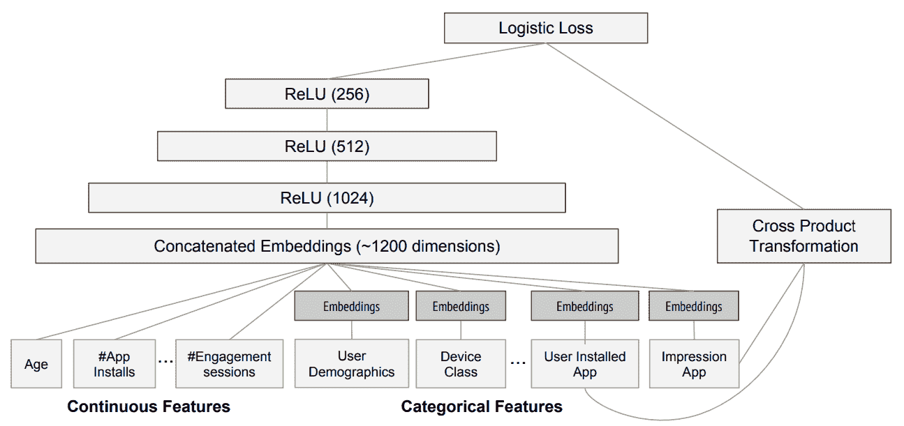

###### 图 9-5. 谷歌 Play 推荐系统

让我们暂停一下。到目前为止，解决我们所有建模问题的方法都是*训练一个深度学习模型*。确实，对于像图像、声音、自然语言文本等复杂的非结构化数据，这是一个相当好的经验法则。深度学习在协同过滤方面也表现得非常出色。但对于分析表格数据来说，它并不总是最佳的起点。

# 超越深度学习

大多数机器学习课程会向你介绍几十种算法，简要介绍它们背后的数学原理，可能还会有一个玩具示例。你会被展示的各种技术茫然不解，对如何应用它们几乎没有实际的理解。

好消息是，现代机器学习可以归结为几种广泛适用的关键技术。最近的研究表明，绝大多数数据集最适合用两种方法建模：

+   决策树集成（即随机森林和梯度提升机），主要用于结构化数据（比如大多数公司数据库表中可能找到的数据）

+   使用 SGD 学习的多层神经网络（即浅层和/或深度学习），主要用于非结构化数据（比如音频、图像和自然语言）

尽管深度学习几乎总是在非结构化数据方面明显优越，但对于许多种结构化数据，这两种方法往往给出相似的结果。但决策树集成往往训练更快，通常更容易解释，不需要特殊的 GPU 硬件进行规模推断，并且通常需要更少的超参数调整。它们也比深度学习流行得早得多，因此在它们周围有更成熟的工具和文档生态系统。

最重要的是，解释表格数据模型的关键步骤对于决策树集成来说要容易得多。有工具和方法可以回答相关问题，比如：数据集中哪些列对你的预测最重要？它们与因变量有什么关系？它们如何相互作用？哪些特定特征对某个特定观察最重要？

因此，决策树集成是我们分析新表格数据集的第一步方法。

这一准则的例外情况是当数据集符合以下条件之一时：

+   有一些高基数分类变量非常重要（“基数”指代表示类别的离散级别的数量，因此高基数分类变量是指像邮政编码这样可能有数千个可能级别的变量）。

+   有一些包含最好用神经网络理解的数据的列，比如纯文本数据。

在实践中，当我们处理符合这些特殊条件的数据集时，我们总是尝试决策树集成和深度学习，看哪个效果更好。在我们的协同过滤示例中，深度学习可能是一个有用的方法，因为我们至少有两个高基数分类变量：用户和电影。但在实践中，事情往往没有那么明确，通常会有高基数和低基数分类变量以及连续变量的混合。

无论如何，很明显我们需要将决策树集成添加到我们的建模工具箱中！

到目前为止，我们几乎所有的繁重工作都是使用 PyTorch 和 fastai 完成的。但是这些库主要设计用于进行大量矩阵乘法和导数计算（即，类似深度学习的操作！）。决策树根本不依赖于这些操作，因此 PyTorch 没有太多用处。

相反，我们将主要依赖一个名为*scikit-learn*（也称为*sklearn*）的库。Scikit-learn 是一个流行的库，用于创建机器学习模型，使用的方法不包括深度学习。此外，我们需要进行一些表格数据处理和查询，因此我们将使用 Pandas 库。最后，我们还需要 NumPy，因为这是 sklearn 和 Pandas 都依赖的主要数值编程库。

我们没有时间在本书中深入研究所有这些库，因此我们只会涉及每个库的一些主要部分。对于更深入的讨论，我们强烈建议阅读 Wes McKinney 的[*Python 数据分析*](http://shop.oreilly.com/product/0636920050896.do)（O'Reilly）。McKinney 是 Pandas 的创始人，因此您可以确信信息是准确的！

首先，让我们收集我们将使用的数据。

# 数据集

本章中使用的数据集来自于蓝皮书对推土机的 Kaggle 竞赛，该竞赛的描述如下：“比赛的目标是根据其使用情况、设备类型和配置来预测拍卖中特定重型设备的销售价格。数据来源于拍卖结果发布，并包括有关使用情况和设备配置的信息。”

这是一种非常常见的数据集类型和预测问题，类似于您在项目或工作场所中可能遇到的情况。该数据集可以在 Kaggle 上下载，Kaggle 是一个举办数据科学竞赛的网站。

## Kaggle 竞赛

Kaggle 是一个非常棒的资源，适合有志成为数据科学家或任何希望提高机器学习技能的人。没有什么比亲自动手实践并获得实时反馈来帮助您提高技能。

Kaggle 提供了以下内容：

+   有趣的数据集

+   关于您的表现的反馈

+   排行榜可以看到什么是好的，什么是可能的，以及什么是最先进的

+   获奖选手分享有用的技巧和技术的博客文章

到目前为止，我们所有的数据集都可以通过 fastai 的集成数据集系统下载。然而，在本章中我们将使用的数据集只能从 Kaggle 获取。因此，您需要在该网站上注册，然后转到[比赛页面](https://oreil.ly/B9wfd)。在该页面上点击规则，然后点击我理解并接受。（尽管比赛已经结束，您不会参加，但您仍然需要同意规则才能下载数据。）

下载 Kaggle 数据集的最简单方法是使用 Kaggle API。您可以通过使用`pip`安装它，并在笔记本单元格中运行以下命令：

```py
!pip install kaggle
```

使用 Kaggle API 需要一个 API 密钥；要获取一个，点击 Kaggle 网站上的个人资料图片，选择我的账户；然后点击创建新的 API 令牌。这将在您的 PC 上保存一个名为*kaggle.json*的文件。您需要将此密钥复制到您的 GPU 服务器上。为此，请打开您下载的文件，复制内容，并将其粘贴到与本章相关的笔记本中的以下单引号内（例如，`creds = `'`{"username":"*xxx*","key":"*xxx*"}`'``）：

```py
creds = ''
```

然后执行此单元格（这只需要运行一次）：

```py
cred_path = Path('~/.kaggle/kaggle.json').expanduser()
if not cred_path.exists():
    cred_path.parent.mkdir(exist_ok=True)
    cred_path.write(creds)
    cred_path.chmod(0o600)
```

现在您可以从 Kaggle 下载数据集！选择一个路径来下载数据集：

```py
path = URLs.path('bluebook')
path
```

```py
Path('/home/sgugger/.fastai/archive/bluebook')
```

然后使用 Kaggle API 将数据集下载到该路径并解压缩：

```py
if not path.exists():
    path.mkdir()
    api.competition_download_cli('bluebook-for-bulldozers', path=path)
    file_extract(path/'bluebook-for-bulldozers.zip')

path.ls(file_type='text')
```

```py
(#7) [Path('Valid.csv'),Path('Machine_Appendix.csv'),Path('ValidSolution.csv'),P
 > ath('TrainAndValid.csv'),Path('random_forest_benchmark_test.csv'),Path('Test.
 > csv'),Path('median_benchmark.csv')]
```

现在我们已经下载了数据集，让我们来看一下！

## 查看数据

Kaggle 提供了有关我们数据集中某些字段的信息。[数据页面](https://oreil.ly/oSrBi)解释了*train.csv*中的关键字段如下：

`SalesID`

销售的唯一标识符。

`MachineID`

机器的唯一标识符。一台机器可以被多次出售。

`销售价格`

机器在拍卖中的售价（仅在*train.csv*中提供）。

`销售日期`

销售日期。

在任何数据科学工作中，直接查看数据是很重要的，以确保您了解格式、存储方式、包含的值类型等。即使您已经阅读了数据的描述，实际数据可能并非您所期望的。我们将从将训练集读入 Pandas DataFrame 开始。通常，除非 Pandas 实际耗尽内存并返回错误，否则最好也指定`low_memory=False`。`low_memory`参数默认为`True`，告诉 Pandas 一次只查看几行数据，以确定每列中包含的数据类型。这意味着 Pandas 最终可能会为不同的行使用不同的数据类型，这通常会导致数据处理错误或模型训练问题。

让我们加载数据并查看列：

```py
df = pd.read_csv(path/'TrainAndValid.csv', low_memory=False)
```

```py
df.columns
```

```py
Index(['SalesID', 'SalePrice', 'MachineID', 'ModelID', 'datasource',
       'auctioneerID', 'YearMade', 'MachineHoursCurrentMeter', 'UsageBand',
       'saledate', 'fiModelDesc', 'fiBaseModel', 'fiSecondaryDesc',
       'fiModelSeries', 'fiModelDescriptor', 'ProductSize',
       'fiProductClassDesc', 'state', 'ProductGroup', 'ProductGroupDesc',
       'Drive_System', 'Enclosure', 'Forks', 'Pad_Type', 'Ride_Control',
       'Stick', 'Transmission', 'Turbocharged', 'Blade_Extension',
       'Blade_Width', 'Enclosure_Type', 'Engine_Horsepower', 'Hydraulics',
       'Pushblock', 'Ripper', 'Scarifier', 'Tip_Control', 'Tire_Size',
       'Coupler', 'Coupler_System', 'Grouser_Tracks', 'Hydraulics_Flow',
       'Track_Type', 'Undercarriage_Pad_Width', 'Stick_Length', 'Thumb',
       'Pattern_Changer', 'Grouser_Type', 'Backhoe_Mounting', 'Blade_Type',
       'Travel_Controls', 'Differential_Type', 'Steering_Controls'],
      dtype='object')
```

这是我们要查看的许多列！尝试浏览数据集，了解每个列中包含的信息类型。我们很快将看到如何“聚焦”于最有趣的部分。

在这一点上，一个很好的下一步是处理*有序列的列*。这指的是包含字符串或类似内容的列，但其中这些字符串具有自然排序。例如，这里是`ProductSize`的级别：

```py
df['ProductSize'].unique()
```

```py
array([nan, 'Medium', 'Small', 'Large / Medium', 'Mini', 'Large', 'Compact'],
 > dtype=object)
```

我们可以告诉 Pandas 这些级别的适当排序方式如下：

```py
sizes = 'Large','Large / Medium','Medium','Small','Mini','Compact'
```

```py
df['ProductSize'] = df['ProductSize'].astype('category')
df['ProductSize'].cat.set_categories(sizes, ordered=True, inplace=True)
```

最重要的数据列是因变量——我们想要预测的变量。请记住，模型的度量是反映预测有多好的函数。重要的是要注意项目使用的度量标准。通常，选择度量标准是项目设置的重要部分。在许多情况下，选择一个好的度量标准将需要不仅仅是选择一个已经存在的变量。这更像是一个设计过程。您应该仔细考虑哪种度量标准，或一组度量标准，实际上衡量了对您重要的模型质量概念。如果没有变量代表该度量标准，您应该看看是否可以从可用的变量构建度量标准。

然而，在这种情况下，Kaggle 告诉我们要使用的度量标准是实际和预测拍卖价格之间的平方对数误差（RMLSE）。我们只需要进行少量处理即可使用这个度量标准：我们取价格的对数，这样该值的`m_rmse`将给出我们最终需要的值：

```py
dep_var = 'SalePrice'
```

```py
df[dep_var] = np.log(df[dep_var])
```

我们现在准备探索我们的第一个用于表格数据的机器学习算法：决策树。

# 决策树

决策树集成，顾名思义，依赖于决策树。所以让我们从那里开始！决策树对数据提出一系列关于数据的二元（是或否）问题。在每个问题之后，树的那部分数据在“是”和“否”分支之间分割，如图 9-6 所示。经过一个或多个问题后，可以基于所有先前答案做出预测，或者需要另一个问题。

现在，这一系列问题是一个过程，用于获取任何数据项，无论是来自训练集还是新数据项，并将该项分配到一个组中。换句话说，在提出问题并回答问题之后，我们可以说该项属于与所有其他训练数据项相同的组，这些数据项对问题的答案相同。但这有什么好处呢？我们模型的目标是预测项目的值，而不是将它们分配到训练数据集中的组中。好处在于我们现在可以为这些组中的每个项目分配一个预测值——对于回归，我们取该组中项目的目标均值。

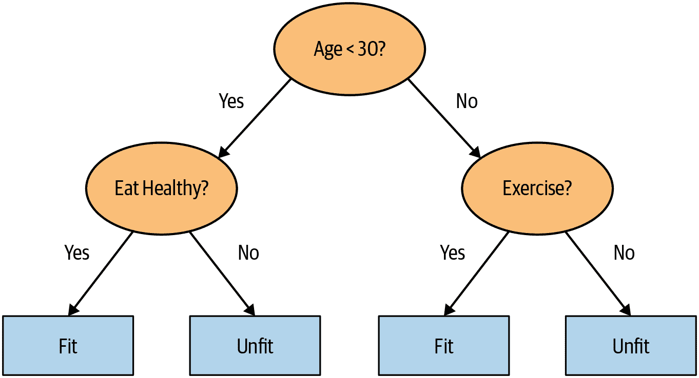

###### 图 9-6\. 决策树示例

让我们考虑如何找到正确的问题。当然，我们不希望自己创建所有这些问题-这就是计算机的作用！训练决策树的基本步骤可以很容易地写下来：

1.  依次循环数据集的每一列。

1.  对于每一列，依次循环该列的每个可能级别。

1.  尝试将数据分成两组，基于它们是否大于或小于该值（或者如果它是一个分类变量，则基于它们是否等于或不等于该分类变量的水平）。

1.  找到这两组中每组的平均销售价格，并查看这与该组中每个设备的实际销售价格有多接近。将这视为一个非常简单的“模型”，其中我们的预测只是该项组的平均销售价格。

1.  在循环遍历所有列和每个可能的级别后，选择使用该简单模型给出最佳预测的分割点。

1.  现在我们的数据有两组，基于这个选定的分割。将每个组视为一个单独的数据集，并通过返回到步骤 1 为每个组找到最佳分割。

1.  递归地继续这个过程，直到每个组达到某个停止标准-例如，当组中只有 20 个项目时停止进一步分割。

尽管这是一个很容易自己实现的算法（这是一个很好的练习），但我们可以节省一些时间，使用内置在 sklearn 中的实现。

然而，首先，我们需要做一些数据准备。

# Alexis 说

这是一个值得思考的有益问题。如果您考虑到定义决策树的过程本质上选择了一个关于变量的*分割问题序列*，您可能会问自己，我们如何知道这个过程选择了*正确的序列*？规则是选择产生最佳分割（即最准确地将项目分为两个不同类别）的分割问题，然后将同样的规则应用于该分割产生的组，依此类推。这在计算机科学中被称为“贪婪”方法。您能想象出一个情景，其中提出一个“不那么强大”的分割问题会使未来的分割更好（或者我应该说更好地导致更好的结果）吗？

## 处理日期

我们需要做的第一件数据准备工作是丰富我们对日期的表示。我们刚刚描述的决策树的基本基础是*二分* - 将一组分成两组。我们查看序数变量，并根据变量的值是大于（或小于）阈值来划分数据集，我们查看分类变量，并根据变量的级别是否是特定级别来划分数据集。因此，这个算法有一种根据序数和分类数据划分数据集的方法。

但是这如何适用于常见的数据类型，日期呢？您可能希望将日期视为序数值，因为说一个日期比另一个日期更大是有意义的。然而，日期与大多数序数值有所不同，因为一些日期在某种方面与其他日期有质的不同，这通常与我们建模的系统相关。

为了帮助我们的算法智能处理日期，我们希望我们的模型不仅知道一个日期是否比另一个日期更近或更早。我们可能希望我们的模型根据日期的星期几、某一天是否是假期、所在月份等来做决策。为此，我们用一组日期元数据列替换每个日期列，例如假期、星期几和月份。这些列提供了我们认为会有用的分类数据。

fastai 带有一个函数，可以为我们执行此操作-我们只需传递包含日期的列名：

```py
df = add_datepart(df, 'saledate')
```

在那里的同时，让我们为测试集做同样的事情：

```py
df_test = pd.read_csv(path/'Test.csv', low_memory=False)
df_test = add_datepart(df_test, 'saledate')
```

我们可以看到我们的 DataFrame 中现在有很多新的列：

```py
' '.join(o for o in df.columns if o.startswith('sale'))
```

```py
'saleYear saleMonth saleWeek saleDay saleDayofweek saleDayofyear
 > saleIs_month_end saleIs_month_start saleIs_quarter_end saleIs_quarter_start
 > saleIs_year_end saleIs_year_start saleElapsed'
```

这是一个很好的第一步，但我们需要做更多的清理。为此，我们将使用 fastai 对象`TabularPandas`和`TabularProc`。

## 使用 TabularPandas 和 TabularProc

第二个预处理步骤是确保我们可以处理字符串和缺失数据。默认情况下，sklearn 都不能处理。相反，我们将使用 fastai 的`TabularPandas`类，它包装了一个 Pandas DataFrame 并提供了一些便利。为了填充一个`TabularPandas`，我们将使用两个`TabularProc`，`Categorify`和`FillMissing`。`TabularProc`类似于常规的`Transform`，但有以下不同：

+   它返回传递给它的完全相同的对象，在原地修改对象后返回。

+   它在数据首次传入时运行变换，而不是在访问数据时懒惰地运行。

`Categorify`是一个`TabularProc`，用数字分类列替换列。`FillMissing`是一个`TabularProc`，用列的中位数替换缺失值，并创建一个新的布尔列，对于任何值缺失的行，该列设置为`True`。这两个变换几乎适用于您将使用的每个表格数据集，因此这是您数据处理的一个很好的起点：

```py
procs = [Categorify, FillMissing]
```

`TabularPandas`还将为我们处理数据集的拆分为训练集和验证集。但是，我们需要非常小心处理我们的验证集。我们希望设计它，使其类似于 Kaggle 将用来评判比赛的*测试集*。

回想一下验证集和测试集之间的区别，如第一章中所讨论的。*验证集*是我们从训练中保留的数据，以确保训练过程不会在训练数据上过拟合。*测试集*是更深层次地被我们自己保留的数据，以确保我们在探索各种模型架构和超参数时不会在验证数据上过拟合。

我们看不到测试集。但我们确实希望定义我们的验证数据，使其与训练数据具有与测试集相同类型的关系。

在某些情况下，随机选择数据点的子集就足够了。但这不是这种情况，因为这是一个时间序列。

如果您查看测试集中表示的日期范围，您会发现它覆盖了 2012 年 5 月的六个月期间，这比训练集中的任何日期都要晚。这是一个很好的设计，因为竞赛赞助商希望确保模型能够预测未来。但这意味着如果我们要有一个有用的验证集，我们也希望验证集比训练集更晚。Kaggle 的训练数据在 2012 年 4 月结束，因此我们将定义一个更窄的训练数据集，其中只包括 2011 年 11 月之前的 Kaggle 训练数据，并且我们将定义一个验证集，其中包括 2011 年 11 月之后的数据。

为了做到这一点，我们使用`np.where`，这是一个有用的函数，返回（作为元组的第一个元素）所有`True`值的索引：

```py
cond = (df.saleYear<2011) | (df.saleMonth<10)
train_idx = np.where( cond)[0]
valid_idx = np.where(~cond)[0]

splits = (list(train_idx),list(valid_idx))
```

`TabularPandas`需要告诉哪些列是连续的，哪些是分类的。我们可以使用辅助函数`cont_cat_split`自动处理：

```py
cont,cat = cont_cat_split(df, 1, dep_var=dep_var)
```

```py
to = TabularPandas(df, procs, cat, cont, y_names=dep_var, splits=splits)
```

`TabularPandas`的行为很像一个 fastai 的`Datasets`对象，包括提供`train`和`valid`属性：

```py
len(to.train),len(to.valid)
```

```py
(404710, 7988)
```

我们可以看到数据仍然显示为类别的字符串（这里我们只显示了一些列，因为完整的表太大了，无法放在一页上）。

```py
to.show(3)
```

|  | state | ProductGroup | Drive_System | Enclosure | SalePrice |
| --- | --- | --- | --- | --- | --- |
| 0 | Alabama | WL | #na# | EROPS w AC | 11.097410 |
| 1 | North Carolina | WL | #na# | EROPS w AC | 10.950807 |
| 2 | New York | SSL | #na# | OROPS | 9.210340 |

然而，底层项目都是数字：

```py
to.items.head(3)
```

|  | state | ProductGroup | Drive_System | Enclosure |
| --- | --- | --- | --- | --- |
| 0 | 1 | 6 | 0 | 3 |
| 1 | 33 | 6 | 0 | 3 |
| 2 | 32 | 3 | 0 | 6 |

将分类列转换为数字是通过简单地用数字替换每个唯一级别来完成的。与级别相关联的数字是按照它们在列中出现的顺序连续选择的，因此在转换后的分类列中，数字没有特定的含义。唯一的例外是，如果您首先将列转换为 Pandas 有序类别（就像我们之前为`ProductSize`所做的那样），那么您选择的排序将被使用。我们可以通过查看`classes`属性来查看映射：

```py
to.classes['ProductSize']
```

```py
(#7) ['#na#','Large','Large / Medium','Medium','Small','Mini','Compact']
```

由于处理数据到这一点需要一分钟左右的时间，我们应该保存它，这样以后我们可以继续从这里继续工作，而不必重新运行之前的步骤。fastai 提供了一个使用 Python 的*pickle*系统保存几乎任何 Python 对象的`save`方法：

```py
(path/'to.pkl').save(to)
```

以后要读回来，您将键入：

```py
to = (path/'to.pkl').load()
```

现在所有这些预处理都完成了，我们准备创建一个决策树。

## 创建决策树

首先，我们定义我们的自变量和因变量：

```py
xs,y = to.train.xs,to.train.y
valid_xs,valid_y = to.valid.xs,to.valid.y
```

现在我们的数据都是数字的，没有缺失值，我们可以创建一个决策树：

```py
m = DecisionTreeRegressor(max_leaf_nodes=4)
m.fit(xs, y);
```

为了简单起见，我们告诉 sklearn 只创建了四个*叶节点*。要查看它学到了什么，我们可以显示决策树：

```py
draw_tree(m, xs, size=7, leaves_parallel=True, precision=2)
```


理解这幅图片是理解决策树的最好方法之一，所以我们将从顶部开始，逐步解释每个部分。

顶部节点代表*初始模型*，在进行任何分割之前，所有数据都在一个组中。这是最简单的模型。这是在不问任何问题的情况下得到的结果，将始终预测值为整个数据集的平均值。在这种情况下，我们可以看到它预测销售价格的对数值为 10.1。它给出了均方误差为 0.48。这个值的平方根是 0.69。（请记住，除非您看到`m_rmse`，或者*均方根误差*，否则您看到的值是在取平方根之前的，因此它只是差异的平方的平均值。）我们还可以看到在这个组中有 404,710 条拍卖记录，这是我们训练集的总大小。这里显示的最后一部分信息是找到的最佳分割的决策标准，即基于`coupler_system`列进行分割。

向下移动并向左移动，这个节点告诉我们，在`coupler_system`小于 0.5 的设备拍卖记录中有 360,847 条。这个组中我们的因变量的平均值是 10.21。从初始模型向下移动并向右移动，我们来到了`coupler_system`大于 0.5 的记录。

底部行包含我们的*叶节点*：没有答案出现的节点，因为没有更多问题需要回答。在这一行的最右边是包含`coupler_system`大于 0.5 的记录的节点。平均值为 9.21，因此我们可以看到决策树算法确实找到了一个单一的二进制决策，将高价值与低价值的拍卖结果分开。仅询问`coupler_system`预测的平均值为 9.21，而不是 10.1。

在第一个决策点后返回到顶部节点后，我们可以看到已经进行了第二个二进制决策分割，基于询问`YearMade`是否小于或等于 1991.5。对于这个条件为真的组（请记住，这是根据`coupler_system`和`YearMade`进行的两个二进制决策），平均值为 9.97，在这个组中有 155,724 条拍卖记录。对于这个条件为假的拍卖组，平均值为 10.4，有 205,123 条记录。因此，我们可以看到决策树算法成功地将我们更昂贵的拍卖记录分成了两组，这两组在价值上有显著差异。

我们可以使用 Terence Parr 强大的[dtreeviz 库](https://oreil.ly/e9KrM)显示相同的信息：

```py
samp_idx = np.random.permutation(len(y))[:500]
dtreeviz(m, xs.iloc[samp_idx], y.iloc[samp_idx], xs.columns, dep_var,
        fontname='DejaVu Sans', scale=1.6, label_fontsize=10,
        orientation='LR')
```


这显示了每个分割点数据分布的图表。我们可以清楚地看到我们的`YearMade`数据存在问题：显然有一些在 1000 年制造的推土机！很可能，这只是一个缺失值代码（在数据中没有出现的值，用作占位符的值，用于在值缺失的情况下）。对于建模目的，1000 是可以的，但正如你所看到的，这个异常值使得我们感兴趣的数值更难以可视化。所以，让我们用 1950 年替换它：

```py
xs.loc[xs['YearMade']<1900, 'YearMade'] = 1950
valid_xs.loc[valid_xs['YearMade']<1900, 'YearMade'] = 1950
```

这个改变使得树的可视化中的分割更加清晰，尽管这并没有在模型结果上有任何显著的改变。这是决策树对数据问题有多么弹性的一个很好的例子！

```py
m = DecisionTreeRegressor(max_leaf_nodes=4).fit(xs, y)
dtreeviz(m, xs.iloc[samp_idx], y.iloc[samp_idx], xs.columns, dep_var,
        fontname='DejaVu Sans', scale=1.6, label_fontsize=10,
        orientation='LR')
```

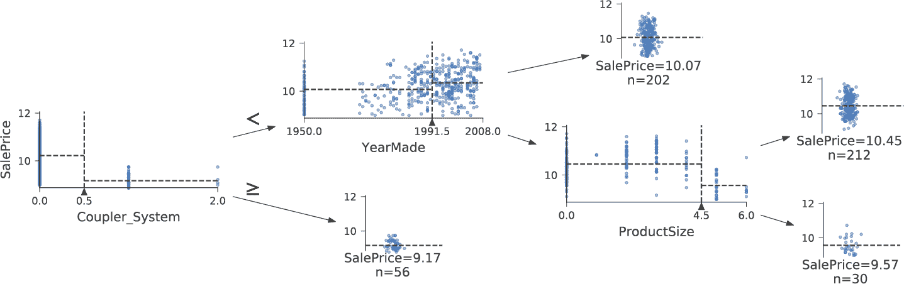

现在让决策树算法构建一个更大的树。在这里，我们没有传递任何停止标准，比如`max_leaf_nodes`：

```py
m = DecisionTreeRegressor()
m.fit(xs, y);
```

我们将创建一个小函数来检查我们模型的均方根误差（`m_rmse`），因为比赛是根据这个来评判的：

```py
def r_mse(pred,y): return round(math.sqrt(((pred-y)**2).mean()), 6)
def m_rmse(m, xs, y): return r_mse(m.predict(xs), y)
```

```py
m_rmse(m, xs, y)
```

```py
0.0
```

所以，我们的模型完美了，对吧？不要那么快……记住，我们真的需要检查验证集，以确保我们没有过拟合：

```py
m_rmse(m, valid_xs, valid_y)
```

```py
0.337727
```

哎呀——看起来我们可能过拟合得很严重。原因如下：

```py
m.get_n_leaves(), len(xs)
```

```py
(340909, 404710)
```

我们的叶节点数几乎和数据点一样多！这似乎有点过于热情。事实上，sklearn 的默认设置允许它继续分裂节点，直到每个叶节点只包含一个项目。让我们改变停止规则，告诉 sklearn 确保每个叶节点至少包含 25 个拍卖记录：

```py
m = DecisionTreeRegressor(min_samples_leaf=25)
m.fit(to.train.xs, to.train.y)
m_rmse(m, xs, y), m_rmse(m, valid_xs, valid_y)
```

```py
(0.248562, 0.32368)
```

看起来好多了。让我们再次检查叶节点的数量：

```py
m.get_n_leaves()
```

```py
12397
```

更加合理！

# Alexis 说

对于一个叶节点比数据项更多的过拟合决策树，这是我的直觉。考虑一下“二十个问题”游戏。在那个游戏中，选择者秘密想象一个物体（比如，“我们的电视机”），猜测者可以提出 20 个是或否的问题来猜测物体是什么（比如“它比一个面包盒大吗？”）。猜测者并不是在尝试预测一个数值，而只是在识别所有可想象物体集合中的特定物体。当你的决策树的叶节点多于域中可能的物体时，它本质上是一个训练有素的猜测者。它已经学会了识别训练集中特定数据项所需的问题序列，并且只是通过描述该项的值来“预测”。这是一种记忆训练集的方式，即过拟合。

构建决策树是创建数据模型的好方法。它非常灵活，因为它可以清楚地处理变量之间的非线性关系和交互作用。但我们可以看到在如何泛化（通过创建小树可以实现）和在训练集上的准确性（通过使用大树可以实现）之间存在一个基本的妥协。

那么我们如何兼顾两全呢？我们将在处理一个重要的遗漏细节之后向您展示：如何处理分类变量。

## 分类变量

在前一章中，当使用深度学习网络时，我们通过独热编码处理分类变量，并将其馈送到嵌入层。嵌入层帮助模型发现这些变量不同级别的含义（分类变量的级别没有固有含义，除非我们使用 Pandas 手动指定一个排序）。在决策树中，我们没有嵌入层，那么这些未处理的分类变量如何在决策树中发挥作用呢？例如，像产品代码这样的东西如何使用？

简短的答案是：它就是有效！想象一种情况，其中一个产品代码在拍卖中比其他任何产品代码都要昂贵得多。在这种情况下，任何二元分割都将导致该产品代码位于某个组中，而该组将比其他组更昂贵。因此，我们简单的决策树构建算法将选择该分割。稍后，在训练过程中，算法将能够进一步分割包含昂贵产品代码的子组，随着时间的推移，树将聚焦于那一个昂贵的产品。

还可以使用一位编码来替换单个分类变量，其中每一列代表变量的一个可能级别。Pandas 有一个`get_dummies`方法可以做到这一点。

然而，实际上并没有证据表明这种方法会改善最终结果。因此，我们通常会尽可能避免使用它，因为它确实会使您的数据集更难处理。在 2019 年，这个问题在 Marvin Wright 和 Inke König 的论文[“Splitting on Categorical Predictors in Random Forests”](https://oreil.ly/ojzKJ)中得到了探讨：

> 对于名义预测器，标准方法是考虑所有 2^(*k* − 1) − 1 个*k*预测类别的 2-分区。然而，这种指数关系会产生大量需要评估的潜在分割，增加了计算复杂性并限制了大多数实现中可能的类别数量。对于二元分类和回归，已经证明按照每个分割中的预测类别进行排序会导致与标准方法完全相同的分割。这减少了计算复杂性，因为对于具有*k*个类别的名义预测器，只需要考虑*k* − 1 个分割。

现在您了解了决策树的工作原理，是时候尝试那种最佳的解决方案了：随机森林。

# 随机森林

1994 年，伯克利大学教授 Leo Breiman 在退休一年后发表了一份名为[“Bagging Predictors”](https://oreil.ly/6gMuG)的小型技术报告，这个报告成为现代机器学习中最有影响力的想法之一。报告开始说：

> Bagging 预测器是一种生成预测器的多个版本并使用这些版本来获得聚合预测器的方法。聚合平均了这些版本……通过对学习集进行自助复制并将其用作新的学习集来形成多个版本。测试表明，bagging 可以显著提高准确性。关键因素是预测方法的不稳定性。如果扰动学习集可以导致构建的预测器发生显著变化，那么 bagging 可以提高准确性。

这是 Breiman 提出的程序：

1.  随机选择数据的子集（即“学习集的自助复制”）。

1.  使用这个子集训练模型。

1.  保存该模型，然后返回到步骤 1 几次。

1.  这将为您提供多个经过训练的模型。要进行预测，请使用所有模型进行预测，然后取每个模型预测的平均值。

这个过程被称为*bagging*。它基于一个深刻而重要的观点：尽管在数据子集上训练的每个模型会比在完整数据集上训练的模型产生更多错误，但这些错误不会相互关联。不同的模型会产生不同的错误。因此，这些错误的平均值为零！因此，如果我们取所有模型预测的平均值，我们应该得到一个预测，随着模型数量的增加，它会越来越接近正确答案。这是一个非凡的结果——这意味着我们可以通过多次在不同随机数据子集上训练它来改进几乎任何类型的机器学习算法的准确性，并对其预测进行平均。

2001 年，Breiman 继续展示了这种建模方法，当应用于决策树构建算法时，特别强大。他甚至比仅仅随机选择每个模型训练的行更进一步，还在每棵决策树的每个分裂点随机选择了一部分列。他将这种方法称为*随机森林*。今天，它可能是最广泛使用和实际重要的机器学习方法。

实质上，随机森林是一个模型，它平均了大量决策树的预测结果，这些决策树是通过随机变化各种参数生成的，这些参数指定了用于训练树和其他树参数的数据。Bagging 是一种特定的*集成*方法，或者将多个模型的结果组合在一起。为了看看它在实践中是如何工作的，让我们开始创建我们自己的随机森林！

## 创建随机森林

我们可以像创建决策树一样创建随机森林，只是现在我们还指定了指示森林中应该有多少树，如何对数据项（行）进行子集化以及如何对字段（列）进行子集化的参数。

在下面的函数定义中，`n_estimators`定义了我们想要的树的数量，`max_samples`定义了每棵树训练时要抽样的行数，`max_features`定义了在每个分裂点抽样的列数（其中`0.5`表示“取一半的总列数”）。我们还可以指定何时停止分裂树节点，有效地限制树的深度，通过包含我们在前一节中使用的相同`min_samples_leaf`参数。最后，我们传递`n_jobs=-1`告诉 sklearn 使用所有 CPU 并行构建树。通过创建一个小函数，我们可以更快地尝试本章其余部分的变化：

```py
def rf(xs, y, n_estimators=40, max_samples=200_000,
       max_features=0.5, min_samples_leaf=5, **kwargs):
    return RandomForestRegressor(n_jobs=-1, n_estimators=n_estimators,
        max_samples=max_samples, max_features=max_features,
        min_samples_leaf=min_samples_leaf, oob_score=True).fit(xs, y)
```

```py
m = rf(xs, y);
```

我们的验证 RMSE 现在比我们上次使用`DecisionTreeRegressor`生成的结果要好得多，后者只使用了所有可用数据生成了一棵树：

```py
m_rmse(m, xs, y), m_rmse(m, valid_xs, valid_y)
```

```py
(0.170896, 0.233502)
```

随机森林最重要的特性之一是它对超参数选择不太敏感，比如`max_features`。您可以将`n_estimators`设置为尽可能高的数字，以便训练更多的树，树越多，模型就越准确。`max_samples`通常可以保持默认值，除非您有超过 200,000 个数据点，在这种情况下，将其设置为 200,000 将使其在准确性上有很小影响的情况下更快地训练。`max_features=0.5`和`min_samples_leaf=4`通常效果很好，尽管 sklearn 的默认值也很好。

sklearn 文档[展示了一个例子](https://oreil.ly/E0Och)，展示了不同`max_features`选择的效果，以及树的数量增加。在图中，蓝色曲线使用最少的特征，绿色曲线使用最多的特征（使用所有特征）。正如您在图 9-7 中所看到的，使用较少特征但具有更多树的模型具有最低的错误结果。

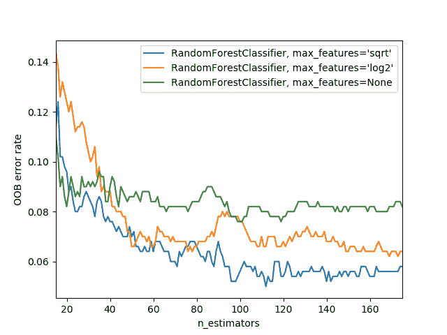

###### 图 9-7\. 基于最大特征和树的数量的错误（来源：[*https://oreil.ly/E0Och*](https://oreil.ly/E0Och)）

为了查看`n_estimators`的影响，让我们从森林中的每棵树获取预测结果（这些在`estimators_`属性中）：

```py
preds = np.stack([t.predict(valid_xs) for t in m.estimators_])
```

如您所见，`preds.mean(0)`给出了与我们的随机森林相同的结果：

```py
r_mse(preds.mean(0), valid_y)
```

```py
0.233502
```

让我们看看随着树的数量增加，RMSE 会发生什么变化。如您所见，大约在 30 棵树后，改进水平就会显著减少：

```py
plt.plot([r_mse(preds[:i+1].mean(0), valid_y) for i in range(40)]);
```

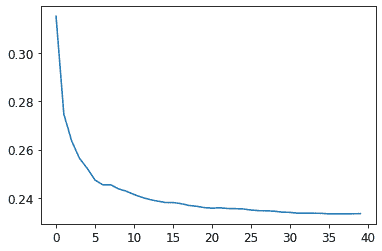

我们在验证集上的表现比在训练集上差。但这是因为我们过拟合了，还是因为验证集涵盖了不同的时间段，或者两者都有？根据我们已经看到的信息，我们无法确定。然而，随机森林有一个非常聪明的技巧叫做*袋外*（OOB）误差，可以帮助我们解决这个问题（以及更多！）。

## 袋外误差

回想一下，在随机森林中，每棵树都是在训练数据的不同子集上训练的。OOB 错误是一种通过在计算行的错误时仅包括那些行*未*包含在训练中的树来测量训练数据集中的预测错误的方法。这使我们能够看到模型是否过拟合，而无需单独的验证集。

# Alexis 说

我对此的直觉是，由于每棵树都是在不同的随机选择的行子集上训练的，因此袋外错误有点像想象每棵树因此也有自己的验证集。该验证集只是未被选中用于该树训练的行。

这在我们只有少量训练数据的情况下特别有益，因为它使我们能够看到我们的模型是否在不移除物品以创建验证集的情况下泛化。OOB 预测可在`oob_prediction_`属性中找到。请注意，我们将它们与训练标签进行比较，因为这是在使用训练集的树上计算的：

```py
r_mse(m.oob_prediction_, y)
```

```py
0.210686
```

我们可以看到我们的 OOB 错误远低于验证集错误。这意味着除了正常的泛化错误之外，还有其他原因导致了该错误。我们将在本章后面讨论这些原因。

这是解释我们模型预测的一种方式——现在让我们更专注于这些。

# 模型解释

对于表格数据，模型解释尤为重要。对于给定的模型，我们最有兴趣的是以下内容：

+   我们对使用特定数据行进行的预测有多自信？

+   对于使用特定数据行进行预测，最重要的因素是什么，它们如何影响该预测？

+   哪些列是最强的预测因子，哪些可以忽略？

+   哪些列在预测目的上实际上是多余的？

+   当我们改变这些列时，预测会如何变化？

正如我们将看到的，随机森林特别适合回答这些问题。让我们从第一个问题开始！

## 用于预测置信度的树方差

我们看到模型如何平均每棵树的预测以获得整体预测——也就是说，一个值的估计。但是我们如何知道估计的置信度？一种简单的方法是使用树之间预测的标准差，而不仅仅是均值。这告诉我们预测的*相对*置信度。一般来说，我们会更谨慎地使用树给出非常不同结果的行的结果（更高的标准差），而不是在树更一致的情况下使用结果（更低的标准差）。

在"创建随机森林"中，我们看到如何使用 Python 列表推导来对验证集进行预测，对森林中的每棵树都这样做：

```py
preds = np.stack([t.predict(valid_xs) for t in m.estimators_])
```

```py
preds.shape
```

```py
(40, 7988)
```

现在我们对验证集中的每棵树和每个拍卖都有一个预测（40 棵树和 7,988 个拍卖）。

使用这种方法，我们可以获得每个拍卖的所有树的预测的标准差：

```py
preds_std = preds.std(0)
```

以下是前五个拍卖的预测的标准差——也就是验证集的前五行：

```py
preds_std[:5]
```

```py
array([0.21529149, 0.10351274, 0.08901878, 0.28374773, 0.11977206])
```

正如您所看到的，预测的置信度差异很大。对于一些拍卖，标准差较低，因为树是一致的。对于其他拍卖，标准差较高，因为树不一致。这是在生产环境中会有用的信息；例如，如果您使用此模型来决定在拍卖中对哪些物品进行竞标，低置信度的预测可能会导致您在竞标之前更仔细地查看物品。

## 特征重要性

仅仅知道一个模型能够做出准确的预测通常是不够的，我们还想知道*它是如何*做出预测的。*特征重要性*给了我们这种洞察力。我们可以直接从 sklearn 的随机森林中获取这些信息，方法是查看`feature_importances_`属性。这里有一个简单的函数，我们可以用它将它们放入一个 DataFrame 并对它们进行排序：

```py
def rf_feat_importance(m, df):
    return pd.DataFrame({'cols':df.columns, 'imp':m.feature_importances_}
                       ).sort_values('imp', ascending=False)
```

我们模型的特征重要性显示，前几个最重要的列的重要性得分比其余的要高得多，其中（不出所料）`YearMade`和`ProductSize`位于列表的顶部：

```py
fi = rf_feat_importance(m, xs)
fi[:10]
```

|  | cols | imp |
| --- | --- | --- |
| 69 | YearMade | 0.182890 |
| 6 | ProductSize | 0.127268 |
| 30 | Coupler_System | 0.117698 |
| 7 | fiProductClassDesc | 0.069939 |
| 66 | ModelID | 0.057263 |
| 77 | saleElapsed | 0.050113 |
| 32 | Hydraulics_Flow | 0.047091 |
| 3 | fiSecondaryDesc | 0.041225 |
| 31 | Grouser_Tracks | 0.031988 |
| 1 | fiModelDesc | 0.031838 |

特征重要性的图表显示了相对重要性更清晰：

```py
def plot_fi(fi):
    return fi.plot('cols', 'imp', 'barh', figsize=(12,7), legend=False)

plot_fi(fi[:30]);
```

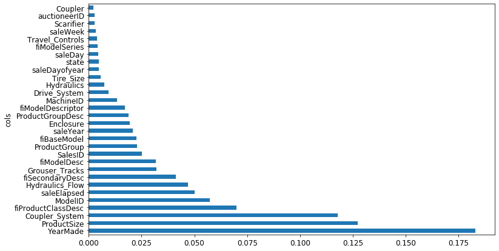

这些重要性是如何计算的相当简单而优雅。特征重要性算法循环遍历每棵树，然后递归地探索每个分支。在每个分支，它查看用于该分割的特征是什么，以及模型由于该分割而改善了多少。该改善（按该组中的行数加权）被添加到该特征的重要性分数中。这些分数在所有树的所有分支中求和，最后对分数进行归一化，使它们总和为 1。

## 去除低重要性变量

看起来我们可以通过去除低重要性的变量来使用列的子集，并且仍然能够获得良好的结果。让我们尝试只保留那些具有特征重要性大于 0.005 的列：

```py
to_keep = fi[fi.imp>0.005].cols
len(to_keep)
```

```py
21
```

我们可以使用列的这个子集重新训练我们的模型：

```py
xs_imp = xs[to_keep]
valid_xs_imp = valid_xs[to_keep]
```

```py
m = rf(xs_imp, y)
```

这里是结果：

```py
m_rmse(m, xs_imp, y), m_rmse(m, valid_xs_imp, valid_y)
```

```py
(0.181208, 0.232323)
```

我们的准确率大致相同，但我们有更少的列需要研究：

```py
len(xs.columns), len(xs_imp.columns)
```

```py
(78, 21)
```

我们发现，通常改进模型的第一步是简化它——78 列对我们来说太多了，我们无法深入研究它们！此外，在实践中，通常更简单、更易解释的模型更容易推出和维护。

这也使得我们的特征重要性图更容易解释。让我们再次看一下：

```py
plot_fi(rf_feat_importance(m, xs_imp));
```

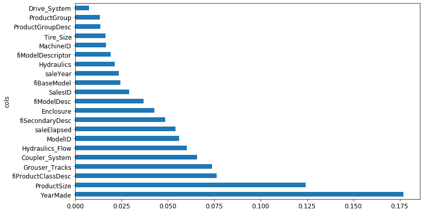

使这个更难解释的一点是，似乎有一些含义非常相似的变量：例如，`ProductGroup`和`ProductGroupDesc`。让我们尝试去除任何冗余特征。

## 去除冗余特征

让我们从这里开始：

```py
cluster_columns(xs_imp)
```

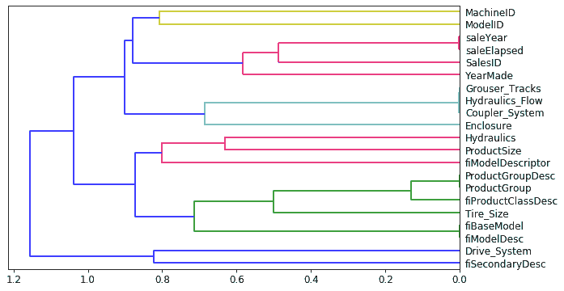

在这个图表中，最相似的列对是在树的左侧远离“根”处早期合并在一起的。毫不奇怪，`ProductGroup`和`ProductGroupDesc`字段很早就合并了，`saleYear`和`saleElapsed`，以及`fiModelDesc`和`fiBaseModel`也是如此。它们可能是如此密切相关，以至于它们实际上是彼此的同义词。

# 确定相似性

最相似的对是通过计算*秩相关性*来找到的，这意味着所有的值都被它们的*秩*（在列内的第一、第二、第三等）替换，然后计算*相关性*。（如果你愿意，可以跳过这个细节，因为它在本书中不会再次出现！）

让我们尝试删除一些这些密切相关特征，看看模型是否可以简化而不影响准确性。首先，我们创建一个快速训练随机森林并返回 OOB 分数的函数，通过使用较低的`max_samples`和较高的`min_samples_leaf`。OOB 分数是由 sklearn 返回的一个数字，范围在 1.0（完美模型）和 0.0（随机模型）之间。（在统计学中被称为*R*²，尽管这些细节对于这个解释并不重要。）我们不需要它非常准确——我们只是要用它来比较不同的模型，基于删除一些可能冗余的列：

```py
def get_oob(df):
    m = RandomForestRegressor(n_estimators=40, min_samples_leaf=15,
        max_samples=50000, max_features=0.5, n_jobs=-1, oob_score=True)
    m.fit(df, y)
    return m.oob_score_
```

这是我们的基线：

```py
get_oob(xs_imp)
```

```py
0.8771039618198545
```

现在我们尝试逐个删除我们可能冗余的变量：

```py
{c:get_oob(xs_imp.drop(c, axis=1)) for c in (
    'saleYear', 'saleElapsed', 'ProductGroupDesc','ProductGroup',
    'fiModelDesc', 'fiBaseModel',
    'Hydraulics_Flow','Grouser_Tracks', 'Coupler_System')}
```

```py
{'saleYear': 0.8759666979317242,
 'saleElapsed': 0.8728423449081594,
 'ProductGroupDesc': 0.877877012281002,
 'ProductGroup': 0.8772503407182847,
 'fiModelDesc': 0.8756415073829513,
 'fiBaseModel': 0.8765165299438019,
 'Hydraulics_Flow': 0.8778545895742573,
 'Grouser_Tracks': 0.8773718142788077,
 'Coupler_System': 0.8778016988955392}
```

现在让我们尝试删除多个变量。我们将从我们之前注意到的紧密对齐的一对中的每个变量中删除一个。让我们看看这样做会发生什么：

```py
to_drop = ['saleYear', 'ProductGroupDesc', 'fiBaseModel', 'Grouser_Tracks']
get_oob(xs_imp.drop(to_drop, axis=1))
```

```py
0.8739605718147015
```

看起来不错！这与拥有所有字段的模型相比几乎没有差别。让我们创建没有这些列的数据框，并保存它们：

```py
xs_final = xs_imp.drop(to_drop, axis=1)
valid_xs_final = valid_xs_imp.drop(to_drop, axis=1)
```

```py
(path/'xs_final.pkl').save(xs_final)
(path/'valid_xs_final.pkl').save(valid_xs_final)
```

我们可以稍后重新加载它们：

```py
xs_final = (path/'xs_final.pkl').load()
valid_xs_final = (path/'valid_xs_final.pkl').load()
```

现在我们可以再次检查我们的 RMSE，以确认准确性没有发生实质性变化：

```py
m = rf(xs_final, y)
m_rmse(m, xs_final, y), m_rmse(m, valid_xs_final, valid_y)
```

```py
(0.183263, 0.233846)
```

通过专注于最重要的变量并删除一些冗余的变量，我们大大简化了我们的模型。现在，让我们看看这些变量如何影响我们的预测，使用部分依赖图。

## 部分依赖

正如我们所看到的，最重要的预测变量是`ProductSize`和`YearMade`。我们想要了解这些预测变量与销售价格之间的关系。首先，最好检查每个类别的值的计数（由 Pandas 的`value_counts`方法提供），看看每个类别有多常见：

```py
p = valid_xs_final['ProductSize'].value_counts(sort=False).plot.barh()
c = to.classes['ProductSize']
plt.yticks(range(len(c)), c);
```

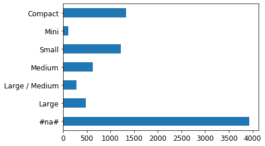

最大的组是`#na#`，这是 fastai 用于缺失值的标签。

让我们对`YearMade`做同样的事情。由于这是一个数值特征，我们需要绘制一个直方图，将年份值分组为几个离散的箱：

```py
ax = valid_xs_final['YearMade'].hist()
```

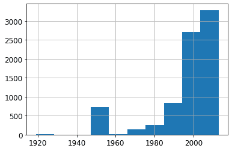

除了我们用于编码缺失年份值的特殊值 1950 之外，大多数数据都是 1990 年后的。

现在我们准备看*部分依赖图*。部分依赖图试图回答这个问题：如果一行除了关注的特征之外没有变化，它会如何影响因变量？

例如，`YearMade` 如何影响销售价格，其他条件都相同？为了回答这个问题，我们不能简单地取每个`YearMade`的平均销售价格。这种方法的问题在于，许多其他因素也会随着年份的变化而变化，比如销售哪些产品、有多少产品带空调、通货膨胀等等。因此，仅仅对具有相同`YearMade`的所有拍卖品进行平均会捕捉到每个其他字段如何随着`YearMade`的变化而变化以及这种整体变化如何影响价格的效果。

相反，我们将`YearMade`列中的每个值替换为 1950，然后计算每个拍卖品的预测销售价格，并对所有拍卖品进行平均。然后我们对 1951、1952 等年份做同样的操作，直到我们的最终年份 2011。这隔离了仅`YearMade`的影响（即使通过对一些想象中的记录进行平均，我们分配了一个可能永远不会实际存在的`YearMade`值以及一些其他值）。

# Alexis 说

如果你有哲学头脑，思考我们为了做出这个计算而搅乱的不同种类的假设性可能会让人眩晕。首先，每个预测都是假设的，因为我们没有记录实证数据。其次，我们不仅仅是想知道如果我们改变`YearMade`以及所有其他因素会如何改变销售价格。相反，我们非常明确地询问在一个假设的世界中，只有`YearMade`改变了销售价格会如何改变。哎呀！我们能够提出这样的问题令人印象深刻。如果你对更深入探讨分析这些微妙之处的形式主义感兴趣，我推荐 Judea Pearl 和 Dana Mackenzie 最近的关于因果关系的书籍*为什么之书*（Basic Books）。

有了这些平均值，我们就可以在 x 轴上绘制每年，y 轴上绘制每个预测。最终，这是一个偏依赖图。让我们来看一下：

```py
from sklearn.inspection import plot_partial_dependence

fig,ax = plt.subplots(figsize=(12, 4))
plot_partial_dependence(m, valid_xs_final, ['YearMade','ProductSize'],
                        grid_resolution=20, ax=ax);
```

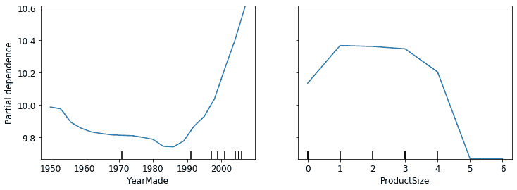

首先看`YearMade`的图表，特别是涵盖 1990 年后的年份部分（因为，正如我们注意到的，这是我们拥有最多数据的地方），我们可以看到年份和价格之间几乎是线性关系。请记住我们的因变量是取对数后的，所以这意味着实际上价格呈指数增长。这是我们所期望的：折旧通常被认为是随时间的乘法因子，因此对于给定的销售日期，改变制造年份应该显示出与销售价格的指数关系。

`ProductSize`的部分图有点令人担忧。它显示我们看到的最终组，即缺失值，价格最低。要在实践中使用这一见解，我们需要找出*为什么*它经常缺失以及这意味着什么。缺失值有时可以是有用的预测因子-这完全取决于导致它们缺失的原因。然而，有时它们可能表明*数据泄漏*。

## 数据泄漏

在论文[“数据挖掘中的泄漏：制定、检测和避免”](https://oreil.ly/XwvYf)中，Shachar Kaufman 等人描述了泄漏如下：

> 关于数据挖掘问题的目标的信息引入，这些信息不应该合法地从中挖掘出来。泄漏的一个微不足道的例子是一个模型将目标本身用作输入，因此得出例如“雨天下雨”的结论。实际上，引入这种非法信息是无意的，并且由数据收集、聚合和准备过程促成。

他们举了一个例子：

> 在 IBM 的一个实际商业智能项目中，根据其网站上发现的关键词，识别了某些产品的潜在客户。结果证明这是泄漏，因为用于训练的网站内容是在潜在客户已经成为客户的时间点进行采样的，网站包含了 IBM 购买的产品的痕迹，比如“Websphere”这样的词（例如，在关于购买的新闻稿或客户使用的特定产品功能中）。

数据泄漏是微妙的，可以采取多种形式。特别是，缺失值通常代表数据泄漏。

例如，Jeremy 参加了一个 Kaggle 竞赛，旨在预测哪些研究人员最终会获得研究资助。这些信息是由一所大学提供的，包括成千上万个研究项目的示例，以及有关涉及的研究人员和每个资助是否最终被接受的数据。大学希望能够使用在这次竞赛中开发的模型来排名哪些资助申请最有可能成功，以便优先处理。

Jeremy 使用随机森林对数据进行建模，然后使用特征重要性来找出哪些特征最具预测性。他注意到了三件令人惊讶的事情：

+   该模型能够在 95%以上的时间内正确预测谁将获得资助。

+   显然，毫无意义的标识列是最重要的预测因子。

+   星期几和一年中的日期列也具有很高的预测性；例如，大多数在星期日日期的资助申请被接受，许多被接受的资助申请日期在 1 月 1 日。

对于标识列，部分依赖图显示，当信息缺失时，申请几乎总是被拒绝。实际上，事实证明，大学在接受资助申请后才填写了大部分这些信息。通常，对于未被接受的申请，这些信息只是留空。因此，这些信息在申请接收时并不可用，并且不会对预测模型可用——这是数据泄漏。

同样，成功申请的最终处理通常在一周或一年结束时自动完成。最终处理日期最终出现在数据中，因此，尽管这些信息具有预测性，但实际上在接收申请时并不可用。

这个例子展示了识别数据泄漏最实用和简单方法，即构建模型，然后执行以下操作：

+   检查模型的准确性是否*过于完美*。

+   寻找在实践中不合理的重要预测因子。

+   寻找在实践中不合理的部分依赖图结果。

回想一下我们的熊探测器，这与我们在第二章中提供的建议相符——通常先构建模型，然后进行数据清理是一个好主意，而不是反过来。模型可以帮助您识别潜在的数据问题。

它还可以帮助您确定哪些因素影响特定预测，使用树解释器。

## 树解释器

在本节开始时，我们说我们想要能够回答五个问题：

+   我们对使用特定数据行进行预测有多自信？

+   对于预测特定数据行，最重要的因素是什么，它们如何影响该预测？

+   哪些列是最强的预测因子？

+   哪些列在预测目的上实际上是多余的？

+   当我们改变这些列时，预测会如何变化？

我们已经处理了其中四个；只剩下第二个问题。要回答这个问题，我们需要使用*treeinterpreter*库。我们还将使用*waterfallcharts*库来绘制结果图表。您可以通过在笔记本单元格中运行以下命令来安装这些：

```py
!pip install treeinterpreter
!pip install waterfallcharts
```

我们已经看到如何计算整个随机森林中的特征重要性。基本思想是查看每个变量对模型改进的贡献，在每棵树的每个分支处，然后将每个变量的所有这些贡献相加。

我们可以完全相同的方式做，但只针对单个数据行。例如，假设我们正在查看拍卖中的特定物品。我们的模型可能预测这个物品会非常昂贵，我们想知道原因。因此，我们取出那一行数据并将其通过第一棵决策树，查看树中每个点处使用的分割。对于每个分割，我们找到相对于树的父节点的增加或减少。我们对每棵树都这样做，并将每个分割变量的重要性变化相加。

例如，让我们选择验证集的前几行：

```py
row = valid_xs_final.iloc[:5]
```

然后我们可以将这些传递给`treeinterpreter`：

```py
prediction,bias,contributions = treeinterpreter.predict(m, row.values)
```

`prediction`只是随机森林的预测。`bias`是基于取因变量的平均值（即每棵树的根*模型*）的预测。`contributions`是最有趣的部分-它告诉我们由于每个独立变量的变化而导致的预测总变化。因此，对于每行，`contributions`加上`bias`必须等于`prediction`。让我们只看第一行：

```py
prediction[0], bias[0], contributions[0].sum()
```

```py
(array([9.98234598]), 10.104309759725059, -0.12196378442186026)
```

用*瀑布图*最清晰地显示贡献。这显示了所有独立变量的正负贡献如何相加以创建最终预测，这里标有“净”标签的右侧列：

```py
waterfall(valid_xs_final.columns, contributions[0], threshold=0.08,
          rotation_value=45,formatting='{:,.3f}');
```

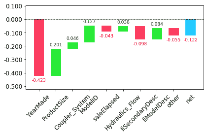

这种信息在生产中最有用，而不是在模型开发过程中。您可以使用它为数据产品的用户提供有关预测背后的基本推理的有用信息。

现在我们已经介绍了一些经典的机器学习技术来解决这个问题，让我们看看深度学习如何帮助！

# 外推和神经网络

随机森林存在的问题，就像所有机器学习或深度学习算法一样，它们并不总是很好地推广到新数据。我们将看到在哪些情况下神经网络更好地推广，但首先，让我们看看随机森林存在的外推问题以及它们如何帮助识别域外数据。

## 外推问题

让我们考虑一个简单的任务，从显示略带噪音的线性关系的 40 个数据点中进行预测：

```py
x_lin = torch.linspace(0,20, steps=40)
y_lin = x_lin + torch.randn_like(x_lin)
plt.scatter(x_lin, y_lin);
```

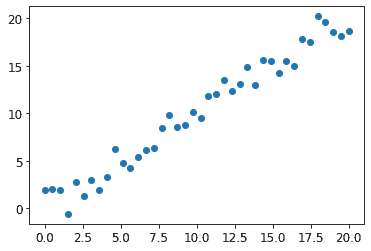

虽然我们只有一个独立变量，但 sklearn 期望独立变量的矩阵，而不是单个向量。因此，我们必须将我们的向量转换为一个具有一列的矩阵。换句话说，我们必须将*shape*从`[40]`更改为`[40,1]`。一种方法是使用`unsqueeze`方法，在请求的维度上为张量添加一个新的单位轴：

```py
xs_lin = x_lin.unsqueeze(1)
x_lin.shape,xs_lin.shape
```

```py
(torch.Size([40]), torch.Size([40, 1]))
```

更灵活的方法是使用特殊值`None`切片数组或张量，这会在该位置引入一个额外的单位轴：

```py
x_lin[:,None].shape
```

```py
torch.Size([40, 1])
```

现在我们可以为这些数据创建一个随机森林。我们将只使用前 30 行来训练模型：

```py
m_lin = RandomForestRegressor().fit(xs_lin[:30],y_lin[:30])
```

然后我们将在完整数据集上测试模型。蓝点是训练数据，红点是预测：

```py
plt.scatter(x_lin, y_lin, 20)
plt.scatter(x_lin, m_lin.predict(xs_lin), color='red', alpha=0.5);
```

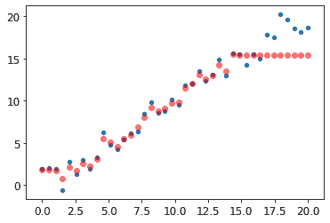

我们有一个大问题！我们在训练数据范围之外的预测都太低了。你认为这是为什么？

请记住，随机森林只是对多棵树的预测进行平均。而树只是预测叶子中行的平均值。因此，树和随机森林永远无法预测超出训练数据范围的值。这对于表示随时间变化的数据，如通货膨胀，且希望对未来时间进行预测的数据尤为棘手。您的预测将系统性地过低。

但问题不仅限于时间变量。随机森林无法对其未见过的数据类型进行外推，从更一般的意义上讲。这就是为什么我们需要确保我们的验证集不包含域外数据。

## 查找域外数据

有时很难知道您的测试集是否与训练数据以相同方式分布，或者如果不同，哪些列反映了这种差异。有一种简单的方法可以弄清楚这一点，那就是使用随机森林！

但在这种情况下，我们不使用随机森林来预测我们实际的因变量。相反，我们尝试预测一行是在验证集还是训练集中。要看到这一点，让我们将训练集和验证集结合起来，创建一个代表每行来自哪个数据集的因变量，使用该数据构建一个随机森林，并获取其特征重要性：

```py
df_dom = pd.concat([xs_final, valid_xs_final])
is_valid = np.array([0]*len(xs_final) + [1]*len(valid_xs_final))

m = rf(df_dom, is_valid)
rf_feat_importance(m, df_dom)[:6]
```

|  | cols | imp |
| --- | --- | --- |
| 5 | saleElapsed | 0.859446 |
| 9 | SalesID | 0.119325 |
| 13 | MachineID | 0.014259 |
| 0 | YearMade | 0.001793 |
| 8 | fiModelDesc | 0.001740 |
| 11 | Enclosure | 0.000657 |

这显示训练集和验证集之间有三列显着不同：`saleElapsed`、`SalesID` 和 `MachineID`。`saleElapsed` 的差异相当明显：它是数据集开始和每行之间的天数，因此直接编码了日期。`SalesID` 的差异表明拍卖销售的标识符可能会随时间递增。`MachineID` 表明类似的情况可能发生在这些拍卖中出售的个别物品上。

让我们先获取原始随机森林模型的 RMSE 基线，然后逐个确定移除这些列的影响：

```py
m = rf(xs_final, y)
print('orig', m_rmse(m, valid_xs_final, valid_y))

for c in ('SalesID','saleElapsed','MachineID'):
    m = rf(xs_final.drop(c,axis=1), y)
    print(c, m_rmse(m, valid_xs_final.drop(c,axis=1), valid_y))
```

```py
orig 0.232795
SalesID 0.23109
saleElapsed 0.236221
MachineID 0.233492
```

看起来我们应该能够移除 `SalesID` 和 `MachineID` 而不会失去任何准确性。让我们检查一下：

```py
time_vars = ['SalesID','MachineID']
xs_final_time = xs_final.drop(time_vars, axis=1)
valid_xs_time = valid_xs_final.drop(time_vars, axis=1)

m = rf(xs_final_time, y)
m_rmse(m, valid_xs_time, valid_y)
```

```py
0.231307
```

删除这些变量略微提高了模型的准确性；但更重要的是，这应该使其随时间更具弹性，更易于维护和理解。我们建议对所有数据集尝试构建一个以 `is_valid` 为因变量的模型，就像我们在这里所做的那样。它通常可以揭示您可能会忽略的微妙的*领域转移*问题。

在我们的情况下，可能有助于简单地避免使用旧数据。通常，旧数据显示的关系已经不再有效。让我们尝试只使用最近几年的数据：

```py
xs['saleYear'].hist();
```

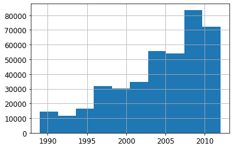

在这个子集上训练的结果如下：

```py
filt = xs['saleYear']>2004
xs_filt = xs_final_time[filt]
y_filt = y[filt]
```

```py
m = rf(xs_filt, y_filt)
m_rmse(m, xs_filt, y_filt), m_rmse(m, valid_xs_time, valid_y)
```

```py
(0.17768, 0.230631)
```

稍微好一点，这表明您不应该总是使用整个数据集；有时候子集可能更好。

让我们看看使用神经网络是否有帮助。

## 使用神经网络

我们可以使用相同的方法构建一个神经网络模型。让我们首先复制设置 `TabularPandas` 对象的步骤：

```py
df_nn = pd.read_csv(path/'TrainAndValid.csv', low_memory=False)
df_nn['ProductSize'] = df_nn['ProductSize'].astype('category')
df_nn['ProductSize'].cat.set_categories(sizes, ordered=True, inplace=True)
df_nn[dep_var] = np.log(df_nn[dep_var])
df_nn = add_datepart(df_nn, 'saledate')
```

我们可以通过使用相同的列集合来为我们的神经网络利用我们在随机森林中修剪不需要的列的工作：

```py
df_nn_final = df_nn[list(xs_final_time.columns) + [dep_var]]
```

在神经网络中，与决策树方法相比，分类列的处理方式大不相同。正如我们在第八章中看到的，在神经网络中，处理分类变量的一个很好的方法是使用嵌入。为了创建嵌入，fastai 需要确定哪些列应该被视为分类变量。它通过比较变量中不同级别的数量与 `max_card` 参数的值来实现这一点。如果较低，fastai 将把该变量视为分类变量。嵌入大小大于 10,000 通常只应在测试是否有更好的方法来分组变量之后使用，因此我们将使用 9,000 作为我们的 `max_card` 值：

```py
cont_nn,cat_nn = cont_cat_split(df_nn_final, max_card=9000, dep_var=dep_var)
```

然而，在这种情况下，有一个变量绝对不能被视为分类变量：`saleElapsed`。按定义，分类变量无法在其所见值范围之外进行外推，但我们希望能够预测未来的拍卖销售价格。因此，我们需要将其作为连续变量处理：

```py
cont_nn.append('saleElapsed')
cat_nn.remove('saleElapsed')
```

让我们来看看我们目前选择的每个分类变量的基数：

```py
df_nn_final[cat_nn].nunique()
```

```py
YearMade                73
ProductSize              6
Coupler_System           2
fiProductClassDesc      74
ModelID               5281
Hydraulics_Flow          3
fiSecondaryDesc        177
fiModelDesc           5059
ProductGroup             6
Enclosure                6
fiModelDescriptor      140
Drive_System             4
Hydraulics              12
Tire_Size               17
dtype: int64
```

有关设备“型号”的两个变量，都具有类似非常高的基数，这表明它们可能包含相似的冗余信息。请注意，当分析冗余特征时，我们不一定会注意到这一点，因为这依赖于相似变量按相同顺序排序（即，它们需要具有类似命名的级别）。拥有 5,000 个级别的列意味着我们的嵌入矩阵需要 5,000 列，如果可能的话最好避免。让我们看看删除其中一个这些型号列对随机森林的影响：

```py
xs_filt2 = xs_filt.drop('fiModelDescriptor', axis=1)
valid_xs_time2 = valid_xs_time.drop('fiModelDescriptor', axis=1)
m2 = rf(xs_filt2, y_filt)
m_rmse(m, xs_filt2, y_filt), m_rmse(m2, valid_xs_time2, valid_y)
```

```py
(0.176706, 0.230642)
```

影响很小，因此我们将其作为神经网络的预测变量移除：

```py
cat_nn.remove('fiModelDescriptor')
```

我们可以像创建随机森林那样创建我们的`TabularPandas`对象，但有一个非常重要的补充：归一化。随机森林不需要任何归一化——树构建过程只关心变量中值的顺序，而不关心它们的缩放。但正如我们所见，神经网络确实关心这一点。因此，在构建`TabularPandas`对象时，我们添加`Normalize`处理器：

```py
procs_nn = [Categorify, FillMissing, Normalize]
to_nn = TabularPandas(df_nn_final, procs_nn, cat_nn, cont_nn,
                      splits=splits, y_names=dep_var)
```

表格模型和数据通常不需要太多的 GPU 内存，因此我们可以使用更大的批量大小：

```py
dls = to_nn.dataloaders(1024)
```

正如我们讨论过的，为回归模型设置`y_range`是一个好主意，所以让我们找到我们因变量的最小值和最大值：

```py
y = to_nn.train.y
y.min(),y.max()
```

```py
(8.465899897028686, 11.863582336583399)
```

现在我们可以创建`Learner`来创建这个表格模型。像往常一样，我们使用特定于应用程序的学习函数，以利用其应用程序定制的默认值。我们将损失函数设置为 MSE，因为这就是这个比赛使用的损失函数。

默认情况下，对于表格数据，fastai 创建一个具有两个隐藏层的神经网络，分别具有 200 和 100 个激活。这对于小数据集效果很好，但在这里我们有一个相当大的数据集，所以我们将层大小增加到 500 和 250：

```py
from fastai.tabular.all import *
```

```py
learn = tabular_learner(dls, y_range=(8,12), layers=[500,250],
                        n_out=1, loss_func=F.mse_loss)
```

```py
learn.lr_find()
```

```py
(0.005754399299621582, 0.0002754228771664202)
```

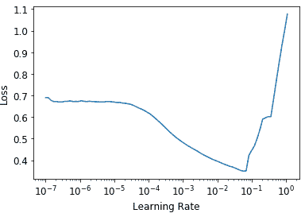

不需要使用`fine_tune`，所以我们将使用`fit_one_cycle`进行几个周期的训练，看看效果如何：

```py
learn.fit_one_cycle(5, 1e-2)
```

| epoch | train_loss | valid_loss | time |
| --- | --- | --- | --- |
| 0 | 0.069705 | 0.062389 | 00:11 |
| 1 | 0.056253 | 0.058489 | 00:11 |
| 2 | 0.048385 | 0.052256 | 00:11 |
| 3 | 0.043400 | 0.050743 | 00:11 |
| 4 | 0.040358 | 0.050986 | 00:11 |

我们可以使用我们的`r_mse`函数将结果与之前得到的随机森林结果进行比较：

```py
preds,targs = learn.get_preds()
r_mse(preds,targs)
```

```py
0.2258
```

它比随机森林要好得多（尽管训练时间更长，对超参数调整要求更高）。

在继续之前，让我们保存我们的模型，以防以后想再次使用它：

```py
learn.save('nn')
```

另一件可以帮助泛化的事情是使用几个模型并平均它们的预测——一个技术，如前面提到的，称为*集成*。

# 集成

回想一下随机森林之所以效果如此好的最初原因：每棵树都有错误，但这些错误彼此之间不相关，因此一旦有足够多的树，这些错误的平均值应该趋向于零。类似的推理可以用来考虑平均使用不同算法训练的模型的预测。

在我们的情况下，我们有两个非常不同的模型，使用非常不同的算法进行训练：一个是随机森林，一个是神经网络。可以合理地期望每个模型产生的错误类型会有很大不同。因此，我们可能会期望它们的预测平均值会比任何一个单独的预测都要好。

正如我们之前看到的，随机森林本身就是一个集成模型。但是我们可以将一个随机森林包含在*另一个*集成中——一个由随机森林和神经网络组成的集成！虽然集成不会决定建模过程的成功与否，但它确实可以为您构建的任何模型增加一点小提升。

我们必须注意的一个小问题是，我们的 PyTorch 模型和我们的 sklearn 模型创建了不同类型的数据：PyTorch 给我们一个秩为 2 的张量（列矩阵），而 NumPy 给我们一个秩为 1 的数组（向量）。`squeeze`会从张量中删除任何单位轴，`to_np`将其转换为 NumPy 数组：

```py
rf_preds = m.predict(valid_xs_time)
ens_preds = (to_np(preds.squeeze()) + rf_preds) /2
```

这给我们比任何一个模型单独取得的结果都要好：

```py
r_mse(ens_preds,valid_y)
```

```py
0.22291
```

实际上，这个结果比 Kaggle 排行榜上显示的任何分数都要好。然而，它并不直接可比，因为 Kaggle 排行榜使用了一个我们无法访问的单独数据集。Kaggle 不允许我们提交到这个旧的比赛中，以找出我们的表现如何，但我们的结果确实看起来令人鼓舞！

## 提升

到目前为止，我们集成的方法是使用*装袋*，它涉及将许多模型（每个模型在不同的数据子集上训练）组合起来通过平均它们。正如我们所看到的，当应用于决策树时，这被称为*随机森林*。

在另一种重要的集成方法中，称为*提升*，我们添加模型而不是对它们进行平均。以下是提升的工作原理：

1.  训练一个欠拟合数据集的小模型。

1.  计算该模型在训练集中的预测。

1.  从目标中减去预测值；这些被称为*残差*，代表了训练集中每个点的误差。

1.  回到第 1 步，但是不要使用原始目标，而是使用残差作为训练的目标。

1.  继续这样做，直到达到停止标准，比如最大树的数量，或者观察到验证集错误变得更糟。

使用这种方法，每棵新树都将尝试拟合所有先前树的错误。因为我们不断通过从先前树的残差中减去每棵新树的预测来创建新的残差，残差会变得越来越小。

使用提升树集成进行预测，我们计算每棵树的预测，然后将它们全部加在一起。有许多遵循这种基本方法的模型，以及许多相同模型的名称。*梯度提升机*（GBMs）和*梯度提升决策树*（GBDTs）是您最有可能遇到的术语，或者您可能会看到实现这些模型的特定库的名称；在撰写本文时，*XGBoost*是最受欢迎的。

请注意，与随机森林不同，使用这种方法，没有什么可以阻止我们过拟合。在随机森林中使用更多树不会导致过拟合，因为每棵树都是独立的。但是在提升集成中，拥有更多树，训练错误就会变得更好，最终您将在验证集上看到过拟合。

我们不会在这里详细介绍如何训练梯度提升树集成，因为这个领域发展迅速，我们提供的任何指导几乎肯定会在您阅读时过时。在我们撰写本文时，sklearn 刚刚添加了一个`HistGradientBoostingRegressor`类，提供了出色的性能。对于这个类，以及我们见过的所有梯度提升树方法，有许多要调整的超参数。与随机森林不同，梯度提升树对这些超参数的选择非常敏感；在实践中，大多数人使用一个循环来尝试一系列超参数，找到最适合的那些。

另一种取得很好结果的技术是在机器学习模型中使用神经网络学习的嵌入。

## 将嵌入与其他方法结合

我们在本章开头提到的实体嵌入论文的摘要中指出：“从训练的神经网络中获得的嵌入在作为输入特征时显著提高了所有测试的机器学习方法的性能。”它包括在图 9-8 中显示的非常有趣的表格。

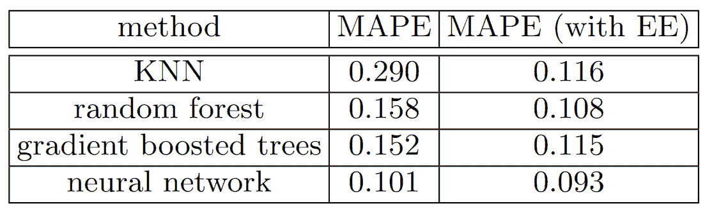

###### 图 9-8。使用神经网络嵌入作为其他机器学习方法的输入的效果（由 Cheng Guo 和 Felix Berkhahn 提供）

这显示了四种建模技术之间的平均百分比误差（MAPE）的比较，其中三种我们已经看过，还有一种是*k*-最近邻（KNN），这是一种非常简单的基准方法。第一列数字包含在比赛中使用这些方法的结果；第二列显示如果您首先使用具有分类嵌入的神经网络，然后在模型中使用这些分类嵌入而不是原始分类列会发生什么。正如您所看到的，在每种情况下，使用嵌入而不是原始类别可以显著改善模型。

这是一个非常重要的结果，因为它表明您可以在推断时获得神经网络的性能改进的大部分，而无需使用神经网络。您可以只使用一个嵌入，这实际上只是一个数组查找，以及一个小的决策树集成。

这些嵌入甚至不需要为组织中的每个模型或任务单独学习。相反，一旦为特定任务的列学习了一组嵌入，它们可以存储在一个中心位置，并在多个模型中重复使用。实际上，我们从与其他大公司的从业者的私下交流中得知，这在许多地方已经发生了。

# 结论

我们已经讨论了表格建模的两种方法：决策树集成和神经网络。我们还提到了两种决策树集成：随机森林和梯度提升机。每种方法都是有效的，但也需要做出妥协：

+   *随机森林*是最容易训练的，因为它们对超参数选择非常有韧性，需要很少的预处理。它们训练速度快，如果有足够的树，就不会过拟合。但是它们可能会稍微不够准确，特别是在需要外推的情况下，比如预测未来的时间段。

+   梯度提升机理论上训练速度与随机森林一样快，但实际上您将不得不尝试很多超参数。它们可能会过拟合，但通常比随机森林稍微准确一些。

+   *神经网络*需要最长的训练时间，并需要额外的预处理，比如归一化；这种归一化也需要在推断时使用。它们可以提供很好的结果并很好地外推，但只有在您小心处理超参数并注意避免过拟合时才能实现。

我们建议从随机森林开始分析。这将为您提供一个强大的基准线，您可以确信这是一个合理的起点。然后，您可以使用该模型进行特征选择和部分依赖分析，以更好地了解您的数据。

基于这个基础，您可以尝试神经网络和 GBM，如果它们在合理的时间内在验证集上给出显著更好的结果，您可以使用它们。如果决策树集成对您有效，尝试将分类变量的嵌入添加到数据中，看看这是否有助于您的决策树学习更好。

# 问卷

1.  什么是连续变量？

1.  什么是分类变量？

1.  分类变量可能的取值中使用的两个词是什么？

1.  什么是密集层？

1.  实体嵌入如何减少内存使用量并加快神经网络的速度？

1.  实体嵌入特别适用于哪些类型的数据集？

1.  机器学习算法的两个主要家族是什么？

1.  为什么有些分类列需要在它们的类别中有特殊的排序？如何在 Pandas 中实现这一点？

1.  总结决策树算法的作用。

1.  日期与常规分类或连续变量有何不同，如何预处理它以使其能够在模型中使用？

1.  在推土机比赛中应该选择一个随机的验证集吗？如果不是，应该选择什么样的验证集？

1.  pickle 是什么，它有什么用？

1.  在本章中绘制的决策树中，如何计算`mse`、`samples`和`values`？

1.  在构建决策树之前，我们如何处理异常值？

1.  我们如何在决策树中处理分类变量？

1.  什么是装袋法？

1.  创建随机森林时，`max_samples`和`max_features`之间有什么区别？

1.  如果将`n_estimators`增加到一个非常高的值，是否会导致过拟合？为什么或为什么不？

1.  在“创建随机森林”部分，在图 9-7 之后，为什么`preds.mean(0)`给出了与我们的随机森林相同的结果？

1.  什么是袋外误差？

1.  列出模型的验证集误差可能比 OOB 误差更糟糕的原因。如何测试您的假设？

1.  解释为什么随机森林很适合回答以下每个问题：

    +   我们对使用特定数据行的预测有多自信？

    +   对于预测特定数据行，最重要的因素是什么，它们如何影响该预测？

    +   哪些列是最强的预测因子？

    +   随着这些列的变化，预测会如何变化？

1.  移除不重要变量的目的是什么？

1.  哪种类型的图表适合展示树解释器的结果？

1.  什么是外推问题？

1.  如何判断测试或验证集的分布方式是否与训练集不同？

1.  为什么我们将`saleElapsed`作为连续变量，即使它的唯一值不到 9,000 个？

1.  什么是提升？

1.  我们如何在随机森林中使用嵌入？我们是否期望这有所帮助？

1.  为什么我们不总是使用神经网络进行表格建模？

## 进一步研究

1.  选择一个 Kaggle 上的带表格数据的比赛（当前或过去），并尝试调整本章中所见的技术以获得最佳结果。将您的结果与私人排行榜进行比较。

1.  自己从头开始实现本章中的决策树算法，并在第一个练习中使用的数据集上尝试它。

1.  在本章中使用神经网络中的嵌入在随机森林中，并查看是否可以改进我们看到的随机森林结果。

1.  解释`TabularModel`源代码的每一行做了什么（除了`BatchNorm1d`和`Dropout`层）。
