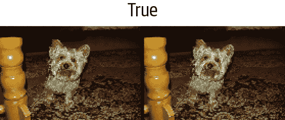
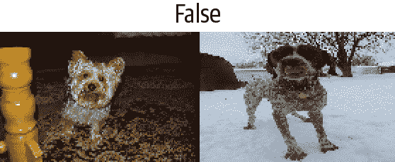
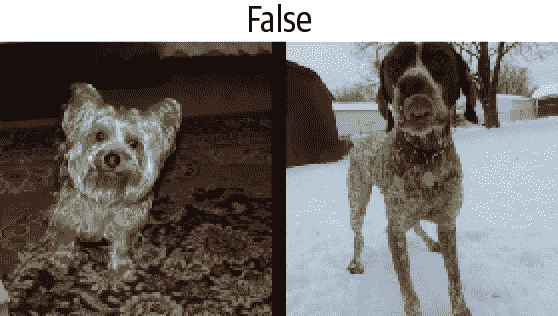
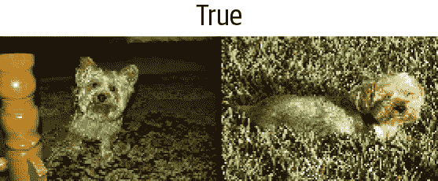
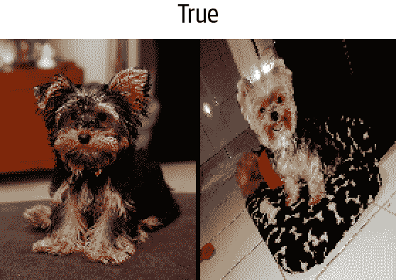

# 第十一章：使用 fastai 的中级 API 进行数据整理


我们已经看到了`Tokenizer`和`Numericalize`对文本集合的处理方式，以及它们如何在数据块 API 中使用，该 API 直接使用`TextBlock`处理这些转换。但是，如果我们只想应用这些转换中的一个，要么是为了查看中间结果，要么是因为我们已经对文本进行了标记化，我们该怎么办？更一般地说，当数据块 API 不足以满足我们特定用例的需求时，我们需要使用 fastai 的*中级 API*来处理数据。数据块 API 是建立在该层之上的，因此它将允许您执行数据块 API 所做的一切，以及更多更多。

# 深入了解 fastai 的分层 API

fastai 库是建立在*分层 API*上的。在最顶层是*应用程序*，允许我们在五行代码中训练模型，正如我们在第一章中看到的。例如，对于为文本分类器创建`DataLoaders`，我们使用了这一行：

```py
from fastai.text.all import *

dls = TextDataLoaders.from_folder(untar_data(URLs.IMDB), valid='test')
```

当您的数据排列方式与 IMDb 数据集完全相同时，工厂方法`TextDataLoaders.from_folder`非常方便，但实际上，情况通常不会如此。数据块 API 提供了更多的灵活性。正如我们在前一章中看到的，我们可以通过以下方式获得相同的结果：

```py
path = untar_data(URLs.IMDB)
dls = DataBlock(
    blocks=(TextBlock.from_folder(path),CategoryBlock),
    get_y = parent_label,
    get_items=partial(get_text_files, folders=['train', 'test']),
    splitter=GrandparentSplitter(valid_name='test')
).dataloaders(path)
```

但有时它并不够灵活。例如，出于调试目的，我们可能需要仅应用与此数据块一起的部分转换。或者我们可能希望为 fastai 不直接支持的应用程序创建一个`DataLoaders`。在本节中，我们将深入探讨 fastai 内部用于实现数据块 API 的组件。了解这些将使您能够利用这个中间层 API 的强大和灵活性。

# 中级 API

中级 API 不仅包含用于创建`DataLoaders`的功能。它还具有*回调*系统，允许我们以任何我们喜欢的方式自定义训练循环，以及*通用优化器*。这两者将在第十六章中介绍。

## 转换

在前一章中研究标记化和数值化时，我们首先获取了一堆文本：

```py
files = get_text_files(path, folders = ['train', 'test'])
txts = L(o.open().read() for o in files[:2000])
```

然后我们展示了如何使用`Tokenizer`对它们进行标记化

```py
tok = Tokenizer.from_folder(path)
tok.setup(txts)
toks = txts.map(tok)
toks[0]
```

```py
(#374) ['xxbos','xxmaj','well',',','"','cube','"','(','1997',')'...]
```

以及如何进行数值化，包括自动为我们的语料库创建词汇表：

```py
num = Numericalize()
num.setup(toks)
nums = toks.map(num)
nums[0][:10]
```

```py
tensor([   2,    8,   76,   10,   23, 3112,   23,   34, 3113,   33])
```

这些类还有一个`decode`方法。例如，`Numericalize.decode`会将字符串标记返回给我们：

```py
nums_dec = num.decode(nums[0][:10]); nums_dec
```

```py
(#10) ['xxbos','xxmaj','well',',','"','cube','"','(','1997',')']
```

`Tokenizer.decode`将其转换回一个字符串（但可能不完全与原始字符串相同；这取决于标记器是否是*可逆的*，在我们撰写本书时，默认的单词标记器不是）：

```py
tok.decode(nums_dec)
```

```py
'xxbos xxmaj well , " cube " ( 1997 )'
```

`decode`被 fastai 的`show_batch`和`show_results`以及其他一些推断方法使用，将预测和小批量转换为人类可理解的表示。

在前面的示例中，对于`tok`或`num`，我们创建了一个名为`setup`的对象（如果需要为`tok`训练标记器并为`num`创建词汇表），将其应用于我们的原始文本（通过将对象作为函数调用），然后最终将结果解码回可理解的表示。大多数数据预处理任务都需要这些步骤，因此 fastai 提供了一个封装它们的类。这就是`Transform`类。`Tokenize`和`Numericalize`都是`Transform`。

一般来说，`Transform`是一个行为类似于函数的对象，它具有一个可选的`setup`方法，用于初始化内部状态（例如`num`内部的词汇表），以及一个可选的`decode`方法，用于反转函数（正如我们在`tok`中看到的那样，这种反转可能不完美）。

`decode` 的一个很好的例子可以在我们在 第七章 中看到的 `Normalize` 转换中找到：为了能够绘制图像，它的 `decode` 方法会撤消归一化（即，乘以标准差并加回均值）。另一方面，数据增强转换没有 `decode` 方法，因为我们希望展示图像上的效果，以确保数据增强按我们的意愿进行工作。

`Transform` 的一个特殊行为是它们总是应用于元组。一般来说，我们的数据总是一个元组 `(input, target)`（有时有多个输入或多个目标）。当对这样的项目应用转换时，例如 `Resize`，我们不希望整个元组被调整大小；相反，我们希望分别调整输入（如果适用）和目标（如果适用）。对于进行数据增强的批处理转换也是一样的：当输入是图像且目标是分割掩模时，需要将转换（以相同的方式）应用于输入和目标。

如果我们将一个文本元组传递给 `tok`，我们可以看到这种行为：

```py
tok((txts[0], txts[1]))
```

```py
((#374) ['xxbos','xxmaj','well',',','"','cube','"','(','1997',')'...],
 (#207)
 > ['xxbos','xxmaj','conrad','xxmaj','hall','went','out','with','a','bang'...])
```

## 编写您自己的转换

如果您想编写一个自定义的转换来应用于您的数据，最简单的方法是编写一个函数。正如您在这个例子中看到的，`Transform` 只会应用于匹配的类型，如果提供了类型（否则，它将始终被应用）。在下面的代码中，函数签名中的 `:int` 表示 `f` 仅应用于 `ints`。这就是为什么 `tfm(2.0)` 返回 `2.0`，但 `tfm(2)` 在这里返回 `3`：

```py
def f(x:int): return x+1
tfm = Transform(f)
tfm(2),tfm(2.0)
```

```py
(3, 2.0)
```

在这里，`f` 被转换为一个没有 `setup` 和没有 `decode` 方法的 `Transform`。

Python 有一种特殊的语法，用于将一个函数（如 `f`）传递给另一个函数（或类似函数的东西，在 Python 中称为 *callable*），称为 *decorator*。通过在可调用对象前加上 `@` 并将其放在函数定义之前来使用装饰器（关于 Python 装饰器有很多很好的在线教程，如果这对您来说是一个新概念，请查看其中一个）。以下代码与前面的代码相同：

```py
@Transform
def f(x:int): return x+1
f(2),f(2.0)
```

```py
(3, 2.0)
```

如果您需要 `setup` 或 `decode`，您需要对 `Transform` 进行子类化，以在 `encodes` 中实现实际的编码行为，然后（可选）在 `setups` 中实现设置行为和在 `decodes` 中实现解码行为：

```py
class NormalizeMean(Transform):
    def setups(self, items): self.mean = sum(items)/len(items)
    def encodes(self, x): return x-self.mean
    def decodes(self, x): return x+self.mean
```

在这里，`NormalizeMean` 将在设置期间初始化某个状态（传递的所有元素的平均值）；然后转换是减去该平均值。为了解码目的，我们通过添加平均值来实现该转换的反向。这里是 `NormalizeMean` 的一个示例：

```py
tfm = NormalizeMean()
tfm.setup([1,2,3,4,5])
start = 2
y = tfm(start)
z = tfm.decode(y)
tfm.mean,y,z
```

```py
(3.0, -1.0, 2.0)
```

请注意，每个方法的调用和实现是不同的：

| 类 | 调用 | 实现 |
| --- | --- | --- |
| `nn.Module`（PyTorch） | `()`（即，作为函数调用） | `forward` |
| `Transform` | `()` | `encodes` |
| `Transform` | `decode()` | `decodes` |
| `Transform` | `setup()` | `setups` |

因此，例如，您永远不会直接调用 `setups`，而是会调用 `setup`。原因是 `setup` 在为您调用 `setups` 之前和之后做了一些工作。要了解有关 `Transform` 及如何使用它们根据输入类型实现不同行为的更多信息，请务必查看 fastai 文档中的教程。

## Pipeline

要将几个转换组合在一起，fastai 提供了 `Pipeline` 类。我们通过向 `Pipeline` 传递一个 `Transform` 列表来定义一个 `Pipeline`；然后它将组合其中的转换。当您在对象上调用 `Pipeline` 时，它将自动按顺序调用其中的转换：

```py
tfms = Pipeline([tok, num])
t = tfms(txts[0]); t[:20]
```

```py
tensor([   2,    8,   76,   10,   23, 3112,   23,   34, 3113,   33,   10,    8,
 > 4477,   22,   88,   32,   10,   27,   42,   14])
```

您可以对编码结果调用 `decode`，以获取可以显示和分析的内容：

```py
tfms.decode(t)[:100]
```

```py
'xxbos xxmaj well , " cube " ( 1997 ) , xxmaj vincenzo \'s first movie , was one
 > of the most interesti'
```

`Transform` 中与 `Transform` 不同的部分是设置。要在一些数据上正确设置 `Transform` 的 `Pipeline`，您需要使用 `TfmdLists`。

# TfmdLists 和 Datasets：转换的集合

您的数据通常是一组原始项目（如文件名或 DataFrame 中的行），您希望对其应用一系列转换。我们刚刚看到，一系列转换在 fastai 中由`Pipeline`表示。将这个`Pipeline`与您的原始项目组合在一起的类称为`TfmdLists`。

## TfmdLists

以下是在前一节中看到的转换的简短方式：

```py
tls = TfmdLists(files, [Tokenizer.from_folder(path), Numericalize])
```

在初始化时，`TfmdLists`将自动调用每个`Transform`的`setup`方法，依次提供每个原始项目而不是由所有先前的`Transform`转换的项目。我们可以通过索引到`TfmdLists`中的任何原始元素来获得我们的`Pipeline`的结果：

```py
t = tls[0]; t[:20]
```

```py
tensor([    2,     8,    91,    11,    22,  5793,    22,    37,  4910,    34,
 > 11,     8, 13042,    23,   107,    30,    11,    25,    44,    14])
```

而`TfmdLists`知道如何解码以进行显示：

```py
tls.decode(t)[:100]
```

```py
'xxbos xxmaj well , " cube " ( 1997 ) , xxmaj vincenzo \'s first movie , was one
 > of the most interesti'
```

实际上，它甚至有一个`show`方法：

```py
tls.show(t)
```

```py
xxbos xxmaj well , " cube " ( 1997 ) , xxmaj vincenzo 's first movie , was one
 > of the most interesting and tricky ideas that xxmaj i 've ever seen when
 > talking about movies . xxmaj they had just one scenery , a bunch of actors
 > and a plot . xxmaj so , what made it so special were all the effective
 > direction , great dialogs and a bizarre condition that characters had to deal
 > like rats in a labyrinth . xxmaj his second movie , " cypher " ( 2002 ) , was
 > all about its story , but it was n't so good as " cube " but here are the
 > characters being tested like rats again .

 " nothing " is something very interesting and gets xxmaj vincenzo coming back
 > to his ' cube days ' , locking the characters once again in a very different
 > space with no time once more playing with the characters like playing with
 > rats in an experience room . xxmaj but instead of a thriller sci - fi ( even
 > some of the promotional teasers and trailers erroneous seemed like that ) , "
 > nothing " is a loose and light comedy that for sure can be called a modern
 > satire about our society and also about the intolerant world we 're living .
 > xxmaj once again xxmaj xxunk amaze us with a great idea into a so small kind
 > of thing . 2 actors and a blinding white scenario , that 's all you got most
 > part of time and you do n't need more than that . xxmaj while " cube " is a
 > claustrophobic experience and " cypher " confusing , " nothing " is
 > completely the opposite but at the same time also desperate .

 xxmaj this movie proves once again that a smart idea means much more than just
 > a millionaire budget . xxmaj of course that the movie fails sometimes , but
 > its prime idea means a lot and offsets any flaws . xxmaj there 's nothing
 > more to be said about this movie because everything is a brilliant surprise
 > and a totally different experience that i had in movies since " cube " .
```

`TfmdLists`以“s”命名，因为它可以使用`splits`参数处理训练集和验证集。您只需要传递在训练集中的元素的索引和在验证集中的元素的索引：

```py
cut = int(len(files)*0.8)
splits = [list(range(cut)), list(range(cut,len(files)))]
tls = TfmdLists(files, [Tokenizer.from_folder(path), Numericalize],
                splits=splits)
```

然后可以通过`train`和`valid`属性访问它们：

```py
tls.valid[0][:20]
```

```py
tensor([    2,     8,    20,    30,    87,   510,  1570,    12,   408,   379,
 > 4196,    10,     8,    20,    30,    16,    13, 12216,   202,   509])
```

如果您手动编写了一个`Transform`，一次执行所有预处理，将原始项目转换为具有输入和目标的元组，那么`TfmdLists`是您需要的类。您可以使用`dataloaders`方法直接将其转换为`DataLoaders`对象。这是我们稍后在本章中将要做的事情。

一般来说，您将有两个（或更多）并行的转换流水线：一个用于将原始项目处理为输入，另一个用于将原始项目处理为目标。例如，在这里，我们定义的流水线仅将原始文本处理为输入。如果我们要进行文本分类，还必须将标签处理为目标。

为此，我们需要做两件事。首先，我们从父文件夹中获取标签名称。有一个名为`parent_label`的函数：

```py
lbls = files.map(parent_label)
lbls
```

```py
(#50000) ['pos','pos','pos','pos','pos','pos','pos','pos','pos','pos'...]
```

然后我们需要一个`Transform`，在设置期间将抓取的唯一项目构建为词汇表，然后在调用时将字符串标签转换为整数。fastai 为我们提供了这个；它被称为`Categorize`：

```py
cat = Categorize()
cat.setup(lbls)
cat.vocab, cat(lbls[0])
```

```py
((#2) ['neg','pos'], TensorCategory(1))
```

要在我们的文件列表上自动执行整个设置，我们可以像以前一样创建一个`TfmdLists`：

```py
tls_y = TfmdLists(files, [parent_label, Categorize()])
tls_y[0]
```

```py
TensorCategory(1)
```

但是然后我们得到了两个分开的对象用于我们的输入和目标，这不是我们想要的。这就是`Datasets`发挥作用的地方。

## Datasets

`Datasets`将并行应用两个（或更多）流水线到相同的原始对象，并构建一个包含结果的元组。与`TfmdLists`一样，它将自动为我们进行设置，当我们索引到`Datasets`时，它将返回一个包含每个流水线结果的元组：

```py
x_tfms = [Tokenizer.from_folder(path), Numericalize]
y_tfms = [parent_label, Categorize()]
dsets = Datasets(files, [x_tfms, y_tfms])
x,y = dsets[0]
x[:20],y
```

像`TfmdLists`一样，我们可以将`splits`传递给`Datasets`以在训练和验证集之间拆分我们的数据：

```py
x_tfms = [Tokenizer.from_folder(path), Numericalize]
y_tfms = [parent_label, Categorize()]
dsets = Datasets(files, [x_tfms, y_tfms], splits=splits)
x,y = dsets.valid[0]
x[:20],y
```

```py
(tensor([    2,     8,    20,    30,    87,   510,  1570,    12,   408,   379,
 > 4196,    10,     8,    20,    30,    16,    13, 12216,   202,   509]),
 TensorCategory(0))
```

它还可以解码任何处理过的元组或直接显示它：

```py
t = dsets.valid[0]
dsets.decode(t)
```

```py
('xxbos xxmaj this movie had horrible lighting and terrible camera movements .
 > xxmaj this movie is a jumpy horror flick with no meaning at all . xxmaj the
 > slashes are totally fake looking . xxmaj it looks like some 17 year - old
 > idiot wrote this movie and a 10 year old kid shot it . xxmaj with the worst
 > acting you can ever find . xxmaj people are tired of knives . xxmaj at least
 > move on to guns or fire . xxmaj it has almost exact lines from " when a xxmaj
 > stranger xxmaj calls " . xxmaj with gruesome killings , only crazy people
 > would enjoy this movie . xxmaj it is obvious the writer does n\'t have kids
 > or even care for them . i mean at show some mercy . xxmaj just to sum it up ,
 > this movie is a " b " movie and it sucked . xxmaj just for your own sake , do
 > n\'t even think about wasting your time watching this crappy movie .',
 'neg')
```

最后一步是将我们的`Datasets`对象转换为`DataLoaders`，可以使用`dataloaders`方法完成。在这里，我们需要传递一个特殊参数来解决填充问题（正如我们在前一章中看到的）。这需要在我们批处理元素之前发生，所以我们将其传递给`before_batch`：

```py
dls = dsets.dataloaders(bs=64, before_batch=pad_input)
```

`dataloaders`直接在我们的`Datasets`的每个子集上调用`DataLoader`。fastai 的`DataLoader`扩展了 PyTorch 中同名类，并负责将我们的数据集中的项目整理成批次。它有很多自定义点，但您应该知道的最重要的是：

`after_item`

在数据集中抓取项目后应用于每个项目。这相当于`DataBlock`中的`item_tfms`。

`before_batch`

在整理之前应用于项目列表上。这是将项目填充到相同大小的理想位置。

`after_batch`

在构建后对整个批次应用。这相当于`DataBlock`中的`batch_tfms`。

最后，这是为了准备文本分类数据所需的完整代码：

```py
tfms = [[Tokenizer.from_folder(path), Numericalize], [parent_label, Categorize]]
files = get_text_files(path, folders = ['train', 'test'])
splits = GrandparentSplitter(valid_name='test')(files)
dsets = Datasets(files, tfms, splits=splits)
dls = dsets.dataloaders(dl_type=SortedDL, before_batch=pad_input)
```

与之前的代码的两个不同之处是使用`GrandparentSplitter`来分割我们的训练和验证数据，以及`dl_type`参数。这是告诉`dataloaders`使用`DataLoader`的`SortedDL`类，而不是通常的类。`SortedDL`通过将大致相同长度的样本放入批次来构建批次。

这与我们之前的`DataBlock`完全相同：

```py
path = untar_data(URLs.IMDB)
dls = DataBlock(
    blocks=(TextBlock.from_folder(path),CategoryBlock),
    get_y = parent_label,
    get_items=partial(get_text_files, folders=['train', 'test']),
    splitter=GrandparentSplitter(valid_name='test')
).dataloaders(path)
```

但现在你知道如何定制每一个部分了！

让我们现在通过一个计算机视觉示例练习刚学到的关于使用这个中级 API 进行数据预处理。

# 应用中级数据 API：SiamesePair

一个*暹罗模型*需要两张图片，并且必须确定它们是否属于同一类。在这个例子中，我们将再次使用宠物数据集，并准备数据用于一个模型，该模型将预测两张宠物图片是否属于同一品种。我们将在这里解释如何为这样的模型准备数据，然后我们将在第十五章中训练该模型。

首先要做的是-让我们获取数据集中的图片：

```py
from fastai.vision.all import *
path = untar_data(URLs.PETS)
files = get_image_files(path/"images")
```

如果我们根本不关心显示我们的对象，我们可以直接创建一个转换来完全预处理那个文件列表。但是我们想要查看这些图片，因此我们需要创建一个自定义类型。当您在`TfmdLists`或`Datasets`对象上调用`show`方法时，它将解码项目，直到达到包含`show`方法的类型，并使用它来显示对象。该`show`方法会传递一个`ctx`，它可以是图像的`matplotlib`轴，也可以是文本的 DataFrame 行。

在这里，我们创建了一个`SiameseImage`对象，它是`Tuple`的子类，旨在包含三个东西：两张图片和一个布尔值，如果图片是同一品种则为`True`。我们还实现了特殊的`show`方法，使其将两张图片与中间的黑线连接起来。不要太担心`if`测试中的部分（这是在 Python 图片而不是张量时显示`SiameseImage`的部分）；重要的部分在最后三行：

```py
class SiameseImage(Tuple):
    def show(self, ctx=None, **kwargs):
        img1,img2,same_breed = self
        if not isinstance(img1, Tensor):
            if img2.size != img1.size: img2 = img2.resize(img1.size)
            t1,t2 = tensor(img1),tensor(img2)
            t1,t2 = t1.permute(2,0,1),t2.permute(2,0,1)
        else: t1,t2 = img1,img2
        line = t1.new_zeros(t1.shape[0], t1.shape[1], 10)
        return show_image(torch.cat([t1,line,t2], dim=2),
                          title=same_breed, ctx=ctx)
```

让我们创建一个第一个`SiameseImage`并检查我们的`show`方法是否有效：

```py
img = PILImage.create(files[0])
s = SiameseImage(img, img, True)
s.show();
```



我们也可以尝试一个不属于同一类的第二张图片：

```py
img1 = PILImage.create(files[1])
s1 = SiameseImage(img, img1, False)
s1.show();
```



我们之前看到的转换的重要之处是它们会分派到元组或其子类。这正是为什么在这种情况下我们选择子类化`Tuple`的原因-这样，我们可以将适用于图像的任何转换应用于我们的`SiameseImage`，并且它将应用于元组中的每个图像：

```py
s2 = Resize(224)(s1)
s2.show();
```



这里`Resize`转换应用于两个图片中的每一个，但不应用于布尔标志。即使我们有一个自定义类型，我们也可以从库中的所有数据增强转换中受益。

现在我们准备构建`Transform`，以便为暹罗模型准备数据。首先，我们需要一个函数来确定所有图片的类别：

```py
def label_func(fname):
    return re.match(r'^(.*)_\d+.jpg$', fname.name).groups()[0]
```

对于每张图片，我们的转换将以 0.5 的概率从同一类中绘制一张图片，并返回一个带有真标签的`SiameseImage`，或者从另一类中绘制一张图片并返回一个带有假标签的`SiameseImage`。这一切都在私有的`_draw`函数中完成。训练集和验证集之间有一个区别，这就是为什么转换需要用拆分初始化：在训练集上，我们将每次读取一张图片时进行随机选择，而在验证集上，我们将在初始化时进行一次性随机选择。这样，在训练期间我们会得到更多不同的样本，但始终是相同的验证集：

```py
class SiameseTransform(Transform):
    def __init__(self, files, label_func, splits):
        self.labels = files.map(label_func).unique()
        self.lbl2files = {l: L(f for f in files if label_func(f) == l)
                          for l in self.labels}
        self.label_func = label_func
        self.valid = {f: self._draw(f) for f in files[splits[1]]}

    def encodes(self, f):
        f2,t = self.valid.get(f, self._draw(f))
        img1,img2 = PILImage.create(f),PILImage.create(f2)
        return SiameseImage(img1, img2, t)

    def _draw(self, f):
        same = random.random() < 0.5
        cls = self.label_func(f)
        if not same:
            cls = random.choice(L(l for l in self.labels if l != cls))
        return random.choice(self.lbl2files[cls]),same
```

然后我们可以创建我们的主要转换：

```py
splits = RandomSplitter()(files)
tfm = SiameseTransform(files, label_func, splits)
tfm(files[0]).show();
```



在数据收集的中级 API 中，我们有两个对象可以帮助我们在一组项目上应用转换：`TfmdLists`和`Datasets`。如果您记得刚才看到的内容，一个应用一系列转换的`Pipeline`，另一个并行应用多个`Pipeline`，以构建元组。在这里，我们的主要转换已经构建了元组，因此我们使用`TfmdLists`：

```py
tls = TfmdLists(files, tfm, splits=splits)
show_at(tls.valid, 0);
```



最后，我们可以通过调用`dataloaders`方法在`DataLoaders`中获取我们的数据。这里需要注意的一点是，这个方法不像`DataBlock`那样接受`item_tfms`和`batch_tfms`。fastai 的`DataLoader`有几个钩子，这些钩子以事件命名；在我们抓取项目后应用的内容称为`after_item`，在构建批次后应用的内容称为`after_batch`：

```py
dls = tls.dataloaders(after_item=[Resize(224), ToTensor],
    after_batch=[IntToFloatTensor, Normalize.from_stats(*imagenet_stats)])
```

请注意，我们需要传递比通常更多的转换，这是因为数据块 API 通常会自动添加它们：

+   `ToTensor`是将图像转换为张量的函数（再次，它应用于元组的每个部分）。

+   `IntToFloatTensor`将包含 0 到 255 之间整数的图像张量转换为浮点数张量，并除以 255，使值在 0 到 1 之间。

现在我们可以使用这个`DataLoaders`来训练模型。与`cnn_learner`提供的通常模型相比，它需要更多的定制，因为它必须接受两个图像而不是一个，但我们将看到如何创建这样的模型并在第十五章中进行训练。

# 结论

fastai 提供了分层 API。当数据处于通常设置之一时，只需一行代码即可获取数据，这使得初学者可以专注于训练模型，而无需花费太多时间组装数据。然后，高级数据块 API 通过允许您混合和匹配构建块来提供更多灵活性。在其下面，中级 API 为您提供更大的灵活性，以在项目上应用转换。在您的实际问题中，这可能是您需要使用的内容，我们希望它使数据处理步骤尽可能简单。

# 问卷调查

1.  为什么我们说 fastai 具有“分层”API？这是什么意思？

1.  `Transform`为什么有一个`decode`方法？它是做什么的？

1.  `Transform`为什么有一个`setup`方法？它是做什么的？

1.  当在元组上调用`Transform`时，它是如何工作的？

1.  编写自己的`Transform`时需要实现哪些方法？

1.  编写一个完全规范化项目的`Normalize`转换（减去数据集的平均值并除以标准差），并且可以解码该行为。尽量不要偷看！

1.  编写一个`Transform`，用于对标记化文本进行数字化（它应该从已见数据集自动设置其词汇，并具有`decode`方法）。如果需要帮助，请查看 fastai 的源代码。

1.  什么是`Pipeline`？

1.  什么是`TfmdLists`？

1.  什么是`Datasets`？它与`TfmdLists`有什么不同？

1.  为什么`TfmdLists`和`Datasets`带有“s”这个名字？

1.  如何从`TfmdLists`或`Datasets`构建`DataLoaders`？

1.  在从`TfmdLists`或`Datasets`构建`DataLoaders`时，如何传递`item_tfms`和`batch_tfms`？

1.  当您希望自定义项目与`show_batch`或`show_results`等方法一起使用时，您需要做什么？

1.  为什么我们可以轻松地将 fastai 数据增强转换应用于我们构建的`SiamesePair`？

## 进一步研究

1.  使用中级 API 在自己的数据集上准备`DataLoaders`中的数据。尝试在 Pet 数据集和 Adult 数据集上进行此操作，这两个数据集来自第一章。

1.  查看[fastai 文档](https://docs.fast.ai)中的 Siamese 教程，了解如何为新类型的项目自定义`show_batch`和`show_results`的行为。在您自己的项目中实现它。

# 理解 fastai 的应用：总结

恭喜你——你已经完成了本书中涵盖训练模型和使用深度学习的关键实用部分的所有章节！你知道如何使用所有 fastai 内置的应用程序，以及如何使用数据块 API 和损失函数进行定制。你甚至知道如何从头开始创建神经网络并训练它！（希望你现在也知道一些问题要问，以确保你的创作有助于改善社会。）

你已经掌握的知识足以创建许多类型的神经网络应用的完整工作原型。更重要的是，它将帮助你了解深度学习模型的能力和局限性，以及如何设计一个适应它们的系统。

在本书的其余部分，我们将逐个拆解这些应用程序，以了解它们构建在哪些基础之上。这对于深度学习从业者来说是重要的知识，因为它使您能够检查和调试您构建的模型，并创建定制的新应用程序，以适应您特定的项目。
