# 第十二章：从头开始的语言模型


我们现在准备深入…深入深度学习！您已经学会了如何训练基本的神经网络，但是如何从那里创建最先进的模型呢？在本书的这一部分，我们将揭开所有的神秘，从语言模型开始。

您在第十章中看到了如何微调预训练的语言模型以构建文本分类器。在本章中，我们将解释该模型的内部结构以及 RNN 是什么。首先，让我们收集一些数据，这些数据将允许我们快速原型化各种模型。

# 数据

每当我们开始处理一个新问题时，我们总是首先尝试想出一个最简单的数据集，这样可以让我们快速轻松地尝试方法并解释结果。几年前我们开始进行语言建模时，我们没有找到任何可以快速原型的数据集，所以我们自己制作了一个。我们称之为*Human Numbers*，它简单地包含了用英语写出的前 10000 个数字。

# Jeremy 说

我在高度经验丰富的从业者中经常看到的一个常见实际错误是在分析过程中未能在适当的时间使用适当的数据集。特别是，大多数人倾向于从太大、太复杂的数据集开始。

我们可以按照通常的方式下载、提取并查看我们的数据集：

```py
from fastai.text.all import *
path = untar_data(URLs.HUMAN_NUMBERS)
```

```py
path.ls()
```

```py
(#2) [Path('train.txt'),Path('valid.txt')]
```

让我们打开这两个文件，看看里面有什么。首先，我们将把所有文本连接在一起，忽略数据集给出的训练/验证拆分（我们稍后会回到这一点）：

```py
lines = L()
with open(path/'train.txt') as f: lines += L(*f.readlines())
with open(path/'valid.txt') as f: lines += L(*f.readlines())
lines
```

```py
(#9998) ['one \n','two \n','three \n','four \n','five \n','six \n','seven
 > \n','eight \n','nine \n','ten \n'...]
```

我们将所有这些行连接在一个大流中。为了标记我们从一个数字到下一个数字的转变，我们使用`.`作为分隔符：

```py
text = ' . '.join([l.strip() for l in lines])
text[:100]
```

```py
'one . two . three . four . five . six . seven . eight . nine . ten . eleven .
 > twelve . thirteen . fo'
```

我们可以通过在空格上拆分来对这个数据集进行标记化：

```py
tokens = text.split(' ')
tokens[:10]
```

```py
['one', '.', 'two', '.', 'three', '.', 'four', '.', 'five', '.']
```

为了数值化，我们必须创建一个包含所有唯一标记（我们的*词汇表*）的列表：

```py
vocab = L(*tokens).unique()
vocab
```

```py
(#30) ['one','.','two','three','four','five','six','seven','eight','nine'...]
```

然后，我们可以通过查找每个词在词汇表中的索引，将我们的标记转换为数字：

```py
word2idx = {w:i for i,w in enumerate(vocab)}
nums = L(word2idx[i] for i in tokens)
nums
```

```py
(#63095) [0,1,2,1,3,1,4,1,5,1...]
```

现在我们有了一个小数据集，语言建模应该是一个简单的任务，我们可以构建我们的第一个模型。

# 我们的第一个从头开始的语言模型

将这转换为神经网络的一个简单方法是指定我们将基于前三个单词预测每个单词。我们可以创建一个包含每个三个单词序列的列表作为我们的自变量，以及每个序列后面的下一个单词作为因变量。

我们可以用普通的 Python 来做到这一点。首先让我们用标记来确认它是什么样子的：

```py
L((tokens[i:i+3], tokens[i+3]) for i in range(0,len(tokens)-4,3))
```

```py
(#21031) [(['one', '.', 'two'], '.'),(['.', 'three', '.'], 'four'),(['four',
 > '.', 'five'], '.'),(['.', 'six', '.'], 'seven'),(['seven', '.', 'eight'],
 > '.'),(['.', 'nine', '.'], 'ten'),(['ten', '.', 'eleven'], '.'),(['.',
 > 'twelve', '.'], 'thirteen'),(['thirteen', '.', 'fourteen'], '.'),(['.',
 > 'fifteen', '.'], 'sixteen')...]
```

现在我们将使用数值化值的张量来做到这一点，这正是模型实际使用的：

```py
seqs = L((tensor(nums[i:i+3]), nums[i+3]) for i in range(0,len(nums)-4,3))
seqs
```

```py
(#21031) [(tensor([0, 1, 2]), 1),(tensor([1, 3, 1]), 4),(tensor([4, 1, 5]),
 > 1),(tensor([1, 6, 1]), 7),(tensor([7, 1, 8]), 1),(tensor([1, 9, 1]),
 > 10),(tensor([10,  1, 11]), 1),(tensor([ 1, 12,  1]), 13),(tensor([13,  1,
 > 14]), 1),(tensor([ 1, 15,  1]), 16)...]
```

我们可以使用`DataLoader`类轻松地对这些进行批处理。现在，我们将随机拆分序列：

```py
bs = 64
cut = int(len(seqs) * 0.8)
dls = DataLoaders.from_dsets(seqs[:cut], seqs[cut:], bs=64, shuffle=False)
```

现在我们可以创建一个神经网络架构，它以三个单词作为输入，并返回词汇表中每个可能的下一个单词的概率预测。我们将使用三个标准线性层，但有两个调整。

第一个调整是，第一个线性层将仅使用第一个词的嵌入作为激活，第二层将使用第二个词的嵌入加上第一层的输出激活，第三层将使用第三个词的嵌入加上第二层的输出激活。关键效果是每个词都在其前面的任何单词的信息上下文中被解释。

第二个调整是，这三个层中的每一个将使用相同的权重矩阵。一个词对来自前面单词的激活的影响方式不应该取决于单词的位置。换句话说，激活值会随着数据通过层移动而改变，但是层权重本身不会从一层到另一层改变。因此，一个层不会学习一个序列位置；它必须学会处理所有位置。

由于层权重不会改变，您可能会认为顺序层是“重复的相同层”。事实上，PyTorch 使这一点具体化；我们可以创建一个层并多次使用它。

## 我们的 PyTorch 语言模型

我们现在可以创建我们之前描述的语言模型模块：

```py
class LMModel1(Module):
    def __init__(self, vocab_sz, n_hidden):
        self.i_h = nn.Embedding(vocab_sz, n_hidden)
        self.h_h = nn.Linear(n_hidden, n_hidden)
        self.h_o = nn.Linear(n_hidden,vocab_sz)

    def forward(self, x):
        h = F.relu(self.h_h(self.i_h(x[:,0])))
        h = h + self.i_h(x[:,1])
        h = F.relu(self.h_h(h))
        h = h + self.i_h(x[:,2])
        h = F.relu(self.h_h(h))
        return self.h_o(h)
```

正如您所看到的，我们已经创建了三个层：

+   嵌入层（`i_h`，表示 *输入* 到 *隐藏*）

+   线性层用于创建下一个单词的激活（`h_h`，表示 *隐藏* 到 *隐藏*）

+   一个最终的线性层来预测第四个单词（`h_o`，表示 *隐藏* 到 *输出*）

这可能更容易以图示形式表示，因此让我们定义一个基本神经网络的简单图示表示。图 12-1 显示了我们将如何用一个隐藏层表示神经网络。

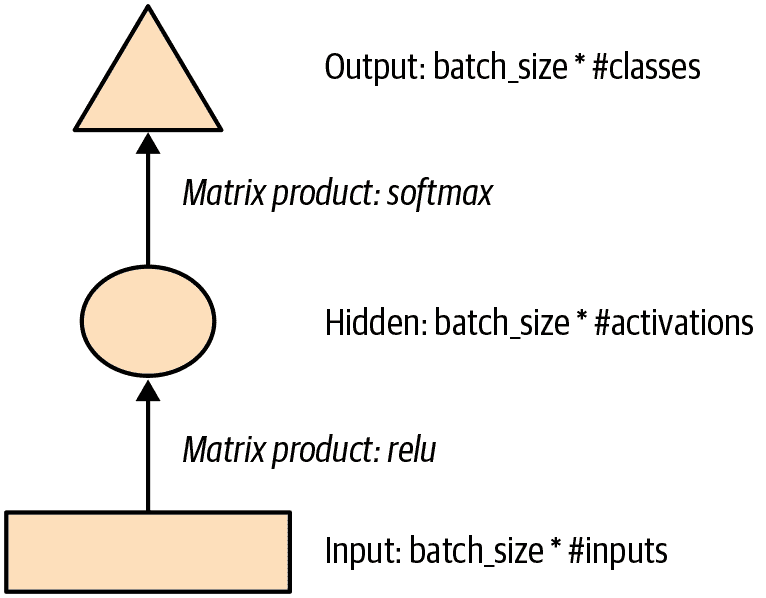

###### 图 12-1。简单神经网络的图示表示

每个形状代表激活：矩形代表输入，圆圈代表隐藏（内部）层激活，三角形代表输出激活。我们将在本章中的所有图表中使用这些形状（在 图 12-2 中总结）。

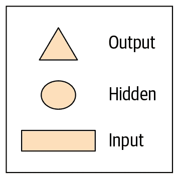

###### 图 12-2。我们图示表示中使用的形状

箭头代表实际的层计算——即线性层后跟激活函数。使用这种符号，图 12-3 显示了我们简单语言模型的外观。

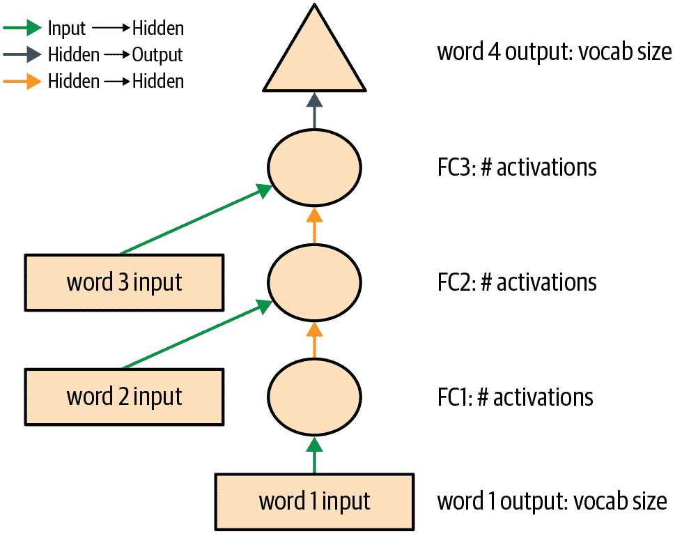

###### 图 12-3。我们基本语言模型的表示

为了简化事情，我们已经从每个箭头中删除了层计算的细节。我们还对箭头进行了颜色编码，使所有具有相同颜色的箭头具有相同的权重矩阵。例如，所有输入层使用相同的嵌入矩阵，因此它们都具有相同的颜色（绿色）。

让我们尝试训练这个模型，看看效果如何：

```py
learn = Learner(dls, LMModel1(len(vocab), 64), loss_func=F.cross_entropy,
                metrics=accuracy)
learn.fit_one_cycle(4, 1e-3)
```

| epoch | train_loss | valid_loss | accuracy | time |
| --- | --- | --- | --- | --- |
| 0 | 1.824297 | 1.970941 | 0.467554 | 00:02 |
| 1 | 1.386973 | 1.823242 | 0.467554 | 00:02 |
| 2 | 1.417556 | 1.654497 | 0.494414 | 00:02 |
| 3 | 1.376440 | 1.650849 | 0.494414 | 00:02 |

要查看这是否有效，请查看一个非常简单的模型会给我们什么结果。在这种情况下，我们总是可以预测最常见的标记，因此让我们找出在我们的验证集中最常见的目标是哪个标记：

```py
n,counts = 0,torch.zeros(len(vocab))
for x,y in dls.valid:
    n += y.shape[0]
    for i in range_of(vocab): counts[i] += (y==i).long().sum()
idx = torch.argmax(counts)
idx, vocab[idx.item()], counts[idx].item()/n
```

```py
(tensor(29), 'thousand', 0.15165200855716662)
```

最常见的标记的索引是 29，对应于标记 `thousand`。总是预测这个标记将给我们大约 15% 的准确率，所以我们表现得更好！

# Alexis 说

我的第一个猜测是分隔符会是最常见的标记，因为每个数字都有一个分隔符。但查看 `tokens` 提醒我，大数字用许多单词写成，所以在通往 10,000 的路上，你会经常写“thousand”：five thousand, five thousand and one, five thousand and two 等等。糟糕！查看数据对于注意到微妙特征以及尴尬明显的特征都很有帮助。

这是一个不错的第一个基线。让我们看看如何用循环重构它。

## 我们的第一个循环神经网络

查看我们模块的代码，我们可以通过用 `for` 循环替换调用层的重复代码来简化它。除了使我们的代码更简单外，这样做的好处是我们将能够同样适用于不同长度的标记序列——我们不会被限制在长度为三的标记列表上：

```py
class LMModel2(Module):
    def __init__(self, vocab_sz, n_hidden):
        self.i_h = nn.Embedding(vocab_sz, n_hidden)
        self.h_h = nn.Linear(n_hidden, n_hidden)
        self.h_o = nn.Linear(n_hidden,vocab_sz)

    def forward(self, x):
        h = 0
        for i in range(3):
            h = h + self.i_h(x[:,i])
            h = F.relu(self.h_h(h))
        return self.h_o(h)
```

让我们检查一下，看看我们使用这种重构是否得到相同的结果：

```py
learn = Learner(dls, LMModel2(len(vocab), 64), loss_func=F.cross_entropy,
                metrics=accuracy)
learn.fit_one_cycle(4, 1e-3)
```

| epoch | train_loss | valid_loss | accuracy | time |
| --- | --- | --- | --- | --- |
| 0 | 1.816274 | 1.964143 | 0.460185 | 00:02 |
| 1 | 1.423805 | 1.739964 | 0.473259 | 00:02 |
| 2 | 1.430327 | 1.685172 | 0.485382 | 00:02 |
| 3 | 1.388390 | 1.657033 | 0.470406 | 00:02 |

我们还可以以完全相同的方式重构我们的图示表示，如图 12-4 所示（这里我们也删除了激活大小的细节，并使用与图 12-3 相同的箭头颜色）。

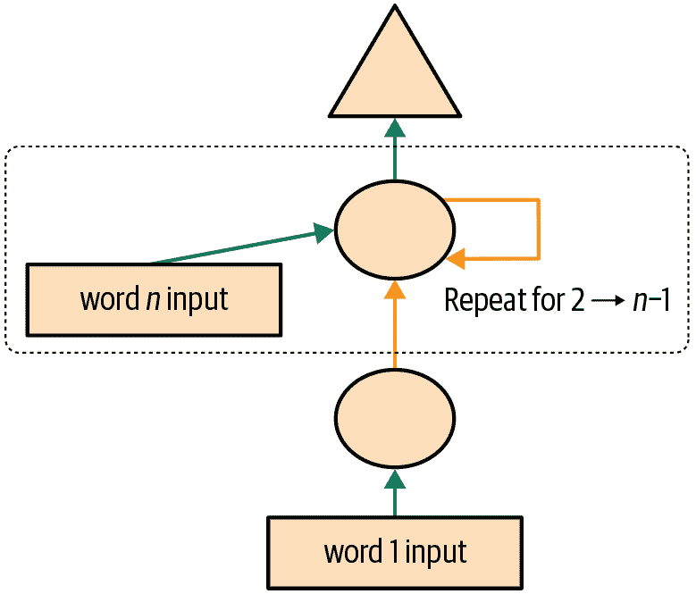

###### 图 12-4\. 基本循环神经网络

您将看到一组激活在每次循环中被更新，存储在变量`h`中—这被称为*隐藏状态*。

# 术语：隐藏状态

在循环神经网络的每一步中更新的激活。

使用这样的循环定义的神经网络称为*循环神经网络*（RNN）。重要的是要意识到 RNN 并不是一个复杂的新架构，而只是使用`for`循环对多层神经网络进行重构。

# Alexis 说

我的真实看法：如果它们被称为“循环神经网络”或 LNNs，它们看起来会少恐怖 50%！

现在我们知道了什么是 RNN，让我们试着让它变得更好一点。

# 改进 RNN

观察我们的 RNN 代码，有一个看起来有问题的地方是，我们为每个新的输入序列将隐藏状态初始化为零。为什么这是个问题呢？我们将样本序列设置得很短，以便它们可以轻松地适应批处理。但是，如果我们正确地对这些样本进行排序，模型将按顺序读取样本序列，使模型暴露于原始序列的长时间段。

我们还可以考虑增加更多信号：为什么只预测第四个单词，而不使用中间预测来预测第二和第三个单词呢？让我们看看如何实现这些变化，首先从添加一些状态开始。

## 维护 RNN 的状态

因为我们为每个新样本将模型的隐藏状态初始化为零，这样我们就丢失了关于迄今为止看到的句子的所有信息，这意味着我们的模型实际上不知道我们在整体计数序列中的进度。这很容易修复；我们只需将隐藏状态的初始化移动到`__init__`中。

但是，这种修复方法将产生自己微妙但重要的问题。它实际上使我们的神经网络变得和文档中的令牌数量一样多。例如，如果我们的数据集中有 10,000 个令牌，我们将创建一个有 10,000 层的神经网络。

要了解为什么会出现这种情况，请考虑我们循环神经网络的原始图示表示，即在图 12-3 中，在使用`for`循环重构之前。您可以看到每个层对应一个令牌输入。当我们谈论使用`for`循环重构之前的循环神经网络的表示时，我们称之为*展开表示*。在尝试理解 RNN 时，考虑展开表示通常是有帮助的。

10,000 层神经网络的问题在于，当您到达数据集的第 10,000 个单词时，您仍然需要计算直到第一层的所有导数。这将非常缓慢，且占用内存。您可能无法在 GPU 上存储一个小批量。

解决这个问题的方法是告诉 PyTorch 我们不希望通过整个隐式神经网络反向传播导数。相反，我们将保留梯度的最后三层。为了在 PyTorch 中删除所有梯度历史，我们使用`detach`方法。

这是我们 RNN 的新版本。现在它是有状态的，因为它在不同调用`forward`时记住了其激活，这代表了它在批处理中用于不同样本的情况：

```py
class LMModel3(Module):
    def __init__(self, vocab_sz, n_hidden):
        self.i_h = nn.Embedding(vocab_sz, n_hidden)
        self.h_h = nn.Linear(n_hidden, n_hidden)
        self.h_o = nn.Linear(n_hidden,vocab_sz)
        self.h = 0

    def forward(self, x):
        for i in range(3):
            self.h = self.h + self.i_h(x[:,i])
            self.h = F.relu(self.h_h(self.h))
        out = self.h_o(self.h)
        self.h = self.h.detach()
        return out

    def reset(self): self.h = 0
```

无论我们选择什么序列长度，这个模型将具有相同的激活，因为隐藏状态将记住上一批次的最后激活。唯一不同的是在每一步计算的梯度：它们将仅在过去的序列长度标记上计算，而不是整个流。这种方法称为*时间穿梭反向传播*（BPTT）。

# 术语：时间穿梭反向传播

将一个神经网络有效地视为每个时间步长一个层（通常使用循环重构），并以通常的方式在其上计算梯度。为了避免内存和时间不足，我们通常使用*截断* BPTT，每隔几个时间步“分离”隐藏状态的计算历史。

要使用`LMModel3`，我们需要确保样本按照一定顺序进行查看。正如我们在第十章中看到的，如果第一批的第一行是我们的`dset[0]`，那么第二批应该将`dset[1]`作为第一行，以便模型看到文本流动。

`LMDataLoader`在第十章中为我们做到了这一点。这次我们要自己做。

为此，我们将重新排列我们的数据集。首先，我们将样本分成`m = len(dset) // bs`组（这相当于将整个连接数据集分成，例如，64 个大小相等的部分，因为我们在这里使用`bs=64`）。`m`是每个这些部分的长度。例如，如果我们使用整个数据集（尽管我们实际上将在一会儿将其分成训练和验证），我们有：

```py
m = len(seqs)//bs
m,bs,len(seqs)
```

```py
(328, 64, 21031)
```

第一批将由样本组成

```py
(0, m, 2*m, ..., (bs-1)*m)
```

样本的第二批

```py
(1, m+1, 2*m+1, ..., (bs-1)*m+1)
```

等等。这样，每个时期，模型将在每批次的每行上看到大小为`3*m`的连续文本块（因为每个文本的大小为 3）。

以下函数执行重新索引：

```py
def group_chunks(ds, bs):
    m = len(ds) // bs
    new_ds = L()
    for i in range(m): new_ds += L(ds[i + m*j] for j in range(bs))
    return new_ds
```

然后，我们在构建`DataLoaders`时只需传递`drop_last=True`来删除最后一个形状不为`bs`的批次。我们还传递`shuffle=False`以确保文本按顺序阅读：

```py
cut = int(len(seqs) * 0.8)
dls = DataLoaders.from_dsets(
    group_chunks(seqs[:cut], bs),
    group_chunks(seqs[cut:], bs),
    bs=bs, drop_last=True, shuffle=False)
```

我们添加的最后一件事是通过`Callback`对训练循环进行微调。我们将在第十六章中更多地讨论回调；这个回调将在每个时期的开始和每个验证阶段之前调用我们模型的`reset`方法。由于我们实现了该方法来将模型的隐藏状态设置为零，这将确保我们在阅读这些连续文本块之前以干净的状态开始。我们也可以开始训练更长一点：

```py
learn = Learner(dls, LMModel3(len(vocab), 64), loss_func=F.cross_entropy,
                metrics=accuracy, cbs=ModelResetter)
learn.fit_one_cycle(10, 3e-3)
```

| epoch | train_loss | valid_loss | accuracy | time |
| --- | --- | --- | --- | --- |
| 0 | 1.677074 | 1.827367 | 0.467548 | 00:02 |
| 1 | 1.282722 | 1.870913 | 0.388942 | 00:02 |
| 2 | 1.090705 | 1.651793 | 0.462500 | 00:02 |
| 3 | 1.005092 | 1.613794 | 0.516587 | 00:02 |
| 4 | 0.965975 | 1.560775 | 0.551202 | 00:02 |
| 5 | 0.916182 | 1.595857 | 0.560577 | 00:02 |
| 6 | 0.897657 | 1.539733 | 0.574279 | 00:02 |
| 7 | 0.836274 | 1.585141 | 0.583173 | 00:02 |
| 8 | 0.805877 | 1.629808 | 0.586779 | 00:02 |
| 9 | 0.795096 | 1.651267 | 0.588942 | 00:02 |

这已经更好了！下一步是使用更多目标并将它们与中间预测进行比较。

## 创建更多信号

我们当前方法的另一个问题是，我们仅为每三个输入单词预测一个输出单词。因此，我们反馈以更新权重的信号量不如可能的那么大。如果我们在每个单词后预测下一个单词，而不是每三个单词，将会更好，如图 12-5 所示。

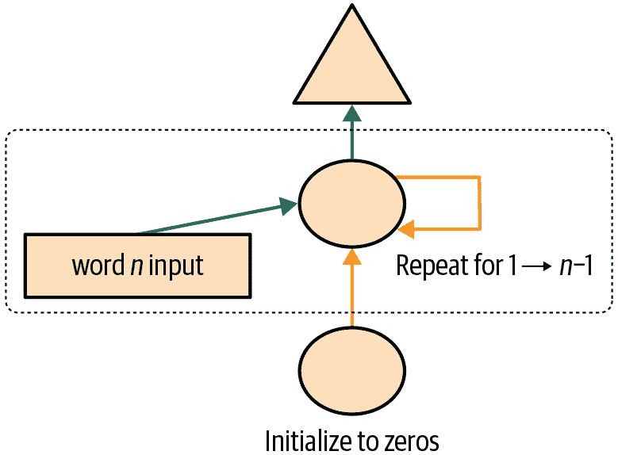

###### 图 12-5。RNN 在每个标记后进行预测

这很容易添加。我们需要首先改变我们的数据，使得因变量在每个三个输入词后的每个三个词中都有。我们使用一个属性`sl`（用于序列长度），并使其稍微变大：

```py
sl = 16
seqs = L((tensor(nums[i:i+sl]), tensor(nums[i+1:i+sl+1]))
         for i in range(0,len(nums)-sl-1,sl))
cut = int(len(seqs) * 0.8)
dls = DataLoaders.from_dsets(group_chunks(seqs[:cut], bs),
                             group_chunks(seqs[cut:], bs),
                             bs=bs, drop_last=True, shuffle=False)
```

查看`seqs`的第一个元素，我们可以看到它包含两个相同大小的列表。第二个列表与第一个相同，但偏移了一个元素：

```py
[L(vocab[o] for o in s) for s in seqs[0]]
```

```py
[(#16) ['one','.','two','.','three','.','four','.','five','.'...],
 (#16) ['.','two','.','three','.','four','.','five','.','six'...]]
```

现在我们需要修改我们的模型，使其在每个单词之后输出一个预测，而不仅仅是在一个三个词序列的末尾：

```py
class LMModel4(Module):
    def __init__(self, vocab_sz, n_hidden):
        self.i_h = nn.Embedding(vocab_sz, n_hidden)
        self.h_h = nn.Linear(n_hidden, n_hidden)
        self.h_o = nn.Linear(n_hidden,vocab_sz)
        self.h = 0

    def forward(self, x):
        outs = []
        for i in range(sl):
            self.h = self.h + self.i_h(x[:,i])
            self.h = F.relu(self.h_h(self.h))
            outs.append(self.h_o(self.h))
        self.h = self.h.detach()
        return torch.stack(outs, dim=1)

    def reset(self): self.h = 0
```

这个模型将返回形状为`bs x sl x vocab_sz`的输出（因为我们在`dim=1`上堆叠）。我们的目标的形状是`bs x sl`，所以在使用`F.cross_entropy`之前，我们需要将它们展平：

```py
def loss_func(inp, targ):
    return F.cross_entropy(inp.view(-1, len(vocab)), targ.view(-1))
```

我们现在可以使用这个损失函数来训练模型：

```py
learn = Learner(dls, LMModel4(len(vocab), 64), loss_func=loss_func,
                metrics=accuracy, cbs=ModelResetter)
learn.fit_one_cycle(15, 3e-3)
```

| epoch | train_loss | valid_loss | accuracy | time |
| --- | --- | --- | --- | --- |
| 0 | 3.103298 | 2.874341 | 0.212565 | 00:01 |
| 1 | 2.231964 | 1.971280 | 0.462158 | 00:01 |
| 2 | 1.711358 | 1.813547 | 0.461182 | 00:01 |
| 3 | 1.448516 | 1.828176 | 0.483236 | 00:01 |
| 4 | 1.288630 | 1.659564 | 0.520671 | 00:01 |
| 5 | 1.161470 | 1.714023 | 0.554932 | 00:01 |
| 6 | 1.055568 | 1.660916 | 0.575033 | 00:01 |
| 7 | 0.960765 | 1.719624 | 0.591064 | 00:01 |
| 8 | 0.870153 | 1.839560 | 0.614665 | 00:01 |
| 9 | 0.808545 | 1.770278 | 0.624349 | 00:01 |
| 10 | 0.758084 | 1.842931 | 0.610758 | 00:01 |
| 11 | 0.719320 | 1.799527 | 0.646566 | 00:01 |
| 12 | 0.683439 | 1.917928 | 0.649821 | 00:01 |
| 13 | 0.660283 | 1.874712 | 0.628581 | 00:01 |
| 14 | 0.646154 | 1.877519 | 0.640055 | 00:01 |

我们需要训练更长时间，因为任务有点变化，现在更加复杂。但我们最终得到了一个好结果...至少有时候是这样。如果你多次运行它，你会发现在不同的运行中可以得到非常不同的结果。这是因为实际上我们在这里有一个非常深的网络，这可能导致非常大或非常小的梯度。我们将在本章的下一部分看到如何处理这个问题。

现在，获得更好模型的明显方法是加深：在我们基本的 RNN 中，隐藏状态和输出激活之间只有一个线性层，所以也许我们用更多的线性层会得到更好的结果。

# 多层 RNNs

在多层 RNN 中，我们将来自我们递归神经网络的激活传递到第二个递归神经网络中，就像图 12-6 中所示。

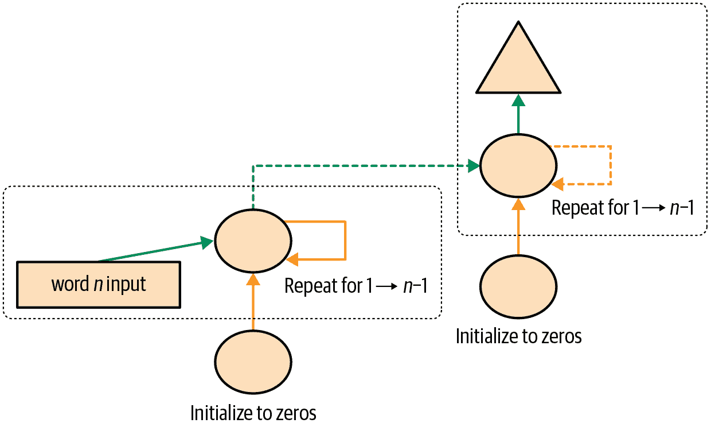

###### 图 12-6\. 2 层 RNN

展开的表示在图 12-7 中显示（类似于图 12-3）。

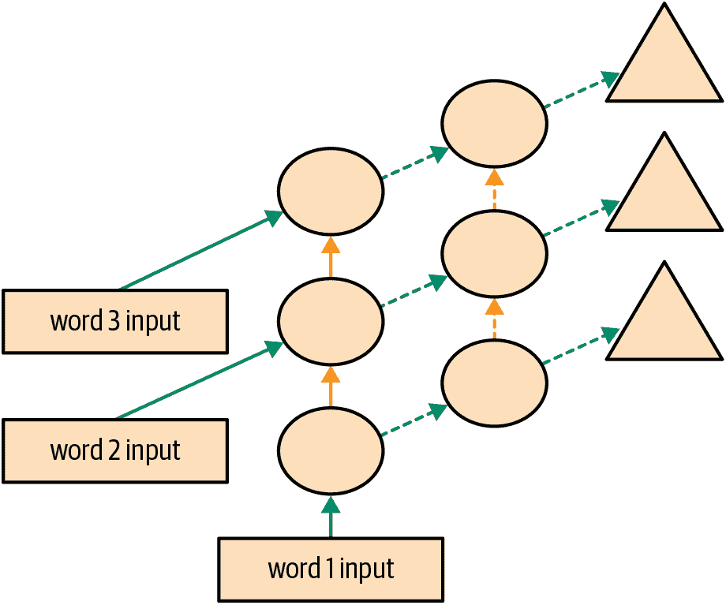

###### 图 12-7\. 2 层展开的 RNN

让我们看看如何在实践中实现这一点。

## 模型

我们可以通过使用 PyTorch 的`RNN`类来节省一些时间，该类实现了我们之前创建的内容，但也给了我们堆叠多个 RNN 的选项，正如我们之前讨论的那样：

```py
class LMModel5(Module):
    def __init__(self, vocab_sz, n_hidden, n_layers):
        self.i_h = nn.Embedding(vocab_sz, n_hidden)
        self.rnn = nn.RNN(n_hidden, n_hidden, n_layers, batch_first=True)
        self.h_o = nn.Linear(n_hidden, vocab_sz)
        self.h = torch.zeros(n_layers, bs, n_hidden)

    def forward(self, x):
        res,h = self.rnn(self.i_h(x), self.h)
        self.h = h.detach()
        return self.h_o(res)

    def reset(self): self.h.zero_()
```

```py
learn = Learner(dls, LMModel5(len(vocab), 64, 2),
                loss_func=CrossEntropyLossFlat(),
                metrics=accuracy, cbs=ModelResetter)
learn.fit_one_cycle(15, 3e-3)
```

| epoch | train_loss | valid_loss | accuracy | time |
| --- | --- | --- | --- | --- |
| 0 | 3.055853 | 2.591640 | 0.437907 | 00:01 |
| 1 | 2.162359 | 1.787310 | 0.471598 | 00:01 |
| 2 | 1.710663 | 1.941807 | 0.321777 | 00:01 |
| 3 | 1.520783 | 1.999726 | 0.312012 | 00:01 |
| 4 | 1.330846 | 2.012902 | 0.413249 | 00:01 |
| 5 | 1.163297 | 1.896192 | 0.450684 | 00:01 |
| 6 | 1.033813 | 2.005209 | 0.434814 | 00:01 |
| 7 | 0.919090 | 2.047083 | 0.456706 | 00:01 |
| 8 | 0.822939 | 2.068031 | 0.468831 | 00:01 |
| 9 | 0.750180 | 2.136064 | 0.475098 | 00:01 |
| 10 | 0.695120 | 2.139140 | 0.485433 | 00:01 |
| 11 | 0.655752 | 2.155081 | 0.493652 | 00:01 |
| 12 | 0.629650 | 2.162583 | 0.498535 | 00:01 |
| 13 | 0.613583 | 2.171649 | 0.491048 | 00:01 |
| 14 | 0.604309 | 2.180355 | 0.487874 | 00:01 |

现在这令人失望...我们之前的单层 RNN 表现更好。为什么？原因是我们有一个更深的模型，导致激活爆炸或消失。

## 激活爆炸或消失

在实践中，从这种类型的 RNN 创建准确的模型是困难的。如果我们调用`detach`的频率较少，并且有更多的层，我们将获得更好的结果 - 这使得我们的 RNN 有更长的时间跨度来学习和创建更丰富的特征。但这也意味着我们有一个更深的模型要训练。深度学习发展中的关键挑战是如何训练这种类型的模型。

这是具有挑战性的，因为当您多次乘以一个矩阵时会发生什么。想想当您多次乘以一个数字时会发生什么。例如，如果您从 1 开始乘以 2，您会得到序列 1、2、4、8，...在 32 步之后，您已经达到 4,294,967,296。如果您乘以 0.5，类似的问题会发生：您会得到 0.5、0.25、0.125，...在 32 步之后，它是 0.00000000023。正如您所看到的，即使是比 1 稍高或稍低的数字，经过几次重复乘法后，我们的起始数字就会爆炸或消失。

因为矩阵乘法只是将数字相乘并将它们相加，重复矩阵乘法会发生完全相同的事情。这就是深度神经网络的全部内容 - 每一层都是另一个矩阵乘法。这意味着深度神经网络很容易最终得到极大或极小的数字。

这是一个问题，因为计算机存储数字的方式（称为*浮点数*）意味着随着数字远离零点，它们变得越来越不准确。来自优秀文章“关于浮点数你从未想知道但却被迫了解”的图 12-8 中的图表显示了浮点数的精度如何随着数字线变化。

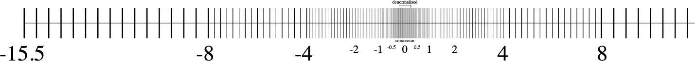

###### 图 12-8。浮点数的精度

这种不准确性意味着通常为更新权重计算的梯度最终会变为零或无穷大。这通常被称为*消失梯度*或*爆炸梯度*问题。这意味着在 SGD 中，权重要么根本不更新，要么跳到无穷大。无论哪种方式，它们都不会随着训练而改善。

研究人员已经开发出了解决这个问题的方法，我们将在本书后面讨论。一种选择是改变层的定义方式，使其不太可能出现激活爆炸。当我们讨论批量归一化时，我们将在第十三章中看到这是如何完成的，当我们讨论 ResNets 时，我们将在第十四章中看到，尽管这些细节通常在实践中并不重要（除非您是一个研究人员，正在创造解决这个问题的新方法）。另一种处理这个问题的策略是谨慎初始化，这是我们将在第十七章中调查的一个主题。

为了避免激活爆炸，RNN 经常使用两种类型的层：*门控循环单元*（GRUs）和*长短期记忆*（LSTM）层。这两种都在 PyTorch 中可用，并且可以直接替换 RNN 层。在本书中，我们只会涵盖 LSTMs；在线上有很多好的教程解释 GRUs，它们是 LSTM 设计的一个小变体。

# LSTM

LSTM 是由 Jürgen Schmidhuber 和 Sepp Hochreiter 于 1997 年引入的一种架构。在这种架构中，不是一个，而是两个隐藏状态。在我们的基本 RNN 中，隐藏状态是 RNN 在上一个时间步的输出。那个隐藏状态负责两件事：

+   拥有正确的信息来预测正确的下一个标记的输出层

+   保留句子中发生的一切记忆

例如，考虑句子“Henry has a dog and he likes his dog very much”和“Sophie has a dog and she likes her dog very much。”很明显，RNN 需要记住句子开头的名字才能预测*he/she*或*his/her*。

在实践中，RNN 在保留句子中较早发生的记忆方面表现非常糟糕，这就是在 LSTM 中有另一个隐藏状态（称为*cell state*）的动机。cell state 将负责保持*长期短期记忆*，而隐藏状态将专注于预测下一个标记。让我们更仔细地看看如何实现这一点，并从头开始构建一个 LSTM。

## 从头开始构建一个 LSTM

为了构建一个 LSTM，我们首先必须了解其架构。图 12-9 显示了其内部结构。

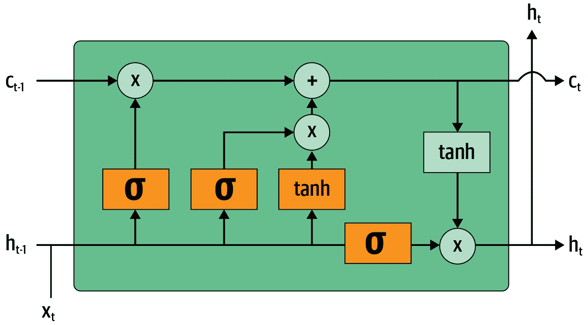

###### 图 12-9\. LSTM 的架构

在这张图片中，我们的输入<math alttext="x Subscript t"><msub><mi>x</mi> <mi>t</mi></msub></math>从左侧进入，带有先前的隐藏状态（<math alttext="h Subscript t minus 1"><msub><mi>h</mi> <mrow><mi>t</mi><mo>-</mo><mn>1</mn></mrow></msub></math>）和 cell state（<math alttext="c Subscript t minus 1"><msub><mi>c</mi> <mrow><mi>t</mi><mo>-</mo><mn>1</mn></mrow></msub></math>）。四个橙色框代表四个层（我们的神经网络），激活函数可以是 sigmoid（<math alttext="sigma"><mi>σ</mi></math>）或 tanh。tanh 只是一个重新缩放到范围-1 到 1 的 sigmoid 函数。它的数学表达式可以写成这样：

<math alttext="双曲正切左括号 x 右括号等于开始分数 e 上标 x 基线加 e 上标 负 x 基线 除以 e 上标 x 基线减 e 上标 负 x 基线 等于 2 sigma 左括号 2 x 右括号 减 1" display="block"><mrow><mo form="prefix">tanh</mo> <mrow><mo>(</mo> <mi>x</mi> <mo>)</mo></mrow> <mo>=</mo> <mfrac><mrow><msup><mi>e</mi> <mi>x</mi></msup> <mo>+</mo><msup><mi>e</mi> <mrow><mo>-</mo><mi>x</mi></mrow></msup></mrow> <mrow><msup><mi>e</mi> <mi>x</mi></msup> <mo>-</mo><msup><mi>e</mi> <mrow><mo>-</mo><mi>x</mi></mrow></msup></mrow></mfrac> <mo>=</mo> <mn>2</mn> <mi>σ</mi> <mrow><mo>(</mo> <mn>2</mn> <mi>x</mi> <mo>)</mo></mrow> <mo>-</mo> <mn>1</mn></mrow></math>

其中<math alttext="sigma"><mi>σ</mi></math>是 sigmoid 函数。图中的绿色圆圈是逐元素操作。右侧输出的是新的隐藏状态（<math alttext="h Subscript t"><msub><mi>h</mi> <mi>t</mi></msub></math>）和新的 cell state（<math alttext="c Subscript t"><msub><mi>c</mi> <mi>t</mi></msub></math>），准备接受我们的下一个输入。新的隐藏状态也被用作输出，这就是为什么箭头分开向上移动。

让我们逐一查看四个神经网络（称为*门*）并解释图表——但在此之前，请注意 cell state（顶部）几乎没有改变。它甚至没有直接通过神经网络！这正是为什么它将继续保持较长期的状态。

首先，将输入和旧隐藏状态的箭头连接在一起。在本章前面编写的 RNN 中，我们将它们相加。在 LSTM 中，我们将它们堆叠在一个大张量中。这意味着我们的嵌入的维度（即<math alttext="x Subscript t"><msub><mi>x</mi> <mi>t</mi></msub></math>的维度）可以与隐藏状态的维度不同。如果我们将它们称为`n_in`和`n_hid`，底部的箭头大小为`n_in + n_hid`；因此所有的神经网络（橙色框）都是具有`n_in + n_hid`输入和`n_hid`输出的线性层。

第一个门（从左到右看）称为*遗忘门*。由于它是一个线性层后面跟着一个 sigmoid，它的输出将由 0 到 1 之间的标量组成。我们将这个结果乘以细胞状态，以确定要保留哪些信息，要丢弃哪些信息：接近 0 的值被丢弃，接近 1 的值被保留。这使得 LSTM 有能力忘记关于其长期状态的事情。例如，当穿过一个句号或一个`xxbos`标记时，我们期望它（已经学会）重置其细胞状态。

第二个门称为*输入门*。它与第三个门（没有真正的名称，但有时被称为*细胞门*）一起更新细胞状态。例如，我们可能看到一个新的性别代词，这时我们需要替换遗忘门删除的关于性别的信息。与遗忘门类似，输入门决定要更新的细胞状态元素（接近 1 的值）或不更新（接近 0 的值）。第三个门确定这些更新值是什么，范围在-1 到 1 之间（由于 tanh 函数）。结果被添加到细胞状态中。

最后一个门是*输出门*。它确定从细胞状态中使用哪些信息来生成输出。细胞状态经过 tanh 后与输出门的 sigmoid 输出结合，结果就是新的隐藏状态。在代码方面，我们可以这样写相同的步骤：

```py
class LSTMCell(Module):
    def __init__(self, ni, nh):
        self.forget_gate = nn.Linear(ni + nh, nh)
        self.input_gate  = nn.Linear(ni + nh, nh)
        self.cell_gate   = nn.Linear(ni + nh, nh)
        self.output_gate = nn.Linear(ni + nh, nh)

    def forward(self, input, state):
        h,c = state
        h = torch.stack([h, input], dim=1)
        forget = torch.sigmoid(self.forget_gate(h))
        c = c * forget
        inp = torch.sigmoid(self.input_gate(h))
        cell = torch.tanh(self.cell_gate(h))
        c = c + inp * cell
        out = torch.sigmoid(self.output_gate(h))
        h = outgate * torch.tanh(c)
        return h, (h,c)
```

实际上，我们可以重构代码。此外，就性能而言，做一次大矩阵乘法比做四次小矩阵乘法更好（因为我们只在 GPU 上启动一次特殊的快速内核，这样可以让 GPU 并行处理更多工作）。堆叠需要一点时间（因为我们必须在 GPU 上移动一个张量，使其全部在一个连续的数组中），所以我们为输入和隐藏状态使用两个单独的层。优化和重构后的代码如下：

```py
class LSTMCell(Module):
    def __init__(self, ni, nh):
        self.ih = nn.Linear(ni,4*nh)
        self.hh = nn.Linear(nh,4*nh)

    def forward(self, input, state):
        h,c = state
        # One big multiplication for all the gates is better than 4 smaller ones
        gates = (self.ih(input) + self.hh(h)).chunk(4, 1)
        ingate,forgetgate,outgate = map(torch.sigmoid, gates[:3])
        cellgate = gates[3].tanh()

        c = (forgetgate*c) + (ingate*cellgate)
        h = outgate * c.tanh()
        return h, (h,c)
```

在这里，我们使用 PyTorch 的`chunk`方法将张量分成四部分。它的工作原理如下：

```py
t = torch.arange(0,10); t
```

```py
tensor([0, 1, 2, 3, 4, 5, 6, 7, 8, 9])
```

```py
t.chunk(2)
```

```py
(tensor([0, 1, 2, 3, 4]), tensor([5, 6, 7, 8, 9]))
```

现在让我们使用这个架构来训练一个语言模型！

## 使用 LSTMs 训练语言模型

这是与`LMModel5`相同的网络，使用了两层 LSTM。我们可以以更高的学习率进行训练，时间更短，获得更好的准确性：

```py
class LMModel6(Module):
    def __init__(self, vocab_sz, n_hidden, n_layers):
        self.i_h = nn.Embedding(vocab_sz, n_hidden)
        self.rnn = nn.LSTM(n_hidden, n_hidden, n_layers, batch_first=True)
        self.h_o = nn.Linear(n_hidden, vocab_sz)
        self.h = [torch.zeros(n_layers, bs, n_hidden) for _ in range(2)]

    def forward(self, x):
        res,h = self.rnn(self.i_h(x), self.h)
        self.h = [h_.detach() for h_ in h]
        return self.h_o(res)

    def reset(self):
        for h in self.h: h.zero_()
```

```py
learn = Learner(dls, LMModel6(len(vocab), 64, 2),
                loss_func=CrossEntropyLossFlat(),
                metrics=accuracy, cbs=ModelResetter)
learn.fit_one_cycle(15, 1e-2)
```

| epoch | train_loss | valid_loss | accuracy | time |
| --- | --- | --- | --- | --- |
| 0 | 3.000821 | 2.663942 | 0.438314 | 00:02 |
| 1 | 2.139642 | 2.184780 | 0.240479 | 00:02 |
| 2 | 1.607275 | 1.812682 | 0.439779 | 00:02 |
| 3 | 1.347711 | 1.830982 | 0.497477 | 00:02 |
| 4 | 1.123113 | 1.937766 | 0.594401 | 00:02 |
| 5 | 0.852042 | 2.012127 | 0.631592 | 00:02 |
| 6 | 0.565494 | 1.312742 | 0.725749 | 00:02 |
| 7 | 0.347445 | 1.297934 | 0.711263 | 00:02 |
| 8 | 0.208191 | 1.441269 | 0.731201 | 00:02 |
| 9 | 0.126335 | 1.569952 | 0.737305 | 00:02 |
| 10 | 0.079761 | 1.427187 | 0.754150 | 00:02 |
| 11 | 0.052990 | 1.494990 | 0.745117 | 00:02 |
| 12 | 0.039008 | 1.393731 | 0.757894 | 00:02 |
| 13 | 0.031502 | 1.373210 | 0.758464 | 00:02 |
| 14 | 0.028068 | 1.368083 | 0.758464 | 00:02 |

现在这比多层 RNN 好多了！然而，我们仍然可以看到有一点过拟合，这表明一点正则化可能会有所帮助。

# 正则化 LSTM

循环神经网络总体上很难训练，因为我们之前看到的激活和梯度消失问题。使用 LSTM（或 GRU）单元比使用普通 RNN 更容易训练，但它们仍然很容易过拟合。数据增强虽然是一种可能性，但在文本数据中使用得比图像数据少，因为在大多数情况下，它需要另一个模型来生成随机增强（例如，将文本翻译成另一种语言，然后再翻译回原始语言）。总的来说，目前文本数据的数据增强并不是一个被充分探索的领域。

然而，我们可以使用其他正则化技术来减少过拟合，这些技术在与 LSTMs 一起使用时进行了深入研究，如 Stephen Merity 等人的论文[“正则化和优化 LSTM 语言模型”](https://oreil.ly/Rf-OG)。这篇论文展示了如何有效地使用 dropout、激活正则化和时间激活正则化可以使一个 LSTM 击败以前需要更复杂模型的最新结果。作者将使用这些技术的 LSTM 称为*AWD-LSTM*。我们将依次看看这些技术。

## Dropout

*Dropout*是由 Geoffrey Hinton 等人在[“通过防止特征探测器的共适应来改进神经网络”](https://oreil.ly/-_xie)中引入的一种正则化技术。基本思想是在训练时随机将一些激活变为零。这确保所有神经元都积极地朝着输出工作，如图 12-10 所示（来自 Nitish Srivastava 等人的[“Dropout：防止神经网络过拟合的简单方法”](https://oreil.ly/pYNxF)）。

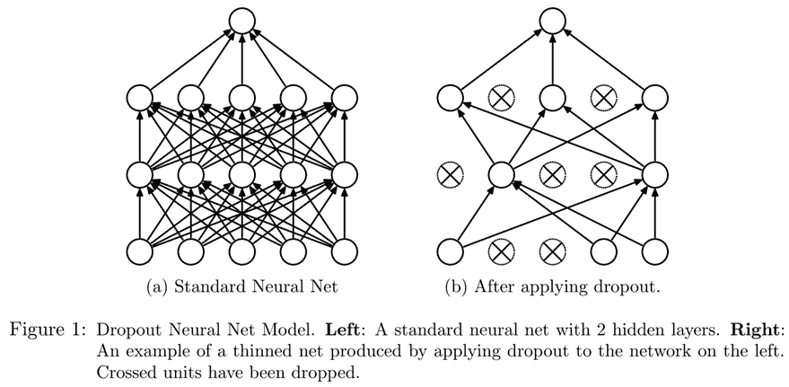

###### 图 12-10。在神经网络中应用 dropout（由 Nitish Srivastava 等人提供）

Hinton 在一次采访中解释了 dropout 的灵感时使用了一个很好的比喻：

> 我去了我的银行。出纳员不断变换，我问其中一个原因。他说他不知道，但他们经常被调动。我想这一定是因为需要员工之间的合作才能成功欺诈银行。这让我意识到，随机在每个示例中删除不同的神经元子集将防止阴谋，从而减少过拟合。

在同一次采访中，他还解释了神经科学提供了额外的灵感：

> 我们并不真正知道为什么神经元会突触。有一种理论是它们想要变得嘈杂以进行正则化，因为我们的参数比数据点多得多。dropout 的想法是，如果你有嘈杂的激活，你可以承担使用一个更大的模型。

这解释了为什么 dropout 有助于泛化的想法：首先它帮助神经元更好地合作；然后它使激活更嘈杂，从而使模型更健壮。

然而，我们可以看到，如果我们只是将这些激活置零而不做其他任何操作，我们的模型将会训练出问题：如果我们从五个激活的总和（由于我们应用了 ReLU，它们都是正数）变为只有两个，这不会有相同的规模。因此，如果我们以概率`p`应用 dropout，我们通过将所有激活除以`1-p`来重新缩放它们（平均`p`将被置零，所以剩下`1-p`），如图 12-11 所示。

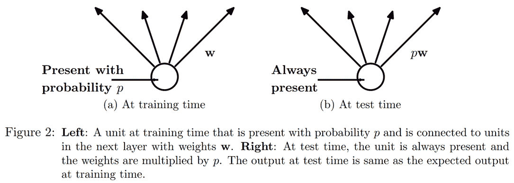

###### 图 12-11。应用 dropout 时为什么要缩放激活（由 Nitish Srivastava 等人提供）

这是 PyTorch 中 dropout 层的完整实现（尽管 PyTorch 的原生层实际上是用 C 而不是 Python 编写的）：

```py
class Dropout(Module):
    def __init__(self, p): self.p = p
    def forward(self, x):
        if not self.training: return x
        mask = x.new(*x.shape).bernoulli_(1-p)
        return x * mask.div_(1-p)
```

`bernoulli_`方法创建一个随机零（概率为`p`）和一（概率为`1-p`）的张量，然后将其乘以我们的输入，再除以`1-p`。注意`training`属性的使用，它在任何 PyTorch `nn.Module`中都可用，并告诉我们是否在训练或推理。

# 做你自己的实验

在本书的前几章中，我们会在这里添加一个`bernoulli_`的代码示例，这样您就可以看到它的确切工作原理。但是现在您已经了解足够多，可以自己做这个，我们将为您提供越来越少的示例，而是期望您自己进行实验以了解事物是如何工作的。在这种情况下，您将在章节末尾的问卷中看到，我们要求您尝试使用`bernoulli_`，但不要等到我们要求您进行实验才开发您对我们正在研究的代码的理解；无论如何都可以开始做。

在将我们的 LSTM 的输出传递到最终层之前使用 dropout 将有助于减少过拟合。在许多其他模型中也使用了 dropout，包括`fastai.vision`中使用的默认 CNN 头部，并且通过传递`ps`参数（其中每个“p”都传递给每个添加的`Dropout`层）在`fastai.tabular`中也可用，正如我们将在第十五章中看到的。

在训练和验证模式下，dropout 的行为不同，我们使用`Dropout`中的`training`属性进行指定。在`Module`上调用`train`方法会将`training`设置为`True`（对于您调用该方法的模块以及递归包含的每个模块），而`eval`将其设置为`False`。在调用`Learner`的方法时会自动执行此操作，但如果您没有使用该类，请记住根据需要在两者之间切换。

## 激活正则化和时间激活正则化

激活正则化（AR）和时间激活正则化（TAR）是两种与权重衰减非常相似的正则化方法，在第八章中讨论过。在应用权重衰减时，我们会对损失添加一个小的惩罚，旨在使权重尽可能小。对于激活正则化，我们将尝试使 LSTM 生成的最终激活尽可能小，而不是权重。

为了对最终激活进行正则化，我们必须将它们存储在某个地方，然后将它们的平方的平均值添加到损失中（以及一个乘数`alpha`，就像权重衰减的`wd`一样）：

```py
loss += alpha * activations.pow(2).mean()
```

时间激活正则化与我们在句子中预测标记有关。这意味着当我们按顺序阅读它们时，我们的 LSTM 的输出应该在某种程度上是有意义的。TAR 通过向损失添加惩罚来鼓励这种行为，使两个连续激活之间的差异尽可能小：我们的激活张量的形状为`bs x sl x n_hid`，我们在序列长度轴上（中间维度）读取连续激活。有了这个，TAR 可以表示如下：

```py
loss += beta * (activations[:,1:] - activations[:,:-1]).pow(2).mean()
```

然后，`alpha`和`beta`是要调整的两个超参数。为了使这项工作成功，我们需要让我们的带有 dropout 的模型返回三个东西：正确的输出，LSTM 在 dropout 之前的激活以及 LSTM 在 dropout 之后的激活。通常在 dropout 后的激活上应用 AR（以免惩罚我们之后转换为零的激活），而 TAR 应用在未经 dropout 的激活上（因为这些零会在两个连续时间步之间产生很大的差异）。然后，一个名为`RNNRegularizer`的回调将为我们应用这种正则化。

## 训练带有权重绑定的正则化 LSTM

我们可以将 dropout（应用在我们进入输出层之前）与 AR 和 TAR 相结合，以训练我们之前的 LSTM。我们只需要返回三个东西而不是一个：我们的 LSTM 的正常输出，dropout 后的激活以及我们的 LSTM 的激活。最后两个将由回调`RNNRegularization`捕获，以便为其对损失的贡献做出贡献。

我们可以从[AWD-LSTM 论文](https://oreil.ly/ETQ5X)中添加另一个有用的技巧是*权重绑定*。在语言模型中，输入嵌入表示从英语单词到激活的映射，输出隐藏层表示从激活到英语单词的映射。直觉上，我们可能会期望这些映射是相同的。我们可以通过将相同的权重矩阵分配给这些层来在 PyTorch 中表示这一点：

```py
self.h_o.weight = self.i_h.weight
```

在`LMMModel7`中，我们包括了这些最终的调整：

```py
class LMModel7(Module):
    def __init__(self, vocab_sz, n_hidden, n_layers, p):
        self.i_h = nn.Embedding(vocab_sz, n_hidden)
        self.rnn = nn.LSTM(n_hidden, n_hidden, n_layers, batch_first=True)
        self.drop = nn.Dropout(p)
        self.h_o = nn.Linear(n_hidden, vocab_sz)
        self.h_o.weight = self.i_h.weight
        self.h = [torch.zeros(n_layers, bs, n_hidden) for _ in range(2)]

    def forward(self, x):
        raw,h = self.rnn(self.i_h(x), self.h)
        out = self.drop(raw)
        self.h = [h_.detach() for h_ in h]
        return self.h_o(out),raw,out

    def reset(self):
        for h in self.h: h.zero_()
```

我们可以使用`RNNRegularizer`回调函数创建一个正则化的`Learner`：

```py
learn = Learner(dls, LMModel7(len(vocab), 64, 2, 0.5),
                loss_func=CrossEntropyLossFlat(), metrics=accuracy,
                cbs=[ModelResetter, RNNRegularizer(alpha=2, beta=1)])
```

`TextLearner`会自动为我们添加这两个回调函数（使用`alpha`和`beta`的默认值），因此我们可以简化前面的行：

```py
learn = TextLearner(dls, LMModel7(len(vocab), 64, 2, 0.4),
                    loss_func=CrossEntropyLossFlat(), metrics=accuracy)
```

然后我们可以训练模型，并通过增加权重衰减到`0.1`来添加额外的正则化：

```py
learn.fit_one_cycle(15, 1e-2, wd=0.1)
```

| epoch | train_loss | valid_loss | accuracy | time |
| --- | --- | --- | --- | --- |
| 0 | 2.693885 | 2.013484 | 0.466634 | 00:02 |
| 1 | 1.685549 | 1.187310 | 0.629313 | 00:02 |
| 2 | 0.973307 | 0.791398 | 0.745605 | 00:02 |
| 3 | 0.555823 | 0.640412 | 0.794108 | 00:02 |
| 4 | 0.351802 | 0.557247 | 0.836100 | 00:02 |
| 5 | 0.244986 | 0.594977 | 0.807292 | 00:02 |
| 6 | 0.192231 | 0.511690 | 0.846761 | 00:02 |
| 7 | 0.162456 | 0.520370 | 0.858073 | 00:02 |
| 8 | 0.142664 | 0.525918 | 0.842285 | 00:02 |
| 9 | 0.128493 | 0.495029 | 0.858073 | 00:02 |
| 10 | 0.117589 | 0.464236 | 0.867188 | 00:02 |
| 11 | 0.109808 | 0.466550 | 0.869303 | 00:02 |
| 12 | 0.104216 | 0.455151 | 0.871826 | 00:02 |
| 13 | 0.100271 | 0.452659 | 0.873617 | 00:02 |
| 14 | 0.098121 | 0.458372 | 0.869385 | 00:02 |

现在这比我们之前的模型好多了！

# 结论

您现在已经看到了我们在第十章中用于文本分类的 AWD-LSTM 架构内部的所有内容。它在更多地方使用了丢失：

+   嵌入丢失（就在嵌入层之后）

+   输入丢失（在嵌入层之后）

+   权重丢失（应用于每个训练步骤中 LSTM 的权重）

+   隐藏丢失（应用于两个层之间的隐藏状态）

这使得它更加规范化。由于微调这五个丢失值（包括输出层之前的丢失）很复杂，我们已经确定了良好的默认值，并允许通过您在该章节中看到的`drop_mult`参数来整体调整丢失的大小。

另一个非常强大的架构，特别适用于“序列到序列”问题（依赖变量本身是一个变长序列的问题，例如语言翻译），是 Transformer 架构。您可以在[书籍网站](https://book.fast.ai)的额外章节中找到它。

# 问卷

1.  如果您的项目数据集非常庞大且复杂，处理它需要大量时间，您应该怎么做？

1.  为什么在创建语言模型之前我们要将数据集中的文档连接起来？

1.  要使用标准的全连接网络来预测前三个单词给出的第四个单词，我们需要对模型进行哪两个调整？

1.  我们如何在 PyTorch 中跨多个层共享权重矩阵？

1.  编写一个模块，预测句子前两个单词给出的第三个单词，而不偷看。

1.  什么是循环神经网络？

1.  隐藏状态是什么？

1.  `LMModel1`中隐藏状态的等价物是什么？

1.  为了在 RNN 中保持状态，为什么按顺序将文本传递给模型很重要？

1.  什么是 RNN 的“展开”表示？

1.  为什么在 RNN 中保持隐藏状态会导致内存和性能问题？我们如何解决这个问题？

1.  什么是 BPTT？

1.  编写代码打印出验证集的前几个批次，包括将标记 ID 转换回英文字符串，就像我们在第十章中展示的 IMDb 数据批次一样。

1.  `ModelResetter`回调函数的作用是什么？我们为什么需要它？

1.  为每三个输入词预测一个输出词的缺点是什么？

1.  为什么我们需要为`LMModel4`设计一个自定义损失函数？

1.  为什么`LMModel4`的训练不稳定？

1.  在展开表示中，我们可以看到递归神经网络有许多层。那么为什么我们需要堆叠 RNN 以获得更好的结果？

1.  绘制一个堆叠（多层）RNN 的表示。

1.  如果我们不经常调用`detach`，为什么在 RNN 中应该获得更好的结果？为什么在实践中可能不会发生这种情况？

1.  为什么深度网络可能导致非常大或非常小的激活？这为什么重要？

1.  在计算机的浮点数表示中，哪些数字是最精确的？

1.  为什么消失的梯度会阻止训练？

1.  在 LSTM 架构中有两个隐藏状态为什么有帮助？每个的目的是什么？

1.  在 LSTM 中这两个状态被称为什么？

1.  tanh 是什么，它与 sigmoid 有什么关系？

1.  `LSTMCell`中这段代码的目的是什么：

    ```py
    h = torch.stack([h, input], dim=1)
    ```

1.  在 PyTorch 中`chunk`是做什么的？

1.  仔细研究`LSTMCell`的重构版本，确保你理解它如何以及为什么与未重构版本执行相同的操作。

1.  为什么我们可以为`LMModel6`使用更高的学习率？

1.  AWD-LSTM 模型中使用的三种正则化技术是什么？

1.  什么是 dropout？

1.  为什么我们要用 dropout 来缩放权重？这是在训练期间、推理期间还是两者都应用？

1.  `Dropout`中这行代码的目的是什么：

    ```py
    if not self.training: return x
    ```

1.  尝试使用`bernoulli_`来了解它的工作原理。

1.  如何在 PyTorch 中将模型设置为训练模式？在评估模式下呢？

1.  写出激活正则化的方程（数学或代码，任你选择）。它与权重衰减有什么不同？

1.  写出时间激活正则化的方程（数学或代码，任你选择）。为什么我们不会在计算机视觉问题中使用这个？

1.  语言模型中的权重绑定是什么？

## 进一步研究

1.  在`LMModel2`中，为什么`forward`可以从`h=0`开始？为什么我们不需要写`h=torch.zeros(...)`？

1.  从头开始编写一个 LSTM 的代码（你可以参考图 12-9）。

1.  搜索互联网了解 GRU 架构并从头开始实现它，尝试训练一个模型。看看能否获得类似于本章中看到的结果。将你的结果与 PyTorch 内置的`GRU`模块的结果进行比较。

1.  查看 fastai 中 AWD-LSTM 的源代码，并尝试将每行代码映射到本章中展示的概念。
