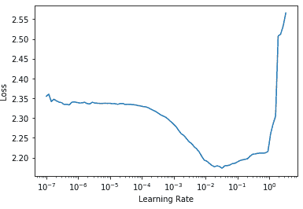
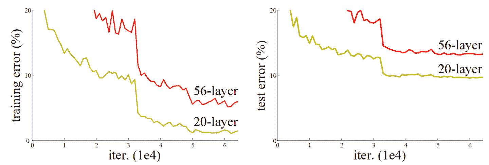
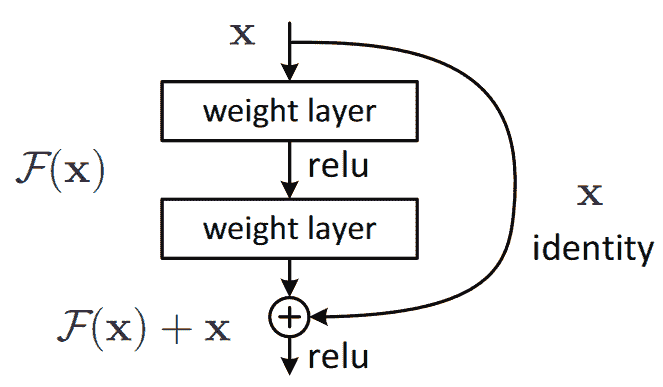
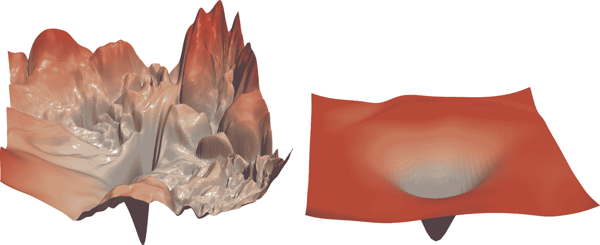
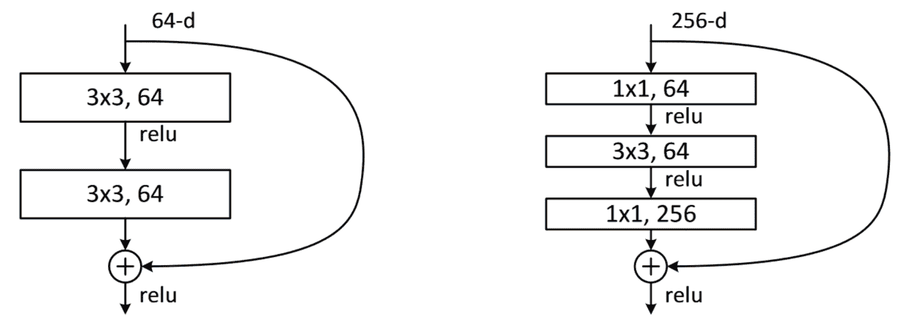

# 第十四章：ResNets


在本章中，我们将在上一章介绍的 CNN 基础上构建，并向您解释 ResNet（残差网络）架构。它是由 Kaiming He 等人于 2015 年在文章[“Deep Residual Learning for Image Recognition”](https://oreil.ly/b68K8)中引入的，到目前为止是最常用的模型架构。最近在图像模型中的发展几乎总是使用残差连接的相同技巧，大多数时候，它们只是原始 ResNet 的调整。

我们将首先展示最初设计的基本 ResNet，然后解释使其性能更好的现代调整。但首先，我们需要一个比 MNIST 数据集更难一点的问题，因为我们已经在常规 CNN 上接近 100%的准确率了。

# 回到 Imagenette

当我们已经在上一章的 MNIST 中看到的准确率已经很高时，要评估我们对模型的任何改进将会很困难，因此我们将通过回到 Imagenette 来解决一个更困难的图像分类问题。我们将继续使用小图像以保持事情相对快速。

让我们获取数据——我们将使用已经调整大小为 160 像素的版本以使事情更快，然后将随机裁剪到 128 像素：

```py
def get_data(url, presize, resize):
    path = untar_data(url)
    return DataBlock(
        blocks=(ImageBlock, CategoryBlock), get_items=get_image_files,
        splitter=GrandparentSplitter(valid_name='val'),
        get_y=parent_label, item_tfms=Resize(presize),
        batch_tfms=[*aug_transforms(min_scale=0.5, size=resize),
                    Normalize.from_stats(*imagenet_stats)],
    ).dataloaders(path, bs=128)
```

```py
dls = get_data(URLs.IMAGENETTE_160, 160, 128)
```

```py
dls.show_batch(max_n=4)
```


当我们查看 MNIST 时，我们处理的是 28×28 像素的图像。对于 Imagenette，我们将使用 128×128 像素的图像进行训练。稍后，我们希望能够使用更大的图像，至少与 224×224 像素的 ImageNet 标准一样大。您还记得我们如何从 MNIST 卷积神经网络中获得每个图像的单个激活向量吗？

我们采用的方法是确保有足够的步幅为 2 的卷积，以使最终层具有 1 的网格大小。然后我们展平我们最终得到的单位轴，为每个图像获得一个向量（因此，对于一个小批量的激活矩阵）。我们可以对 Imagenette 做同样的事情，但这会导致两个问题：

+   我们需要很多步幅为 2 的层，才能使我们的网格在最后变成 1×1 的大小——可能比我们本来会选择的要多。

+   该模型将无法处理除最初训练的大小之外的任何大小的图像。

处理第一个问题的一种方法是以一种处理 1×1 以外的网格大小的方式展平最终的卷积层。我们可以简单地将矩阵展平为向量，就像我们以前做过的那样，通过将每一行放在前一行之后。事实上，这是卷积神经网络直到 2013 年几乎总是采用的方法。最著名的例子是 2013 年 ImageNet 的获奖者 VGG，有时今天仍在使用。但这种架构还有另一个问题：它不仅不能处理与训练集中使用的相同大小的图像之外的图像，而且需要大量内存，因为展平卷积层导致许多激活被馈送到最终层。因此，最终层的权重矩阵是巨大的。

这个问题通过创建*完全卷积网络*来解决。完全卷积网络的技巧是对卷积网格中的激活进行平均。换句话说，我们可以简单地使用这个函数：

```py
def avg_pool(x): return x.mean((2,3))
```

正如您所看到的，它正在计算 x 轴和 y 轴上的平均值。这个函数将始终将一组激活转换为每个图像的单个激活。PyTorch 提供了一个稍微更灵活的模块，称为`nn.AdaptiveAvgPool2d`，它将一组激活平均到您需要的任何大小的目标（尽管我们几乎总是使用大小为 1）。

因此，一个完全卷积网络具有多个卷积层，其中一些将是步幅为 2 的，在最后是一个自适应平均池化层，一个展平层来移除单位轴，最后是一个线性层。这是我们的第一个完全卷积网络：

```py
def block(ni, nf): return ConvLayer(ni, nf, stride=2)
def get_model():
    return nn.Sequential(
        block(3, 16),
        block(16, 32),
        block(32, 64),
        block(64, 128),
        block(128, 256),
        nn.AdaptiveAvgPool2d(1),
        Flatten(),
        nn.Linear(256, dls.c))
```

我们将在网络中用其他变体替换`block`的实现，这就是为什么我们不再称其为`conv`。我们还通过利用 fastai 的`ConvLayer`节省了一些时间，它已经提供了前一章中`conv`的功能（还有更多！）。

# 停下来思考

考虑这个问题：这种方法对于像 MNIST 这样的光学字符识别（OCR）问题是否有意义？绝大多数从事 OCR 和类似问题的从业者倾向于使用全卷积网络，因为这是现在几乎每个人都学习的。但这真的毫无意义！例如，你不能通过将数字切成小块、混在一起，然后决定每个块平均看起来像 3 还是 8 来判断一个数字是 3 还是 8。但这正是自适应平均池化有效地做的事情！全卷积网络只对没有单一正确方向或大小的对象（例如大多数自然照片）是一个很好的选择。

一旦我们完成卷积层，我们将得到大小为`bs x ch x h x w`的激活（批量大小、一定数量的通道、高度和宽度）。我们想将其转换为大小为`bs x ch`的张量，因此我们取最后两个维度的平均值，并像在我们之前的模型中那样展平尾随的 1×1 维度。

这与常规池化不同，因为这些层通常会取给定大小窗口的平均值（对于平均池化）或最大值（对于最大池化）。例如，大小为 2 的最大池化层在旧的 CNN 中非常流行，通过在每个维度上取每个 2×2 窗口的最大值（步幅为 2），将图像的尺寸减半。

与以前一样，我们可以使用我们自定义的模型定义一个`Learner`，然后在之前获取的数据上对其进行训练：

```py
def get_learner(m):
    return Learner(dls, m, loss_func=nn.CrossEntropyLoss(), metrics=accuracy
                  ).to_fp16()

learn = get_learner(get_model())
```

```py
learn.lr_find()
```

```py
(0.47863011360168456, 3.981071710586548)
```



对于 CNN 来说，3e-3 通常是一个很好的学习率，这在这里也是如此，所以让我们试一试：

```py
learn.fit_one_cycle(5, 3e-3)
```

| epoch | train_loss | valid_loss | accuracy | time |
| --- | --- | --- | --- | --- |
| 0 | 1.901582 | 2.155090 | 0.325350 | 00:07 |
| 1 | 1.559855 | 1.586795 | 0.507771 | 00:07 |
| 2 | 1.296350 | 1.295499 | 0.571720 | 00:07 |
| 3 | 1.144139 | 1.139257 | 0.639236 | 00:07 |
| 4 | 1.049770 | 1.092619 | 0.659108 | 00:07 |

考虑到我们必须从头开始选择 10 个类别中的正确一个，而且我们只训练了 5 个时期，这是一个相当不错的开始！我们可以通过使用更深的模型做得更好，但只是堆叠新层并不会真正改善我们的结果（你可以尝试自己看看！）。为了解决这个问题，ResNets 引入了*跳跃连接*的概念。我们将在下一节中探讨 ResNets 的这些方面。

# 构建现代 CNN：ResNet

我们现在已经拥有构建我们自从本书开始就一直在计算机视觉任务中使用的模型所需的所有要素：ResNets。我们将介绍它们背后的主要思想，并展示它如何在 Imagenette 上提高了准确性，然后构建一个带有所有最新调整的版本。

## 跳跃连接

2015 年，ResNet 论文的作者们注意到了一件他们觉得奇怪的事情。即使使用了批量归一化，他们发现使用更多层的网络表现不如使用更少层的网络，并且模型之间没有其他差异。最有趣的是，这种差异不仅在验证集中观察到，而且在训练集中也观察到；因此这不仅仅是一个泛化问题，而是一个训练问题。正如论文所解释的：

> 出乎意料的是，这种退化并不是由过拟合引起的，向适当深度的模型添加更多层会导致更高的训练错误，正如我们的实验[先前报告]和彻底验证的那样。

这种现象在图 14-1 中的图表中有所说明，左侧是训练错误，右侧是测试错误。



###### 图 14-1。不同深度网络的训练（由 Kaiming He 等人提供）。

正如作者在这里提到的，他们并不是第一个注意到这个奇怪事实的人。但他们是第一个迈出非常重要的一步：

> 让我们考虑一个更浅的架构及其更深的对应物，后者在其上添加更多层。存在一种通过构建解决更深模型的方法：添加的层是恒等映射，其他层是从学习的更浅模型中复制的。

由于这是一篇学术论文，这个过程以一种不太易懂的方式描述，但概念实际上非常简单：从一个训练良好的 20 层神经网络开始，然后添加另外 36 层什么都不做的层（例如，它们可以是具有单个权重等于 1 和偏置等于 0 的线性层）。结果将是一个 56 层的网络，它与 20 层网络完全相同，证明总是存在深度网络应该*至少和*任何浅层网络一样好。但由于某种原因，随机梯度下降似乎无法找到它们。

# 行话：恒等映射

将输入返回而不做任何改变。这个过程由一个*恒等函数*执行。

实际上，还有另一种更有趣的方法来创建这些额外的 36 层。如果我们用`x + conv(x)`替换每次出现的`conv(x)`，其中`conv`是上一章中添加第二个卷积，然后是 ReLU，然后是批量归一化层的函数。此外，回想一下批量归一化是`gamma*y + beta`。如果我们为这些最终批量归一化层中的每一个初始化`gamma`为零会怎样？那么我们这些额外的 36 层的`conv(x)`将始终等于零，这意味着`x+conv(x)`将始终等于`x`。

这给我们带来了什么好处？关键是，这 36 个额外的层，就目前而言，是一个*恒等映射*，但它们有*参数*，这意味着它们是*可训练的*。因此，我们可以从最好的 20 层模型开始，添加这 36 个最初什么都不做的额外层，然后*微调整个 56 层模型*。这些额外的 36 层可以学习使它们最有用的参数！

ResNet 论文提出了这样的一个变体，即“跳过”每第二个卷积，因此我们实际上得到了`x+conv2(conv1(x))`。这在图 14-2（来自论文）中的图表中显示。



###### 图 14-2。一个简单的 ResNet 块（由 Kaiming He 等人提供）。

右侧的箭头只是`x+conv2(conv1(x))`中的`x`部分，被称为*恒等分支*或*跳跃连接*。左侧路径是`conv2(conv1(x))`部分。您可以将恒等路径视为提供从输入到输出的直接路径。

在 ResNet 中，我们不是先训练少量层，然后在末尾添加新层并进行微调。相反，我们在整个 CNN 中使用像图 14-2 中的 ResNet 块这样的块，以通常的方式从头开始初始化并以通常的方式使用 SGD 进行训练。我们依靠跳跃连接使网络更容易使用 SGD 进行训练。

还有另一种（在很大程度上等效的）思考这些 ResNet 块的方式。这就是论文描述的方式：

> 我们不是希望每几个堆叠的层直接适应所需的底层映射，而是明确让这些层适应一个残差映射。形式上，将所需的底层映射表示为*H*(*x*)，我们让堆叠的非线性层适应另一个映射*F*(*x*) := H(*x*)*−x*。原始映射被重新构造为*F*(*x*)+*x*。我们假设优化残差映射比优化原始未引用的映射更容易。在极端情况下，如果恒等映射是最佳的，将残差推向零将比通过一堆非线性层适应恒等映射更容易。

再次，这是相当晦涩的文字，让我们尝试用简单的英语重新表述一下！如果给定层的结果是`x`，我们使用一个返回`y = x + block(x)`的 ResNet 块，我们不是要求该块预测`y`；我们要求它预测`y`和`x`之间的差异。因此，这些块的任务不是预测特定的特征，而是最小化`x`和期望的`y`之间的误差。因此，ResNet 擅长学习不做任何事情和通过两个卷积层块（具有可训练权重）之间的区别。这就是这些模型得名的原因：它们在预测残差（提醒：“残差”是预测减去目标）。

这两种关于 ResNet 的思考方式共享的一个关键概念是学习的便利性。这是一个重要的主题。回想一下普遍逼近定理，它指出一个足够大的网络可以学习任何东西。这仍然是真的，但事实证明，在原始数据和训练方案下，网络在原则上可以学习的东西与它实际上容易学习的东西之间存在非常重要的区别。过去十年中神经网络的许多进步都像 ResNet 块一样：意识到如何使一些一直可能的东西变得可行。

# 真实身份路径

原始论文实际上并没有在每个块的最后一个 batchnorm 层中使用零作为`gamma`的初始值的技巧；这是几年后才出现的。因此，ResNet 的原始版本并没有真正以真实的身份路径开始训练 ResNet 块，但是尽管如此，具有“穿越”跳过连接的能力确实使其训练效果更好。添加 batchnorm `gamma`初始化技巧使模型能够以更高的学习速率训练。

这是一个简单 ResNet 块的定义（fastai 将最后一个 batchnorm 层的`gamma`权重初始化为零，因为`norm_type=NormType.BatchZero`）：

```py
class ResBlock(Module):
    def __init__(self, ni, nf):
        self.convs = nn.Sequential(
            ConvLayer(ni,nf),
            ConvLayer(nf,nf, norm_type=NormType.BatchZero))

    def forward(self, x): return x + self.convs(x)
```

然而，这有两个问题：它无法处理除 1 以外的步幅，并且要求`ni==nf`。停下来仔细思考为什么会这样。

问题在于，如果在其中一个卷积层上使用步幅为 2，输出激活的网格大小将是输入的每个轴的一半。因此，我们无法将其添加回`forward`中的`x`，因为`x`和输出激活具有不同的维度。如果`ni!=nf`，则会出现相同的基本问题：输入和输出连接的形状不允许我们将它们相加。

为了解决这个问题，我们需要一种方法来改变`x`的形状，使其与`self.convs`的结果匹配。可以通过使用步幅为 2 的平均池化层来减半网格大小：也就是说，该层从输入中获取 2×2 的块，并用它们的平均值替换它们。

可以通过使用卷积来改变通道数。然而，我们希望这个跳过连接尽可能接近一个恒等映射，这意味着使这个卷积尽可能简单。最简单的卷积是一个卷积核大小为 1 的卷积。这意味着卷积核大小为`ni` × `nf` × `1` × `1`，因此它只是对每个输入像素的通道进行点积运算，根本不跨像素进行组合。这种*1x1 卷积*在现代 CNN 中被广泛使用，因此花一点时间思考它是如何工作的。

# 术语：1x1 卷积

卷积核大小为 1 的卷积。

以下是使用这些技巧处理跳过连接中形状变化的 ResBlock：

```py
def _conv_block(ni,nf,stride):
    return nn.Sequential(
        ConvLayer(ni, nf, stride=stride),
        ConvLayer(nf, nf, act_cls=None, norm_type=NormType.BatchZero))
```

```py
class ResBlock(Module):
    def __init__(self, ni, nf, stride=1):
        self.convs = _conv_block(ni,nf,stride)
        self.idconv = noop if ni==nf else ConvLayer(ni, nf, 1, act_cls=None)
        self.pool = noop if stride==1 else nn.AvgPool2d(2, ceil_mode=True)

    def forward(self, x):
        return F.relu(self.convs(x) + self.idconv(self.pool(x)))
```

请注意，我们在这里使用`noop`函数，它只是返回其未更改的输入（*noop*是一个计算机科学术语，代表“无操作”）。在这种情况下，如果`nf==nf`，`idconv`什么也不做，如果`stride==1`，`pool`也不做任何操作，这正是我们在跳过连接中想要的。

此外，您会看到我们已经从`convs`的最后一个卷积层和`idconv`中删除了 ReLU（`act_cls=None`），并将其移到*在*我们添加跳跃连接之后。这样做的想法是整个 ResNet 块就像一个层，您希望激活在层之后。

让我们用`ResBlock`替换我们的`block`并尝试一下：

```py
def block(ni,nf): return ResBlock(ni, nf, stride=2)
learn = get_learner(get_model())
```

```py
learn.fit_one_cycle(5, 3e-3)
```

| epoch | train_loss | valid_loss | accuracy | time |
| --- | --- | --- | --- | --- |
| 0 | 1.973174 | 1.845491 | 0.373248 | 00:08 |
| 1 | 1.678627 | 1.778713 | 0.439236 | 00:08 |
| 2 | 1.386163 | 1.596503 | 0.507261 | 00:08 |
| 3 | 1.177839 | 1.102993 | 0.644841 | 00:09 |
| 4 | 1.052435 | 1.038013 | 0.667771 | 00:09 |

这并没有好多少。但这一切的目的是让我们能够训练*更深*的模型，而我们实际上还没有充分利用这一点。要创建一个比如说深两倍的模型，我们只需要用两个`ResBlock`替换我们的`block`：

```py
def block(ni, nf):
    return nn.Sequential(ResBlock(ni, nf, stride=2), ResBlock(nf, nf))
```

```py
learn = get_learner(get_model())
learn.fit_one_cycle(5, 3e-3)
```

| epoch | train_loss | valid_loss | accuracy | time |
| --- | --- | --- | --- | --- |
| 0 | 1.964076 | 1.864578 | 0.355159 | 00:12 |
| 1 | 1.636880 | 1.596789 | 0.502675 | 00:12 |
| 2 | 1.335378 | 1.304472 | 0.588535 | 00:12 |
| 3 | 1.089160 | 1.065063 | 0.663185 | 00:12 |
| 4 | 0.942904 | 0.963589 | 0.692739 | 00:12 |

现在我们取得了良好的进展！

ResNet 论文的作者后来赢得了 2015 年 ImageNet 挑战赛。当时，这是计算机视觉领域迄今为止最重要的年度事件。我们已经看到另一个 ImageNet 的获奖者：2013 年的获奖者 Zeiler 和 Fergus。值得注意的是，在这两种情况下，突破的起点都是实验观察：Zeiler 和 Fergus 案例中关于层实际学习内容的观察，以及 ResNet 作者案例中关于可以训练哪种网络的观察。设计和分析周到的实验，甚至只是看到一个意想不到的结果，然后，最重要的是，开始弄清楚到底发生了什么，具有极大的坚韧性，这是许多科学发现的核心。深度学习不像纯数学。这是一个非常实验性的领域，因此成为一个强大的实践者，而不仅仅是一个理论家，是非常重要的。

自 ResNet 推出以来，它已经被广泛研究和应用于许多领域。其中最有趣的论文之一，发表于 2018 年，是由 Hao Li 等人撰写的[“可视化神经网络损失景观”](https://oreil.ly/C9cFi)。它表明使用跳跃连接有助于平滑损失函数，这使得训练更容易，因为它避免了陷入非常陡峭的区域。图 14-3 展示了该论文中的一幅惊人图片，说明了 SGD 需要导航以优化普通 CNN（左侧）与 ResNet（右侧）之间的不同之处。



###### 图 14-3\. ResNet 对损失景观的影响（由 Hao Li 等人提供）

我们的第一个模型已经很好了，但进一步的研究发现了更多可以应用的技巧，使其变得更好。我们接下来将看看这些技巧。

## 一个最先进的 ResNet

在[“用卷积神经网络进行图像分类的技巧”](https://oreil.ly/n-qhd)中，Tong He 等人研究了 ResNet 架构的变体，这几乎没有额外的参数或计算成本。通过使用调整后的 ResNet-50 架构和 Mixup，他们在 ImageNet 上实现了 94.6%的 Top-5 准确率，而普通的 ResNet-50 没有 Mixup 只有 92.2%。这个结果比普通 ResNet 模型取得的结果更好，后者深度是它的两倍（速度也是两倍，更容易过拟合）。

# 术语：Top-5 准确率

一个度量，测试我们模型的前 5 个预测中我们想要的标签有多少次。在 ImageNet 竞赛中使用它，因为许多图像包含多个对象，或者包含可以轻松混淆甚至可能被错误标记为相似标签的对象。在这些情况下，查看前 1 的准确率可能不合适。然而，最近 CNN 的表现越来越好，以至于前 5 的准确率几乎达到 100%，因此一些研究人员现在也在 ImageNet 中使用前 1 的准确率。

当我们扩展到完整的 ResNet 时，我们将使用这个调整过的版本，因为它要好得多。它与我们之前的实现略有不同，它不是直接从 ResNet 块开始，而是从几个卷积层开始，然后是一个最大池化层。这就是网络的第一层，称为*干*的样子：

```py
def _resnet_stem(*sizes):
    return [
        ConvLayer(sizes[i], sizes[i+1], 3, stride = 2 if i==0 else 1)
            for i in range(len(sizes)-1)
    ] + [nn.MaxPool2d(kernel_size=3, stride=2, padding=1)]
```

```py
_resnet_stem(3,32,32,64)
```

```py
[ConvLayer(
   (0): Conv2d(3, 32, kernel_size=(3, 3), stride=(2, 2), padding=(1, 1))
   (1): BatchNorm2d(32, eps=1e-05, momentum=0.1)
   (2): ReLU()
 ), ConvLayer(
   (0): Conv2d(32, 32, kernel_size=(3, 3), stride=(1, 1), padding=(1, 1))
   (1): BatchNorm2d(32, eps=1e-05, momentum=0.1)
   (2): ReLU()
 ), ConvLayer(
   (0): Conv2d(32, 64, kernel_size=(3, 3), stride=(1, 1), padding=(1, 1))
   (1): BatchNorm2d(64, eps=1e-05, momentum=0.1)
   (2): ReLU()
 ), MaxPool2d(kernel_size=3, stride=2, padding=1, ceil_mode=False)]
```

# 术语：干

CNN 的前几层。通常，干的结构与 CNN 的主体不同。

我们之所以有一系列普通卷积层的起始，而不是 ResNet 块，是基于对所有深度卷积神经网络的一个重要洞察：绝大部分的计算发生在早期层。因此，我们应该尽可能保持早期层的速度和简单。

要了解为什么绝大部分的计算发生在早期层，考虑一下在 128 像素输入图像上的第一个卷积。如果是步幅为 1 的卷积，它将应用核到 128×128 个像素中的每一个。这是很多工作！然而，在后续层中，网格大小可能只有 4×4 甚至 2×2，因此要做的核应用要少得多。

另一方面，第一层卷积只有 3 个输入特征和 32 个输出特征。由于它是一个 3×3 的核，这是权重中的 864 个参数。但最后一个卷积将有 256 个输入特征和 512 个输出特征，导致 1,179,648 个权重！因此，第一层包含了绝大部分的计算量，而最后几层包含了绝大部分的参数。

一个 ResNet 块比一个普通卷积块需要更多的计算，因为（在步幅为 2 的情况下）一个 ResNet 块有三个卷积和一个池化层。这就是为什么我们希望从普通卷积开始我们的 ResNet。

现在我们准备展示一个现代 ResNet 的实现，带有“技巧袋”。它使用了四组 ResNet 块，分别为 64、128、256 和 512 个滤波器。每组都以步幅为 2 的块开始，除了第一组，因为它紧接着一个`MaxPooling`层：

```py
class ResNet(nn.Sequential):
    def __init__(self, n_out, layers, expansion=1):
        stem = _resnet_stem(3,32,32,64)
        self.block_szs = [64, 64, 128, 256, 512]
        for i in range(1,5): self.block_szs[i] *= expansion
        blocks = [self._make_layer(*o) for o in enumerate(layers)]
        super().__init__(*stem, *blocks,
                         nn.AdaptiveAvgPool2d(1), Flatten(),
                         nn.Linear(self.block_szs[-1], n_out))

    def _make_layer(self, idx, n_layers):
        stride = 1 if idx==0 else 2
        ch_in,ch_out = self.block_szs[idx:idx+2]
        return nn.Sequential(*[
            ResBlock(ch_in if i==0 else ch_out, ch_out, stride if i==0 else 1)
            for i in range(n_layers)
        ])
```

`_make_layer`函数只是用来创建一系列`n_layers`块。第一个是从`ch_in`到`ch_out`，步幅为指定的`stride`，其余所有块都是步幅为 1 的块，从`ch_out`到`ch_out`张量。一旦块被定义，我们的模型就是纯顺序的，这就是为什么我们将其定义为`nn.Sequential`的子类。（暂时忽略`expansion`参数；我们将在下一节讨论它。暂时设为`1`，所以它不起作用。）

模型的各个版本（ResNet-18、-34、-50 等）只是改变了每个组中块的数量。这是 ResNet-18 的定义：

```py
rn = ResNet(dls.c, [2,2,2,2])
```

让我们训练一下，看看它与之前的模型相比如何：

```py
learn = get_learner(rn)
learn.fit_one_cycle(5, 3e-3)
```

| epoch | train_loss | valid_loss | accuracy | time |
| --- | --- | --- | --- | --- |
| 0 | 1.673882 | 1.828394 | 0.413758 | 00:13 |
| 1 | 1.331675 | 1.572685 | 0.518217 | 00:13 |
| 2 | 1.087224 | 1.086102 | 0.650701 | 00:13 |
| 3 | 0.900428 | 0.968219 | 0.684331 | 00:12 |
| 4 | 0.760280 | 0.782558 | 0.757197 | 00:12 |

尽管我们有更多的通道（因此我们的模型更准确），但由于我们优化了干，我们的训练速度与以前一样快。

为了使我们的模型更深，而不占用太多计算或内存，我们可以使用 ResNet 论文引入的另一种层：瓶颈层。

## 瓶颈层

瓶颈层不是使用 3 个内核大小为 3 的卷积堆叠，而是使用三个卷积：两个 1×1（在开头和结尾）和一个 3×3，如右侧在图 14-4 中所示。



###### 图 14-4\. 常规和瓶颈 ResNet 块的比较（由 Kaiming He 等人提供）

为什么这很有用？1×1 卷积速度更快，因此即使这似乎是一个更复杂的设计，这个块的执行速度比我们看到的第一个 ResNet 块更快。这样一来，我们可以使用更多的滤波器：正如我们在插图中看到的，输入和输出的滤波器数量是四倍更高的（256 而不是 64）。1×1 卷积减少然后恢复通道数（因此称为*瓶颈*）。总体影响是我们可以在相同的时间内使用更多的滤波器。

让我们尝试用这种瓶颈设计替换我们的`ResBlock`：

```py
def _conv_block(ni,nf,stride):
    return nn.Sequential(
        ConvLayer(ni, nf//4, 1),
        ConvLayer(nf//4, nf//4, stride=stride),
        ConvLayer(nf//4, nf, 1, act_cls=None, norm_type=NormType.BatchZero))
```

我们将使用这个来创建一个具有组大小`(3,4,6,3)`的 ResNet-50。现在我们需要将`4`传递给`ResNet`的`expansion`参数，因为我们需要从四倍少的通道开始，最终将以四倍多的通道结束。

像这样更深的网络通常在仅训练 5 个时期时不会显示出改进，所以这次我们将将其增加到 20 个时期，以充分利用我们更大的模型。为了获得更好的结果，让我们也使用更大的图像：

```py
dls = get_data(URLs.IMAGENETTE_320, presize=320, resize=224)
```

我们不必为更大的 224 像素图像做任何调整；由于我们的全卷积网络，它可以正常工作。这也是为什么我们能够在本书的早期进行*渐进调整*的原因——我们使用的模型是全卷积的，所以我们甚至能够微调使用不同尺寸训练的模型。现在我们可以训练我们的模型并查看效果：

```py
rn = ResNet(dls.c, [3,4,6,3], 4)
```

```py
learn = get_learner(rn)
learn.fit_one_cycle(20, 3e-3)
```

| epoch | train_loss | valid_loss | accuracy | time |
| --- | --- | --- | --- | --- |
| 0 | 1.613448 | 1.473355 | 0.514140 | 00:31 |
| 1 | 1.359604 | 2.050794 | 0.397452 | 00:31 |
| 2 | 1.253112 | 4.511735 | 0.387006 | 00:31 |
| 3 | 1.133450 | 2.575221 | 0.396178 | 00:31 |
| 4 | 1.054752 | 1.264525 | 0.613758 | 00:32 |
| 5 | 0.927930 | 2.670484 | 0.422675 | 00:32 |
| 6 | 0.838268 | 1.724588 | 0.528662 | 00:32 |
| 7 | 0.748289 | 1.180668 | 0.666497 | 00:31 |
| 8 | 0.688637 | 1.245039 | 0.650446 | 00:32 |
| 9 | 0.645530 | 1.053691 | 0.674904 | 00:31 |
| 10 | 0.593401 | 1.180786 | 0.676433 | 00:32 |
| 11 | 0.536634 | 0.879937 | 0.713885 | 00:32 |
| 12 | 0.479208 | 0.798356 | 0.741656 | 00:32 |
| 13 | 0.440071 | 0.600644 | 0.806879 | 00:32 |
| 14 | 0.402952 | 0.450296 | 0.858599 | 00:32 |
| 15 | 0.359117 | 0.486126 | 0.846369 | 00:32 |
| 16 | 0.313642 | 0.442215 | 0.861911 | 00:32 |
| 17 | 0.294050 | 0.485967 | 0.853503 | 00:32 |
| 18 | 0.270583 | 0.408566 | 0.875924 | 00:32 |
| 19 | 0.266003 | 0.411752 | 0.872611 | 00:33 |

现在我们得到了一个很好的结果！尝试添加 Mixup，然后在吃午餐时将其训练一百个时期。你将拥有一个从头开始训练的非常准确的图像分类器。

这里展示的瓶颈设计通常仅用于 ResNet-50、-101 和-152 模型。ResNet-18 和-34 模型通常使用前一节中看到的非瓶颈设计。然而，我们注意到瓶颈层通常即使对于较浅的网络也效果更好。这只是表明，论文中的细节往往会持续多年，即使它们并不是最佳设计！质疑假设和“每个人都知道的东西”总是一个好主意，因为这仍然是一个新领域，很多细节并不总是做得很好。

# 结论

自第一章以来，我们一直在使用的计算机视觉模型是如何构建的，使用跳跃连接来训练更深的模型。尽管已经进行了大量研究以寻找更好的架构，但它们都使用这个技巧的某个版本来建立从输入到网络末端的直接路径。在使用迁移学习时，ResNet 是预训练模型。在下一章中，我们将看一下我们使用的模型是如何从中构建的最终细节。

# 问卷调查

1.  在以前的章节中，我们如何将用于 MNIST 的 CNN 转换为单个激活向量？为什么这对 Imagenette 不适用？

1.  我们在 Imagenette 上做了什么？

1.  什么是自适应池化？

1.  什么是平均池化？

1.  为什么在自适应平均池化层之后需要`Flatten`？

1.  什么是跳跃连接？

1.  为什么跳跃连接使我们能够训练更深的模型？

1.  图 14-1 展示了什么？这是如何导致跳跃连接的想法的？

1.  什么是恒等映射？

1.  ResNet 块的基本方程是什么（忽略批量归一化和 ReLU 层）？

1.  ResNet 与残差有什么关系？

1.  当存在步幅为 2 的卷积时，我们如何处理跳跃连接？当滤波器数量发生变化时呢？

1.  我们如何用向量点积表示 1×1 卷积？

1.  使用`F.conv2d`或`nn.Conv2d`创建一个 1×1 卷积并将其应用于图像。图像的形状会发生什么变化？

1.  `noop`函数返回什么？

1.  解释图 14-3 中显示的内容。

1.  何时使用前 5 准确度比前 1 准确度更好？

1.  CNN 的“起始”是什么？

1.  为什么在 CNN 的起始部分使用普通卷积而不是 ResNet 块？

1.  瓶颈块与普通 ResNet 块有何不同？

1.  为什么瓶颈块更快？

1.  完全卷积网络（以及具有自适应池化的网络）如何实现渐进式调整大小？

## 进一步研究

1.  尝试为 MNIST 创建一个带有自适应平均池化的完全卷积网络（请注意，您将需要更少的步幅为 2 的层）。与没有这种池化层的网络相比如何？

1.  在第十七章中，我们介绍了*爱因斯坦求和符号*。快进去看看它是如何工作的，然后使用`torch.einsum`编写一个 1×1 卷积操作的实现。将其与使用`torch.conv2d`进行相同操作进行比较。

1.  使用纯 PyTorch 或纯 Python 编写一个前 5 准确度函数。

1.  在 Imagenette 上训练一个模型更多的 epochs，使用和不使用标签平滑。查看 Imagenette 排行榜，看看你能达到最佳结果有多接近。阅读描述领先方法的链接页面。
