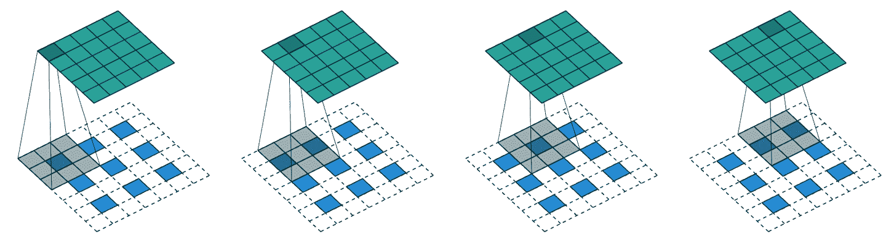
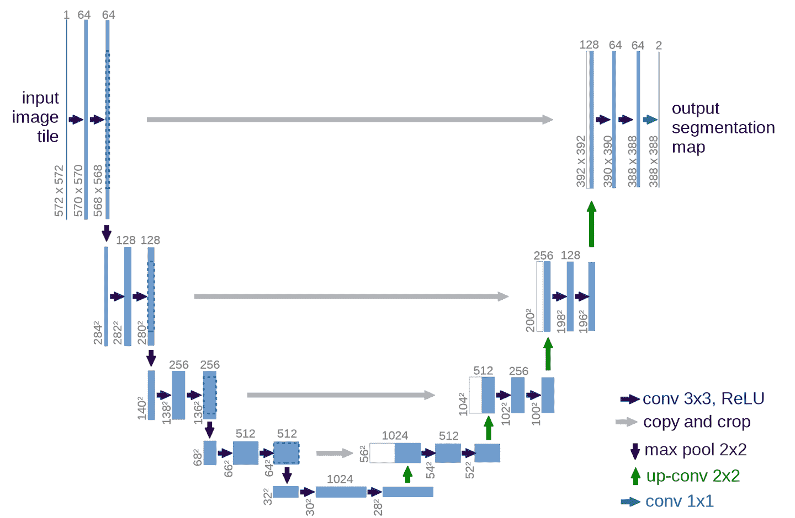
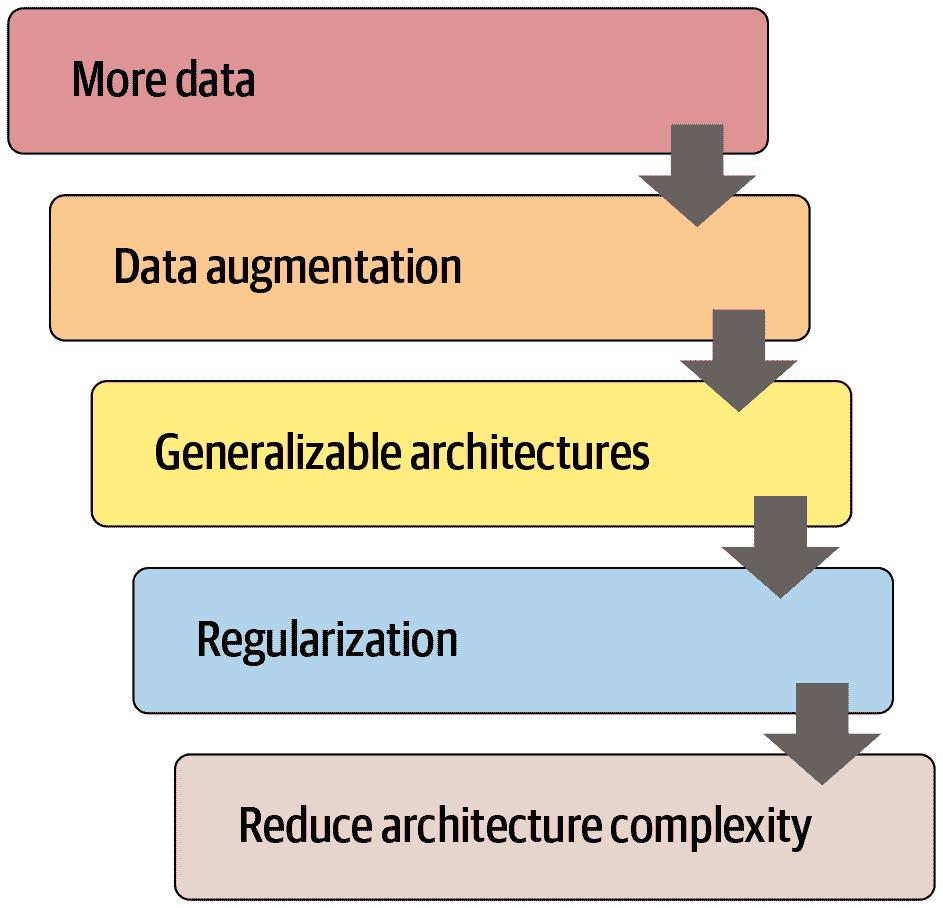

# 第十五章：应用架构深入探讨


我们现在处于一个令人兴奋的位置，我们可以完全理解我们为计算机视觉、自然语言处理和表格分析使用的最先进模型的架构。在本章中，我们将填补有关 fastai 应用模型如何工作的所有缺失细节，并向您展示如何构建它们。

我们还将回到我们在第十一章中看到的用于 Siamese 网络的自定义数据预处理流程，并向您展示如何使用 fastai 库中的组件为新任务构建自定义预训练模型。

我们将从计算机视觉开始。

# 计算机视觉

对于计算机视觉应用，我们使用`cnn_learner`和`unet_learner`函数来构建我们的模型，具体取决于任务。在本节中，我们将探讨如何构建我们在本书的第 I 部分和 II 部分中使用的`Learner`对象。

## cnn_learner

让我们看看当我们使用`cnn_learner`函数时会发生什么。我们首先向这个函数传递一个用于网络*主体*的架构。大多数情况下，我们使用 ResNet，您已经知道如何创建，所以我们不需要深入研究。预训练权重将根据需要下载并加载到 ResNet 中。

然后，对于迁移学习，网络需要被*切割*。这指的是切掉最后一层，该层仅负责 ImageNet 特定的分类。实际上，我们不仅切掉这一层，还切掉自自适应平均池化层以及之后的所有内容。这样做的原因很快就会变得清楚。由于不同的架构可能使用不同类型的池化层，甚至完全不同类型的*头部*，我们不仅仅搜索自适应池化层来决定在哪里切割预训练模型。相反，我们有一个信息字典，用于确定每个模型的主体在哪里结束，头部从哪里开始。我们称之为`model_meta`—这是`resnet50`的信息：

```py
model_meta[resnet50]
```

```py
{'cut': -2,
 'split': <function fastai.vision.learner._resnet_split(m)>,
 'stats': ([0.485, 0.456, 0.406], [0.229, 0.224, 0.225])}
```

# 行话：主体和头部

神经网络的头部是专门针对特定任务的部分。对于 CNN，通常是自适应平均池化层之后的部分。主体是其他所有部分，包括干部（我们在第十四章中学到的）。

如果我们取出在`-2`之前的所有层，我们就得到了 fastai 将保留用于迁移学习的模型部分。现在，我们放上我们的新头部。这是使用`create_head`函数创建的：

```py
create_head(20,2)
```

```py
Sequential(
  (0): AdaptiveConcatPool2d(
    (ap): AdaptiveAvgPool2d(output_size=1)
    (mp): AdaptiveMaxPool2d(output_size=1)
  )
  (1): Flatten()
  (2): BatchNorm1d(20, eps=1e-05, momentum=0.1, affine=True)
  (3): Dropout(p=0.25, inplace=False)
  (4): Linear(in_features=20, out_features=512, bias=False)
  (5): ReLU(inplace=True)
  (6): BatchNorm1d(512, eps=1e-05, momentum=0.1, affine=True)
  (7): Dropout(p=0.5, inplace=False)
  (8): Linear(in_features=512, out_features=2, bias=False)
)
```

使用这个函数，您可以选择在末尾添加多少个额外的线性层，每个线性层之后使用多少 dropout，以及使用什么类型的池化。默认情况下，fastai 将同时应用平均池化和最大池化，并将两者连接在一起（这是`AdaptiveConcatPool2d`层）。这不是一个特别常见的方法，但它在 fastai 和其他研究实验室近年来独立开发，并倾向于比仅使用平均池化提供小幅改进。

fastai 与大多数库有所不同，因为默认情况下它在 CNN 头部中添加两个线性层，而不是一个。原因是，正如我们所看到的，即使将预训练模型转移到非常不同的领域，迁移学习仍然可能是有用的。然而，在这些情况下，仅使用单个线性层可能不足够；我们发现使用两个线性层可以使迁移学习更快速、更容易地应用在更多情况下。

# 最后一个 Batchnorm

`create_head`的一个值得关注的参数是`bn_final`。将其设置为`True`将导致一个 batchnorm 层被添加为您的最终层。这有助于帮助您的模型适当地缩放输出激活。迄今为止，我们还没有看到这种方法在任何地方发表，但我们发现在实践中无论我们在哪里使用它，它都效果很好。

现在让我们看看`unet_learner`在我们在第一章展示的分割问题中做了什么。

## unet_learner

深度学习中最有趣的架构之一是我们在第一章中用于分割的架构。分割是一项具有挑战性的任务，因为所需的输出实际上是一幅图像，或者一个像素网格，包含了每个像素的预测标签。其他任务也有类似的基本设计，比如增加图像的分辨率（*超分辨率*）、给黑白图像添加颜色（*着色*）、或将照片转换为合成画作（*风格转移*）——这些任务在本书的[在线章节](https://book.fast.ai)中有介绍，所以在阅读完本章后一定要查看。在每种情况下，我们都是从一幅图像开始，将其转换为另一幅具有相同尺寸或纵横比的图像，但像素以某种方式被改变。我们将这些称为*生成式视觉模型*。

我们的做法是从与前一节中看到的开发 CNN 头部的确切方法开始。例如，我们从一个 ResNet 开始，然后截断自适应池化层和之后的所有层。然后我们用我们的自定义头部替换这些层，执行生成任务。

在上一句中有很多含糊之处！我们到底如何创建一个生成图像的 CNN 头部？如果我们从一个 224 像素的输入图像开始，那么在 ResNet 主体的末尾，我们将得到一个 7×7 的卷积激活网格。我们如何将其转换为一个 224 像素的分割掩模？

当然，我们使用神经网络来做这个！所以我们需要一种能够在 CNN 中增加网格大小的层。一个简单的方法是用一个 2×2 的方块替换 7×7 网格中的每个像素。这四个像素中的每一个将具有相同的值——这被称为*最近邻插值*。PyTorch 为我们提供了一个可以做到这一点的层，因此一个选项是创建一个包含步长为 1 的卷积层（以及通常的批归一化和 ReLU 层）和 2×2 最近邻插值层的头部。实际上，你现在可以尝试一下！看看你是否可以创建一个设计如此的自定义头部，并在 CamVid 分割任务上尝试一下。你应该会发现你得到了一些合理的结果，尽管它们不会像我们在第一章中的结果那样好。

另一种方法是用*转置卷积*替换最近邻和卷积的组合，也被称为*步长一半卷积*。这与常规卷积相同，但首先在输入的所有像素之间插入零填充。这在图片上最容易看到——图 15-1 显示了一张来自我们在第十三章讨论过的优秀的[卷积算术论文](https://oreil.ly/hu06c)中的图表，展示了一个应用于 3×3 图像的 3×3 转置卷积。



###### 图 15-1\. 一个转置卷积（由 Vincent Dumoulin 和 Francesco Visin 提供）

正如你所看到的，结果是增加输入的大小。你现在可以通过使用 fastai 的`ConvLayer`类来尝试一下；在你的自定义头部中传递参数`transpose=True`来创建一个转置卷积，而不是一个常规卷积。

然而，这两种方法都不是很好。问题在于我们的 7×7 网格根本没有足够的信息来创建一个 224×224 像素的输出。要求每个网格单元的激活具有足够的信息来完全重建输出中的每个像素是非常困难的。

解决方案是使用*跳跃连接*，就像 ResNet 中那样，但是从 ResNet 主体中的激活一直跳到架构对面的转置卷积的激活。这种方法在 2015 年 Olaf Ronneberger 等人的论文[“U-Net:用于生物医学图像分割的卷积网络”](https://oreil.ly/6ely4)中有所阐述。尽管该论文侧重于医学应用，但 U-Net 已经彻底改变了各种生成视觉模型。



###### 图 15-2。U-Net 架构（由 Olaf Ronneberger、Philipp Fischer 和 Thomas Brox 提供）

这幅图片展示了左侧的 CNN 主体（在这种情况下，它是一个常规的 CNN，而不是 ResNet，它们使用 2×2 最大池化而不是步幅为 2 的卷积，因为这篇论文是在 ResNets 出现之前写的），右侧是转置卷积（“上采样”）层。额外的跳跃连接显示为从左到右的灰色箭头（有时被称为*交叉连接*）。你可以看到为什么它被称为*U-Net*！

有了这种架构，传递给转置卷积的输入不仅是前一层中较低分辨率的网格，还有 ResNet 头部中较高分辨率的网格。这使得 U-Net 可以根据需要使用原始图像的所有信息。U-Net 的一个挑战是确切的架构取决于图像大小。fastai 有一个独特的`DynamicUnet`类，根据提供的数据自动生成合适大小的架构。

现在让我们专注于一个示例，其中我们利用 fastai 库编写一个自定义模型。

## 孪生网络

让我们回到我们在第十一章中为孪生网络设置的输入管道。你可能还记得，它由一对图像组成，标签为`True`或`False`，取决于它们是否属于同一类。

利用我们刚刚看到的内容，让我们为这个任务构建一个自定义模型并对其进行训练。如何做？我们将使用一个预训练的架构并将我们的两个图像传递给它。然后我们可以连接结果并将它们发送到一个自定义头部，该头部将返回两个预测。在模块方面，看起来像这样：

```py
class SiameseModel(Module):
    def __init__(self, encoder, head):
        self.encoder,self.head = encoder,head

    def forward(self, x1, x2):
        ftrs = torch.cat([self.encoder(x1), self.encoder(x2)], dim=1)
        return self.head(ftrs)
```

要创建我们的编码器，我们只需要取一个预训练模型并切割它，就像我们之前解释的那样。函数`create_body`为我们执行此操作；我们只需传递我们想要切割的位置。正如我们之前看到的，根据预训练模型的元数据字典，ResNet 的切割值为`-2`：

```py
encoder = create_body(resnet34, cut=-2)
```

然后我们可以创建我们的头部。查看编码器告诉我们最后一层有 512 个特征，所以这个头部将需要接收`512*4`。为什么是 4？首先我们必须乘以 2，因为我们有两个图像。然后我们需要第二次乘以 2，因为我们的连接池技巧。因此我们创建头部如下：

```py
head = create_head(512*4, 2, ps=0.5)
```

有了我们的编码器和头部，我们现在可以构建我们的模型：

```py
model = SiameseModel(encoder, head)
```

在使用`Learner`之前，我们还需要定义两件事。首先，我们必须定义要使用的损失函数。它是常规的交叉熵，但由于我们的目标是布尔值，我们需要将它们转换为整数，否则 PyTorch 会抛出错误：

```py
def loss_func(out, targ):
    return nn.CrossEntropyLoss()(out, targ.long())
```

更重要的是，为了充分利用迁移学习，我们必须定义一个自定义的*splitter*。*splitter*是一个告诉 fastai 库如何将模型分成参数组的函数。这些在幕后用于在进行迁移学习时仅训练模型的头部。

这里我们想要两个参数组：一个用于编码器，一个用于头部。因此我们可以定义以下*splitter*（`params`只是一个返回给定模块的所有参数的函数）：

```py
def siamese_splitter(model):
    return [params(model.encoder), params(model.head)]
```

然后，我们可以通过传递数据、模型、损失函数、分割器和任何我们想要的指标来定义我们的`Learner`。由于我们没有使用 fastai 的传输学习便利函数（如`cnn_learner`），我们必须手动调用`learn.freeze`。这将确保只有最后一个参数组（在本例中是头部）被训练：

```py
learn = Learner(dls, model, loss_func=loss_func,
                splitter=siamese_splitter, metrics=accuracy)
learn.freeze()
```

然后我们可以直接使用通常的方法训练我们的模型：

```py
learn.fit_one_cycle(4, 3e-3)
```

| epoch | train_loss | valid_loss | accuracy | time |
| --- | --- | --- | --- | --- |
| 0 | 0.367015 | 0.281242 | 0.885656 | 00:26 |
| 1 | 0.307688 | 0.214721 | 0.915426 | 00:26 |
| 2 | 0.275221 | 0.170615 | 0.936401 | 00:26 |
| 3 | 0.223771 | 0.159633 | 0.943843 | 00:26 |

现在我们解冻并使用有区别的学习率微调整个模型一点（即，对于主体使用较低的学习率，对于头部使用较高的学习率）：

```py
learn.unfreeze()
learn.fit_one_cycle(4, slice(1e-6,1e-4))
```

| epoch | train_loss | valid_loss | accuracy | time |
| --- | --- | --- | --- | --- |
| 0 | 0.212744 | 0.159033 | 0.944520 | 00:35 |
| 1 | 0.201893 | 0.159615 | 0.942490 | 00:35 |
| 2 | 0.204606 | 0.152338 | 0.945196 | 00:36 |
| 3 | 0.213203 | 0.148346 | 0.947903 | 00:36 |

94.8％是非常好的，当我们记得以相同方式训练的分类器（没有数据增强）的错误率为 7％时。

现在我们已经看到如何创建完整的最先进的计算机视觉模型，让我们继续进行自然语言处理。

# 自然语言处理

将 AWD-LSTM 语言模型转换为迁移学习分类器，就像我们在第十章中所做的那样，遵循与本章第一节中的`cnn_learner`相似的过程。在这种情况下，我们不需要一个“元”字典，因为我们没有这么多种类的体系结构需要在主体中支持。我们只需要选择语言模型中的堆叠 RNN 作为编码器，这是一个单独的 PyTorch 模块。这个编码器将为输入的每个单词提供一个激活，因为语言模型需要为每个下一个单词输出一个预测。

要从中创建一个分类器，我们使用了[ULMFiT 论文](https://oreil.ly/3hdSj)中描述的一种方法，称为“用于文本分类的 BPTT（BPT3C）”：

> 我们将文档分成固定长度为*b*的批次。在每个批次的开始，模型使用前一个批次的最终状态进行初始化；我们跟踪用于平均值和最大池化的隐藏状态；梯度被反向传播到隐藏状态对最终预测有贡献的批次。在实践中，我们使用可变长度的反向传播序列。

换句话说，分类器包含一个`for`循环，循环遍历每个序列的批次。状态在批次之间保持不变，并且存储每个批次的激活。最后，我们使用相同的平均值和最大连接池技巧，这与我们用于计算机视觉模型的方法相同，但这一次，我们不是在 CNN 网格单元上进行池化，而是在 RNN 序列上进行池化。

对于这个`for`循环，我们需要将我们的数据分批处理，但每个文本需要单独处理，因为它们各自有自己的标签。然而，这些文本很可能不会都是相同的长度，这意味着我们无法将它们都放在同一个数组中，就像我们在语言模型中所做的那样。

这就是填充将会有所帮助的地方：当获取一堆文本时，我们确定最长的文本，然后用一个特殊的标记`xxpad`填充较短的文本。为了避免在同一批次中有一个包含 2,000 个标记的文本和一个包含 10 个标记的文本的极端情况（因此有很多填充和浪费的计算），我们通过确保相似大小的文本被放在一起来改变随机性。文本在训练集中仍然会以某种随机顺序排列（对于验证集，我们可以简单地按长度顺序排序），但不完全是这样。

这是由 fastai 库在创建我们的`DataLoaders`时在幕后自动完成的。

# 表格

最后，让我们看看`fastai.tabular`模型。（我们不需要单独查看协同过滤，因为我们已经看到这些模型只是表格模型或使用点积方法，我们之前从头开始实现。）

这是`TabularModel`的`forward`方法：

```py
if self.n_emb != 0:
    x = [e(x_cat[:,i]) for i,e in enumerate(self.embeds)]
    x = torch.cat(x, 1)
    x = self.emb_drop(x)
if self.n_cont != 0:
    x_cont = self.bn_cont(x_cont)
    x = torch.cat([x, x_cont], 1) if self.n_emb != 0 else x_cont
return self.layers(x)
```

我们不会在这里显示`__init__`，因为这并不那么有趣，但会依次查看`forward`中的每行代码。第一行只是测试是否有任何嵌入需要处理-如果只有连续变量，我们可以跳过这一部分：

```py
if self.n_emb != 0:
```

`self.embeds`包含嵌入矩阵，因此这会获取每个激活

```py
    x = [e(x_cat[:,i]) for i,e in enumerate(self.embeds)]
```

并将它们连接成一个单一张量：

```py
    x = torch.cat(x, 1)
```

然后应用了辍学。您可以将`emb_drop`传递给`__init__`以更改此值：

```py
    x = self.emb_drop(x)
```

现在我们测试是否有任何连续变量需要处理：

```py
if self.n_cont != 0:
```

它们通过一个批量归一化层

```py
    x_cont = self.bn_cont(x_cont)
```

并与嵌入激活连接在一起，如果有的话：

```py
    x = torch.cat([x, x_cont], 1) if self.n_emb != 0 else x_cont
```

最后，这些通过线性层传递（每个线性层包括批量归一化，如果`use_bn`为`True`，并且辍学，如果`ps`设置为某个值或值列表）：

```py
return self.layers(x)
```

恭喜！现在您已经了解了 fastai 库中使用的每个架构的所有细节！

# 结论

正如您所看到的，深度学习架构的细节现在不应该让您感到恐惧。您可以查看 fastai 和 PyTorch 的代码，看看发生了什么。更重要的是，尝试理解*为什么*会发生这种情况。查看代码中引用的论文，并尝试看看代码如何与描述的算法相匹配。

现在我们已经调查了模型的所有部分以及传递给它的数据，我们可以考虑这对于实际深度学习意味着什么。如果您拥有无限的数据，无限的内存和无限的时间，那么建议很简单：在所有数据上训练一个巨大的模型很长时间。但深度学习不简单的原因是您的数据、内存和时间通常是有限的。如果内存或时间不足，解决方案是训练一个较小的模型。如果您无法训练足够长时间以过拟合，那么您没有充分利用模型的容量。

因此，第一步是达到过拟合的点。然后问题是如何减少过拟合。图 15-3 显示了我们建议从那里优先考虑的步骤。



###### 图 15-3。减少过拟合的步骤

许多从业者在面对过拟合模型时，从这个图表的完全错误的一端开始。他们的起点是使用更小的模型或更多的正则化。除非训练模型占用太多时间或内存，否则使用更小的模型应该是您采取的最后一步。减小模型的大小会降低模型学习数据中微妙关系的能力。

相反，您的第一步应该是寻求*创建更多数据*。这可能涉及向您已经拥有的数据添加更多标签，找到模型可以被要求解决的其他任务（或者，换个角度思考，识别您可以建模的不同类型的标签），或者通过使用更多或不同的数据增强技术创建额外的合成数据。由于 Mixup 和类似方法的发展，现在几乎所有类型的数据都可以获得有效的数据增强。

一旦您获得了您认为可以合理获得的尽可能多的数据，并且通过利用您可以找到的所有标签并进行所有有意义的增强来尽可能有效地使用它，如果您仍然过拟合，您应该考虑使用更具一般化能力的架构。例如，添加批量归一化可能会提高泛化能力。

如果在尽力使用数据和调整架构后仍然过拟合，您可以考虑正则化。一般来说，在最后一层或两层添加 dropout 可以很好地正则化您的模型。然而，正如我们从 AWD-LSTM 开发故事中学到的那样，在整个模型中添加不同类型的 dropout 通常会更有帮助。一般来说，具有更多正则化的较大模型更灵活，因此比具有较少正则化的较小模型更准确。

只有在考虑了所有这些选项之后，我们才建议您尝试使用较小版本的架构。

# 问卷

1.  神经网络的头是什么？

1.  神经网络的主体是什么？

1.  什么是“剪切”神经网络？为什么我们需要在迁移学习中这样做？

1.  `model_meta`是什么？尝试打印它以查看里面的内容。

1.  阅读`create_head`的源代码，并确保你理解每一行的作用。

1.  查看`create_head`的输出，并确保你理解每一层的存在原因，以及`create_head`源代码是如何创建它的。

1.  找出如何改变`create_cnn`创建的 dropout、层大小和层数，并查看是否可以找到能够提高宠物识别准确性的值。

1.  `AdaptiveConcatPool2d`是什么作用？

1.  什么是最近邻插值？如何用它来上采样卷积激活？

1.  什么是转置卷积？还有另一个名称是什么？

1.  创建一个带有`transpose=True`的卷积层，并将其应用于图像。检查输出形状。

1.  绘制 U-Net 架构。

1.  什么是用于文本分类的 BPTT（BPT3C）？

1.  在 BPT3C 中如何处理不同长度的序列？

1.  尝试在笔记本中逐行运行`TabularModel.forward`的每一行，每个单元格一行，并查看每个步骤的输入和输出形状。

1.  `TabularModel`中的`self.layers`是如何定义的？

1.  预防过拟合的五个步骤是什么？

1.  为什么在尝试其他方法预防过拟合之前不减少架构复杂性？

## 进一步研究

1.  编写自己的自定义头，并尝试使用它训练宠物识别器。看看是否可以获得比 fastai 默认更好的结果。

1.  尝试在 CNN 头部之间切换`AdaptiveConcatPool2d`和`AdaptiveAvgPool2d`，看看会有什么不同。

1.  编写自己的自定义分割器，为每个 ResNet 块创建一个单独的参数组，以及一个单独的参数组用于干扰。尝试使用它进行训练，看看是否可以改善宠物识别器。

1.  阅读关于生成图像模型的在线章节，并创建自己的着色器、超分辨率模型或风格转移模型。

1.  使用最近邻插值创建一个自定义头，并用它在 CamVid 上进行分割。
