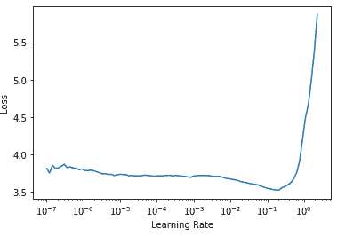
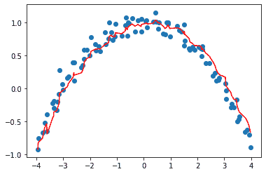
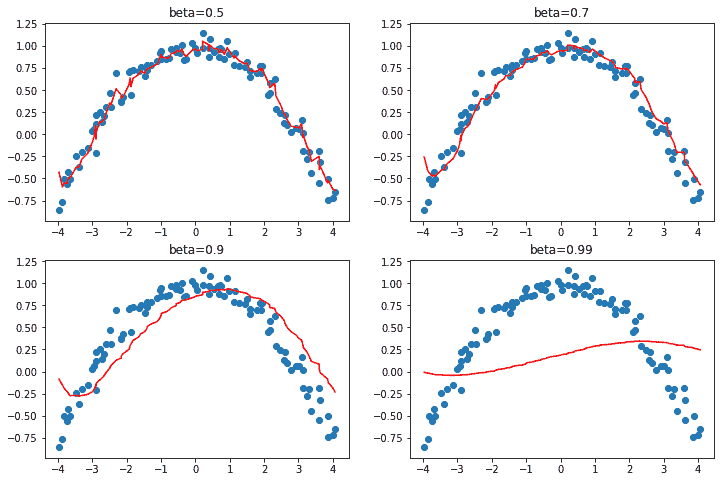
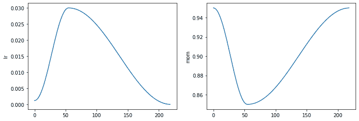
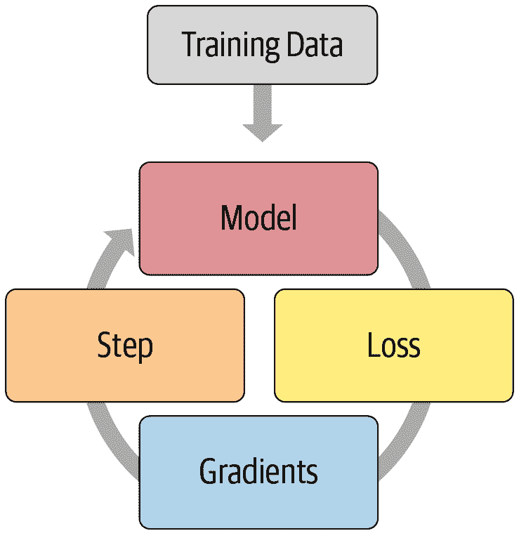
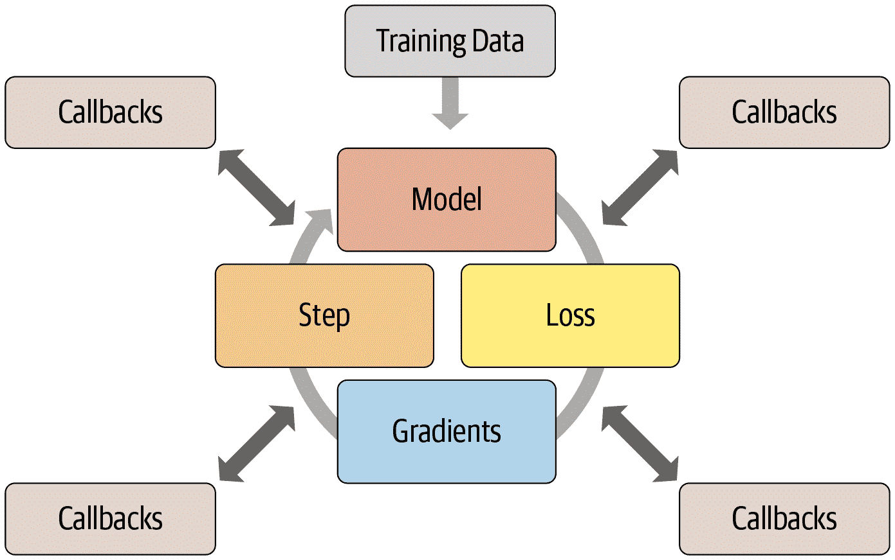
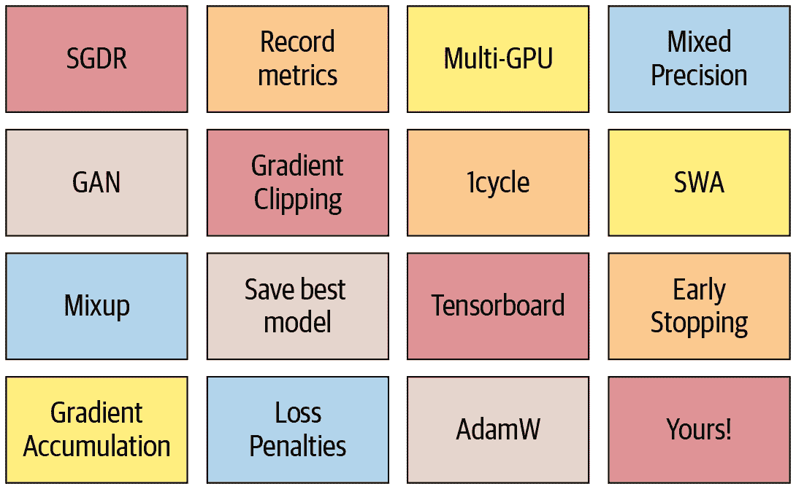

# 第十六章：训练过程


现在你知道如何为计算机视觉、自然图像处理、表格分析和协同过滤创建最先进的架构，也知道如何快速训练它们。所以我们完成了，对吧？还没有。我们仍然需要探索一下训练过程的更多内容。

我们在第四章中解释了随机梯度下降的基础：将一个小批量数据传递给模型，用损失函数将其与目标进行比较，然后计算这个损失函数对每个权重的梯度，然后使用公式更新权重：

```py
new_weight = weight - lr * weight.grad
```

我们在训练循环中从头开始实现了这个，看到 PyTorch 提供了一个简单的`nn.SGD`类，可以为我们的每个参数进行这个计算。在本章中，我们将构建一些更快的优化器，使用一个灵活的基础。但在训练过程中，我们可能还想要改变一些东西。对于训练循环的任何调整，我们都需要一种方法来向 SGD 的基础添加一些代码。fastai 库有一个回调系统来做到这一点，我们将教你所有相关知识。

让我们从标准的 SGD 开始建立一个基线；然后我们将介绍最常用的优化器。

# 建立基线

首先，我们将使用普通的 SGD 创建一个基线，并将其与 fastai 的默认优化器进行比较。我们将通过使用与第十四章中相同的`get_data`来获取 Imagenette：

```py
dls = get_data(URLs.IMAGENETTE_160, 160, 128)
```

我们将创建一个没有预训练的 ResNet-34，并传递任何接收到的参数：

```py
def get_learner(**kwargs):
    return cnn_learner(dls, resnet34, pretrained=False,
                    metrics=accuracy, **kwargs).to_fp16()
```

这是默认的 fastai 优化器，具有通常的 3e-3 学习率：

```py
learn = get_learner()
learn.fit_one_cycle(3, 0.003)
```

| epoch | train_loss | valid_loss | accuracy | time |
| --- | --- | --- | --- | --- |
| 0 | 2.571932 | 2.685040 | 0.322548 | 00:11 |
| 1 | 1.904674 | 1.852589 | 0.437452 | 00:11 |
| 2 | 1.586909 | 1.374908 | 0.594904 | 00:11 |

现在让我们尝试普通的 SGD。我们可以将`opt_func`（优化函数）传递给`cnn_learner`，以便让 fastai 使用任何优化器：

```py
learn = get_learner(opt_func=SGD)
```

首先要看的是`lr_find`：

```py
learn.lr_find()
```

```py
(0.017378008365631102, 3.019951861915615e-07)
```



看起来我们需要使用比我们通常使用的更高的学习率：

```py
learn.fit_one_cycle(3, 0.03, moms=(0,0,0))
```

| epoch | train_loss | valid_loss | accuracy | time |
| --- | --- | --- | --- | --- |
| 0 | 2.969412 | 2.214596 | 0.242038 | 00:09 |
| 1 | 2.442730 | 1.845950 | 0.362548 | 00:09 |
| 2 | 2.157159 | 1.741143 | 0.408917 | 00:09 |

因为用动量加速 SGD 是一个很好的主意，fastai 在`fit_one_cycle`中默认执行这个操作，所以我们用`moms=(0,0,0)`关闭它。我们很快会讨论动量。

显然，普通的 SGD 训练速度不如我们所希望的快。所以让我们学习一些技巧来加速训练！

# 通用优化器

为了构建我们加速的 SGD 技巧，我们需要从一个灵活的优化器基础开始。在 fastai 之前没有任何库提供这样的基础，但在 fastai 的开发过程中，我们意识到学术文献中看到的所有优化器改进都可以使用*优化器回调*来处理。这些是我们可以组合、混合和匹配在优化器中构建优化器步骤的小代码片段。它们由 fastai 的轻量级`Optimizer`类调用。这些是我们在本书中使用的两个关键方法在`Optimizer`中的定义：

```py
def zero_grad(self):
    for p,*_ in self.all_params():
        p.grad.detach_()
        p.grad.zero_()

def step(self):
    for p,pg,state,hyper in self.all_params():
        for cb in self.cbs:
            state = _update(state, cb(p, **{**state, **hyper}))
        self.state[p] = state
```

正如我们在从头开始训练 MNIST 模型时看到的，`zero_grad`只是循环遍历模型的参数并将梯度设置为零。它还调用`detach_`，这会删除任何梯度计算的历史，因为在`zero_grad`之后不再需要它。

更有趣的方法是`step`，它循环遍历回调（`cbs`）并调用它们来更新参数（如果`cb`返回任何内容，`_update`函数只是调用`state.update`）。正如你所看到的，`Optimizer`本身不执行任何 SGD 步骤。让我们看看如何将 SGD 添加到`Optimizer`中。

这是一个优化器回调，通过将`-lr`乘以梯度并将其添加到参数（当在 PyTorch 中传递`Tensor.add_`两个参数时，它们在相加之前相乘）来执行单个 SGD 步骤：

```py
def sgd_cb(p, lr, **kwargs): p.data.add_(-lr, p.grad.data)
```

我们可以使用`cbs`参数将这个传递给`Optimizer`；我们需要使用`partial`，因为`Learner`将调用这个函数来创建我们的优化器：

```py
opt_func = partial(Optimizer, cbs=[sgd_cb])
```

让我们看看这是否有效：

```py
learn = get_learner(opt_func=opt_func)
learn.fit(3, 0.03)
```

| epoch | train_loss | valid_loss | accuracy | time |
| --- | --- | --- | --- | --- |
| 0 | 2.730918 | 2.009971 | 0.332739 | 00:09 |
| 1 | 2.204893 | 1.747202 | 0.441529 | 00:09 |
| 2 | 1.875621 | 1.684515 | 0.445350 | 00:09 |

它正在工作！这就是我们如何在 fastai 中从头开始创建 SGD。现在让我们看看这个“动量”是什么。

# 动量

正如在第四章中所描述的，SGD 可以被看作站在山顶上，通过在每个时间点沿着最陡峭的斜坡方向迈出一步来往下走。但如果我们有一个球在山上滚动呢？在每个给定点，它不会完全按照梯度的方向前进，因为它会有*动量*。具有更多动量的球（例如，一个更重的球）会跳过小凸起和洞，更有可能到达崎岖山脉的底部。另一方面，乒乓球会卡在每一个小缝隙中。

那么我们如何将这个想法带到 SGD 中呢？我们可以使用移动平均值，而不仅仅是当前梯度，来进行我们的步骤：

```py
weight.avg = beta * weight.avg + (1-beta) * weight.grad
new_weight = weight - lr * weight.avg
```

这里`beta`是我们选择的一个数字，定义了要使用多少动量。如果`beta`为 0，第一个方程变为`weight.avg = weight.grad`，因此我们最终得到普通的 SGD。但如果它接近 1，所选择的主要方向是以前步骤的平均值。（如果你对统计学有一点了解，你可能会在第一个方程中认出*指数加权移动平均*，它经常用于去噪数据并获得潜在趋势。）

请注意，我们写`weight.avg`以突出显示我们需要为模型的每个参数存储移动平均值（它们都有自己独立的移动平均值）。

图 16-1 显示了一个单参数的噪声数据示例，其中动量曲线以红色绘制，参数的梯度以蓝色绘制。梯度增加，然后减少，动量很好地跟随总体趋势，而不会受到噪声的太大影响。



###### 图 16-1。动量的一个例子

如果损失函数有窄谷，我们需要导航：普通的 SGD 会使我们从一边反弹到另一边，而带有动量的 SGD 会将这些平均值平滑地滚动到一侧。参数`beta`确定我们使用的动量的强度：使用较小的`beta`，我们会保持接近实际梯度值，而使用较高的`beta`，我们将主要朝着梯度的平均值前进，直到梯度的任何变化使得该趋势移动。

使用较大的`beta`，我们可能会错过梯度改变方向并滚动到一个小的局部最小值。这是一个期望的副作用：直观地，当我们向模型展示一个新的输入时，它会看起来像训练集中的某个东西，但不会*完全*像它。它将对应于损失函数中接近我们在训练结束时得到的最小值的点，但不会*在*那个最小值。因此，我们宁愿在一个宽阔的最小值中进行训练，附近的点具有近似相同的损失（或者如果你喜欢的话，损失尽可能平坦的点）。图 16-2 显示了当我们改变`beta`时，图 16-1 中的图表如何变化。



###### 图 16-2。不同 beta 值的动量

我们可以看到在这些示例中，`beta`太高会导致梯度的整体变化被忽略。在带动量的 SGD 中，通常使用的`beta`值为 0.9。

`fit_one_cycle`默认从 0.95 开始，逐渐调整到 0.85，然后在训练结束时逐渐移回到 0.95。让我们看看在普通 SGD 中添加动量后我们的训练情况如何。

要向我们的优化器添加动量，我们首先需要跟踪移动平均梯度，我们可以使用另一个回调来实现。当优化器回调返回一个`dict`时，它用于更新优化器的状态，并在下一步传回优化器。因此，这个回调将跟踪梯度平均值，存储在名为`grad_avg`的参数中：

```py
def average_grad(p, mom, grad_avg=None, **kwargs):
    if grad_avg is None: grad_avg = torch.zeros_like(p.grad.data)
    return {'grad_avg': grad_avg*mom + p.grad.data}
```

要使用它，我们只需在我们的步骤函数中用`grad_avg`替换`p.grad.data`：

```py
def momentum_step(p, lr, grad_avg, **kwargs): p.data.add_(-lr, grad_avg)
```

```py
opt_func = partial(Optimizer, cbs=[average_grad,momentum_step], mom=0.9)
```

`Learner`将自动调度`mom`和`lr`，因此`fit_one_cycle`甚至可以与我们自定义的`Optimizer`一起使用：

```py
learn = get_learner(opt_func=opt_func)
learn.fit_one_cycle(3, 0.03)
```

| epoch | train_loss | valid_loss | accuracy | time |
| --- | --- | --- | --- | --- |
| 0 | 2.856000 | 2.493429 | 0.246115 | 00:10 |
| 1 | 2.504205 | 2.463813 | 0.348280 | 00:10 |
| 2 | 2.187387 | 1.755670 | 0.418853 | 00:10 |

```py
learn.recorder.plot_sched()
```



我们仍然没有得到很好的结果，所以让我们看看我们还能做什么。

# RMSProp

RMSProp 是由 Geoffrey Hinton 在[他的 Coursera 课程“神经网络机器学习”第 6 讲 e](https://oreil.ly/FVcIE)中介绍的 SGD 的另一种变体。与 SGD 的主要区别在于它使用自适应学习率：每个参数都有自己特定的学习率，由全局学习率控制。这样，我们可以通过为需要大幅度改变的权重提供更高的学习率来加速训练，而对于已经足够好的权重，则提供较低的学习率。

我们如何决定哪些参数应该具有较高的学习率，哪些不应该？我们可以查看梯度来获取一个想法。如果一个参数的梯度一直接近于零，那么该参数将需要更高的学习率，因为损失是平的。另一方面，如果梯度到处都是，我们可能应该小心并选择一个较低的学习率以避免发散。我们不能简单地平均梯度来查看它们是否变化很多，因为大正数和大负数的平均值接近于零。相反，我们可以使用通常的技巧，即取绝对值或平方值（然后在平均后取平方根）。

再次，为了确定噪声背后的一般趋势，我们将使用移动平均值，具体来说是梯度的平方的移动平均值。然后，我们将通过使用当前梯度（用于方向）除以这个移动平均值的平方根来更新相应的权重（这样，如果它很低，有效的学习率将更高，如果它很高，有效的学习率将更低）：

```py
w.square_avg = alpha * w.square_avg + (1-alpha) * (w.grad ** 2)
new_w = w - lr * w.grad / math.sqrt(w.square_avg + eps)
```

`eps`（*epsilon*）是为了数值稳定性而添加的（通常设置为 1e-8），`alpha`的默认值通常为 0.99。

我们可以通过做与`avg_grad`类似的事情将其添加到`Optimizer`中，但是多了一个`**2`：

```py
def average_sqr_grad(p, sqr_mom, sqr_avg=None, **kwargs):
    if sqr_avg is None: sqr_avg = torch.zeros_like(p.grad.data)
    return {'sqr_avg': sqr_avg*sqr_mom + p.grad.data**2}
```

我们可以像以前一样定义我们的步骤函数和优化器：

```py
def rms_prop_step(p, lr, sqr_avg, eps, grad_avg=None, **kwargs):
    denom = sqr_avg.sqrt().add_(eps)
    p.data.addcdiv_(-lr, p.grad, denom)

opt_func = partial(Optimizer, cbs=[average_sqr_grad,rms_prop_step],
                   sqr_mom=0.99, eps=1e-7)
```

让我们试一试：

```py
learn = get_learner(opt_func=opt_func)
learn.fit_one_cycle(3, 0.003)
```

| epoch | train_loss | valid_loss | accuracy | time |
| --- | --- | --- | --- | --- |
| 0 | 2.766912 | 1.845900 | 0.402548 | 00:11 |
| 1 | 2.194586 | 1.510269 | 0.504459 | 00:11 |
| 2 | 1.869099 | 1.447939 | 0.544968 | 00:11 |

好多了！现在我们只需将这些想法结合起来，我们就有了 Adam，fastai 的默认优化器。

# Adam

Adam 将 SGD 与动量和 RMSProp 的思想结合在一起：它使用梯度的移动平均作为方向，并除以梯度平方的移动平均的平方根，为每个参数提供自适应学习率。 

Adam 计算移动平均值的方式还有一个不同之处。它采用*无偏*移动平均值，即

```py
w.avg = beta * w.avg + (1-beta) * w.grad
unbias_avg = w.avg / (1 - (beta**(i+1)))
```

如果我们是第`i`次迭代（从 0 开始，就像 Python 一样）。这个除数`1 - (beta**(i+1))`确保无偏平均值看起来更像开始时的梯度（因为`beta < 1`，分母很快接近 1）。

将所有内容放在一起，我们的更新步骤看起来像这样：

```py
w.avg = beta1 * w.avg + (1-beta1) * w.grad
unbias_avg = w.avg / (1 - (beta1**(i+1)))
w.sqr_avg = beta2 * w.sqr_avg + (1-beta2) * (w.grad ** 2)
new_w = w - lr * unbias_avg / sqrt(w.sqr_avg + eps)
```

至于 RMSProp，`eps`通常设置为 1e-8，文献建议的`(beta1，beta2)`的默认值为`(0.9，0.999)`。

在 fastai 中，Adam 是我们使用的默认优化器，因为它可以加快训练速度，但我们发现`beta2=0.99`更适合我们使用的调度类型。`beta1`是动量参数，我们在调用`fit_one_cycle`时用参数`moms`指定。至于`eps`，fastai 使用默认值 1e-5。`eps`不仅仅对数值稳定性有用。更高的`eps`限制了调整学习率的最大值。举个极端的例子，如果`eps`为 1，那么调整后的学习率永远不会高于基本学习率。

与其在书中展示所有这些代码，我们让你去看看 fastai 的优化器笔记本[*https://oreil.ly/*](https://oreil.ly/)*24_O[GitHub 存储库]（浏览 _nbs*文件夹并搜索名为*optimizer*的笔记本）。你会看到到目前为止我们展示的所有代码，以及 Adam 和其他优化器，以及许多示例和测试。

当我们从 SGD 转换为 Adam 时，有一件事情会改变，那就是我们如何应用权重衰减，这可能会产生重要的后果。

# 解耦权重衰减

权重衰减，我们在第八章中讨论过，相当于（在普通 SGD 的情况下）用以下方式更新参数：

```py
new_weight = weight - lr*weight.grad - lr*wd*weight
```

这个公式的最后一部分解释了这种技术的名称：每个权重都会被`lr * wd`的因子衰减。

权重衰减的另一个名称是*L2 正则化*，它包括将所有平方权重的总和添加到损失中（乘以权重衰减）。正如我们在第八章中看到的，这可以直接表达在梯度上：

```py
weight.grad += wd*weight
```

对于 SGD，这两个公式是等价的。然而，这种等价性仅适用于标准 SGD，因为正如我们在动量、RMSProp 或 Adam 中看到的，更新周围有一些额外的梯度公式。

大多数库使用第二种公式，但 Ilya Loshchilov 和 Frank Hutter 在[“解耦权重衰减正则化”](https://oreil.ly/w37Ac)中指出，第一种方法是 Adam 优化器或动量的唯一正确方法，这就是为什么 fastai 将其设为默认值。

现在你知道了`learn.fit_one_cycle`这行代码背后隐藏的一切！

然而，优化器只是训练过程的一部分。当你需要改变 fastai 的训练循环时，你不能直接改变库内的代码。相反，我们设计了一套回调系统，让你可以在独立的块中编写任何你喜欢的调整，然后进行混合和匹配。

# 回调

有时候你需要稍微改变事物的工作方式。事实上，我们已经看到了这种情况的例子：Mixup，fp16 训练，每个时期重置模型以训练 RNN 等。我们如何进行这种类型的调整训练过程？

我们已经看到了基本训练循环，借助`Optimizer`类的帮助，对于单个时期，它看起来像这样：

```py
for xb,yb in dl:
    loss = loss_func(model(xb), yb)
    loss.backward()
    opt.step()
    opt.zero_grad()
```

图 16-3 展示了如何形象地描绘这一点。



###### 图 16-3. 基本训练循环

深度学习从业者通常自定义训练循环的常规方式是复制现有训练循环，然后将特定更改所需的代码插入其中。这几乎是你在网上找到的所有代码的样子。但是它存在严重问题。

某个特定调整过的训练循环不太可能满足您的特定需求。可以对训练循环进行数百次更改，这意味着可能有数十亿种可能的排列组合。您不能只是从这里的一个训练循环中复制一个调整，从那里的另一个训练循环中复制另一个调整，然后期望它们都能一起工作。每个都将基于对其所在环境的不同假设，使用不同的命名约定，并期望数据以不同的格式存在。

我们需要一种方法，允许用户在训练循环的任何部分插入自己的代码，但以一种一致和明确定义的方式。计算机科学家已经提出了一个优雅的解决方案：回调。*回调*是您编写并注入到另一段代码中的代码片段，在预定义的点执行。事实上，回调已经多年用于深度学习训练循环。问题在于，在以前的库中，只能在可能需要的一小部分地方注入代码——更重要的是，回调无法执行它们需要执行的所有操作。

为了能够像手动复制和粘贴训练循环并直接插入代码一样灵活，回调必须能够读取训练循环中的所有可能信息，根据需要修改所有信息，并完全控制批次、周期甚至整个训练循环何时应该终止。fastai 是第一个提供所有这些功能的库。它修改了训练循环，使其看起来像图 16-4。



###### 图 16-4. 带有回调的训练循环

这种方法的有效性在过去几年中得到了验证——通过使用 fastai 回调系统，我们能够实现我们尝试的每一篇新论文，并满足每一个修改训练循环的用户请求。训练循环本身并不需要修改。图 16-5 展示了添加的一些回调。



###### 图 16-5. 一些 fastai 回调

这很重要，因为这意味着我们头脑中的任何想法，我们都可以实现。我们永远不需要深入 PyTorch 或 fastai 的源代码，并临时拼凑一个系统来尝试我们的想法。当我们实现自己的回调来开发自己的想法时，我们知道它们将与 fastai 提供的所有其他功能一起工作——因此我们将获得进度条、混合精度训练、超参数退火等等。

另一个优点是，它使逐渐删除或添加功能以及执行消融研究变得容易。您只需要调整传递给 fit 函数的回调列表。

例如，这是每个训练循环批次运行的 fastai 源代码：

```py
try:
    self._split(b);                                  self('begin_batch')
    self.pred = self.model(*self.xb);                self('after_pred')
    self.loss = self.loss_func(self.pred, *self.yb); self('after_loss')
    if not self.training: return
    self.loss.backward();                            self('after_backward')
    self.opt.step();                                 self('after_step')
    self.opt.zero_grad()
except CancelBatchException:                         self('after_cancel_batch')
finally:                                             self('after_batch')
```

形式为`self('...')`的调用是回调被调用的地方。正如您所看到的，这发生在每一步之后。回调将接收整个训练状态，并且还可以修改它。例如，输入数据和目标标签分别在`self.xb`和`self.yb`中；回调可以修改这些以修改训练循环看到的数据。它还可以修改`self.loss`甚至梯度。

让我们通过编写一个回调来看看这在实践中是如何工作的。

## 创建回调

当您想要编写自己的回调时，可用事件的完整列表如下：

`begin_fit`

在做任何事情之前调用；适用于初始设置。

`begin_epoch`

在每个周期开始时调用；对于需要在每个周期重置的任何行为都很有用。

`begin_train`

在周期的训练部分开始时调用。

`begin_batch`

在每个批次开始时调用，就在绘制该批次之后。可以用于对批次进行任何必要的设置（如超参数调度）或在输入/目标进入模型之前对其进行更改（例如，通过应用 Mixup）。

`after_pred`

在计算模型对批次的输出后调用。可以用于在将其馈送到损失函数之前更改该输出。

`after_loss`

在计算损失之后但在反向传播之前调用。可以用于向损失添加惩罚（例如在 RNN 训练中的 AR 或 TAR）。

`after_backward`

在反向传播之后调用，但在参数更新之前调用。可以在更新之前对梯度进行更改（例如通过梯度裁剪）。

`after_step`

在步骤之后和梯度归零之前调用。

`after_batch`

在批次结束时调用，以在下一个批次之前执行任何必要的清理。

`after_train`

在时代的训练阶段结束时调用。

`begin_validate`

在时代的验证阶段开始时调用；用于特定于验证所需的任何设置。

`after_validate`

在时代的验证部分结束时调用。

`after_epoch`

在时代结束时调用，进行下一个时代之前的任何清理。

`after_fit`

在训练结束时调用，进行最终清理。

此列表的元素可作为特殊变量`event`的属性使用，因此您只需在笔记本中键入`event.`并按 Tab 键即可查看所有选项的列表

让我们看一个例子。您是否还记得在第十二章中我们需要确保在每个时代的训练和验证开始时调用我们的特殊`reset`方法？我们使用 fastai 提供的`ModelResetter`回调来为我们执行此操作。但它究竟是如何工作的呢？这是该类的完整源代码：

```py
class ModelResetter(Callback):
    def begin_train(self):    self.model.reset()
    def begin_validate(self): self.model.reset()
```

是的，实际上就是这样！它只是在完成时代的训练或验证后，调用一个名为`reset`的方法。

回调通常像这样“简短而甜美”。实际上，让我们再看一个。这是添加 RNN 正则化（AR 和 TAR）的 fastai 回调的源代码：

```py
class RNNRegularizer(Callback):
    def __init__(self, alpha=0., beta=0.): self.alpha,self.beta = alpha,beta

    def after_pred(self):
        self.raw_out,self.out = self.pred[1],self.pred[2]
        self.learn.pred = self.pred[0]

    def after_loss(self):
        if not self.training: return
        if self.alpha != 0.:
            self.learn.loss += self.alpha * self.out[-1].float().pow(2).mean()
        if self.beta != 0.:
            h = self.raw_out[-1]
            if len(h)>1:
                self.learn.loss += self.beta * (h[:,1:] - h[:,:-1]
                                               ).float().pow(2).mean()
```

# 自己编写代码。

回去重新阅读“激活正则化和时间激活正则化”，然后再看看这里的代码。确保您理解它在做什么以及为什么。

在这两个示例中，请注意我们如何可以通过直接检查`self.model`或`self.pred`来访问训练循环的属性。这是因为`Callback`将始终尝试获取其内部`Learner`中没有的属性。这些是`self.learn.model`或`self.learn.pred`的快捷方式。请注意，它们适用于读取属性，但不适用于编写属性，这就是为什么当`RNNRegularizer`更改损失或预测时，您会看到`self.learn.loss =`或`self.learn.pred =`。

在编写回调时，可以直接检查`Learner`的以下属性：

`model`

用于训练/验证的模型。

`data`

底层的`DataLoaders`。

`loss_func`

使用的损失函数。

`opt`

用于更新模型参数的优化器。

`opt_func`

用于创建优化器的函数。

`cbs`

包含所有`Callback`的列表。

`dl`

用于迭代的当前`DataLoader`。

`x`/`xb`

从`self.dl`中绘制的最后一个输入（可能由回调修改）。`xb`始终是一个元组（可能有一个元素），`x`是去元组化的。您只能分配给`xb`。

`y`/`yb`

从`self.dl`中绘制的最后一个目标（可能由回调修改）。`yb`始终是一个元组（可能有一个元素），`y`是去元组化的。您只能分配给`yb`。

`pred`

从`self.model`中绘制的最后预测（可能由回调修改）。

`loss`

最后计算的损失（可能由回调修改）。

`n_epoch`

此次训练的时代数。

`n_iter`

当前`self.dl`中的迭代次数。

`纪元`

当前纪元索引（从 0 到`n_epoch-1`）。

`iter`

`self.dl`中的当前迭代索引（从 0 到`n_iter-1`）。

以下属性由`TrainEvalCallback`添加，除非您刻意删除该回调，否则应该可用：

`train_iter`

自此次训练开始以来已完成的训练迭代次数

`pct_train`

已完成的训练迭代的百分比（从 0 到 1）

`training`

一个指示我们是否处于训练模式的标志

以下属性由`Recorder`添加，除非您刻意删除该回调，否则应该可用：

`smooth_loss`

训练损失的指数平均版本

回调也可以通过使用异常系统中断训练循环的任何部分。

## 回调排序和异常

有时回调需要能够告诉 fastai 跳过一个批次或一个纪元，或者完全停止训练。例如，考虑`TerminateOnNaNCallback`。这个方便的回调将在损失变为无穷大或`NaN`（*不是一个数字*）时自动停止训练。以下是此回调的 fastai 源代码：

```py
class TerminateOnNaNCallback(Callback):
    run_before=Recorder
    def after_batch(self):
        if torch.isinf(self.loss) or torch.isnan(self.loss):
            raise CancelFitException
```

`raise CancelFitException`这一行告诉训练循环在这一点中断训练。训练循环捕获此异常并不再运行任何进一步的训练或验证。可用的回调控制流异常如下：

`CancelFitException`

跳过本批次的其余部分并转到`after_batch`。

`CancelEpochException`

跳过本纪元的训练部分的其余部分并转到`after_train`。

`CancelTrainException`

跳过本纪元的验证部分的其余部分并转到`after_validate`。

`CancelValidException`

跳过本纪元的其余部分并转到`after_epoch`。

`CancelBatchException`

训练中断并转到`after_fit`。

您可以检测是否发生了其中一个异常，并添加代码，以在以下事件之后立即执行：

`after_cancel_batch`

在继续到`after_batch`之前立即到达`CancelBatchException`后

`after_cancel_train`

在继续到`after_epoch`之前立即到达`CancelTrainException`后

`after_cancel_valid`

在继续到`after_epoch`之前立即到达`CancelValidException`后

`after_cancel_epoch`

在继续到`after_epoch`之前立即到达`CancelEpochException`后

`after_cancel_fit`

在继续到`after_fit`之前立即到达`CancelFitException`后

有时需要按特定顺序调用回调。例如，在`TerminateOnNaNCallback`的情况下，很重要的是`Recorder`在此回调之后运行其`after_batch`，以避免注册`NaN`损失。您可以在回调中指定`run_before`（此回调必须在之前运行...）或`run_after`（此回调必须在之后运行...）以确保您需要的顺序。

# 结论

在本章中，我们仔细研究了训练循环，探讨了 SGD 的变体以及为什么它们可能更强大。在撰写本文时，开发新的优化器是一个活跃的研究领域，因此在阅读本章时，可能会在[书籍网站](https://book.fast.ai)上发布新变体的附录。请务必查看我们的通用优化器框架如何帮助您快速实现新的优化器。

我们还研究了强大的回调系统，该系统允许您通过允许您在每个步骤之间检查和修改任何参数来自定义训练循环的每一部分。

# 问卷调查

1.  SGD 一步的方程是什么，以数学或代码形式（您喜欢的方式）？

1.  我们传递什么给`cnn_learner`以使用非默认优化器？

1.  什么是优化器回调？

1.  优化器中的`zero_grad`是做什么的？

1.  优化器中的`step`是做什么的？通常优化器中如何实现它？

1.  重写`sgd_cb`以使用`+=`运算符，而不是`add_`。

1.  什么是动量？写出方程式。

1.  动量的物理类比是什么？它如何应用在我们的模型训练设置中？

1.  动量值越大对梯度有什么影响？

1.  1cycle 训练的动量的默认值是多少？

1.  RMSProp 是什么？写出方程。

1.  梯度的平方值表示什么？

1.  Adam 与动量和 RMSProp 有何不同？

1.  写出 Adam 的方程。

1.  计算几批虚拟值的`unbias_avg`和`w.avg`的值。

1.  在 Adam 中，`eps`值较高会产生什么影响？

1.  阅读 fastai 存储库中的优化器笔记本并执行它。

1.  在哪些情况下，像 Adam 这样的动态学习率方法会改变权重衰减的行为？

1.  训练循环的四个步骤是什么？

1.  为什么使用回调比为每个想要添加的调整编写新的训练循环更好？

1.  fastai 回调系统设计的哪些方面使其像复制和粘贴代码片段一样灵活？

1.  在编写回调时，如何获取可用事件的列表？

1.  编写`ModelResetter`回调（请不要偷看）。

1.  如何在回调内部访问训练循环的必要属性？何时可以使用或不使用与它们配套的快捷方式？

1.  回调如何影响训练循环的控制流？

1.  编写`TerminateOnNaN`回调（如果可能的话，请不要偷看）。

1.  如何确保你的回调在另一个回调之后或之前运行？

## 进一步研究

1.  查阅“修正的 Adam”论文，使用通用优化器框架实现它，并尝试一下。搜索其他最近在实践中表现良好的优化器，并选择一个实现。

1.  查看[文档](https://docs.fast.ai)中的混合精度回调。尝试理解每个事件和代码行的作用。

1.  从头开始实现自己版本的学习率查找器。与 fastai 的版本进行比较。

1.  查看 fastai 附带的回调的源代码。看看能否找到一个与你要做的类似的回调，以获得一些灵感。

# 深度学习基础：总结

恭喜你——你已经完成了书中“深度学习基础”部分！现在你理解了 fastai 的所有应用程序和最重要的架构是如何构建的，以及训练它们的推荐方法——你拥有构建这些内容所需的所有信息。虽然你可能不需要创建自己的训练循环或批归一化层，但了解幕后发生的事情对于调试、性能分析和部署解决方案非常有帮助。

既然你现在理解了 fastai 应用的基础，一定要花时间深入研究源代码笔记本，并运行和实验它们的部分。这将让你更清楚地了解 fastai 中的所有内容是如何开发的。

在下一节中，我们将更深入地探讨：我们将探索神经网络的实际前向和后向传递是如何进行的，以及我们可以利用哪些工具来获得更好的性能。然后，我们将继续进行一个项目，将书中的所有材料汇集在一起，用它来构建一个用于解释卷积神经网络的工具。最后但并非最不重要的是，我们将从头开始构建 fastai 的`Learner`类。
