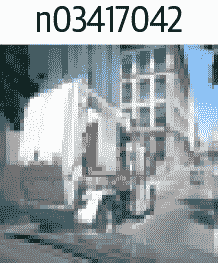
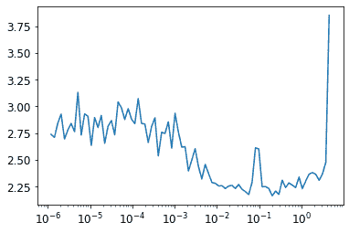
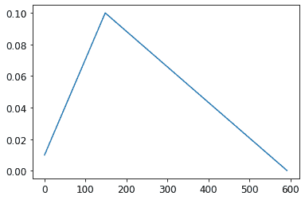

# 第十九章：从头开始创建一个 fastai 学习器


这最后一章（除了结论和在线章节）将会有所不同。它包含的代码比以前的章节要多得多，而叙述要少得多。我们将介绍新的 Python 关键字和库，而不进行讨论。这一章的目的是为您开展一项重要的研究项目。您将看到，我们将从头开始实现 fastai 和 PyTorch API 的许多关键部分，仅建立在我们在第十七章中开发的组件上！这里的关键目标是最终拥有自己的`Learner`类和一些回调函数，足以训练一个模型在 Imagenette 上，包括我们学习的每个关键技术的示例。在构建`Learner`的过程中，我们将创建我们自己的`Module`、`Parameter`和并行`DataLoader`的版本，这样您就会对 PyTorch 类的功能有一个很好的了解。

本章末尾的问卷调查对于本章非常重要。这是我们将指导您探索许多有趣方向的地方，使用本章作为起点。我们建议您在计算机上跟着本章进行学习，并进行大量的实验、网络搜索和其他必要的工作，以了解发生了什么。在本书的其余部分，您已经积累了足够的技能和专业知识来做到这一点，所以我们相信您会做得很好！

让我们开始手动收集一些数据。

# 数据

查看`untar_data`的源代码，看看它是如何工作的。我们将在这里使用它来访问 Imagene 的 160 像素版本，以在本章中使用：

```py
path = untar_data(URLs.IMAGENETTE_160)
```

要访问图像文件，我们可以使用`get_image_files`：

```py
t = get_image_files(path)
t[0]
```

```py
Path('/home/jhoward/.fastai/data/imagenette2-160/val/n03417042/n03417042_3752.JP
 > EG')
```

或者我们可以使用 Python 的标准库`glob`来做同样的事情：

```py
from glob import glob
files = L(glob(f'{path}/**/*.JPEG', recursive=True)).map(Path)
files[0]
```

```py
Path('/home/jhoward/.fastai/data/imagenette2-160/val/n03417042/n03417042_3752.JP
 > EG')
```

如果您查看`get_image_files`的源代码，您会发现它使用了 Python 的`os.walk`；这是一个比`glob`更快、更灵活的函数，所以一定要尝试一下。

我们可以使用 Python Imaging Library 的`Image`类打开一张图片：

```py
im = Image.open(files[0])
im
```


```py
im_t = tensor(im)
im_t.shape
```

```py
torch.Size([160, 213, 3])
```

这将成为我们独立变量的基础。对于我们的因变量，我们可以使用`pathlib`中的`Path.parent`。首先，我们需要我们的词汇表

```py
lbls = files.map(Self.parent.name()).unique(); lbls
```

```py
(#10) ['n03417042','n03445777','n03888257','n03394916','n02979186','n03000684','
 > n03425413','n01440764','n03028079','n02102040']
```

以及反向映射，感谢`L.val2idx`：

```py
v2i = lbls.val2idx(); v2i
```

```py
{'n03417042': 0,
 'n03445777': 1,
 'n03888257': 2,
 'n03394916': 3,
 'n02979186': 4,
 'n03000684': 5,
 'n03425413': 6,
 'n01440764': 7,
 'n03028079': 8,
 'n02102040': 9}
```

这就是我们需要组合成`Dataset`的所有部分。

## 数据集

在 PyTorch 中，`Dataset`可以是任何支持索引（`__getitem__`）和`len`的东西：

```py
class Dataset:
    def __init__(self, fns): self.fns=fns
    def __len__(self): return len(self.fns)
    def __getitem__(self, i):
        im = Image.open(self.fns[i]).resize((64,64)).convert('RGB')
        y = v2i[self.fns[i].parent.name]
        return tensor(im).float()/255, tensor(y)
```

我们需要一个训练和验证文件名列表传递给`Dataset.__init__`：

```py
train_filt = L(o.parent.parent.name=='train' for o in files)
train,valid = files[train_filt],files[~train_filt]
len(train),len(valid)
```

```py
(9469, 3925)
```

现在我们可以尝试一下：

```py
train_ds,valid_ds = Dataset(train),Dataset(valid)
x,y = train_ds[0]
x.shape,y
```

```py
(torch.Size([64, 64, 3]), tensor(0))
```

```py
show_image(x, title=lbls[y]);
```



正如您所看到的，我们的数据集返回独立变量和因变量作为元组，这正是我们需要的。我们需要将这些整合成一个小批量。通常，可以使用`torch.stack`来完成这个任务，这就是我们将在这里使用的方法：

```py
def collate(idxs, ds):
    xb,yb = zip(*[ds[i] for i in idxs])
    return torch.stack(xb),torch.stack(yb)
```

这是一个包含两个项目的小批量，用于测试我们的`collate`：

```py
x,y = collate([1,2], train_ds)
x.shape,y
```

```py
(torch.Size([2, 64, 64, 3]), tensor([0, 0]))
```

现在我们有了数据集和一个整合函数，我们准备创建`DataLoader`。我们将在这里添加两个东西：一个可选的`shuffle`用于训练集，以及一个`ProcessPoolExecutor`来并行进行预处理。并行数据加载器非常重要，因为打开和解码 JPEG 图像是一个缓慢的过程。一个 CPU 核心不足以快速解码图像以使现代 GPU 保持繁忙。这是我们的`DataLoader`类：

```py
class DataLoader:
    def __init__(self, ds, bs=128, shuffle=False, n_workers=1):
        self.ds,self.bs,self.shuffle,self.n_workers = ds,bs,shuffle,n_workers

    def __len__(self): return (len(self.ds)-1)//self.bs+1

    def __iter__(self):
        idxs = L.range(self.ds)
        if self.shuffle: idxs = idxs.shuffle()
        chunks = [idxs[n:n+self.bs] for n in range(0, len(self.ds), self.bs)]
        with ProcessPoolExecutor(self.n_workers) as ex:
            yield from ex.map(collate, chunks, ds=self.ds)
```

让我们尝试一下我们的训练和验证数据集：

```py
n_workers = min(16, defaults.cpus)
train_dl = DataLoader(train_ds, bs=128, shuffle=True, n_workers=n_workers)
valid_dl = DataLoader(valid_ds, bs=256, shuffle=False, n_workers=n_workers)
xb,yb = first(train_dl)
xb.shape,yb.shape,len(train_dl)
```

```py
(torch.Size([128, 64, 64, 3]), torch.Size([128]), 74)
```

这个数据加载器的速度不比 PyTorch 的慢，但它要简单得多。因此，如果您正在调试一个复杂的数据加载过程，不要害怕尝试手动操作，以帮助您准确地了解发生了什么。

对于归一化，我们需要图像统计数据。通常，可以在一个训练小批量上计算这些数据，因为这里不需要精度：

```py
stats = [xb.mean((0,1,2)),xb.std((0,1,2))]
stats
```

```py
[tensor([0.4544, 0.4453, 0.4141]), tensor([0.2812, 0.2766, 0.2981])]
```

我们的`Normalize`类只需要存储这些统计数据并应用它们（要查看为什么需要`to_device`，请尝试将其注释掉，然后查看后面的笔记本中会发生什么）：

```py
class Normalize:
    def __init__(self, stats): self.stats=stats
    def __call__(self, x):
        if x.device != self.stats[0].device:
            self.stats = to_device(self.stats, x.device)
        return (x-self.stats[0])/self.stats[1]
```

我们总是喜欢在笔记本中测试我们构建的一切，一旦我们构建它：

```py
norm = Normalize(stats)
def tfm_x(x): return norm(x).permute((0,3,1,2))
```

```py
t = tfm_x(x)
t.mean((0,2,3)),t.std((0,2,3))
```

```py
(tensor([0.3732, 0.4907, 0.5633]), tensor([1.0212, 1.0311, 1.0131]))
```

这里`tfm_x`不仅仅应用`Normalize`，还将轴顺序从`NHWC`排列为`NCHW`（如果你需要提醒这些首字母缩写指的是什么，请参阅第十三章）。PIL 使用`HWC`轴顺序，我们不能在 PyTorch 中使用，因此需要这个`permute`。

这就是我们模型的数据所需的全部内容。现在我们需要模型本身！

# Module 和 Parameter

要创建一个模型，我们需要`Module`。要创建`Module`，我们需要`Parameter`，所以让我们从那里开始。回想一下，在第八章中我们说`Parameter`类“没有添加任何功能（除了自动调用`requires_grad_`）。它只用作一个‘标记’，以显示要包含在`parameters`中的内容。”这里有一个确切的定义：

```py
class Parameter(Tensor):
    def __new__(self, x): return Tensor._make_subclass(Parameter, x, True)
    def __init__(self, *args, **kwargs): self.requires_grad_()
```

这里的实现有点尴尬：我们必须定义特殊的`__new__` Python 方法，并使用内部的 PyTorch 方法`_make_subclass`，因为在撰写本文时，PyTorch 否则无法正确处理这种子类化或提供官方支持的 API 来执行此操作。也许在你阅读本文时，这个问题已经得到解决，所以请查看本书网站以获取更新的详细信息。

我们的`Parameter`现在表现得就像一个张量，正如我们所希望的：

```py
Parameter(tensor(3.))
```

```py
tensor(3., requires_grad=True)
```

现在我们有了这个，我们可以定义`Module`：

```py
class Module:
    def __init__(self):
        self.hook,self.params,self.children,self._training = None,[],[],False

    def register_parameters(self, *ps): self.params += ps
    def register_modules   (self, *ms): self.children += ms

    @property
    def training(self): return self._training
    @training.setter
    def training(self,v):
        self._training = v
        for m in self.children: m.training=v

    def parameters(self):
        return self.params + sum([m.parameters() for m in self.children], [])

    def __setattr__(self,k,v):
        super().__setattr__(k,v)
        if isinstance(v,Parameter): self.register_parameters(v)
        if isinstance(v,Module):    self.register_modules(v)

    def __call__(self, *args, **kwargs):
        res = self.forward(*args, **kwargs)
        if self.hook is not None: self.hook(res, args)
        return res

    def cuda(self):
        for p in self.parameters(): p.data = p.data.cuda()
```

关键功能在`parameters`的定义中：

```py
self.params + sum([m.parameters() for m in self.children], [])
```

这意味着我们可以询问任何`Module`的参数，并且它将返回它们，包括所有子模块（递归地）。但是它是如何知道它的参数是什么的呢？这要归功于实现 Python 的特殊`__setattr__`方法，每当 Python 在类上设置属性时，它就会为我们调用。我们的实现包括这一行：

```py
if isinstance(v,Parameter): self.register_parameters(v)
```

正如你所看到的，这是我们将新的`Parameter`类用作“标记”的地方——任何属于这个类的东西都会被添加到我们的`params`中。

Python 的`__call__`允许我们定义当我们的对象被视为函数时会发生什么；我们只需调用`forward`（这里不存在，所以子类需要添加）。在我们这样做之前，如果定义了钩子，我们将调用一个钩子。现在你可以看到 PyTorch 的钩子并没有做任何花哨的事情——它们只是调用任何已注册的钩子。

除了这些功能之外，我们的`Module`还提供了`cuda`和`training`属性，我们很快会用到。

现在我们可以创建我们的第一个`Module`，即`ConvLayer`：

```py
class ConvLayer(Module):
    def __init__(self, ni, nf, stride=1, bias=True, act=True):
        super().__init__()
        self.w = Parameter(torch.zeros(nf,ni,3,3))
        self.b = Parameter(torch.zeros(nf)) if bias else None
        self.act,self.stride = act,stride
        init = nn.init.kaiming_normal_ if act else nn.init.xavier_normal_
        init(self.w)

    def forward(self, x):
        x = F.conv2d(x, self.w, self.b, stride=self.stride, padding=1)
        if self.act: x = F.relu(x)
        return x
```

我们不是从头开始实现`F.conv2d`，因为你应该已经在第十七章的问卷中使用`unfold`完成了这个任务。相反，我们只是创建了一个小类，将它与偏置和权重初始化一起包装起来。让我们检查它是否与`Module.parameters`正确工作：

```py
l = ConvLayer(3, 4)
len(l.parameters())
```

```py
2
```

并且我们可以调用它（这将导致`forward`被调用）：

```py
xbt = tfm_x(xb)
r = l(xbt)
r.shape
```

```py
torch.Size([128, 4, 64, 64])
```

同样，我们可以实现`Linear`：

```py
class Linear(Module):
    def __init__(self, ni, nf):
        super().__init__()
        self.w = Parameter(torch.zeros(nf,ni))
        self.b = Parameter(torch.zeros(nf))
        nn.init.xavier_normal_(self.w)

    def forward(self, x): return x@self.w.t() + self.b
```

测试一下是否有效：

```py
l = Linear(4,2)
r = l(torch.ones(3,4))
r.shape
```

```py
torch.Size([3, 2])
```

让我们也创建一个测试模块来检查，如果我们将多个参数作为属性包含，它们是否都被正确注册：

```py
class T(Module):
    def __init__(self):
        super().__init__()
        self.c,self.l = ConvLayer(3,4),Linear(4,2)
```

由于我们有一个卷积层和一个线性层，每个层都有权重和偏置，我们期望总共有四个参数：

```py
t = T()
len(t.parameters())
```

```py
4
```

我们还应该发现，在这个类上调用`cuda`会将所有这些参数放在 GPU 上：

```py
t.cuda()
t.l.w.device
```

```py
device(type='cuda', index=5)
```

现在我们可以使用这些部分来创建一个 CNN。

## 简单的 CNN

正如我们所见，`Sequential`类使许多架构更容易实现，所以让我们创建一个：

```py
class Sequential(Module):
    def __init__(self, *layers):
        super().__init__()
        self.layers = layers
        self.register_modules(*layers)

    def forward(self, x):
        for l in self.layers: x = l(x)
        return x
```

这里的`forward`方法只是依次调用每个层。请注意，我们必须使用我们在`Module`中定义的`register_modules`方法，否则`layers`的内容不会出现在`parameters`中。

# 所有的代码都在这里

请记住，我们在这里没有使用任何 PyTorch 模块的功能；我们正在自己定义一切。所以如果你不确定`register_modules`做什么，或者为什么需要它，再看看我们为`Module`编写的代码！

我们可以创建一个简化的`AdaptivePool`，它只处理到 1×1 输出的池化，并且也将其展平，只需使用`mean`：

```py
class AdaptivePool(Module):
    def forward(self, x): return x.mean((2,3))
```

这就足够我们创建一个 CNN 了！

```py
def simple_cnn():
    return Sequential(
        ConvLayer(3 ,16 ,stride=2), #32
        ConvLayer(16,32 ,stride=2), #16
        ConvLayer(32,64 ,stride=2), # 8
        ConvLayer(64,128,stride=2), # 4
        AdaptivePool(),
        Linear(128, 10)
    )
```

让我们看看我们的参数是否都被正确注册了：

```py
m = simple_cnn()
len(m.parameters())
```

```py
10
```

现在我们可以尝试添加一个钩子。请注意，我们在`Module`中只留了一个钩子的空间；您可以将其变成列表，或者使用类似`Pipeline`的东西将几个钩子作为单个函数运行：

```py
def print_stats(outp, inp): print (outp.mean().item(),outp.std().item())
for i in range(4): m.layers[i].hook = print_stats

r = m(xbt)
r.shape
```

```py
0.5239089727401733 0.8776043057441711
0.43470510840415955 0.8347987532615662
0.4357188045978546 0.7621666193008423
0.46562111377716064 0.7416611313819885
torch.Size([128, 10])
```

我们有数据和模型。现在我们需要一个损失函数。

# 损失

我们已经看到如何定义“负对数似然”：

```py
def nll(input, target): return -input[range(target.shape[0]), target].mean()
```

实际上，这里没有对数，因为我们使用与 PyTorch 相同的定义。这意味着我们需要将对数与 softmax 放在一起：

```py
def log_softmax(x): return (x.exp()/(x.exp().sum(-1,keepdim=True))).log()

sm = log_softmax(r); sm[0][0]
```

```py
tensor(-1.2790, grad_fn=<SelectBackward>)
```

将这些结合起来就得到了我们的交叉熵损失：

```py
loss = nll(sm, yb)
loss
```

```py
tensor(2.5666, grad_fn=<NegBackward>)
```

请注意公式

<math alttext="log 左括号分数 a 除以 b 右括号等于 log 左括号 a 右括号减去 log 左括号 b 右括号" display="block"><mrow><mo form="prefix">log</mo> <mfenced separators="" open="(" close=")"><mfrac><mi>a</mi> <mi>b</mi></mfrac></mfenced> <mo>=</mo> <mo form="prefix">log</mo> <mrow><mo>(</mo> <mi>a</mi> <mo>)</mo></mrow> <mo>-</mo> <mo form="prefix">log</mo> <mrow><mo>(</mo> <mi>b</mi> <mo>)</mo></mrow></mrow></math>

在计算对数 softmax 时，这给出了一个简化，之前定义为`(x.exp()/(x.exp().sum(-1))).log()`：

```py
def log_softmax(x): return x - x.exp().sum(-1,keepdim=True).log()
sm = log_softmax(r); sm[0][0]
```

```py
tensor(-1.2790, grad_fn=<SelectBackward>)
```

然后，有一种更稳定的计算指数和的对数的方法，称为[*LogSumExp*技巧](https://oreil.ly/9UB0b)。这个想法是使用以下公式

<math alttext="log 左括号 sigma-求和下标 j 等于 1 上标 n 上标 e 上标 x 上标 j 下标基准右括号等于 log 左括号 e 上标 a 基准 sigma-求和下标 j 等于 1 上标 n 上标 e 上标 x 上标 j 下标减 a 基准右括号等于 a 加 log 左括号 sigma-求和下标 j 等于 1 上标 n 上标 e 上标 x 上标 j 下标减 a 基准右括号" display="block"><mrow><mo form="prefix">log</mo> <mfenced separators="" open="(" close=")"><munderover><mo>∑</mo> <mrow><mi>j</mi><mo>=</mo><mn>1</mn></mrow> <mi>n</mi></munderover> <msup><mi>e</mi> <msub><mi>x</mi> <mi>j</mi></msub></msup></mfenced> <mo>=</mo> <mo form="prefix">log</mo> <mfenced separators="" open="(" close=")"><msup><mi>e</mi> <mi>a</mi></msup> <munderover><mo>∑</mo> <mrow><mi>j</mi><mo>=</mo><mn>1</mn></mrow> <mi>n</mi></munderover> <msup><mi>e</mi> <mrow><msub><mi>x</mi> <mi>j</mi></msub> <mo>-</mo><mi>a</mi></mrow></msup></mfenced> <mo>=</mo> <mi>a</mi> <mo>+</mo> <mo form="prefix">log</mo> <mfenced separators="" open="(" close=")"><munderover><mo>∑</mo> <mrow><mi>j</mi><mo>=</mo><mn>1</mn></mrow> <mi>n</mi></munderover> <msup><mi>e</mi> <mrow><msub><mi>x</mi> <mi>j</mi></msub> <mo>-</mo><mi>a</mi></mrow></msup></mfenced></mrow></math>

其中*a*是<math alttext="x 下标 j"><msub><mi>x</mi> <mi>j</mi></msub></math>的最大值。

以下是相同的代码：

```py
x = torch.rand(5)
a = x.max()
x.exp().sum().log() == a + (x-a).exp().sum().log()
```

```py
tensor(True)
```

我们将其放入一个函数中

```py
def logsumexp(x):
    m = x.max(-1)[0]
    return m + (x-m[:,None]).exp().sum(-1).log()

logsumexp(r)[0]
```

```py
tensor(3.9784, grad_fn=<SelectBackward>)
```

因此我们可以将其用于我们的`log_softmax`函数：

```py
def log_softmax(x): return x - x.logsumexp(-1,keepdim=True)
```

这与之前得到的结果相同：

```py
sm = log_softmax(r); sm[0][0]
```

```py
tensor(-1.2790, grad_fn=<SelectBackward>)
```

我们可以使用这些来创建`交叉熵`：

```py
def cross_entropy(preds, yb): return nll(log_softmax(preds), yb).mean()
```

现在让我们将所有这些部分组合起来创建一个`学习者`。

# 学习者

我们有数据、模型和损失函数；在我们可以拟合模型之前，我们只需要另一件事，那就是优化器！这里是 SGD：

```py
class SGD:
    def __init__(self, params, lr, wd=0.): store_attr(self, 'params,lr,wd')
    def step(self):
        for p in self.params:
            p.data -= (p.grad.data + p.data*self.wd) * self.lr
            p.grad.data.zero_()
```

正如我们在本书中所看到的，有了`学习者`生活就变得更容易了。`学习者`需要知道我们的训练和验证集，这意味着我们需要`DataLoaders`来存储它们。我们不需要任何其他功能，只需要一个地方来存储它们并访问它们：

```py
class DataLoaders:
    def __init__(self, *dls): self.train,self.valid = dls

dls = DataLoaders(train_dl,valid_dl)
```

现在我们准备创建我们的`学习者`类：

```py
class Learner:
    def __init__(self, model, dls, loss_func, lr, cbs, opt_func=SGD):
        store_attr(self, 'model,dls,loss_func,lr,cbs,opt_func')
        for cb in cbs: cb.learner = self
```

```py
    def one_batch(self):
        self('before_batch')
        xb,yb = self.batch
        self.preds = self.model(xb)
        self.loss = self.loss_func(self.preds, yb)
        if self.model.training:
            self.loss.backward()
            self.opt.step()
        self('after_batch')

    def one_epoch(self, train):
        self.model.training = train
        self('before_epoch')
        dl = self.dls.train if train else self.dls.valid
        for self.num,self.batch in enumerate(progress_bar(dl, leave=False)):
            self.one_batch()
        self('after_epoch')

    def fit(self, n_epochs):
        self('before_fit')
        self.opt = self.opt_func(self.model.parameters(), self.lr)
        self.n_epochs = n_epochs
        try:
            for self.epoch in range(n_epochs):
                self.one_epoch(True)
                self.one_epoch(False)
        except CancelFitException: pass
        self('after_fit')

    def __call__(self,name):
        for cb in self.cbs: getattr(cb,name,noop)()
```

这是我们在本书中创建的最大的类，但每个方法都非常小，所以通过依次查看每个方法，您应该能够理解发生了什么。

我们将调用的主要方法是`fit`。这个循环

```py
for self.epoch in range(n_epochs)
```

并在每个 epoch 中分别调用`self.one_epoch`，然后`train=True`，然后`train=False`。然后`self.one_epoch`对`dls.train`或`dls.valid`中的每个批次调用`self.one_batch`，适当地（在将`DataLoader`包装在`fastprogress.progress_bar`之后）。最后，`self.one_batch`遵循我们在本书中看到的适合一个小批量的一系列步骤。

在每个步骤之前和之后，`Learner`调用`self`，`self`调用`__call__`（这是标准的 Python 功能）。`__call__`在`self.cbs`中的每个回调上使用`getattr(cb,name)`，这是 Python 的内置函数，返回具有请求名称的属性（在本例中是一个方法）。因此，例如，`self('before_fit')`将为每个定义了该方法的回调调用`cb.before_fit()`。

正如您所看到的，`Learner`实际上只是使用了我们的标准训练循环，只是在适当的时候还调用了回调。所以让我们定义一些回调！

## 回调

在`Learner.__init__`中，我们有

```py
for cb in cbs: cb.learner = self
```

换句话说，每个回调都知道它是在哪个学习器中使用的。这是至关重要的，否则回调无法从学习器中获取信息，或者更改学习器中的内容。因为从学习器中获取信息是如此常见，我们通过将`Callback`定义为`GetAttr`的子类，并将默认属性定义为`learner`，使其更容易：

```py
class Callback(GetAttr): _default='learner'
```

`GetAttr`是一个 fastai 类，为您实现了 Python 的标准`__getattr__`和`__dir__`方法，因此每当您尝试访问一个不存在的属性时，它会将请求传递给您定义为`_default`的内容。

例如，我们希望在`fit`开始时自动将所有模型参数移动到 GPU。我们可以通过将`before_fit`定义为`self.learner.model.cuda`来实现这一点；然而，由于`learner`是默认属性，并且我们让`SetupLearnerCB`继承自`Callback`（它继承自`GetAttr`），我们可以去掉`.learner`，只需调用`self.model.cuda`：

```py
class SetupLearnerCB(Callback):
    def before_batch(self):
        xb,yb = to_device(self.batch)
        self.learner.batch = tfm_x(xb),yb

    def before_fit(self): self.model.cuda()
```

在`SetupLearnerCB`中，我们还通过调用`to_device(self.batch)`将每个小批量移动到 GPU（我们也可以使用更长的`to_device(self.learner.batch)`）。然而，请注意，在`self.learner.batch = tfm_x(xb),yb`这一行中，我们不能去掉`.learner`，因为这里我们是*设置*属性，而不是获取它。

在尝试我们的`Learner`之前，让我们创建一个回调来跟踪和打印进度。否则，我们将无法真正知道它是否正常工作：

```py
class TrackResults(Callback):
    def before_epoch(self): self.accs,self.losses,self.ns = [],[],[]

    def after_epoch(self):
        n = sum(self.ns)
        print(self.epoch, self.model.training,
              sum(self.losses).item()/n, sum(self.accs).item()/n)

    def after_batch(self):
        xb,yb = self.batch
        acc = (self.preds.argmax(dim=1)==yb).float().sum()
        self.accs.append(acc)
        n = len(xb)
        self.losses.append(self.loss*n)
        self.ns.append(n)
```

现在我们准备好第一次使用我们的`Learner`了！

```py
cbs = [SetupLearnerCB(),TrackResults()]
learn = Learner(simple_cnn(), dls, cross_entropy, lr=0.1, cbs=cbs)
learn.fit(1)
```

```py
0 True 2.1275552130636814 0.2314922378287042

0 False 1.9942575636942674 0.2991082802547771
```

惊人的是，我们可以用如此少的代码实现 fastai 的`Learner`中的所有关键思想！现在让我们添加一些学习率调度。

## 调度学习率

如果我们想要获得良好的结果，我们将需要一个 LR finder 和 1cycle 训练。这两个都是*退火*回调，也就是说，它们在训练过程中逐渐改变超参数。这是`LRFinder`：

```py
class LRFinder(Callback):
    def before_fit(self):
        self.losses,self.lrs = [],[]
        self.learner.lr = 1e-6

    def before_batch(self):
        if not self.model.training: return
        self.opt.lr *= 1.2

    def after_batch(self):
        if not self.model.training: return
        if self.opt.lr>10 or torch.isnan(self.loss): raise CancelFitException
        self.losses.append(self.loss.item())
        self.lrs.append(self.opt.lr)
```

这展示了我们如何使用`CancelFitException`，它本身是一个空类，仅用于表示异常的类型。您可以在`Learner`中看到这个异常被捕获。（您应该自己添加和测试`CancelBatchException`，`CancelEpochException`等。）让我们尝试一下，将其添加到我们的回调列表中：

```py
lrfind = LRFinder()
learn = Learner(simple_cnn(), dls, cross_entropy, lr=0.1, cbs=cbs+[lrfind])
learn.fit(2)
```

```py
0 True 2.6336045582954903 0.11014890695955222

0 False 2.230653363853503 0.18318471337579617
```

并查看结果：

```py
plt.plot(lrfind.lrs[:-2],lrfind.losses[:-2])
plt.xscale('log')
```



现在我们可以定义我们的`OneCycle`训练回调：

```py
class OneCycle(Callback):
    def __init__(self, base_lr): self.base_lr = base_lr
    def before_fit(self): self.lrs = []

    def before_batch(self):
        if not self.model.training: return
        n = len(self.dls.train)
        bn = self.epoch*n + self.num
        mn = self.n_epochs*n
        pct = bn/mn
        pct_start,div_start = 0.25,10
        if pct<pct_start:
            pct /= pct_start
            lr = (1-pct)*self.base_lr/div_start + pct*self.base_lr
        else:
            pct = (pct-pct_start)/(1-pct_start)
            lr = (1-pct)*self.base_lr
        self.opt.lr = lr
        self.lrs.append(lr)
```

我们将尝试一个 LR 为 0.1：

```py
onecyc = OneCycle(0.1)
learn = Learner(simple_cnn(), dls, cross_entropy, lr=0.1, cbs=cbs+[onecyc])
```

让我们适应一段时间，看看它的样子（我们不会在书中展示所有输出——在笔记本中尝试以查看结果）：

```py
learn.fit(8)
```

最后，我们将检查学习率是否遵循我们定义的调度（如您所见，我们这里没有使用余弦退火）：

```py
plt.plot(onecyc.lrs);
```



# 结论

我们已经通过在本章中重新实现它们来探索 fastai 库的关键概念。由于这本书大部分内容都是代码，您应该尝试通过查看书籍网站上相应的笔记本来进行实验。现在您已经了解了它是如何构建的，作为下一步，请务必查看 fastai 文档中的中级和高级教程，以了解如何自定义库的每一个部分。

# 问卷调查

# 实验

对于这里要求您解释函数或类是什么的问题，您还应该完成自己的代码实验。

1.  什么是`glob`？

1.  如何使用 Python 图像处理库打开图像？

1.  `L.map`是做什么的？

1.  `Self`是做什么的？

1.  什么是`L.val2idx`？

1.  您需要实现哪些方法来创建自己的`Dataset`？

1.  当我们从 Imagenette 打开图像时为什么要调用`convert`？

1.  `~`是做什么的？它如何用于拆分训练和验证集？

1.  `~`是否适用于`L`或`Tensor`类？NumPy 数组、Python 列表或 Pandas DataFrames 呢？

1.  什么是`ProcessPoolExecutor`？

1.  `L.range(self.ds)`是如何工作的？

1.  `__iter__`是什么？

1.  什么是`first`？

1.  `permute`是什么？为什么需要它？

1.  什么是递归函数？它如何帮助我们定义`parameters`方法？

1.  编写一个递归函数，返回斐波那契数列的前 20 个项目。

1.  什么是`super`？

1.  为什么`Module`的子类需要重写`forward`而不是定义`__call__`？

1.  在`ConvLayer`中，为什么`init`取决于`act`？

1.  为什么`Sequential`需要调用`register_modules`？

1.  编写一个打印每个层激活形状的钩子。

1.  什么是 LogSumExp？

1.  为什么`log_softmax`有用？

1.  什么是`GetAttr`？它如何帮助回调？

1.  重新实现本章中的一个回调，而不继承自`Callback`或`GetAttr`。

1.  `Learner.__call__`是做什么的？

1.  什么是`getattr`？（注意与`GetAttr`的大小写区别！）

1.  在`fit`中为什么有一个`try`块？

1.  为什么在`one_batch`中检查`model.training`？

1.  什么是`store_attr`？

1.  `TrackResults.before_epoch`的目的是什么？

1.  `model.cuda`是做什么的？它是如何工作的？

1.  为什么我们需要在`LRFinder`和`OneCycle`中检查`model.training`？

1.  在`OneCycle`中使用余弦退火。

## 进一步研究

1.  从头开始编写`resnet18`（如有需要，请参考第十四章），并在本章中使用`Learner`进行训练。

1.  从头开始实现一个批归一化层，并在您的`resnet18`中使用它。

1.  为本章编写一个 Mixup 回调。

1.  向 SGD 添加动量。

1.  从 fastai（或任何其他库）中挑选几个您感兴趣的特性，并使用本章中创建的对象实现它们。

1.  选择一篇尚未在 fastai 或 PyTorch 中实现的研究论文，并使用本章中创建的对象进行实现。然后：

    +   将论文移植到 fastai。

    +   向 fastai 提交拉取请求，或创建自己的扩展模块并发布。

    提示：您可能会发现使用[`nbdev`](https://nbdev.fast.ai)来创建和部署您的软件包很有帮助。
