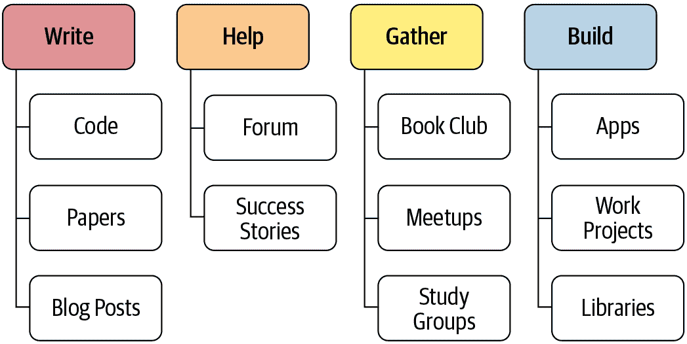

# 第二十章：总结思考

恭喜！你成功了！如果你已经完成了到这一点的所有笔记本，你已经加入了一个小但不断增长的人群，他们能够利用深度学习的力量解决实际问题。你可能不会觉得这样—事实上，你可能不会。我们一再看到完成 fast.ai 课程的学生明显低估了自己作为深度学习从业者的效力。我们也看到这些人经常被具有传统学术背景的其他人低估。所以如果你要超越自己的期望和他人的期望，那么在关闭这本书后，你接下来要做的事情比你到目前为止所做的更重要。

最重要的是保持动力。事实上，从你对优化器的研究中知道，动量是可以自我增强的！所以想想你现在可以做些什么来维持和加速你的深度学习之旅。图 20-1 可以给你一些想法。

###### 图 20-1。接下来要做什么

在这本书中，我们谈了很多关于写作的价值，无论是代码还是散文。但也许你到目前为止还没有写得像你希望的那样多。没关系！现在是一个扭转局面的好机会。此时你有很多话要说。也许你已经在一个数据集上尝试了一些实验，其他人似乎没有以同样的方式看待。告诉世界！或者你可能正在考虑尝试一些在阅读时想到的想法——现在是把这些想法转化为代码的好时机。

如果你想分享你的想法，一个相对低调的地方是[fast.ai 论坛](https://forums.fast.ai)。你会发现那里的社区非常支持和乐于助人，所以请过来告诉我们你在做什么。或者看看你是否可以回答一些问题，帮助那些在学习早期的人。

如果你在深度学习之旅中取得了一些成功，无论大小，请务必告诉我们！在论坛上发布这些信息尤其有帮助，因为了解其他学生的成功可以极大地激励人们。

对许多人来说，保持与学习之旅的联系最重要的方法之一是围绕它建立一个社区。例如，你可以尝试在你当地社区设立一个小型深度学习聚会，或者一个学习小组，甚至可以在当地聚会上做一个关于你到目前为止学到的内容或者你感兴趣的某个特定方面的演讲。你现在还不是世界领先的专家也没关系——重要的是要记住你现在知道很多其他人不知道的东西，所以他们很可能会欣赏你的观点。

另一个许多人发现有用的社区活动是定期的读书俱乐部或论文阅读俱乐部。你可能已经在你的社区找到了一些，如果没有，你可以尝试开始一个。即使只有另一个人和你一起做，也会帮助你获得支持和鼓励，让你开始行动起来。

如果你不在一个容易与志同道合的人聚在一起的地方，可以去论坛，因为人们总是在组建虚拟学习小组。这些通常涉及一群人每周一次通过视频聊天讨论一个深度学习主题。

希望到这一点，你已经有了一些小项目和实验。我们建议你的下一步是选择其中一个，并尽可能把它做得更好。真正把它打磨成你能做到的最好作品——一件让你真正自豪的作品。这将迫使你更深入地了解一个主题，测试你的理解，并让你看到当你全力以赴时你能做到什么。

此外，您可能想看一下[fast.ai 免费在线课程](https://course.fast.ai)，它涵盖了与本书相同的内容。有时，以两种方式看同样的材料确实有助于澄清思路。事实上，人类学习研究人员发现，学习材料的最佳方式之一是从不同角度看同一件事，用不同的方式描述。

如果您选择接受最后的任务，那就是把这本书送给您认识的某人，并帮助另一个人开始他们自己的深度学习之旅！
